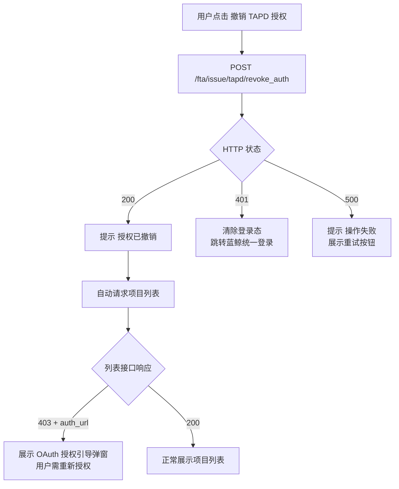

# 场景：撤销 TAPD 用户态授权

> 所属功能：TAPD 授权与建单
> 角色：普通用户
> 前置条件：用户已当前已完成 TAPD OAuth 用户态授权（列表接口正常返回项目）

---

## 调用序列

### 步骤 1：用户触发撤销授权

→ 触发时机：
- 用户在 OAuth 授权弹窗中选择「取消授权」
- 或在设置页中找到「TAPD 授权管理」并点击「撤销授权」

→ 调用接口：`POST /fta/issue/tapd/revoke_auth`

→ 请求 Body：`{ "bk_biz_id": <业务ID> }`

→ Content-Type: `application/json`

### 请求体

```json
{
  "bk_biz_id": 2  // 蓝鲸业务ID，必填
}
```

### 请求头

```
Cookie: {{蓝鲸登录态 Cookie}}
X-CSRFToken: {{csrf_token}}
Content-Type: application/json
```

### 成功响应（HTTP 200）

```json
{
  "result": true,
  "code": 200,
  "message": "OK",
  "data": {
    "success": true,
    "message": "授权已撤销"
  }
}
```

→ 成功后：引导用户重新请求项目列表（或直接自动请求），此时列表接口会返回 403 + `auth_url`，用户需重新走 OAuth 授权流程。

---

## 简要调用流程图



---

## 前端交互

| 触发位置 | 交互说明 |
|----------|---------|
| OAuth 弹窗中的「取消授权」 | 用户首次打开 OAuth 弹窗时（用于引导授权），可在弹窗底部提供「取消授权并退出」辅助按钮，点击后调用本接口撤销当前用户的 TAPD 授权，然后关闭弹窗 |
| 设置页的「TAPD 授权管理」 | 在业务设置或个人设置中提供已授权第三方服务的管理入口，展示 TAPD 授权状态，并提供「撤销授权」操作按钮 |

### 撤销后的状态变化

| 撤销前 | 撤销后 | 说明 |
|--------|--------|------|
| 用户拥有有效的 TAPD 用户态 Token | Token 被后端从 Redis 中删除 | 下次请求列表接口时，后端无法找到 Token，返回 403 + `auth_url` |
| 项目列表正常显示 | 列表接口返回 403，展示 OAuth 授权引导 | 用户必须重新完成 OAuth 授权才能再次查看项目列表 |

> **注意**：撤销用户态授权**不会**影响 TapdWorkspaceBinding（项目与业务的绑定关系）。已关联的项目仍然保持 `bound` 状态，但用户无法查看列表或建单，直到重新完成 OAuth 授权。

---

## 失败态

| 场景 | 前端展示 | 交互 |
|------|---------|------|
| 401 — 蓝鲸登录态过期 | 统一登录页 | 登录后返回 |
| 500 — 后端异常 | 提示「撤销授权失败，请稍后重试」+ [重试] 按钮 | 点击重试重新发送请求 |

---

## 注意事项

### 撤销与解绑的区别

| 操作 | 影响范围 | 后端动作 | 前端可见效果 |
|------|---------|---------|-------------|
| **解绑**（`unbind_workspace`） | 单个项目 | 删除该项目的 `TapdWorkspaceBinding`；写入 tombstone (`manually_unbound`) | 该项目状态变为 `manually_unbound`，其他项目不受影响 |
| **撤销授权**（`revoke_auth`） | 当前用户全量 | 删除用户态 Token（Redis），不碰 `TapdWorkspaceBinding` | 下次请求列表返回 403，需重新 OAuth |

### 撤销授权后能否立即重新授权？

可以。撤销授权后用户的 TAPD 用户态 Token 已被删除，但 TAPD 侧对蓝鲸监控应用的 OAuth 授权记录仍然存在（用户曾在 TAPD 上点击过「同意授权」）。因此用户重新走 OAuth 流程时，TAPD 通常不会再次展示授权确认页，而是直接返回 code，后端换 token 后恢复使用。前端无需特殊处理。

---

## 版本记录

| 版本 | 日期 | 作者 | 变更 |
|------|------|------|------|
| 2 | 2026-07-01 | AI | 修正请求体：后端需要 `bk_biz_id` 参数，而非无请求体 |
| 1 | 2026-07-01 | AI | 初始创建，对应后端 `RevokeTapdUserAuthResource`（`POST /fta/issue/tapd/revoke_auth`） |
