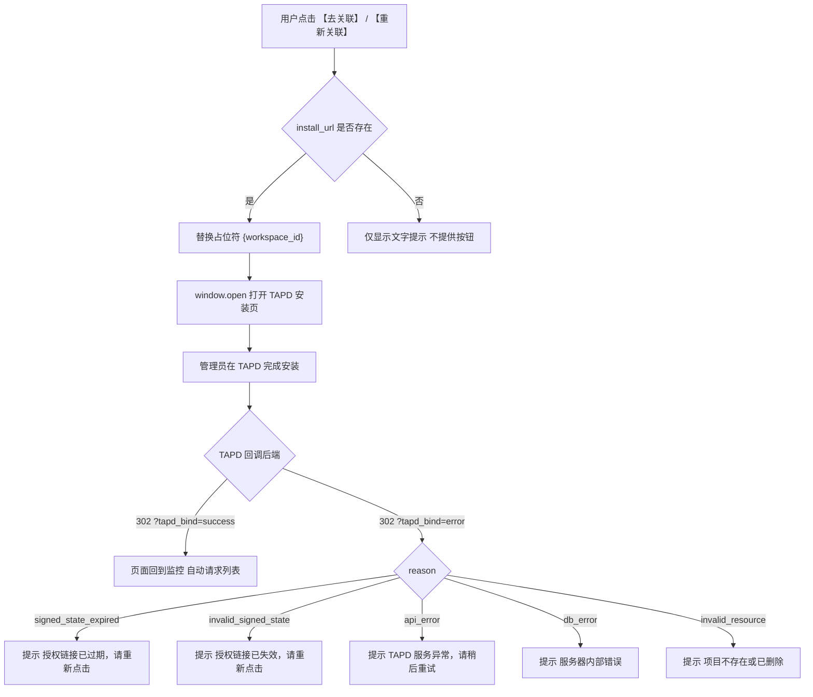

# 场景：TAPD 应用态授权安装

> 所属功能：TAPD 授权与建单
> 角色：普通用户发起 / TAPD 管理员执行授权
> 前置条件：用户在去关联页面看到至少一个状态为「授权失效」或「未授权」的项目

---

## 调用序列

### 步骤 1：后端提供安装页 URL

→ 触发时机：加载项目列表接口返回成功时
→ 来源：列表响应中的 `install_url` 字段
→ 该字段仅在列表中包含 `stale` 或 `unbound` 状态项目时存在

**`install_url` 结构（由后端生成）**：

```http
https://tapd.woa.com/oauth/open_app_install
  ?client_id=bkmonitor_tapd
  &test=1
  &cb=https%3A%2F%2Fmonitor.example.com%2Fapi%2Fv4%2Fissue%2Ftapd%2Fapp_install_callback%2F%3Fsigned_state%3DeyJia19...U4x
  #selected_workspace_id={workspace_id}
```

| 组成部分 | 说明 |
|---------|------|
| `client_id=bkmonitor_tapd` | 固定值，后端预写 |
| `test=1` | 测试应用标识（正式上架后改为 `0`） |
| `cb` | 回跳 URL，整体已由后端进行 URL 编码，指向应用安装回调端点 |
| `#selected_workspace_id={workspace_id}` | Fragment 部分，其中 `{workspace_id}` 为占位符 |

→ 成功后：将 `install_url` 保存，在用户点击「去授权」或「重新授权」时填入占位符并打开
→ 失败时（字段不存在）：说明全部项目已处于可建单或一键可绑定状态，无需显示授权按钮

---

### 步骤 2：用户触发授权，跳转安装页

→ 触发时机：用户点击列表中 `stale` 或 `unbound` 项目旁的「重新授权」或「去授权」按钮
→ 所需数据：该项目对应的 `workspace_id`
→ 操作：将 `install_url` 中的 `{workspace_id}` 占位符替换为实际项目 ID
→ 打开方式：以新窗口或新标签页方式打开安装页

替换后示例：
```
https://tapd.woa.com/oauth/open_app_install
  ?client_id=bkmonitor_tapd&test=1&cb=...
  #selected_workspace_id=69990779
```

---

### 步骤 3：管理员在 TAPD 安装页完成授权

→ 页面打开后，TAPD 平台展示蓝鲸监控应用的授权安装界面
→ 权限要求：执行安装的操作者需拥有该 TAPD 项目的管理员权限
→ 管理员确认授权安装后，TAPD 自动向后端发起回调请求
→ 前端在此步骤无直接交互，页面停留在 TAPD 或等待回调完成

---

### 步骤 4：回调完成，回到监控页面

→ TAPD 回调后端成功 → 后端 302 重定向 → 监控页面加载
→ 重定向后 URL 示例：`https://monitor.example.com/tapd/workspace?tapd_bind=success&workspace_id=69990779`
→ 前端检测 URL query 参数 `tapd_bind`，若值为 `success`，说明授权刚完成

---

### 步骤 5：刷新列表状态

→ 触发时机：检测到 `tapd_bind=success` 后
→ 操作：重新请求项目列表接口
→ 预期结果：之前 `stale` / `unbound` 的项目变为 `bound` 状态

---

## 简要调用流程图



---

## 跨浏览器 / 跨账号场景

这是一个常见的真实场景：普通用户在蓝鲸前端看到未授权项目，但普通用户自己没有 TAPD 管理员权限，需要管理员完成授权。

**角色分离**：
- **普通用户**（工单处理者）：在蓝鲸前端查看项目列表，点击「去授权」按钮，将打开的安装页链接分享给管理员
- **TAPD 管理员**（有安装权限的角色）：在自己的浏览器中打开安装页，完成应用授权，无需登录蓝鲸

**数据正确性**：
`install_url` 中包含的签名状态串已内嵌真实发起了授权请求的用户信息。即使管理员在自己的浏览器、自己的账号中完成安装授权，后端在写入项目绑定记录时，仍会正确记录发起人为原始用户。

前端视角无需关心此逻辑，正常执行跳转打开操作即可。

---

## 错误处理

授权安装流程中可能出现的错误（通过回调重定向后的 URL query 参数识别）：

| `tapd_bind` | `reason` | 含义 | 前端动作 |
|-------------|----------|------|---------|
| `error` | `signed_state_expired` | 安装链接已过期（超过 15 分钟） | 提示「授权链接已过期，请重新点击去授权」 |
| `error` | `invalid_signed_state` | 安装链接的签名验证失败（可能链接被篡改） | 提示「授权链接已失效，请重新点击去授权」 |
| `error` | `api_error` | 回调时 TAPD API 异常 | 提示「TAPD 服务异常，请稍后重试」 |
| `error` | `db_error` | 数据库写入失败 | 提示「服务器内部错误，请稍后重试」 |
| `error` | `invalid_resource` | 项目不存在或已删除 | 提示「项目不存在或已删除」 |

---

## 常见问题

### Q1：普通用户和管理员可能是不同的人，怎么保证授权后项目绑定到正确的监控业务？

签名状态串中已内嵌 `bk_biz_id`（业务 ID）和 `space_uid`（空间唯一标识），以及发起此次授权操作的原始用户标识。管理员在任意环境中完成授权，后端都能从签名状态串中还原出正确的业务关联和发起人信息。前端无需额外处理。

### Q2：`install_url` 的有效期是多久？

签名状态串的有效期为 15 分钟。超过此时间后打开安装页并点击确认，TAPD 回调时会返回 `signed_state_expired` 错误，前端应提示用户重新点击「去授权」按钮生成新的安装链接。

### Q3：管理员点了「取消」或不安装会怎样？

TAPD 安装页无「取消后回调」机制。如果管理员拒绝安装或关闭页面，TAPD 不会回调后端。前端不会收到任何回调通知。用户关闭安装窗口后，状态不会自动刷新。需要用户手动刷新页面重新请求列表，或点击「刷新状态」按钮重新请求项目列表。

### Q4：一个项目可以多次重复授权吗？

后端绑定写入使用唯一约束 + 插入或更新（upsert）模式，重复授权无副作用，最终状态一致。前端无需处理重复授权的情况，每次点击「重新授权」打开安装页即可。
