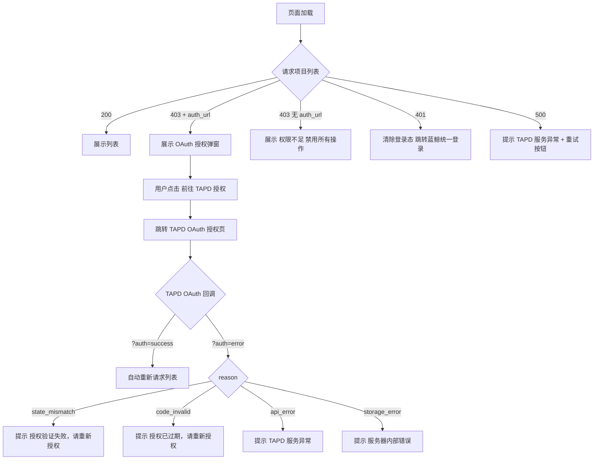

# 场景：TAPD 用户态 OAuth 授权

> 所属功能：TAPD 授权与建单
> 角色：普通用户
> 前置条件：请求项目列表接口返回 HTTP 403，响应中包含 `auth_url`

---

## 调用序列

### 步骤 1：检测 Token 失效

→ 触发时机：页面加载时请求项目列表接口
→ 接口返回 HTTP 403，响应体中包含：

```json
{
  "result": false,
  "code": 403,
  "message": "TAPD 用户态授权未生效",
  "data": {
    "auth_url": "https://tapd.woa.com/oauth/authorize?client_id=bkmonitor_tapd&response_type=code&redirect_uri=https%3A%2F%2Fmonitor.example.com%2Fapi%2Fv4%2Fissue%2Ftapd%2Foauth_callback%2F&scope=user_space&state=nonce123:2",
    "auth_method": "session"
  }
}
```

| 字段 | 说明 |
|------|------|
| `auth_url` | 后端生成的 TAPD OAuth 授权页 URL，裸字符串，直接跳转即可 |
| `auth_method` | 固定为 `session`，表示 state 存于后端 Session |

→ 前端行为：展示授权引导弹窗，包含授权说明和跳转按钮

---

### 步骤 2：用户触发 OAuth 跳转

→ 触发时机：用户点击授权引导弹窗中的「前往 TAPD 授权」按钮
→ 操作：直接跳转至 `auth_url` 所指的 TAPD OAuth 授权页
→ 该 URL 已包含 redirect_uri（回调端点）、scope（授权范围）和 state（防 CSRF 值），前端无需修改

---

### 步骤 3：用户在 TAPD 完成 OAuth 授权

→ 用户在 TAPD 授权页确认授予蓝鲸监控对其 TAPD 账号的访问权限
→ TAPD 自动向后端发起回调请求，携带 code 和 state
→ 前端在此步骤无直接交互，浏览器停留在 TAPD 或等待回调

---

### 步骤 4：回调完成，回到监控页面

→ 后端完成 code 换 token、加密存储后，302 重定向回监控页面
→ 授权成功时 URL 示例：`https://monitor.example.com/tapd/workspace?auth=success`
→ 授权失败时 URL 示例：`https://monitor.example.com/tapd/workspace?auth=error&reason=state_mismatch`
→ 前端检测 URL query 参数 `auth`

---

### 步骤 5：刷新列表状态

→ 触发时机：检测到 `auth=success` 后
→ 操作：重新请求项目列表接口
→ 预期结果：个人 Token 已刷新，接口返回项目列表（HTTP 200）

---

## 简要调用流程图



---

## 错误处理

OAuth 授权流程中可能出现的错误（通过回调重定向后的 URL query 参数识别）：

| `auth` | `reason` | 含义 | 前端行为 |
|--------|----------|------|---------|
| `error` | `state_mismatch` | Session state 不匹配（跨站请求伪造攻击，或用户 Session 已过期） | 提示「授权验证失败，请重新授权」 |
| `error` | `code_invalid` | 授权码已过期（超过 10 分钟）或已被使用 | 提示「授权已过期，请重新授权」 |
| `error` | `api_error` | TAPD 请求 Token 接口异常 | 提示「TAPD 服务异常，请稍后重试」 |
| `error` | `storage_error` | Token 写入 Redis 失败 | 提示「服务器内部错误，请稍后重试」 |

---

## 注意事项

### 授权页面弹窗设计建议

授权引导弹窗应包含以下信息：
- 当前状态说明：「您的 TAPD 个人授权已过期或尚未完成」
- 操作提示：「请在 TAPD 完成授权后自动回到本页面」
- 操作按钮：「前往 TAPD 授权」
- 辅助信息：「授权完成后页面将自动返回」

### 与蓝鲸登录态的关系

TAPD OAuth 授权与蓝鲸平台自身的登录态是独立的两个系统。
- 用户可能有蓝鲸登录态但无 TAPD 授权（此时列表接口返回 403 + auth_url）
- 用户可能有 TAPD 授权但蓝鲸登录态过期（此时任何监控接口都返回 401）
- 两者需分别处理，互不影响

### Token 有效期与刷新策略

一期不实现 Token 的自动后台刷新。个人 Token 有效期为 2 小时（由 TAPD 平台决定），后端通过 Redis TTL 自动淘汰。Token 过期后再次请求列表接口将返回 403，引导用户重新走一次 OAuth 授权流程。评审结论：Token 刷新机制比例失衡，一次重定向成本低，无需复杂异步任务。

---

## 常见问题

### Q1：用户点了「拒绝授权」会怎样？

TAPD 授权页不提供「拒绝后回调」机制。用户点了「取消」或关闭授权页，TAPD 不会回调后端。前端不会收到任何回调通知，页面停留在 TAPD。用户需要手动关闭 TAPD 页面、回到监控页面，此时列表接口仍返回 403，授权引导弹窗继续展示。

### Q2：用户完成 OAuth 授权后，页面没有自动跳回监控怎么办？

正常流程由 TAPD 回调后端后重定向完成。如果因网络等原因用户停留在 TAPD 页面，用户可手动关闭 TAPD 页签回到监控页，再点击「刷新」重新请求列表。如果 Token 已正常写入，列表将正常返回；如果授权未完成，仍返回 403。

### Q3：一个用户在多个蓝鲸业务下操作，授权状态共享吗？

不共享。OAuth 授权是基于用户的（用户维度），但 Token 的 Session state 按业务 ID 隔离。不同业务下的授权互相独立，但实际的 TAPD 授权是一次性的——用户只需在 TAPD 上授权一次蓝鲸监控对用户账号的访问，各个监控业务都可以共享该授权（Token 是用户级别的）。

换言之：用户在业务 A 完成了 OAuth 授权，业务 B 的请求也会正常返回列表，因为用的是同一个用户 Token。

### Q4：`auth_url` 需要缓存吗？

不需要。每次列表接口返回 403 时都会生成一个新的 `auth_url`，其中 `state` 参数包含新的随机串和防 CSRF 值，且会更新后端 Session。缓存旧的 `auth_url` 可能导致 state 不匹配错误。每次触发 403 时都应使用响应中的最新 `auth_url`。
