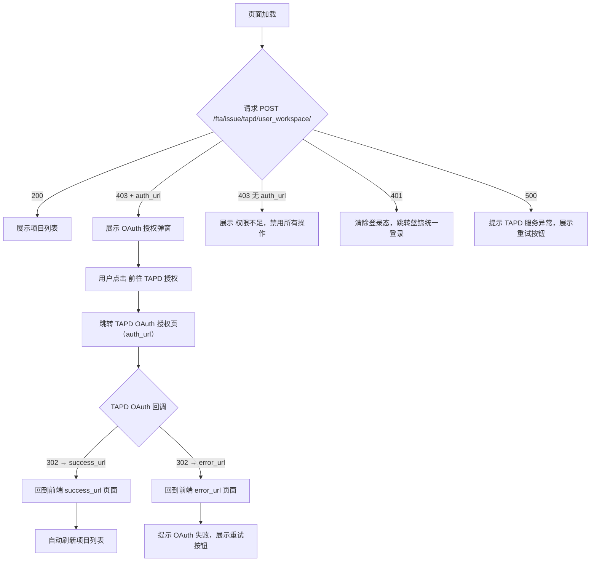

# 场景：TAPD 用户态 OAuth 授权

> 所属功能：TAPD 授权与建单
> 角色：普通用户
> 前置条件：请求项目列表接口返回 HTTP 403，响应中包含 `auth_url`
>
> ⚠️ **版本 3 变更**：增加「取消授权」按钮交互描述，与 `revoke_auth` 接口联动。
>
> ⚠️ **版本 2 变更**：`auth_url` 中的 `state` 改为自包含 signed_state（含用户名、租户、过期时间等），`scope` 细化为 `story#read story#write bug#read bug#write`

---

## 调用序列

### 步骤 1：检测 Token 失效

→ 触发时机：页面加载时请求项目列表接口
→ 接口返回 HTTP 403，响应体中包含：

```json
{
  "result": false,
  "code": 403,
  "message": "TAPD 用户态授权未生效",
  "data": {
    "auth_url": "https://tapd.woa.com/oauth/authorize?client_id=bkmonitor_tapd&response_type=code&redirect_uri=https%3A%2F%2Fmonitor.example.com%2Ffta%2Fissue%2Ftapd%2Foauth_callback%2F&scope=story%23read+story%23write+bug%23read+bug%23write&state=eyJub25jZSI6ImFiYzEyMyIsImJrX2Jpel9pZCI6MiwiYmtfdGVuYW50X2lkIjoiZGVmYXVsdCIsInNwYWNlX3VpZCI6ImJrY2NfXzIiLCJpbml0aWF0b3IiOiJhcnRlbWlzIiwiZXhwIjoxNzE5MDcyMDAwLCJzdWNjZXNzX3VybCI6Imh0dHBzOi8vbW9uaXRvci5leGFtcGxlLmNvbS8jL3RhcGQvd29ya3NwYWNlIiwiZXJyb3JfdXJsIjoiaHR0cHM6L21vbml0b3IuZXhhbXBsZS5jb20vLi4uIiwiYmFja2VuZF9jYWxsYmFjayI6Imh0dHBzOi8vbW9uaXRvci5leGFtcGxlLmNvbS9mdGEvaXNzdWUvdGFwZC9vYXV0aF9jYWxsYmFjay8ifQ==..."
  }
}
```

| 字段 | 说明 |
|------|------|
| `auth_url` | 后端生成的 TAPD OAuth 授权页 URL，`state` 为自包含 signed_state，前端直接跳转即可，无需任何改动 |

→ 前端行为：展示授权引导弹窗，包含授权说明和跳转按钮

---

### 步骤 2：用户触发 OAuth 跳转（或选择取消授权）

→ 触发时机：用户点击授权引导弹窗中的「前往 TAPD 授权」按钮
→ 操作：直接跳转至 `auth_url` 所指的 TAPD OAuth 授权页
→ 该 URL 已包含 `redirect_uri`（回调端点）、`scope`（权限范围）和 `state`（自包含签名状态串），前端无需修改

→ **替代操作**：用户点击弹窗中的「取消授权」按钮（可选）
→ 操作：调用 `POST /fta/issue/tapd/revoke_auth`（Body: `{ "bk_biz_id": <业务ID> }`）撤销当前用户 TAPD 用户态授权，关闭弹窗
→ 详见 [revoke-tapd-auth.md](revoke-tapd-auth.md)

---

### 步骤 3：用户在 TAPD 完成 OAuth 授权

→ 用户在 TAPD 授权页确认授予蓝鲸监控对其 TAPD 账号的访问权限
→ TAPD 自动向后端发起回调请求，携带 code 和 state
→ 前端在此步骤无直接交互，浏览器停留在 TAPD 或等待回调

---

### 步骤 4：回调完成，回到监控页面

后端完成 code 换 token、加密存储后，302 重定向到 `success_url`（前端配置的地址，不含额外 query 参数）。

如果失败（signed_state 过期、code 失效、API 异常等），则 302 重定向到 `error_url`（同样不含额外 query 参数）。

---

### 步骤 5：刷新列表状态

→ 触发时机：页面从 `success_url` 或 `error_url` 返回并重新加载时
→ 操作：
- 若 URL 匹配 `success_url` → 重新请求项目列表接口
- 若 URL 匹配 `error_url` → 展示「授权失败，请重试」提示
→ 预期结果：个人 Token 已写入 Redis，接口返回项目列表（HTTP 200）

> 实际判断方法：建议前端在跳转 TAPD 前将 `{ oauthFlow: true, timestamp: Date.now() }` 写入 sessionStorage，页面返回后检测到该标记（且在 5 分钟内），即可自动触发列表刷新。

---

## 简要调用流程图



---

## 错误处理

用户态授权成功后，后端 302 重定向至 `success_url`（前端配置）；失败时 302 重定向至 `error_url`。两者均**不附加额外 URL query 参数**。

| 场景 | 前端表现 | 建议行为 |
|------|---------|---------|
| 页面加载且 URL 匹配 `success_url` | OAuth 成功，Token 已写入 Redis | 自动刷新项目列表 |
| 页面加载且 URL 匹配 `error_url` | OAuth 失败（signed_state 过期、code 失效、API 异常等） | 提示「授权失败，请重试」并展示重试按钮 |

> 前端可通过 sessionStorage 或 localStorage 记录 OAuth 流程状态（如在跳转前写入 `{ oauthFlow: true, timestamp: Date.now() }`），页面返回后检测到该标记且在合理时间范围内（< 5分钟），即可触发列表刷新。

---

## 注意事项

### 授权页面弹窗设计建议

授权引导弹窗应包含以下信息：
- 当前状态说明：「您的 TAPD 个人授权已过期或尚未完成」
- 操作提示：「请在 TAPD 完成授权后自动回到本页面」
- 主操作按钮：「前往 TAPD 授权」
- 辅助按钮（可选）：「取消授权」—— 调用 `POST /fta/issue/tapd/revoke_auth`（Body: `{ "bk_biz_id": <业务ID> }`）撤销用户态授权，关闭弹窗。下次请求列表时再次触发本弹窗
- 辅助信息：「授权完成后页面将自动返回」

**注意**：版本 2 变更后不再依赖 Session。`state` 改为自包含 signed_state（JWT-like），内嵌 `success_url`、`error_url`、`backend_callback`、用户信息等，支持多浏览器、跨标签页、Session 过期场景。前端无需关心 `state` 的内部结构，拿到 `auth_url` 后直接在浏览器地址栏打开即可。

### Token 有效期与刷新策略

一期不实现 Token 的自动后台刷新。个人 Token 有效期为 2 小时（由 TAPD 平台决定），后端通过 Redis TTL 自动淘汰。Token 过期后再次请求列表接口将返回 403，引导用户重新走一次 OAuth 授权流程。评审结论：Token 刷新机制比例失衡，一次重定向成本低，无需复杂异步任务。

---

## 常见问题

### Q1：用户点了「拒绝授权」会怎样？

TAPD 授权页不提供「拒绝后回调」机制。用户点了「取消」或关闭授权页，TAPD 不会回调后端。前端不会收到任何回调通知，页面停留在 TAPD。用户需要手动关闭 TAPD 页面、回到监控页面，此时列表接口仍返回 403，授权引导弹窗继续展示。

### Q2：用户完成 OAuth 授权后，页面没有自动跳回监控怎么办？

正常流程由 TAPD 回调后端后重定向完成。如果因网络等原因用户停留在 TAPD 页面，用户可手动关闭 TAPD 页签回到监控页，再点击「刷新」重新请求列表。如果 Token 已正常写入，列表将正常返回；如果授权未完成，仍返回 403。

### Q3：一个用户在多个蓝鲸业务下操作，授权状态共享吗？

不共享。OAuth 授权是基于用户的（用户维度），但 `auth_url` 中的 `signed_state` 按业务 ID 隔离（内嵌 `bk_biz_id`）。不同业务下的授权链接是独立的，包含不同的 nonce 和过期时间。

但实际的 TAPD 授权是一次性的——用户只需在 TAPD 上授权一次蓝鲸监控对用户账号的访问，各个监控业务都可以共享该授权（Token 是用户级别的，Redis key = `tapd_uat:{tenant}:{user}`）。

换言之：用户在业务 A 完成了 OAuth 授权，业务 B 的请求也会正常返回列表，因为用的是同一个用户 Token。但由于 `signed_state` 内含特定业务信息，每个业务的 `auth_url` 只能用于该业务的回调。

### Q4：`auth_url` 需要缓存吗？

不需要。每次列表接口返回 403 时都会生成一个新的 `auth_url`，其中 `state` 参数是新的 signed_state（包含新的 nonce 和新的过期时间），且有效期仅 15 分钟。缓存旧的 `auth_url` 可能导致签名过期或 nonce 不匹配。每次触发 403 时都应使用响应中的最新 `auth_url`。
