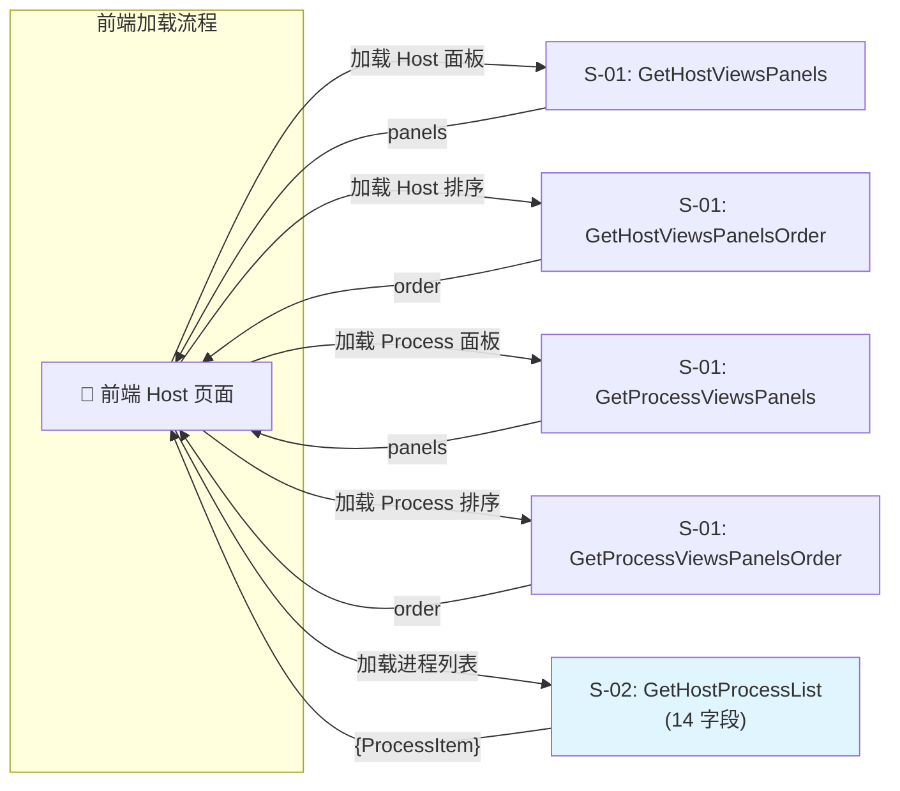
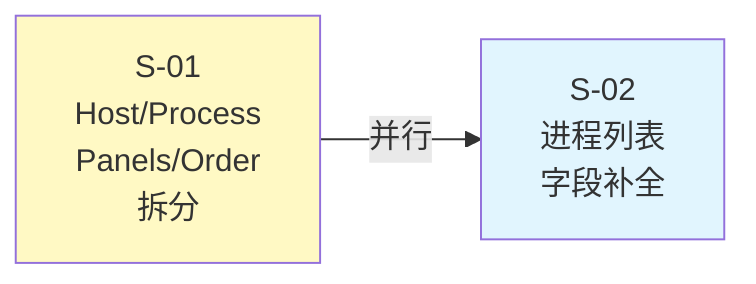

# Host 页面接口拆分重构 - 技术设计

> **需求编号**: REQ-20260707-001
> **设计日期**: 2026-07-09
> **设计状态**: 设计中

---

## 1. 需求背景 & 目标

### 1.1 背景

前端 Host 页面当前通过 `get_scene_view` 一次性获取全部视图配置（panels + order），进程列表仅返回 3 个字段（status, name, id）。随着页面复杂度增加，前端需要将接口拆分为细粒度独立接口，实现首屏快速渲染、按需加载、缓存策略优化。

### 1.2 目标

- **S-01**: 拆分 `get_scene_view` 为 4 个独立接口（host/process × panels/order），前端按需调用
- **S-02**: 补全 `get_host_process_list` 字段至 14 个，覆盖 CMDB 静态信息 + 运行时指标 + 端口健康状态

### 1.3 不在范围内

- 前端页面渲染逻辑
- 其他 Host 页面接口（`search_host_info`、`search_host_metric`、`get_topo_tree`）保持不变
- 面板内具体指标数据的查询逻辑

---

## 2. 关键环节一览图

---

## 3. 总体方案设计

### 3.1 子需求节点图

### 3.2 共享术语速查

| 术语 | 含义 | 定义位置 |
|------|------|----------|
| `SceneView` | 场景视图，Monaco 场景化配置模型，包含 `view_type`、`panels`、`order` | 子需求 S-01 |
| `HostBuiltinProcessor` | Host/Process 内置处理器，通过 `get_auto_view_panels` 生成 panels + order | 子需求 S-01 |
| `ProcessItem` | 前端定义的进程列表数据项，14 个字段（含静态+运行时+端口健康） | 子需求 S-02 |
| `system.proc` | 蓝鲸监控采集的进程运行时指标表（pid, cpu, mem, uptime 等） | 子需求 S-02 |
| `system.proc_port` | 蓝鲸监控采集的端口健康状态表（port_health, proc_exists） | 子需求 S-02 |
| `ResourceRoute` | Django DRF Resource 框架路由注册范式，`(method, Resource, endpoint)` | 通用 |

---

## 4. 全局风险 & 跨子需求依赖

### 4.1 跨子需求依赖

- **S-01 ↔ S-02**: 无直接数据依赖，可并行开发、独立测试、独立发布
- **内部共享**: 两子需求共享 `SceneViewViewSet` 路由注册位置（`scene_view/views.py`），但 Resource 类各自独立

### 4.2 全局风险

| 风险 | 影响 | 缓解措施 |
|------|------|---------|
| `Process` 类改造影响面 | 改 `api/cmdb/define.py` 的 `Process.__init__` 加 `_extra_attr` 兜底，可能影响所有 CMDB 进程查询场景 | S-02 方案中提供「改类」和「绕过封装」两个备选，按影响范围决策 |
| 时序查询新增下游依赖 | S-02 引入 `system.proc`/`system.proc_port` 时序查询，下游服务不可用时可能导致进程列表加载慢或失败 | 超时控制（默认 3s）、降级返回（缺失字段填 `None`）、缓存策略 |
| 路由注册一致性 | 4 个新接口 + 1 个改造接口统一挂在 `SceneViewViewSet`，URL 命名需与前端 API 文档严格对齐 | 接口签名阶段与前端 Wiki 交叉校验 |

### 4.3 共享接口契约变更声明

| 变更类型 | 接口 | 变更内容 | 影响子需求 |
|---------|------|---------|-----------|
| 修改 | `get_host_process_list` | 响应字段从 3 个扩展至 14 个 | S-02 |
| 新增 | `get_host_views_panels` | 从 `get_scene_view` `host` 视图拆分 panels | S-01 |
| 新增 | `get_host_views_panels_order` | 从 `get_scene_view` `host` 视图拆分 order | S-01 |
| 新增 | `get_process_views_panels` | 从 `get_scene_view` `process` 视图拆分 panels | S-01 |
| 新增 | `get_process_views_panels_order` | 从 `get_scene_view` `process` 视图拆分 order | S-01 |

---

*(子文档详见 `design/` 目录)*
