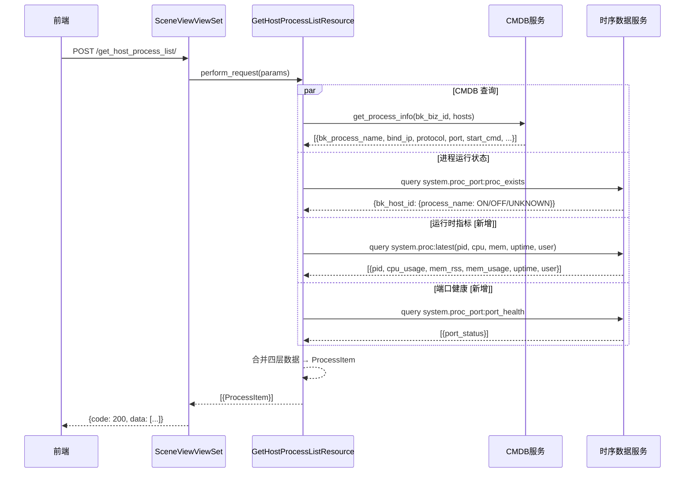

# S-02: 进程列表字段补全

> **父需求**: REQ-20260707-001
> **子需求编号**: S-02

---

## 1. 术语

| 术语 | 含义 |
|------|------|
| `ProcessItem` | 前端定义的进程列表数据项，14 个字段 |
| `system.proc` | 蓝鲸监控采集进程运行时指标（pid, cpu, mem, uptime 等），维度：`bk_host_id` + `display_name` |
| `system.proc_port` | 蓝鲸监控采集端口健康状态，指标：`port_health`（0=Normal/1=Abnormal），维度同上 |
| `Process` (CMDB) | `api/cmdb/define.py` 中的 Python 类，封装 CMDB 原始进程 JSON，当前无 `_extra_attr` 兜底 |
| `get_process_status` | `scene_view/resources/host.py` 现有函数，查 `system.proc_port` 的 `proc_exists` 返回 ON/OFF/UNKNOWN |

---

## 2. 现状（AS-IS）

### 2.1 现状描述

`GetHostProcessListResource` 当前返回仅 3 个字段：

```python
{
    "status": "ON",  # ON/OFF/UNKNOWN，来自 get_process_status
    "name": "nginx",
    "id": "nginx"    # 即 name，无 hostIp 拼接
}
```

**完整链路**：
1. `perform_request` 调 `get_process_info(bk_biz_id, topo_nodes)`（`cc/resources/cmdb.py`）
2. `get_process_info` 查 CMDB 获取原始进程列表
3. `get_process_info` 内部每进程构建 `Process(pp)` 对象 → `process["ports"] = pp.ports`
4. `get_process_status(bk_biz_id, hosts)` 查 `system.proc_port` 的 `proc_exists` 指标
5. `perform_request` 将 CMDB 数据与 `status` 合并返回

**位置**：`scene_view/resources/host.py` → `GetHostProcessListResource`（第 46-120 行）

### 2.2 痛点

- 前端进程列表需要展示 14 个字段，后端当前仅返回 3 个
- `Process` 类丢失原始字段：`start_cmd`, `create_time`, `last_time` 等因无 `_extra_attr` 被丢弃
- `portStatus`（端口健康状态）与当前返回的 `status`（进程运行状态）语义不同但前端均需要

---

## 3. 方案（TO-BE）

### 3.1 方案概述

保留现有 CMDB 查询链路，按数据源分层补全字段：

1. **CMDB 静态信息**：直接复用 `get_process_info` 的 CMDB 查询，从原始 JSON（非 `Process` 对象）取 `bind_ip`, `protocol`, `port`, `start_cmd`
2. **运行时指标**：新增 `system.proc` 时序查询，取 `pid`, `cpuUsage`, `memRss`, `memUsage`, `uptime`, `user`
3. **端口健康**：新增 `system.proc_port` 查询（`port_health` 指标），与现有 `proc_exists` 查询并行
4. **Process 类**：二期待改造（新增 `_extra_attr` 兜底），一期先用原始 JSON 绕过

### 3.2 关键决策点

| 决策 | 选择 | 理由 | 备选方案 | 否决原因 |
|------|------|------|---------|---------|
| CMDB 字段来源 | ✅ 从原始 JSON 取（绕过 `Process` 对象） | 立即可用，无需等待 `Process` 类改造发布 | 改 `Process.__init__` 加 `_extra_attr` | `start_cmd` 需立即使用，改类需回归测试所有 CMDB 调用点 |
| `Process` 类改造时机 | 二期异步改造，一期先用原始 JSON | 避免阻塞主流程，降低发布风险 | 一期同步改 | CMDB `Process` 类广泛引用，改动影响面不可控 |
| 时序查询方式 | 复用现有 `get_ts_data` 工具（BK-Monitor 通用时序查询） | 项目内已有成熟封装，支持批量查询和超时控制 | 直接调 UnifyQuery API | 增加维护成本，无额外收益 |
| 缺失字段处理 | 填 `None`（而非默认值） | 前端可区分「无数据」与「值为零」 | 默认值 0 | `cpuUsage=0` 与「无数据」语义混淆 |

### 3.3 目录结构

```
api/
└── cmdb/
    └── define.py              # [二期待改] Process 类新增 _extra_attr 兜底（Phase 2 实施）
scene_view/
├── resources/
│   └── host.py                # [修改] GetHostProcessListResource.perform_request 补全字段逻辑
└── builtin/
    └── host.py                # [无改动] get_process_status 复用
cc/
└── resources/
    └── cmdb.py                # [修改] get_process_info 返回原始 JSON 供额外字段提取
```

---

## 4. 接口设计 + 数据模型

### 4.1 对外接口（改造接口）

#### `get_host_process_list`

| 属性 | 值 |
|------|-----|
| 方法 | POST |
| 路由 | `/scene_view/get_host_process_list/` |
| Resource | `GetHostProcessListResource`（改造） |

**Request**: 复用现有（无变化）

```json
{
  "bk_biz_id": 2,
  "id": 1  // bk_host_id
}
```

**Response Demo**（改造后，字段扩展至 14 个）：

```json
{
  "code": 200,
  "data": [
    {
      "status": "ON",
      "name": "nginx",
      "id": "nginx",
      "bindIp": "127.0.0.1",
      "protocol": "TCP",
      "port": "80",
      "startCommand": "/usr/sbin/nginx",
      "pid": 1234,
      "cpuUsage": 12.5,
      "memRss": 1024000,
      "memUsage": 5.2,
      "uptime": "3d 2h",
      "user": "www-data",
      "hostIp": "10.0.0.1",
      "portStatus": 0  // 0=Normal, 1=Abnormal；与 status(ON/OFF/UNKNOWN) 语义不同
    }
  ],
  "message": "success"
}
```

### 4.2 数据模型

#### Process 类改造（`api/cmdb/define.py`）— 二期待办

> **Phase 1 无需修改**：当前从原始 JSON 直接取 `start_cmd` 等字段，不依赖 `Process` 对象。
> 二期改造示例如下：

```python
class Process(BkCmdbResource):
    """CMDB 进程信息（二期改造）"""
    
    def __init__(self, process_info):
        self.id = process_info["bk_process_id"]
        self.name = process_info["bk_process_name"]
        self.protocol = process_info["protocol"] if process_info["protocol"] else None
        self.bind_ip = process_info["bind_ip"]
        self.port = process_info["port"]
        self.start_cmd = process_info.get("start_cmd")  # [二期新增] 保留 start_cmd
        self.ports = process_info.get("ports", [])
        # [二期新增] _extra_attr 兜底，保留所有原始字段
        self._raw = process_info
```

#### 进程列表响应 Schema（返回字段定义）

| 字段 | 来源 | 数据类型 | 说明 |
|------|------|---------|------|
| `status` | `get_process_status`（现有） | string | ON/OFF/UNKNOWN，进程运行状态 |
| `name` | CMDB `bk_process_name` | string | 进程名称 |
| `id` | CMDB `bk_process_name`（与 name 相同） | string | 进程标识 |
| `bindIp` | CMDB `bind_ip` | string | 绑定 IP |
| `protocol` | CMDB `protocol` | string | 协议类型（TCP/UDP） |
| `port` | CMDB `port`（单值处理） | string | 首个端口 |
| `startCommand` | CMDB `start_cmd` | string | 启动命令 |
| `pid` | `system.proc` `pid` | int | 进程 ID |
| `cpuUsage` | `system.proc` `cpu_usage` | float | CPU 使用率（%） |
| `memRss` | `system.proc` `mem_rss` | int | 物理内存（bytes） |
| `memUsage` | `system.proc` `mem_usage` | float | 内存使用率（%） |
| `uptime` | `system.proc` `uptime` | string | 运行时长 |
| `user` | `system.proc` `user` | string | 运行用户 |
| `hostIp` | 入参主机 IP | string | 主机 IP |
| `portStatus` | `system.proc_port` `port_health` | int | 0=Normal, 1=Abnormal |

---

## 5. 时序图



---

## 6. 异常处理

| 场景 | 行为 | 是否对外暴露 |
|------|------|------------|
| CMDB 查询失败 | 抛 `CMDBError`，前端显示「进程信息加载失败」 | 是 |
| system.proc 时序查询超时（>3s） | 降级：运行时字段（pid, cpuUsage 等）填 `None`，前端展示为 `--` 或 `N/A`，其他字段正常返回 | 否（静默降级） |
| system.proc_port 查询超时 | 降级：`portStatus` 填 `None`，不影响 `status`（现有逻辑正常返回）；前端展示为 `--` 或 `N/A` | 否（静默降级） |
| hosts 为空列表 | 返回空列表 `[]` | 否 |
| 某进程无时序数据 | 该进程运行时字段填 `None`，其余字段正常 | 否 |

---

## 7. 性能 & 安全

### 性能

- **预期量级**：单机 Host 进程数 ≤ 50，时序查询维度 `bk_host_id` + `display_name`
- **关键瓶颈**：`system.proc` 聚合查询（N 个进程 × M 个指标），建议使用批量查询
- **不做的优化**：
  - 不引入进程级缓存（进程状态变化快，缓存收益低）
  - 不做预加载（按需查询，避免无用开销）

### 安全

- **输入校验**：`bk_biz_id`（int）、`id`（int，`bk_host_id`）通过现有 `RequestSerializer` 校验
- **权限边界**：复用 `GetHostProcessListResource` 现有权限检查（`bk_biz_id` 归属校验）
- **时序查询防注入**：查询维度固定为 `bk_host_id` + `display_name`，不使用用户输入字符串拼接查询语句

---

## 8. 影响范围

| 影响对象 | 影响类型 | 影响描述 | 是否破坏性变更 |
|---------|---------|---------|:----------:|
| `scene_view/resources/host.py` | 行为变更 | `GetHostProcessListResource` 新增时序查询逻辑，返回字段从 3 个扩至 14 个 | 否（兼容扩展） |
| `cc/resources/cmdb.py` | 行为变更 | `get_process_info` 需支持返回原始 JSON 供额外字段提取 | 否（兼容扩展） |
| `api/cmdb/define.py` | 二期待办 | `Process` 类新增 `_extra_attr` / `_raw` 兜底（Phase 2 实施） | 否（兼容扩展） |
| `system.proc` 时序服务 | 依赖新增 | 新增下游查询依赖 | 否（降级处理） |
| `system.proc_port` 时序服务 | 依赖新增 | 新增下游查询依赖 | 否（降级处理） |

---

*(父文档详见 `host_view_split_DESIGN.md`)*
