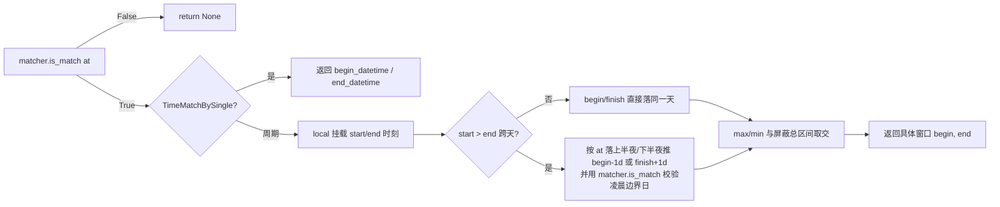
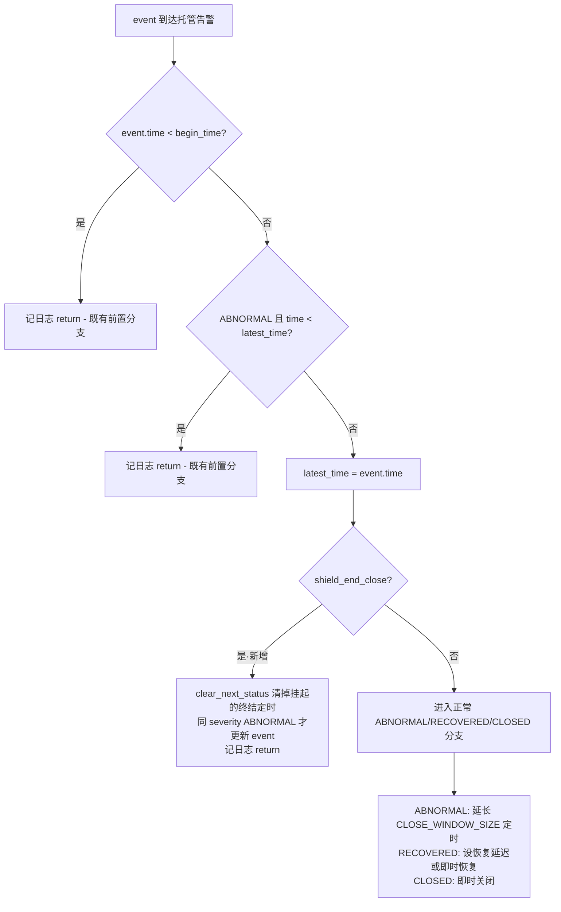
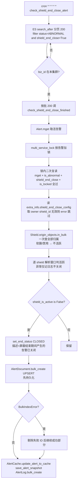

# 逐处解读：PR#12433 屏蔽结束后静默关闭告警

> 本文为完整讲解（Phase 0→1→2→3→4→5→6→7）。

**本文引用的文件**
- [全量 diff](file:///tmp/teach-pr12433.diff)
- [close.py](file://bkmonitor/alarm_backends/service/converge/shield/close.py)
- [window.py](file://bkmonitor/alarm_backends/service/converge/shield/window.py)
- [shield_obj.py](file://bkmonitor/alarm_backends/service/converge/shield/shield_obj.py)
- [shield_tasks.py](file://bkmonitor/alarm_backends/service/alert/manager/shield_tasks.py)
- [alert.py](file://bkmonitor/alarm_backends/core/alert/alert.py)
- [builder/processor.py](file://bkmonitor/alarm_backends/service/alert/builder/processor.py)

## 目录
1. [改动组 1：核心数据模型与常量](#改动组-1核心数据模型与常量)
2. [改动组 2：接管判定引擎](#改动组-2接管判定引擎)
3. [改动组 3：托管告警的隔离防护](#改动组-3托管告警的隔离防护)
4. [改动组 4：独立关闭任务](#改动组-4独立关闭任务)
5. [改动组 5：Web/内核接口层](#改动组-5web内核接口层)
6. [改动组 6：前端](#改动组-6前端)
7. [改动组 7：测试](#改动组-7测试)

---

## 改动组 1：核心数据模型与常量

**改动模式**：给"屏蔽"这个已有概念加一个正交维度——结束处理方式。不改既有行为，新字段默认值就是旧行为。

### `constants/shield.py` — 新增 `ShieldEndPolicy`

**before → after**

| | 代码 |
|---|---|
| before | 无此概念 |
| after | `class ShieldEndPolicy: NOTIFY_ONCE = "notify_once"; CLOSE = "close"` |

- **改了什么**：定义两种结束策略枚举。`notify_once` 是现行为（屏蔽结束对未恢复告警各补发一次通知）；`close` 是本 PR 新增能力。
- **为什么改**：`[显式]` TAPD 需求 1010158081137962111——"选项一=屏蔽结束后发送一次通知（默认）；选项二=屏蔽结束时不再通知"。
- **影响谁**：全部下游（模型/接口/引擎/前端），见后续各组。
- **范围**：`[专用]`

顺带：`object` 括号清理、编码声明删除——纯风格改动，无语义变化。

章节来源：[constants/shield.py](file://bkmonitor/constants/shield.py#L54-L58)

### `bkmonitor/models/base.py` + `migrations/0205` — Shield 模型加字段

**before → after**

| | 代码 |
|---|---|
| before | `Shield` 模型无 end_policy 字段 |
| after | `end_policy = models.CharField(verbose_name="屏蔽结束处理方式", max_length=16, default=ShieldEndPolicy.NOTIFY_ONCE)` + 迁移 |

- **改了什么**：Shield 表新增一列，默认 `notify_once`——存量数据零迁移成本，新字段默认值即旧行为。
- **为什么改**：`[推断]` 默认值选 `notify_once` 而非空，推断依据是"上线后既有屏蔽规则行为不变"，与需求交付目标"默认保留当前通知行为，降低功能上线对既有使用习惯的影响"直接呼应。
- **影响谁**：DB（需迁移）、ShieldCacheManager 缓存序列化（config dict 会带上该字段）、所有读 Shield 的链路。
- **范围**：`[专用]`

章节来源：[models/base.py](file://bkmonitor/bkmonitor/models/base.py#L800-L810)、[0205_shield_end_policy.py](file://bkmonitor/bkmonitor/migrations/0205_shield_end_policy.py#L1-L13)

### `bkmonitor/documents/alert.py` — AlertDocument 加 `shield_end_close`

- **改了什么**：告警 ES 文档新增布尔字段 `shield_end_close`，标记"这条告警被某条 close 屏蔽接管"。
- **为什么改**：`[推断]` 需要一个持久化标记让独立关闭任务能扫到这些告警（任务 filter `Q("term", shield_end_close=True)`），且区分"普通屏蔽"（is_shielded/is_blocked）与"托管"两种状态。
- **影响谁**：ES mapping（存量索引需先加 mapping 才能查询）、manager 的两个扫描任务、shield_tasks 扫描。
- **范围**：`[专用]`

章节来源：[documents/alert.py](file://bkmonitor/bkmonitor/documents/alert.py#L80-L84)

---

## 改动组 2：接管判定引擎

**改动模式**：新建一个批内匹配器，在 builder 阶段对新告警做"close 屏蔽认领"。匹配不是"当前时间在窗口内"，而是"告警的 begin_time 落在屏蔽窗口内"——这是整个 PR 最核心的语义切换。

### `converge/shield/close.py`（新文件）— `CloseShieldMatcher`

**before → after**

| | 代码 |
|---|---|
| before | 无 |
| after | `CloseShieldMatcher`：按业务缓存 close 屏蔽配置，批内 `take_over(alert)` 逐告警匹配 |

- **改了什么**：核心方法 `_take_over` 做四件事：① 从 `ShieldCacheManager.get_shields_by_biz_id` 拉业务下全部屏蔽，过滤出 end_policy=close、启用中、非快捷、category 不属于 (alert, event) 的候选；② 按业务解析时区并 `timezone.override`；③ `_match`：对每个候选 `shield.is_match(document, now)`，命中多个时按 `(end, -shield_id)` 取 max（结束最晚优先、ID 小优先）；④ 命中即写 `shield_end_close=True`、`is_shielded=True`、`shield_id=[id]`、extra_info 记 `shield_end_close_config`（shield_id + window_begin/window_end 快照），并 `clear_next_status()`。
- **为什么改**：
  - `[推断]` 过滤条件排除 alert/event 类与快捷屏蔽，推断依据：这两类屏蔽的语义是"针对特定告警/事件的一次性屏蔽"，与"期间产生的告警"（面向未来）概念冲突，接口层也做了同款拒绝校验（serializers.py validate）。
  - `[推断]` 候选选择"结束最晚优先"，推断依据：多条 close 屏蔽同时覆盖时，选窗口最远的意味着告警能被托管最久，最不容易在屏蔽还在时就脱离托管。
  - `[显式]` 注释 `Matching precedes the normal enrichment stage in the builder`——匹配发生在正常 enricher 之前，strategy snapshot 缺失时先补 enrich。
- **影响谁**：builder 两处调用点（见改动组 3）、saas_config.py 的缓存短路路径（见下）。
- **范围**：`[专用]`

关键细节：`take_over` 首行 `if alert.shield_end_close or not alert.is_abnormal(): return`——**首接粘滞**：已被接管的告警不再重新匹配（即使后续窗口更长的屏蔽出现，也不改主）。测试 `test_take_over_selects_farthest_end_then_lowest_id` 验证了这一点。

章节来源：[close.py](file://bkmonitor/alarm_backends/service/converge/shield/close.py#L17-L77)

### `converge/shield/window.py`（新文件）— 窗口解析

**before → after**

| | 代码 |
|---|---|
| before | 无 |
| after | `business_timezone(bk_biz_id)` + `close_time_matcher(...)` + `matching_window(matcher, at)` |

- **改了什么**：三个函数解决两个问题：
  1. **业务时区**：`business_timezone` 从 CMDB 业务缓存取 `time_zone`，取不到兜底 `settings.TIME_ZONE`。
  2. **窗口具体化**：普通屏蔽匹配只回答"当前时间是否命中"，close 屏蔽需要回答"**这次告警**发生在哪一次屏蔽窗口内"。`matching_window` 把周期规则（每天/每周/每月的 HH:MM 窗口）解析成**具体的一次** [begin, end] 时间戳区间。
- **为什么改**：
  - `[显式]` 类 docstring `Close shields use the business calendar, never the worker OS timezone`——周期匹配必须用业务日历，不能用 worker 的 OS 时区。
  - `[推断]` `_BusinessCalendar` 重写 `is_week_match/is_month_match` 改用 `time_tools.localtime`，推断依据：原 `TimeMatchByWeek.is_week_match` 用的是构造时 worker 时区的时间，混合时区集群下周几判定会漂移。
  - `[推断]` `matching_window` 处理跨天窗口（start > end，如 23:00-01:00）时逐段查 `matcher.is_match(凌晨时刻)` 缩边界，推断依据：跨天窗口的结束日可能是"不属于该周/月过滤集"的日子，直接 +1 天会把窗口算长。
- **影响谁**：`AlertShieldObj`（匹配语义）、`shield_tasks.shield_is_active`（到期判定）。
- **范围**：`[专用]`

`matching_window` 的窗口端点截断逻辑（对周期屏蔽）：

**看图**：从左往右，第一个判断就决定要不要继续——不匹配直接返回。中间那个菱形是关键：单次屏蔽和周期屏蔽走两条不同的路，周期那条还要额外处理"跨天"的情况。最后所有路都汇到"与总区间取交"这一步。

图表来源：[window.py](file://bkmonitor/alarm_backends/service/converge/shield/window.py#L55-L75)

章节来源：[window.py](file://bkmonitor/alarm_backends/service/converge/shield/window.py#L18-L75)

### `shield_obj.py` — `AlertShieldObj` 匹配语义分流

**before → after**

| | 代码 |
|---|---|
| before | `def is_match(self, alert): return self.time_check.is_match(arrow.now()) and self.dimension_check.is_match(...)` |
| after | `def is_match(self, alert, source_time=None)`：close 屏蔽走 `matching_window` 判 `alert.begin_time` 是否落窗；非 close 屏蔽保持原"当前时间"判定 |

- **改了什么**：两个方法被条件分流改写：
  1. `_parse_cycle_config`：close 屏蔽用 `close_time_matcher`（业务日历）构造 time_check，非 close 走原 `super()`。
  2. `is_match`：close 屏蔽以 `alert.begin_time`（告警触发时间）落窗为准，非 close 保持"当前时刻"判定。source_time 参数化便于测试注入时间。
- **为什么改**：`[推断]` 语义必须切换的原因：close 屏蔽管理的是"屏蔽**期间产生**的告警"——一个 10:00 产生的告警在 11:00（窗口外）被处理时，普通语义"当前时间在窗口内"会误判；只有"begin_time 落在窗口内"才正确对应"屏蔽期间产生的告警"。
- **影响谁**：`saas_config.py` 缓存短路（本组下一节）、`CloseShieldMatcher._match`。
- **范围**：`[专用]`

⚠️ 关键注意：**这个语义切换对 `AlertShieldObj` 是无条件的**——只要 `config.get("end_policy") == "close"` 就走新分支，不管是谁构造的这个对象。`saas_config.py` 的 Shielder 构造 `AlertShieldObj(config)` 时**不传** `business_timezone_name`，此时 `_parse_cycle_config` 会自动解析（`getattr(self, "business_timezone_name", None)` 为 None 时调 `business_timezone(bk_biz_id)`）。这对 close 屏蔽是必要修复（否则 `_parse_cycle_config` 拿不到时区），但对既有 notify_once 链路零影响（走 super()）。

章节来源：[shield_obj.py](file://bkmonitor/alarm_backends/service/converge/shield/shield_obj.py#L433-L451)、[shield_obj.py](file://bkmonitor/alarm_backends/service/converge/shield/shield_obj.py#L570-L585)

### `saas_config.py` — 缓存短路二次确认

**before → after**

| | 告诉 |
|---|---|
| before | 命中缓存 config_ids 直接返回 AlertShieldObj 列表，不再匹配 |
| after | close 屏蔽额外过一次 `shield.is_match(self.alert)` 才返回 |

- **改了什么**：`get_shield_objs_from_cache` 原本"命中缓存即免匹配"（性能优化，普通屏蔽维度匹配过一次就不再重算）。close 屏蔽加入后，这一短路会**误命中**：缓存里存的 config_ids 是"该告警曾命中过的屏蔽"，但 close 屏蔽的匹配语义是"告警 begin_time 落在**这一轮**窗口内"——历史窗口命中过的 close 屏蔽，不代表当前这次发生也在窗口内。
- **为什么改**：`[显式]` 注释 `A close shield must still cover this alert's concrete occurrence`。
- **影响谁**：既有 notify_once 屏蔽链路的行为不变（`end_policy != "close"` 直接通过）。
- **范围**：`[专用]`

章节来源：[saas_config.py](file://bkmonitor/alarm_backends/service/converge/shield/shielder/saas_config.py#L38-L62)

---

## 改动组 3：托管告警的隔离防护（7 个隔离点）

**改动模式**：一旦告警被接管（`shield_end_close=True`），切断它作为"普通告警"的全部副作用。同一意图散布在 7 个文件，都是同构的小改动。

### 3.1 `core/alert/alert.py` — 托管告警的更新与信号

**before → after**

| | 代码 |
|---|---|
| before | `Alert.update`：ABNORMAL 事件延续告警 + 设关闭定时；RECOVERED/CLOSED 事件终结告警。`should_send_signal` = `self._refresh_db and not self.is_blocked` |
| after | `update` 开头插托管分支：`clear_next_status()` + 仅同 severity 的 ABNORMAL 事件更新 event + 记日志 + return（不进任何终结/定时分支）。`should_send_signal` 加 `and not self.shield_end_close`。新增 `shield_end_close` property |

- **改了什么**：托管告警收到任何事件都**不终结**——RECOVERED 事件来了也只记日志，保持 ABNORMAL 状态等独立任务关闭。这是"托管告警独立生命周期"的根基。
- **为什么改**：`[显式]` 注释 `A shield-owned alert keeps its deduplication identity until the dedicated checker closes it, even when recovery events arrive`。`[推断]` 若允许 RECOVERED 终结，告警恢复后在 ES 里是 RECOVERED 态，屏蔽结束时"关闭这批告警"的语义就落空了（对已恢复告警再发关闭没意义，但用户预期是"屏蔽结束时统一关闭"）；且恢复后去重链断开，后续新告警会开新去重线，破坏"期间产生的告警"集合边界。
- **影响谁**：builder 存量告警分支（`alert.update(event)`）、所有调用 `should_send_signal` 的消费方。
- **范围**：`[专用]`

`update` 托管分支的完整行为：

**看图**：从顶上往下，前两个菱形是改动前就有的拦截（时间太旧、不是最新），过了它们才轮到本次新增的那个判断——就是标着"新增"的那个菱形。它选"是"就走进新分支直接返回，选"否"才走原来的老路。也就是说新逻辑插在既有流程中间，不改变前面的拦截条件。

图表来源：[alert.py](file://bkmonitor/alarm_backends/core/alert/alert.py#L150-L230)

章节来源：[alert.py](file://bkmonitor/alarm_backends/core/alert/alert.py#L164-L172)、[alert.py](file://bkmonitor/alarm_backends/core/alert/alert.py#L614-L624)

### 3.2 `builder/processor.py` — 两处接管调用点

**before → after**

| | 代码 |
|---|---|
| before | `build_alerts` 直接进存量/新建分支 |
| after | ① 存量异常告警先 `close_shields.take_over(alert)`，命中即 `alert.update(event)` 后 continue（跳过 QoS/严重级别分叉）；② 新建告警在回写 current_alerts 前 `take_over(alert)` |

- **改了什么**：builder 是告警的出生地，两处调用覆盖"存量告警再触发"与"新建告警"两条路径。托管命中后跳过 QoS 处理与严重级别分叉——这两者都会**关闭旧告警开新告警**，破坏托管告警的生命周期边界。
- **为什么改**：`[推断]` QoS 解除分支 `alert.set_end_status(CLOSED)` 与严重级别分叉 `set_end_status(CLOSED) + from_event 新告警`都会终结托管告警，让"屏蔽期间产生的告警"集合在屏蔽中途漏成员。跳过它们保证托管告警身份不漂移。
- **影响谁**：被 QoS/高级别分叉影响的托管告警（不再被中途关闭）。
- **范围**：`[专用]`

另：`send_check_task` 投递过滤（托管告警不进 alert.manager 状态检查队列）+ 日志从记全部告警改为只记实际投递的——`[显式]` 注释 `只记录实际投递的告警 id，避免被过滤的告警被误记为已投递`。

章节来源：[builder/processor.py](file://bkmonitor/alarm_backends/service/alert/builder/processor.py#L180-L207)、[builder/processor.py](file://bkmonitor/alarm_backends/service/alert/builder/processor.py#L377-L445)

### 3.3 `enricher/rule_assign.py` — 跳过分派

- **改了什么**：`enrich_alert` 首行托管告警直接 return，不执行分派（severity/assign_tags 改写）。
- **为什么改**：`[显式]` 注释 `屏蔽托管告警不执行分派，其他信息丰富仍由 factory 继续处理`。
- **范围**：`[专用]`

### 3.4 `manager/processor.py` — filter_alerts 双重排除

- **改了什么**：`filter_alerts` 对入参告警做双重排除：① 直接过掉 `alert.shield_end_close`；② 缓存缺失的告警回读快照（`Alert.mget(missing_keys)`），快照是托管态的也过掉；③ 缓存二次确认从 `not cache_alert.is_abnormal()` 改为 `not cache_alert.is_abnormal() or cache_alert.shield_end_close`。
- **为什么改**：`[显式]` 注释 `Reuse the existing lock-protected cache read. Only missing cache entries need a snapshot/ES fallback, rather than reloading every ordinary alert`——为补差量快照回读做的最小改动。`[推断]` 排除必要性：manager 的 check 链会对异常告警做"仍未恢复则补发通知"处理，托管告警不该进这条链（这正是 end_policy=close 要关闭的能力）。
- **影响谁**：`check_abnormal_alert` / `check_blocked_alert` 两个周期任务的处理队列。
- **范围**：`[专用]`

### 3.6 `service/alert/processor.py` — send_signal 排除

- **改了什么**：`send_signal` 循环里 `if alert.is_blocked or alert.shield_end_close: continue`——托管告警不投 composite 事件。
- **为什么改**：`[推断]` composite 检查链会触发动作套餐执行（作业/回调/自愈），托管告警必须不执行处理套餐，需求原文"屏蔽期间产生的告警，期间不发送通知、不执行处理套餐"。
- **范围**：`[专用]`

### 3.7 `composite/tasks.py` — 排队复核

- **改了什么**：`check_action_and_composite`（composite 延迟任务的执行体）开头复核 `alert.shield_end_close`，是则跳过。
- **为什么改**：`[推断]` 排队窗口内告警可能刚被接管（builder take_over 发生在投递之后），执行前复核防漏；这是"投递时过滤"（3.6）之外的第二道防线。
- **范围**：`[专用]`

### 3.8 `fta_action/tasks/create_action.py` — 动作创建前置过滤

**before → after**

| | 代码 |
|---|---|
| before | `self.alerts = [... if alert.is_valid_handle(...)]`；`self.alert_ids = alert_ids`；`self.severity = severity or self.alerts[0].severity` |
| after | 过滤条件加 `not alert.shield_end_close`；`self.alert_ids = [alert.id for alert in self.alerts]`；`self.severity = severity or (self.alerts[0].severity if self.alerts else None)` |

- **改了什么**：三个联动改写：① 过滤前置托管标记；② `alert_ids` 改由**过滤后**列表派生（原来直接用入参 alert_ids——若全部告警被过滤掉，alert_ids 与 self.alerts 会不一致）；③ severity 兜底加空列表防御（`self.alerts` 可能为空）。
- **为什么改**：`[推断]` ②③ 是①的必然连带——全过滤后 `self.alerts[0]` 会 IndexError；`alert_ids` 若保留原值，下游动作会引用已过滤的告警。
- **范围**：`[专用]`

章节来源：[create_action.py](file://bkmonitor/alarm_backends/service/fta_action/tasks/create_action.py#L346-L382)

---

## 改动组 4：独立关闭任务

**改动模式**：新建独立周期任务，cron 每分钟扫描托管告警，判定归属屏蔽是否已结束，结束则静默关闭。与既有 manager check 链完全隔离。

### `manager/shield_tasks.py`（新文件，128 行）

**任务全景**：

**看图**：上半段是"筛出候选"——按条件翻页、按集群过滤、按批下发；下半段是"逐条关闭"，中间那个加锁和锁内二次复读是防并发的关键。末尾那个菱形处理部分失败：写不进去的那几条被剔除，其余照常继续。

图表来源：[shield_tasks.py](file://bkmonitor/alarm_backends/service/alert/manager/shield_tasks.py#L22-L128)

- **改了什么**：任务入口 `check_shield_end_close_alert`（ES 扫描 + 集群过滤 + 分批）与 `check_shield_end_close_finished`（锁内关闭）。`shield_is_active` 只查"当前配置的窗口是否仍活跃"——不重匹配维度、不回放短时变更。
- **为什么改**：
  - `[显式]` 函数 docstring `托管告警独立扫描：只保留一批 ID，不进入普通状态检查链`；`只检查本轮配置的状态与时间；不重匹配维度，不回放短时变更`。
  - `[推断]` 用 `origin_objects`（含软删）而非 `objects`，推断依据：注释 `原始 manager 包含软删除记录。缺失并不等价于明确删除，保留告警并告警日志`——软删除的屏蔽应视为"已结束"（关闭告警），而 DB 记录查不到（硬删）时不能假设屏蔽已结束，宁可保留告警。
  - `[推断]` SQL 异常直接抛出不吞，推断依据：注释 `SQL 异常直接抛出，整批不执行关闭；每批只进行一次配置查询`——配置读不到时关闭判定无依据，整批不动作比误关安全。
  - `[推断]` 先写 ES 再更缓存，推断依据：注释 `先持久化，再更新成功项的缓存。锁内按 ID 更新，避免旧告警覆盖后继去重身份`。
- **影响谁**：worker 角色注册（`config/role/worker.py` crontab）。
- **范围**：`[专用]`

四条异常路径全部取向"保留告警不关闭"（fail-safe toward alerting）：owner 配置缺失 / 时间配置不可读 / SQL 异常整批抛出 / BulkIndexError 部分成功。这与告警屏蔽模块的既有保守原则一致（无法判定时不屏蔽、宁可不关也不误关）。

章节来源：[shield_tasks.py](file://bkmonitor/alarm_backends/service/alert/manager/shield_tasks.py#L22-L128)

### `manager/tasks.py` — 既有扫描排除

- **改了什么**：`check_abnormal_alert` 的 ES filter 加 `~Q("term", shield_end_close=True)`；`check_blocked_alert` 同款（含注释强调 continuous 告警扫描窗口）；`check_blocked_alert_finished` 锁内复核加 `not alert.shield_end_close`。
- **为什么改**：`[推断]` 既有扫描是"补发通知/关闭流控告警"链路，托管告警由独立任务负责，双扫会竞争锁与写冲突。
- **范围**：`[专用]`

### `config/role/worker.py` — 任务注册

- **改了什么**：crontab 追加 `("alarm_backends.service.alert.manager.shield_tasks.check_shield_end_close_alert", "* * * * *", "cluster")`。
- **为什么改**：`[推断]` 分钟级频率与既有 `check_abnormal_alert`（同为 `* * * * *` cluster）对齐——屏蔽到期的判定粒度。
- **范围**：`[专用]`

章节来源：[worker.py](file://bkmonitor/config/role/worker.py#L226-L230)

---

## 改动组 5：Web/内核接口层

**改动模式**：四层接口（serializers → web resources → kernel_api → 前端）同构透传 end_policy，附两条校验规则。

### `serializers.py` — 字段 + 校验

- **改了什么**：`BaseSerializer` 加 `end_policy` ChoiceField（default=notify_once）+ `validate` 钩子：close 遇 category ∈ (event, alert) 或 is_quick 时拒绝。
- **为什么改**：`[显式]` 错误消息 `快捷屏蔽不支持屏蔽结束时关闭告警`。
- **范围**：`[专用]`

### `backend_resources.py` — 五个 Resource 透传

- **改了什么**：`AddShieldResource` / `BulkAddAlertShieldResource` 创建时写 `end_policy=data.get(...)`；`ShieldListResource` / `ShieldDetailResource` 输出加字段；`EditShieldResource` 加字段 + **创建后不可修改**校验（传了且不同即 ValidationError `结束处理方式创建后不可修改`）。
- **为什么改**：`[推断]` 不可修改的理由：编辑屏蔽时间窗口是常见操作，但托管告警身上的 `shield_end_close_config` 快照（window_begin/window_end）在接管时已冻结，若允许改 policy，快照与新 policy 语义冲突，实现成本高；前端也同步展示了"创建后不可修改"提示。
- **范围**：`[专用]`

### `kernel_api/resource/alert.py` — MCP/AI 接口

- **改了什么**：`CreateAlarmShieldResource` / `UpdateAlarmShieldResource` 加 end_policy 字段（create 默认 notify_once、update required=False）。
- **范围**：`[专用]`

### `frontend_resources.py` — 列表透传

- **改了什么**：`FrontendShieldListResource` 输出加 end_policy；顺带删除未用 import `format_dimension_conditions_display`。
- **范围**：`[专用]`

章节来源：[backend_resources.py](file://bkmonitor/packages/monitor_web/shield/resources/backend_resources.py#L380-L560)

---

## 改动组 6：前端

**改动模式**：一个共享单选组件 + 五个页面接入（PC 三创建页/两详情页）+ Trace 端原生复刻。文案与需求稿逐条对应。

### `alarm-shield-end-policy.vue`（新组件）

- 两个 radio（notify_once/close）+ 随选中项变化的两段常驻提示 + "创建后不可修改"说明。readonly prop 控制编辑态展示。默认值 notify_once。
- 文案来源：`[显式]` TAPD 需求稿原文（选项一/二提示语、必填星号、区块底部说明）。
- **范围**：`[专用]`

### 三个创建编辑页接入（dimension.tsx / scope.vue / strategy.vue）

- **改了什么**：import 组件 + `endPolicy` data 字段（默认 notify_once）+ 编辑回填 `data.end_policy || 'notify_once'` + 提交参数 `end_policy: this.endPolicy` + 模板插入（时间配置与屏蔽原因之间）。编辑态传 `readonly={this.isEdit}`。
- **范围**：`[专用]`

### 两个详情页 + Trace 端

- PC 详情页：category ∈ (scope, strategy, dimension) 时在时间范围与屏蔽原因之间展示只读文案。
- Trace 端 `alarm-shield-config.tsx`：无共享组件体系，用 bkui-vue Radio 原生复刻同款 UI；**事件类屏蔽（EShieldType.Event）不渲染该字段**（与后端校验对齐）；提交时 `...(tabData.active !== EShieldType.Event ? { end_policy } : {})` 条件展开。
- **范围**：`[专用]`

### 噪音改动（顺带）

`alarm-shield-dimension.tsx` 的 3 处 `key` 属性补充、`alarm-shield-strategy.vue` / `alarm-shield-scope.vue` 的 CSS lint 修复（`0px`→`0`、`:before`→`::before`、`word-wrap`→`overflow-wrap`、`item-aggDimension`→`item-agg-dimension` 等）——无语义变更。

章节来源：[alarm-shield-end-policy.vue](file://bkmonitor/webpack/src/monitor-pc/pages/alarm-shield/alarm-shield-components/alarm-shield-end-policy.vue#L1-L58)

---

## 改动组 7：测试

**改动模式**：6 个测试文件，60 用例（参数化展开后精确计数），覆盖接口契约/接管选择/时区边界/隔离点/关闭任务全链路。

| 文件 | 用例数 | 覆盖 |
|------|--------|------|
| `tests/api/fta/test_shield_end_policy.py` | 15 | 接口契约：创建透传（×2）/旧调用默认/快捷+事件+告警拒绝 close（×3）/非法值拒绝/创建侧拒绝先于副作用（×2）/详情返回（×2）/编辑保留原值（×2）/编辑改值拒绝（×2）——8 函数参数化展开 |
| `test_shield_close.py` | 19 | 周期窗口具体化（×3）/跨天窗口（×2）/周过滤凌晨截断/close 拒绝历史窗口而 notify_once 不拒/接管选最远结束+粘滞/托管 update 不终结（×3）/批量配置与时区复用/send_signal 与 composite 过滤/匹配失败隔离/策略快照补 enrich（×2）——14 函数参数化展开 |
| `test_close_timezone.py` | 9 | UTC 业务不继承上海 worker（×2）/业务日历与 OS 日历差异（×3）/缺业务兜底配置默认/异常还原时区/多业务接管还原上下文/shield 复用已解析时区 |
| `test_shield_tasks.py` | 10 | 未到期不写/禁用+软删关闭/终态或无标跳过/锁失败跳过/无效时间配置保留/owner 缺失不视为过期/SQL 异常不关闭/部分写失败只更成功项/当前配置覆盖初始窗口/扫描分批与集群过滤 |
| `test_shield_filter.py` | 5 | manager 过滤：缓存已接管排除/缺缓存回读快照排除/普通告警保留/混合批只回读缺失项/缺缓存普通快照保留 |
| `test_rule_assign.py` | 2 | 托管告警跳过分派/severity/tags 不被改写；混合批普通告警分派正常 |

测试的一个鲜明特征：**大量用 `object.__new__(AlertShieldObj)` + 手工设属性**绕过 `__init__` 的完整解析，直接测目标方法（`_parse_cycle_config` / `is_match`）——单元测试粒度精细，不依赖 DB/缓存。

章节来源：[test_shield_close.py](file://bkmonitor/alarm_backends/tests/service/converge/test_shield_close.py#L1-L263)

---

## 五幕对照（叙事骨架自检）

- 第一幕（处境）：屏蔽结束后未恢复告警集中补发通知的既有行为，无法满足"期间产生的告警结束时直接关闭"的新诉求。
- 第二幕（冲突）：朴素做法"屏蔽结束时把窗口内产生过的告警关掉"需要回答三个难题——怎么定义"期间产生的"（时区与周期窗口的具体化）、怎么保证期间不通知不执行套餐（既有链路有 7 个副作用入口）、怎么安全关闭（并发与部分失败）。
- 第三幕（拆解）：数据模型（组1）→ 接管判定（组2）→ 隔离防护（组3）→ 独立关闭（组4）→ 接口与前端（组5/6）。
- 第四幕（验证）：60 个测试用例（6 文件，参数化展开后计数）覆盖全链路，含时区边界与并发场景。
- 第五幕（定位）：end_policy 是屏蔽的**正交维度**（与五类屏蔽类别组合），托管告警是"独立生命周期"的第三种告警形态（普通/屏蔽中/托管）。
