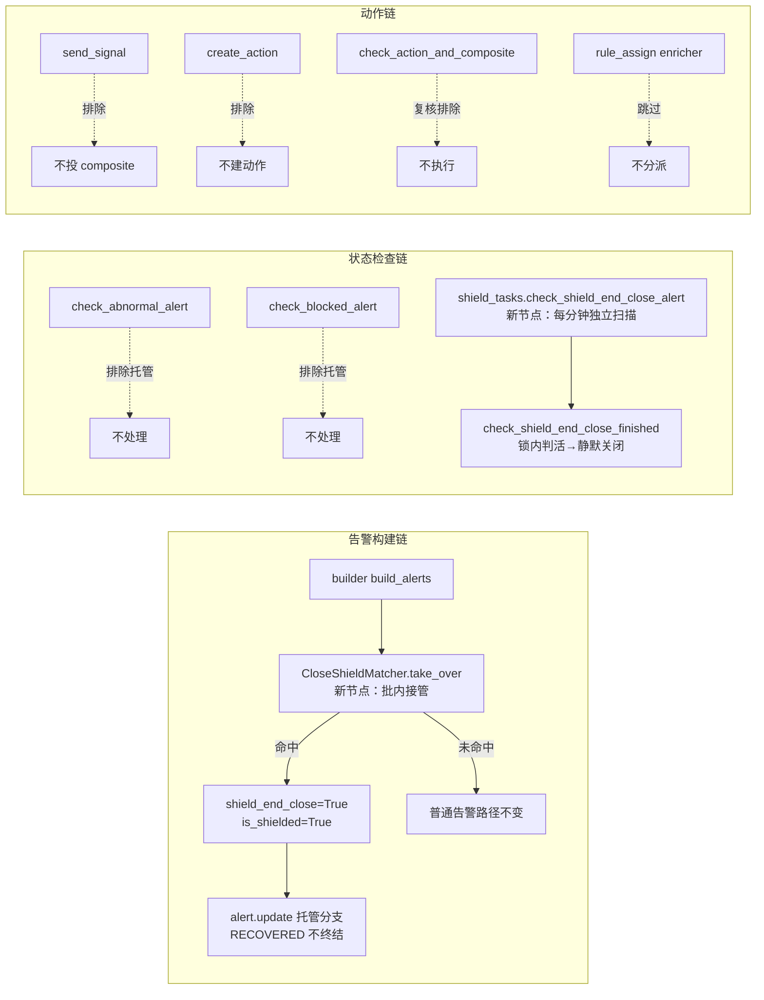

# 影响面分析：PR#12433 屏蔽结束后静默关闭告警

> 本文为完整讲解（Phase 0→1→2→3→4→5→6→7）。变更规模跨 36 文件（> 20 阈值），按规范采用完整模式。

> 全部结论经源码检索实证（grep 全仓 + 关键文件全读）。判不了的范围明确写"待确认"，禁凭 diff 推断。

## 一、直接调用方矩阵（变更符号 → 消费方）

### `AlertShieldObj`（构造签名 + is_match 语义分流）

| 调用方 | 位置 | 是否受影响 | 实证 |
|---|---|---|---|
| `CloseShieldMatcher._take_over` | [close.py:47](file://bkmonitor/alarm_backends/service/converge/shield/close.py#L47) | 本变更目标用户，传 business_timezone_name | grep 全仓 5 文件 14 处构造点 |
| `AlertShieldConfigShielder.__init__` | [saas_config.py:96](file://bkmonitor/alarm_backends/service/converge/shield/shielder/saas_config.py#L96) | 是——既有屏蔽主链路 | 回读全文：缓存未命中时逐 config 构造并 `shield_obj.is_match(alert)`（L96-L99），close 屏蔽走新语义（begin_time 落窗），notify_once 走 elif 原语义 |
| `get_shield_objs_from_cache` | [saas_config.py:55](file://bkmonitor/alarm_backends/service/converge/shield/shielder/saas_config.py#L55) | 是——本变更加二次确认 | diff 实证 |
| `IncidentShielder.is_matched` | [saas_config.py:240](file://bkmonitor/alarm_backends/service/converge/shield/shielder/saas_config.py#L240) | 否 | config 来自 `get_failure_scope_config()`（故障影响配置），无 end_policy 字段 → `config.get("end_policy") == "close"` 恒 False → elif 原路径 |
| `converge/shield/tasks.py do_check_and_send_shield_notice` | [tasks.py:58](file://bkmonitor/alarm_backends/service/converge/shield/tasks.py#L58) | **否**（code review P1 疑点在此收敛） | 回读全文：只调 `check_and_send_notice()` → `can_send_start_notice`/`can_send_end_notice`（[shield_obj.py:335](file://bkmonitor/alarm_backends/service/converge/shield/shield_obj.py#L335)，纯时间窗+Redis 锁判定），**不调 is_match**；但注意 Shield.objects.filter 拉的 values() 会带上 end_policy 字段（values() 全字段），构造时 `_parse_cycle_config` 对 close 屏蔽会走新分支自动解析业务时区 |
| 测试 test_notice_execute.py | 8 处构造 | 否 | 测试 config 无 end_policy → 原路径 |

### `ShieldCacheManager.get_shields_by_biz_id`（新增消费方 close.py）

既有消费方 2 处（kernel_api bkm_cli cache.py:663、saas_config.py:77），本变更新增 close.py 一处。该方法是只读缓存查询，无行为改动，新消费方不影响既有调用。

### `check_action_and_composite`（composite 排队复核）

生产调用方 2 处：[processor.py:167](file://bkmonitor/alarm_backends/service/alert/processor.py#L167)（send_signal 投递）与 [composite/processor.py:592/731](file://bkmonitor/alarm_backends/service/composite/processor.py#L592)（排队重试 apply_async）。3.6 投递过滤 + 3.7 排队复核构成双防线，复合执行体 `check_action_and_composite` 开头复核不影响两处调用方的契约（参数不变）。

### `Alert.update` / `should_send_signal` / `shield_end_close` property

- `should_send_signal` 消费方：builder finalize 链（save_alerts 后判投递）、[processor.py:163](file://bkmonitor/alarm_backends/service/alert/processor.py#L163) send_signal 循环。
- `shield_end_close` 消费方：全仓 17 文件实证（见 02-正确性核对），全部是本变更引入的新消费点或测试，无既有代码误读该字段。
- `Alert.update` 消费方：builder 存量分支（命中接管后 `alert.update(event)`）。**托管控分支在函数最前部短路**，非托管告警零行为变化。

## 二、契约与兼容性

### 接口契约

- `AddShieldResource` / `BulkAddAlertShieldResource`：入参新增可选 `end_policy`（缺省 notify_once）——**旧调用方不传该字段行为不变**，向后兼容。实证：test_old_create_defaults_to_notify_once。
- `EditShieldResource`：不传 end_policy 保留原值（test_edit_keeps_original_policy 的 policy=None 分支）；传了且不同 → 整次拒绝且不落任何变更（handle_time 未调用，test_edit_rejects_entire_change_before_mutation）。
- kernel_api `CreateAlarmShieldResource` / `UpdateAlarmShieldResource`：同款可选字段。
- 前端 `FrontendShieldListResource`：输出加字段，纯增量。

### 数据与缓存兼容

- MySQL：`end_policy` AddField 带 default，存量行自动补 notify_once，零回填。
- ES：`shield_end_close` 新 Boolean 字段。**存量索引 mapping 无此字段**——es-dsl `field.Boolean()` 动态映射下新文档可写，但 term 查询 `Q("term", shield_end_close=True)` 对未加 mapping 的存量索引行为待确认（新索引按模板创建则无问题）。→ 待确认项（发布顺序依赖）。
- Redis：ALERT_SHIELD_SNAPSHOT 缓存结构不变（config_ids 列表），仅消费端加二次 is_match 确认。

### 行为兼容（notify_once 侧）

既有 notify_once 屏蔽全链路逐点验证不变：is_match elif 原路径（shield_obj.py:583-585）、_parse_cycle_config super()（L437-438）、saas_config 缓存短路直通（`end_policy != "close"` 条件短路）、builder/manager/composite/create_action 过滤条件全部为 `not shield_end_close`（notify_once 告警无此标记恒通过）。

## 三、数据流影响

图源：综合 01-逐处解读.md 组3/组4 + 本节调用方矩阵。

数据流增量：告警 ES 文档新增 `shield_end_close` + `extra_info.shield_end_close_config`（接管时写入，含 shield_id 与窗口快照）；关闭时写 AlertLog（OpType.CLOSE，描述"屏蔽结束，期间产生的告警已关闭"）。

## 四、未覆盖区域与待确认

1. **ES 存量索引 mapping**（上文）：`shield_end_close` 的 term 查询在未更新模板/映射的存量索引上是否正常命中——判不了，列为待确认。
2. **屏蔽延长/编辑窗口与接管粘滞的交互**：接管后 close 屏蔽被编辑（窗口延长），托管告警的 shield_end_close_config 快照仍指向旧窗口；独立任务按"当前配置"判活（shield_is_active 只看当前配置状态与时间，test_current_time_config_overrides_initial_window 实证），行为已定义但快照与实际窗口可能不一致——描述事实，裁决归 05-风险。
3. **多集群部署**：check_shield_end_close_alert 用 get_cluster_bk_biz_ids 过滤（与既有 manager 任务同款模式），行为一致，无新风险面。
4. **前端老版本**：老前端不传 end_policy → 后端缺省 notify_once，行为不变（向后兼容已实证）。

## 五、影响面总评

变更设计为"正交增量"：新字段默认值=旧行为、新分支条件恒收窄在 `end_policy == "close"` / `shield_end_close == True`，既有 notify_once 全链路 8 个接触点逐一验证零变化。新增独立任务与既有 manager 任务物理隔离（独立扫描 filter + 独立锁复核），无双扫竞争。主要外部依赖是 ES mapping 就绪（待确认项 1）。
