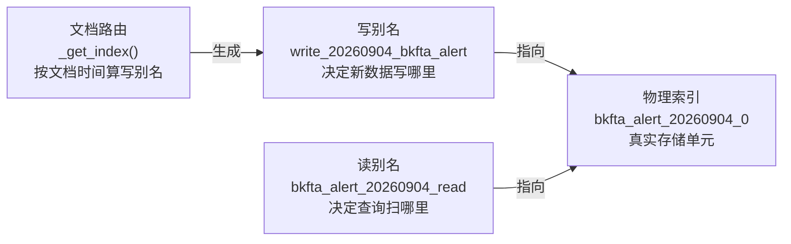

# 00 · 能力大纲：ES 告警索引轮转（ILM）

> **讲解对象**：`module`（空间边界）
> **对象路径**：`bkmonitor/bkmonitor/utils/elasticsearch/ilm.py` + `bkmonitor/bkmonitor/documents/base.py` + `bkmonitor/bkmonitor/documents/alert.py` + `bkmonitor/bkmonitor/documents/tasks.py`
> **别名**：告警索引切片 / rollover / reindex 搬运 / 索引生命周期管理
> **知识范围**：两者都含（`[通用]` ES 索引生命周期常识 + `[专用]` 本项目 ILM 实现与告警文档存储语义）
> **学习目标**：`读懂`（默认）—— 理解它是什么、怎么工作、数据怎么流
> **讲解模式**：完整讲解（Phase 0 → 7）

---

## 一、开场：这段代码为什么存在

[专用] 监控系统的告警数据有个天然特征：**写多读少、按时间访问、总量无上限增长**。一条告警从触发到恢复可能横跨几分钟，也可能横跨几个月；一个中等规模环境每天产生数十万条告警。如果所有告警都堆在一个 ES 索引里，会同时撞上三堵墙：

- **容量墙**：单索引无限膨胀，恢复与迁移耗时不可控。
- **清理墙**：想删 30 天前的数据，只能 `delete_by_query` 全表扫描，删完还留空洞。
- **查询墙**：查"最近 7 天"也要扫全量分片。

本项目给出的答案是**时间切片 + 别名路由**：把数据按天切成一个个物理索引，用「写别名」决定新数据写到哪、用「读别名」决定查询扫哪些索引，到期后整个索引直接删除（删文件比删文档便宜几个数量级）。这套机制封装在 `ILM` 类里，被所有告警域 Document 共用。

[专用] 但真正让这套机制"不普通"的是第二个问题：**告警是长生命周期的可变实体**。它不像日志那样写完就不变——一条告警今天还 ABNORMAL，明天可能恢复；恢复时文档要更新、状态要改写。如果文档永远停在"首次触发那天"的索引里，那么"查今天还活着的告警"就必须扫遍全量历史索引。本项目用 **REINDEX 搬运**解决它：轮转创建新索引时，把符合 `REINDEX_QUERY`（告警即 `status=ABNORMAL`）的文档从旧索引搬到新索引。这是一个"用写入放大换查询收敛"的取舍，也是整个机制中最反直觉、最容易踩坑的部分。

> ⚠️ 搬运条件还叠加了 `create_time >= 新索引日期` 的范围过滤，实际语义比"活跃告警每天搬到当天索引"更窄。项目内四处材料（代码注释 / 测试 docstring / ai-docs 设计文档 / ki 记忆）与代码在此处存在张力，详见 `02-正确性核对.md` 的 E1 项。

---

## 二、对外职责边界

### 做什么

[专用] `ILM` 类是本项目**告警域 ES 索引生命周期管理**的唯一实现，负责四件事：

| 能力 | 方法 | 一句话职责 |
|---|---|---|
| 索引创建 | `create_index()` / `update_index()` | 按"日期 + 序号"命名创建新物理索引，并处理 mapping 变更 |
| 别名路由 | `create_or_update_aliases()` | 将写别名 / 读别名指向最新索引，并按 `slice_gap` 前向预留 |
| 活跃数据搬运 | `reindex()` | 轮转时把符合 `REINDEX_QUERY` 的文档从旧索引搬到新索引 |
| 过期清理与降冷 | `clean_index()` / `reallocate_index()` | 删除无未过期别名的索引；把冷索引迁移到 warm 节点 |

### 不做什么

[专用] 明确划清边界，避免误用：

- **不做 ES 原生 ILM**：本项目完全自研，未使用 Elasticsearch 内置的 `ilm policy` / `rollover API`。判断依据：`ilm.py` 全部基于 `indices.create` / `update_aliases` / `reindex` 等底层 API 手工编排，无 `ilm.put_lifecycle` 调用。
- **不管元数据域的索引**：`bkmonitor/metadata/models/storage.py` 另有一套同名方法（`update_index_and_aliases` / `clean_index_v2` / `reallocate_index`），服务于监控时序数据（table_id 维度），与本套代码**同名但不同实现**，勿混淆。
- **不负责文档内容正确性**：`reindex` 是原样复制，不做字段转换或补全。

---

## 三、公开能力清单（入口）

[专用] 按调用链从外到内排列：

| 入口 | 位置 | 触发方式 | 职责 |
|---|---|---|---|
| `rollover_indices()` | `bkmonitor/documents/tasks.py:18` | Celery 定时 `*/24 * * * *`（`config/role/worker.py:239`） | 遍历 `ALL_DOCUMENTS` 逐个执行轮转 |
| `BaseDocument.rollover()` | `documents/base.py:224` | 被上面的任务调用 | 更新索引模板 → 存在则 update、否则 create |
| `BaseDocument.clear_expired_index()` | `documents/base.py:234` | 被 `clear_expired_indices()` 调用 | 删除过期索引 |
| `clear_expired_indices()` | `documents/tasks.py:38` | **当前无 crontab 注册** | 遍历清理（函数存在但未被调度） |
| `rollover_index` 管理命令 | `bkmonitor/management/commands/rollover_index.py` | 手工执行 | 手工触发一次全量轮转 |
| `ILM` 类 | `utils/elasticsearch/ilm.py:29` | 被 `BaseDocument.get_lifecycle_manager()` 装配 | 全部底层动作的实现 |

### 参与轮转的 Document 清单

[专用] `ALL_DOCUMENTS`（`documents/__init__.py:23-34`）共 10 个，全部走同一套轮转逻辑，但 **REINDEX 策略各不相同**：

| Document | 索引名 | REINDEX_ENABLED | 搬运条件 |
|---|---|---|---|
| `AlertDocument` | `bkfta_alert` | **True** | `status=ABNORMAL` |
| `IncidentDocument` | `bkmonitor_aiops_incident_info` | **True** | `status=ABNORMAL` |
| `ActionInstanceDocument` | （`documents/action.py`） | **True** | `status=RUNNING`（`ActionDisplayStatus`） |
| `EventDocument` | — | False（继承默认） | 不搬运 |
| `AlertLog` | — | False | 不搬运 |
| `IncidentSnapshotDocument` / `IncidentNoticeDocument` / `IncidentOperationDocument` | — | False | 不搬运 |
| `IssueDocument` | `bkfta_issue` | **False（显式声明）** | 不搬运 |
| `IssueActivityDocument` | `bkfta_fta_issue_act` | **False（显式声明）** | 不搬运 |

> **读这张表的方式**：`REINDEX_ENABLED=True` 的三个（告警 / 故障 / 处理记录）都是**有状态机、会长期存活且状态会变**的实体；关闭的都是**一次写入、不再变更**的流水或快照类文档。Issue 系列虽然也有状态机，但显式关闭了搬运——原因见 `documents/base.py:258-262` 的 `Flattened` 类注释：mapping 变更后靠轮转切新索引，历史数据留在旧索引、不参与新字段过滤。

---

## 四、关键抽象

[专用] 四个必须分清的概念，后面所有章节都建立在这四个之上：

**图表来源**
- `bkmonitor/bkmonitor/documents/base.py:70-76`（`get_write_index_name` / `get_read_index_name`）
- `bkmonitor/bkmonitor/documents/base.py:78-89`（`_get_index`）
- `bkmonitor/bkmonitor/utils/elasticsearch/ilm.py:139-142`（`make_index_name`）

| 抽象 | 命名规则 | 谁来用 | 关键点 |
|---|---|---|---|
| **物理索引** | `{index_name}_{YYYYMMDD}_{seq}` | 存储层 | 一天可有多个（`_0` / `_1` / `_2`），按大小分裂 |
| **写别名** | `write_{YYYYMMDD}_{index_name}` | 写入侧 | **唯一**，永远指向最新索引；由文档自身时间决定用哪天的别名 |
| **读别名** | `{index_name}_{YYYYMMDD}_read` | 查询侧 | **多个并存**，一个物理索引可挂多个日期的读别名 |
| **索引模板** | `{index_name}`（pattern `{index_name}_*`） | 创建索引时 | `use_template=True`，创建时不传 body，由模板提供 mapping |

> **为什么写别名带日期、而不是一个固定的 `write_alias`？** [专用] 因为文档路由是按**文档自身时间**算的：一条 `begin_time` 是 9 月 1 日的告警补写进来，仍然写 `write_20260901_bkfta_alert`，而不是今天。这样"文档时间"与"索引日期"保持一致，查询时才能按时间窗反推索引列表。这是整个设计的基石。

---

## 五、两个轮子：定时轮转 vs 按需切分

[专用] 这是最容易被误解的一点——本项目**同时存在两种触发新索引的方式**，它们的触发条件完全不同：

| 维度 | 定时轮转（update_index） | 大小分裂（slice） | mapping 变更切分 |
|---|---|---|---|
| 触发时机 | Celery `*/24 * * * *` | 同上（在 update 流程内判定） | 同上（在 update 流程内判定） |
| 判定条件 | 日期跨天（`date_format` 粒度=天） | 当前索引 > `slice_size`（默认 50 GB） | mapping 与模型定义不一致且非"仅新增字段" |
| 是否 reindex | **是** | **是** | **是** |
| 产物 | `bkfta_alert_20260905_0` | `bkfta_alert_20260904_1` | 视情况新建或原地改 mapping |

**关键**：`reindex` 不是定时任务的独立动作，而是 **`update_index()` 返回了「新建索引」之后的连带动作**。只有当确实创建了新索引时才会搬运；如果本次只是"检查通过、无需变更"，完全不触发 reindex。

`章节来源`
- `bkmonitor/bkmonitor/utils/elasticsearch/ilm.py:244-255`（`update_index_and_aliases` 的连带 reindex）
- `bkmonitor/bkmonitor/utils/elasticsearch/ilm.py:257-370`（`update_index` 的三类判定）

---

## 六、本次讲解的核心问题清单

后续阶段将逐条回答：

1. **索引名与别名是怎么拼出来的？** → `01-代码wiki.md`
2. **轮转任务每次到底做了什么判断？** → `01-代码wiki.md` + `03-功能推演.md`
3. **reindex 搬运到底搬了什么、留下什么？** → `03-功能推演.md`（核心）
4. **为什么"查 7 天查不到、查 30 天能查到"？** → `04-应用场景.md`
5. **一条告警从触发到恢复，文档在索引间怎么流动？** → `05-数据流.md`

---

## 七、知识范围标注说明

本材料每个讲解点标注：

- `[通用]` —— 跨项目成立的 ES / 分布式存储常识，可迁移到其它项目
- `[专用]` —— 仅在本项目成立的实现细节、配置约定、业务语义

**本文为完整讲解（Phase 0→7）。**
