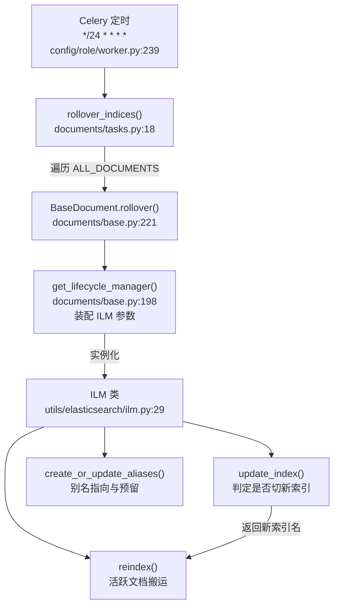
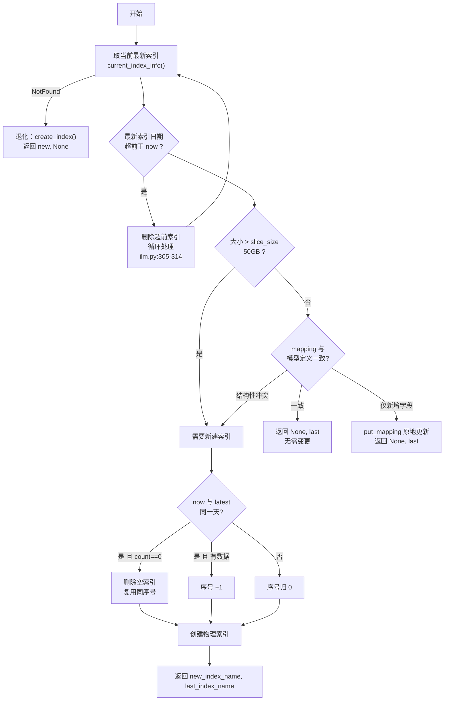
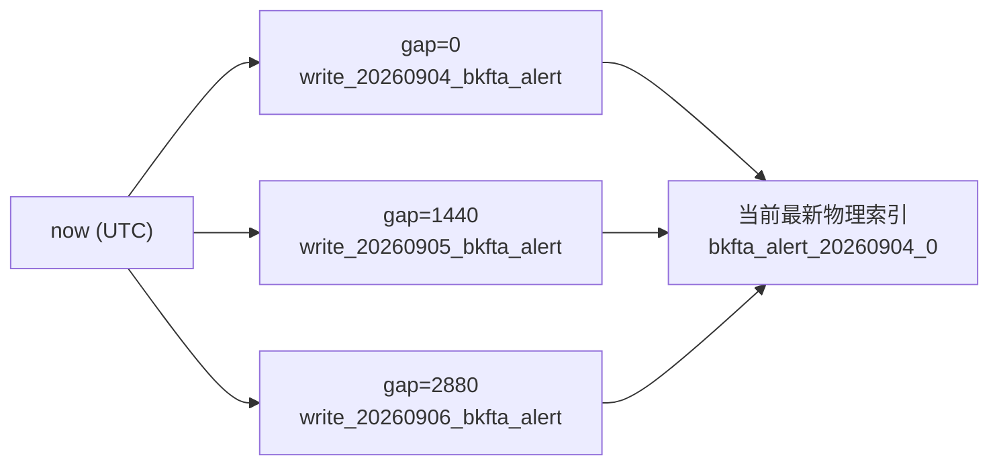
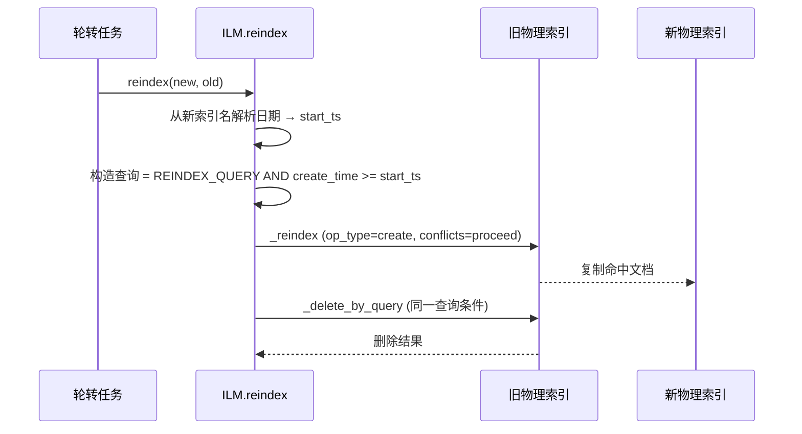
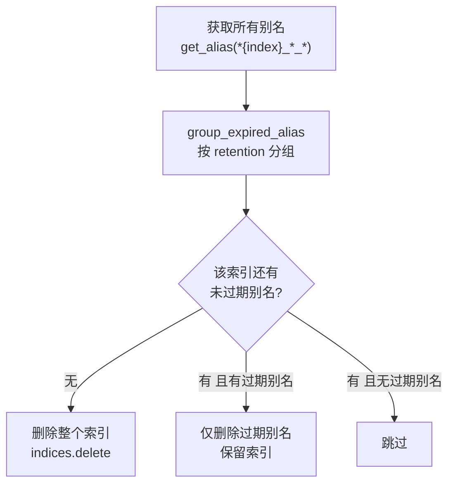
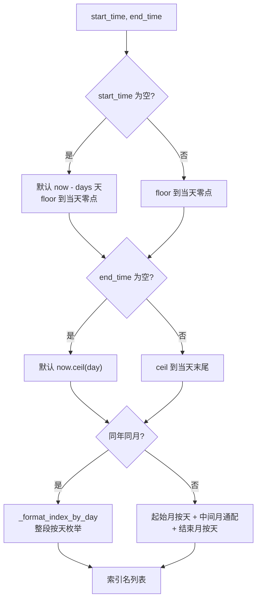

# 01 · 代码 wiki：ES 告警索引轮转

> **讲解模式**：完整讲解（Phase 2）
> **对象**：`ILM` 类 + `BaseDocument` 索引抽象层 + `AlertDocument` 存储语义
> 每个讲解点标注 `[通用]` / `[专用]`

📊 配套交互图：[ILM 组件结构图](./archify/rollover-architecture.html)（archify 交付，可缩放与按关系追踪）

---

## 一、模块结构（目录与文件职责）



**图表来源**
- `bkmonitor/bkmonitor/config/role/worker.py:239`
- `bkmonitor/bkmonitor/documents/tasks.py:18-37`
- `bkmonitor/bkmonitor/documents/base.py:198-241`
- `bkmonitor/bkmonitor/utils/elasticsearch/ilm.py:29-801`

| 文件 | 行数 | 职责 |
|---|---|---|
| `bkmonitor/utils/elasticsearch/ilm.py` | 801 | **核心实现**：索引创建 / 别名管理 / reindex / 清理 / 降冷 |
| `bkmonitor/documents/base.py` | 265 | **抽象层**：索引名与别名命名规则、查询索引推导、ILM 装配入口 |
| `bkmonitor/documents/alert.py` | 374 | 告警文档模型：`REINDEX_*` 配置 + 跨期查询适配（`get` / `mget`） |
| `bkmonitor/documents/tasks.py` | 48 | 定时任务：`rollover_indices` / `clear_expired_indices` |
| `bkmonitor/documents/__init__.py` | 34 | `ALL_DOCUMENTS` 注册表（10 个 Document） |
| `bkmonitor/documents/constants.py` | ~20 | `ES_INDEX_SETTINGS`（分片/副本/刷新间隔，支持环境变量覆盖） |

---

## 二、ILM 类：构造参数与含义

[专用] `ILM.__init__`（`ilm.py:32-62`）的参数决定了整套策略，理解参数 = 理解策略：

| 参数 | 类型 | 本项目传值 | 含义 |
|---|---|---|---|
| `index_name` | str | `cls.Index.name`（如 `bkfta_alert`） | 索引前缀 |
| `index_body` | dict | `cls._index.to_dict()` | 索引定义（mapping + settings），用于模板与比对 |
| `es_client` | — | `cls._index._get_connection()` | ES 连接 |
| `date_format` | str | `"%Y%m%d"` | **切片粒度由它决定**——当前是天 |
| `slice_gap` | int | `1440`（分钟） | **别名前向预留步长** = 1 天 |
| `slice_size` | int | `settings.FTA_ES_SLICE_SIZE or 50` | 单索引大小上限（GB），超出则同日分裂 |
| `retention` | int | `settings.FTA_ES_RETENTION or 365` | 数据保留天数 |
| `use_template` | bool | `True` | 创建索引时不传 body，由索引模板提供定义 |
| `reindex_enabled` | bool | `cls.REINDEX_ENABLED` | 是否启用活跃文档搬运 |
| `reindex_query` | dict | `cls.REINDEX_QUERY` | 搬运的文档筛选条件 |
| `warm_phase_days` | int | **未传（默认 0）** | 降冷等待天数，告警域**未启用** |
| `warm_phase_settings` | dict | **未传（默认 None）** | 降冷目标节点属性，告警域**未启用** |

> **关键观察**：`get_lifecycle_manager()`（`base.py:198-211`）**没有传** `warm_phase_days` 与 `warm_phase_settings`，因此 `reallocate_index()`（冷热处理）在告警域恒为 no-op（`ilm.py:665-667` 直接 return）。冷热分层只存在于元数据域的 `ESStorage`。这是告警域与时序数据域在 ILM 上的**最大差异**。

`章节来源`
- `bkmonitor/bkmonitor/utils/elasticsearch/ilm.py:32-62`
- `bkmonitor/bkmonitor/documents/base.py:198-211`
- `bkmonitor/bkmonitor/config/default.py:788-789`（默认值 50 / 365）

---

## 三、命名规则：物理索引与别名

### 3.1 三种名字的生成

[专用] 命名规则集中在两个文件，是理解一切的钥匙：

```python
# documents/base.py:60-65 —— 别名
get_write_index_name(index_name, date_str) -> f"write_{date_str}_{index_name}"
get_read_index_name(index_name, date_str)  -> f"{index_name}_{date_str}_read"

# utils/elasticsearch/ilm.py:145-147 —— 物理索引
make_index_name(datetime_object, index) -> f"{index_name}_{YYYYMMDD}_{seq}"
```

[专用] 三条正则用于反解（`ilm.py:395-411`）：

| 正则 | 匹配对象 | 兼容意义 |
|---|---|---|
| `write_(\d+)_{index_name}` | 新版写别名 | 当前格式 |
| `{index_name}_(\d+)_write` | **旧版写别名** | 历史兼容，`get_alias_datetime_str` 仍会识别 |
| `{index_name}_(\d+)_read` | 读别名 | 当前格式 |
| `{index_name}_(\d+)_(\d+)` | 物理索引 | `index_re`，用于 `current_index_info` 解析 |

### 3.2 索引模板

[专用] `upsert_template()`（`base.py:213-219`）在**每次轮转前**执行：

```python
index_template = cls._index.as_template(
    template_name=cls.Index.name,
    pattern=f"{cls.Index.name}_*",
    order=100,
)
index_template.save()
```

配合 `use_template=True`，创建物理索引时**不传 body**（`ilm.py:272-276`、`:360-364`），mapping 完全由模板提供。这意味着**改模型字段 → 模板更新 → 下一次创建的索引自动带上新字段**，无需数据迁移。

`章节来源`
- `bkmonitor/bkmonitor/documents/base.py:60-65`、`:213-219`
- `bkmonitor/bkmonitor/utils/elasticsearch/ilm.py:145-147`、`:395-411`

---

## 四、核心流程一：轮转判定（update_index）

[专用] `update_index()`（`ilm.py:276-370`）是定时任务每次都要跑的判定逻辑，按序做五件事：



**图表来源**
- `bkmonitor/bkmonitor/utils/elasticsearch/ilm.py:276-370`
- `bkmonitor/bkmonitor/utils/elasticsearch/ilm.py:89-143`（`current_index_info`）

### 4.1 三个判定分支的细节

[专用] **分支 A：清理超前索引**（`ilm.py:303-314`）
如果最新索引的日期比 `now` 还大，说明旧版本任务曾预留过远，直接删除后重新取。用 `while` 循环是因为可能连续存在多个超前索引。

[专用] **分支 B：大小分裂**（`ilm.py:317-327`）
`index_size_in_byte / 1024^3 > slice_size` 即触发。注意看的是 **`primaries.store.size_in_bytes`**（主分片大小，不含副本）。

[专用] **分支 C：mapping 比对**（`ilm.py:591-659`，`is_mapping_same`）
这是最精细的一块，返回 `(is_same_mapping, should_create)` 二元组，语义**反直觉**：

| 情况 | `is_same_mapping` | `should_create` | 行为 |
|---|---|---|---|
| 完全一致 | True | False | 无需变更 |
| **仅模型新增了字段** | False | **False** | `put_mapping` 原地加字段，不切索引 |
| 字段 type / format / properties 等冲突 | False | **True** | 切新索引 |
| 索引不存在 | False | True | 重建 |

比对的字段白名单（`ilm.py:641`）：`type` / `include_in_all` / `doc_values` / `format` / `properties` / `fields`。

> [专用] **易错点**：`is_mapping_same` 的返回值顺序是 `(is_same_mapping, should_create)`，但调用处写的是 `is_same_mapping, should_create = self.is_mapping_same(...)`，而函数开头却 `should_create = True`、末尾才改 False。读代码时容易把"False, False"误读成"不一致所以要建"。**实际语义是：第一个 False 表示"和模型不完全一致"，第二个 False 表示"但不用建索引"**。

`章节来源`
- `bkmonitor/bkmonitor/utils/elasticsearch/ilm.py:591-659`
- `bkmonitor/bkmonitor/utils/elasticsearch/ilm.py:329-347`

---

## 五、核心流程二：别名管理（create_or_update_aliases）

[专用] `create_or_update_aliases(ahead_time=1440)`（`ilm.py:149-237`）做两件看似矛盾的事：**把未来 N 天的别名也提前挂上**。



**图表来源**
- `bkmonitor/bkmonitor/utils/elasticsearch/ilm.py:149-237`

[专用] **为什么要预留未来别名？** 因为写入侧按"**文档自身时间**"算写别名。假如下游有一个延迟上报、或跨时区产生的"明天"时间戳，写入时若 `write_20260905_*` 尚不存在，写入会直接失败。`slice_gap=1440`（1 天）+ `ahead_time=1440`（1 天）意味着**总是提前 1 天把明天的写别名准备好**。

> **注意这里的循环边界**（`ilm.py:159`、`:234-236`）：`while now_gap <= ahead_time` 且步进 `self.slice_gap`。当 `slice_gap == ahead_time == 1440` 时，循环执行两次（gap=0、gap=1440），即**今天 + 明天**。若把 `slice_gap` 调小（如 60 分钟），则会生成 25 个别名。

[专用] **别名的"断开旧指向"**（`ilm.py:180-231`）：
先查该别名当前挂在哪些索引上，把**不等于最新索引**的全部解除，再把别名挂到最新索引。这保证同一写别名在任何时刻**只指向一个物理索引**。

> [专用] **读别名与写别名的生命周期不同**：写别名在切新索引后会被"搬家"到新索引（旧指向被解除）；读别名**永不迁移**——`bkfta_alert_20260904_read` 永远指着 9 月 4 日那个索引，直到该索引被清理。这正是"按时间窗查询"能成立的基础。

`章节来源`
- `bkmonitor/bkmonitor/utils/elasticsearch/ilm.py:149-237`

---

## 六、核心流程三：reindex 搬运

[专用] **调用时机**（`ilm.py:244-255`）：

```python
def update_index_and_aliases(self, ahead_time=1440):
    new_index_name, old_index_name = self.update_index()
    aliases = self.create_or_update_aliases(ahead_time)
    if new_index_name and old_index_name:
        self.reindex(new_index_name, old_index_name)   # ← 仅当确实新建了索引
    return new_index_name, aliases
```

**只有真的创建了新物理索引才会搬运**。日常绝大多数轮转周期（每 24 分钟一次）走的是"无需变更"分支，不产生任何 reindex 开销。

[专用] **搬运逻辑**（`ilm.py:739-801`），四步：



**图表来源**
- `bkmonitor/bkmonitor/utils/elasticsearch/ilm.py:739-801`

[专用] 三个关键参数：

| 参数 | 值 | 意义 |
|---|---|---|
| `conflicts` | `"proceed"` | 遇到版本冲突**继续**而非中断 |
| `op_type` | `"create"` | 目标索引中已存在同 `_id` 则**跳过**（不覆盖新副本） |
| `request_timeout` | `300` | 5 分钟超时 |
| `delete_old_docs` | `True` | 搬完删除旧索引中的源文档 |

> [专用] **为什么 `op_type=create` 很关键**：搬运期间，写入侧可能已经在**新索引**里更新了同一条告警（因为新写别名已指向新索引）。若用 `index`（覆盖），旧快照会反过来覆盖掉更新的新副本。`create` 保证"新索引里已有的不动"，实现了一次天然的乐观并发控制。
>
> 而 `conflicts=proceed` 保证个别冲突不会让整批 reindex 失败。

### 6.1 搬运范围：一个必须说清的细节

[专用] 搬运的筛选条件是**两个条件的 AND**：

```python
search = Search().from_dict(self.reindex_query or {}).filter("range", create_time={"gte": start_ts})
```

1. `REINDEX_QUERY`：对告警是 `status=ABNORMAL`（`alert.py:35`）
2. `create_time >= start_ts`，其中 `start_ts` = **新索引对应日期的零点**

> ⚠️ **本项目内四处材料（代码注释 / 单元测试 docstring / ai-docs 设计文档 / ki 记忆）都表述为"活跃告警每天被搬运到当天索引"**。但按上面这行代码，实际搬运的是**「状态为 ABNORMAL 且 create_time 落在新索引日期之后」的文档**。二者的差异与 `create_time` 在告警生命周期中是否被刷新有关，详见 `02-正确性核对.md` 的专门核对项。此处仅陈述代码事实，不下最终结论。

`章节来源`
- `bkmonitor/bkmonitor/utils/elasticsearch/ilm.py:739-801`
- `bkmonitor/bkmonitor/documents/alert.py:34-35`
- `bkmonitor/bkmonitor/documents/incident.py:121-122`
- `bkmonitor/bkmonitor/documents/action.py:27-28`

---

## 七、核心流程四：过期清理（clean_index）

[专用] `clean_index()`（`ilm.py:533-581`）：



**图表来源**
- `bkmonitor/bkmonitor/utils/elasticsearch/ilm.py:533-581`、`:434-531`

[专用] **清理的判定单位不是"索引创建时间"，而是"别名是否过期"**：

1. 取索引上挂的所有别名，逐个解析出日期字符串（三种格式兼容，`ilm.py:413-431`）
2. 别名日期 > `now - retention` → 未过期；否则过期
3. **索引上没有任何未过期别名 → 整个索引删除**
4. 还有未过期别名、但有已过期的 → 只删那些过期别名，索引保留
5. 解析不出日期的别名（用户自建）→ 由 `settings.ES_RETAIN_INVALID_ALIAS` 决定去留，默认 `True`（保留，`config/default.py:464`）

> [专用] **为什么一个索引会挂多个日期的读别名？** 因为 `create_or_update_aliases` 会把最新索引同时挂上"今天 + 预留未来"的读别名；而历史索引各自保留自己那天的读别名。所以判定"索引是否还活着"要看它身上**是否还有未过期的别名**，而不是看创建时间。

> [专用] **重要事实**：`clear_expired_indices()`（`documents/tasks.py:38`）**没有在任何 crontab 中注册**（已 grep 全仓确认，`worker.py` 的 `DEFAULT_CRONTAB` 只有 `rollover_indices`）。也就是说**告警索引的过期清理目前没有自动调度**，只能靠手工执行管理命令。这意味着 `retention=365` 的配置在当前部署下是一个"未生效的声明"。

`章节来源`
- `bkmonitor/bkmonitor/utils/elasticsearch/ilm.py:533-581`
- `bkmonitor/bkmonitor/documents/tasks.py:38-47`
- `bkmonitor/bkmonitor/config/default.py:464`

---

## 八、查询侧：时间窗如何翻译成索引列表

[专用] `BaseDocument.build_index_name_by_time()`（`base.py:107-143`）是整个设计的"另一半"——写入按文档时间路由，查询按时间窗反推：



**图表来源**
- `bkmonitor/bkmonitor/documents/base.py:92-143`

[专用] **退化规则**（`base.py:92-105`）：

```python
def _format_index_by_day(cls, start_time, end_time):
    if (end_time - start_time).days > 15:
        return [cls.get_read_index_name(index_name, f"{start_time.strftime('%Y%m')}*")]
    # 否则 day-by-day 枚举
```

| 时间窗 | 生成的索引列表 |
|---|---|
| 同月、跨度 ≤ 15 天 | `bkfta_alert_20260901_read` … `bkfta_alert_20260910_read` |
| 同月、跨度 > 15 天 | `bkfta_alert_202609*_read`（单条通配） |
| 跨月 | 起始月按天/通配 + 中间整月通配 + 结束月按天/通配 |

> [通用] **为什么需要退化？** ES 查询的索引数量直接影响查询计划开销与分片放大倍数。几十个别名还好，几百个会让协调节点开销显著上升。这条 15 天阈值是"精确枚举"与"通配扫描"之间的经验平衡点。

[专用] **另一个入口：`all_indices=True`**（`base.py:146-160`）

```python
build_all_indices_read_index_name() -> f"{cls.Index.name}_*_read"
```

精确 ID 查询（`AlertDocument.get_by_dedupe_md5`、Issue 系列的大部分查询）走这条路，**完全绕开时间分区**。这是规避"文档实际索引日期与用户时间窗错位"的最彻底手段。

`章节来源`
- `bkmonitor/bkmonitor/documents/base.py:92-160`

---

## 九、AlertDocument 对轮转的适配

[专用] 由于文档可能因 reindex 而搬家，`AlertDocument` 的精确查询做了专门适配：

### 9.1 `get()`（`alert.py:150-165`）

```python
ts = cls.parse_timestamp_by_id(id)        # alert_id 前 10 位 = begin_time
hits = cls.search(start_time=ts, end_time=int(time.time())).filter("term", id=id).execute().hits
```

- 下界 = `begin_time`（从 ID 反解，无需查库）
- **上界恒为 `now`** —— 覆盖"文档可能已被搬到更晚的索引"

### 9.2 `mget()`（`alert.py:167-215`）

比 `get()` 多了两件事：

1. **按 begin_time 排序后分批**：让时间相近的 ID 聚到同一批，每批只用"本批最小 begin_time"作下界，避免离散 ID 导致每批都展开全量宽窗口
2. **按 `-update_time` 排序 + 按 `_id` 去重**：reindex 过渡期同一告警在新旧索引各存一份，取最新副本

`MGET_BATCH_SIZE = 5000`，单批 `size = 本批 ID 数 × 2`（为双副本留余量，满批 10000 恰等于 ES 默认 `max_result_window`）。

> [专用] 注释里明确写了为什么**不用 scroll**：高并发批量 mget 曾积压 scroll context 突破 `max_open_scroll_context=500`，导致 `alert.manager` 成功率告警。改成"按 ID 的有界查询 + 一次 execute 取完"。

`章节来源`
- `bkmonitor/bkmonitor/documents/alert.py:33-35`、`:150-215`

---

## 十、设计模式与不变量

[通用] **模式识别**

| 模式 | 体现 |
|---|---|
| **模板方法 / 策略** | `BaseDocument` 定义骨架，各 Document 通过 `REINDEX_ENABLED` / `REINDEX_QUERY` 注入差异策略 |
| **Facade** | `ILM` 把 ES 原生 API 编排成"轮转 / 清理 / 降冷"三个业务语义动作 |
| **索引别名路由** | 写别名唯一 + 读别名多份，实现"写收口、读分散" |
| **乐观并发（隐式）** | `op_type=create` + `conflicts=proceed` 让并发写入优先于 reindex 搬运 |

[专用] **不变量（破坏即故障）**

1. **写别名唯一性**：任一时刻一个写别名只能指向一个物理索引（`ilm.py:214-231` 强制保证）
2. **读别名不迁移**：`{index}_{date}_read` 一旦挂上就不随轮转搬家，直到索引删除
3. **上界恒 now**：任何按 ID 精确查询的索引窗口，上界必须是 `now`，不可用查询截止时间替代（`alert.py:150-215`）
4. **文档路由按文档时间**：`_get_index()` 用 `get_index_time()`（告警是 `begin_time`）而非当前时间，保证"同 ID 的文档写入位置稳定"
5. **`all_indices` 兜底**：无法推断时间锚点的精确查询必须走 `all_indices=True`

> **不变量 3 的血泪史**：`get_host_alarm_count` 曾把 `end_time` 传给 `AlertDocument.search` 收窄索引窗口，导致历史时间窗下未恢复告警计数为 0。该坑已沉淀在 ki `项目踩坑点/通用`。

---

## 十一、依赖关系

[专用] **内部依赖**

| 依赖 | 用途 |
|---|---|
| `bkmonitor.utils.elasticsearch.curator.IndexList` | 降冷时过滤已分配的索引（告警域未启用） |
| `elasticsearch_dsl.Search` | 构造 reindex 查询与文档查询 |
| `arrow` | 时间取整与月份运算 |
| `django.conf.settings` | `FTA_ES_SLICE_SIZE` / `FTA_ES_RETENTION` / `ES_RETAIN_INVALID_ALIAS` |

[专用] **上游（谁驱动它）**

- `config/role/worker.py:239` → Celery beat `*/24 * * * *`
- `bkmonitor/management/commands/rollover_index.py` → 手工命令
- `packages/fta_web/handlers.py:275` → Web 侧某入口也会调用（需确认触发场景）

[专用] **下游（谁消费它的结果）**

- 所有通过 `BaseDocument.search()` 发起的查询（告警列表、详情、TopN、导出……）
- 所有通过 `bulk_create` / `save` 发起的写入（告警接入、状态流转、Issue 关联……）

[通用] **外部系统**

- Elasticsearch 5 / 6 / 7：代码同时 import 三个版本的 client 异常类做兼容（`ilm.py:20-22`）

---

## 十二、易混淆点提示

[专用] 读这段代码时最容易搞混的三组概念：

| 混淆对 | 区别 |
|---|---|
| **slice_gap vs slice_size** | `slice_gap` 是别名预留步长（时间），`slice_size` 是索引分裂阈值（空间），两者完全无关 |
| **`is_mapping_same` 的两个返回值** | `(is_same_mapping, should_create)`，"仅新增字段"时是 `(False, False)` → 原地改 mapping 不切索引 |
| **`reindex` 的 op_type=create vs index** | 用 `create` 是防止旧快照覆盖搬运期间的并发新写入 |
| **ILM（本项目）vs ES 原生 ILM** | 本项目纯自研编排，与 Elasticsearch 内置 `ilm policy` 无关 |
| **`ilm.py`（告警域）vs `storage.py`（元数据域）** | 两者有同名方法但实现不同，前者用于告警文档、后者用于监控时序数据 |

`章节来源`
- 综合 `bkmonitor/bkmonitor/utils/elasticsearch/ilm.py` 与 `bkmonitor/bkmonitor/documents/base.py`
