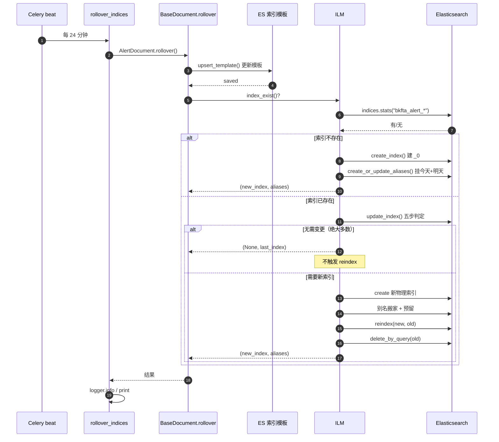
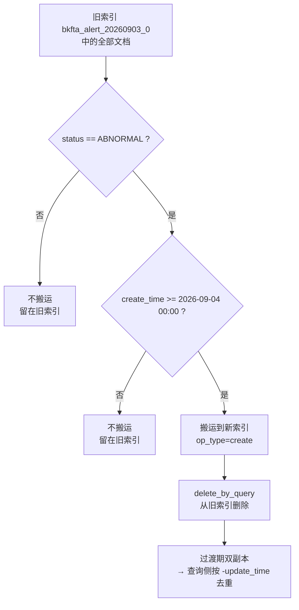
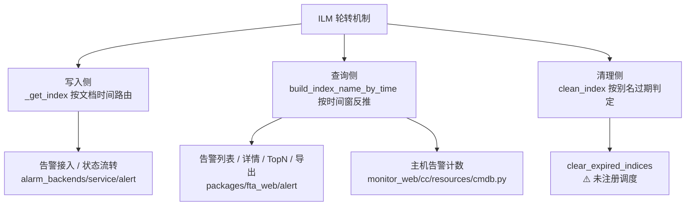

# 03 · 功能推演

> **推演依据**：`00-能力大纲.md` + `01-代码wiki.md`（已通过 Phase 3 质量闸门）
> **推演内容**：一次轮转周期的完整执行路径、reindex 搬运的真实行为、边界与异常、性能特征

---

## 一、一次轮转周期的完整执行路径

[专用] Celery beat 每 24 分钟触发一次 `rollover_indices()`，它对 `ALL_DOCUMENTS` 的 10 个 Document **逐个**执行，彼此用 try/except 隔离（单个失败不影响其他）。以 `AlertDocument` 为例，一次完整执行如下：



**图表来源**
- `bkmonitor/bkmonitor/documents/tasks.py:18-37`
- `bkmonitor/bkmonitor/documents/base.py:221-232`
- `bkmonitor/bkmonitor/utils/elasticsearch/ilm.py:76-87`、`:244-255`、`:739-801`

### 1.1 推演：日常稳态下的实际开销

[专用] 每 24 分钟一次、一天约 60 次。其中：

- **59 次左右**走"无需变更"分支：`update_index()` 只做一次 `indices.stats` + 一次 `indices.get_mapping`，然后 return（`ilm.py:337-345`）。开销极小。
- **1 次左右**（跨天时）走"创建新索引"分支，触发别名更新与 reindex。

> [专用] **这里有个容易忽略的点**：`create_or_update_aliases()` **每次都会执行**（`ilm.py:246`），即使 `update_index()` 返回 `(None, last_index)` 没建新索引。它依然会循环更新今天 + 明天的别名指向。这是一次幂等的 `update_aliases` 调用，开销可接受，但确实是每 24 分钟一次的固定 ES 写操作。

---

## 二、reindex 搬运：真实行为推演

[专用] 这是整个机制中最需要"想清楚"的部分。我们用一个具体场景推演。

### 2.1 场景设定

假设今天是 **2026-09-04**，轮转任务刚创建了新索引 `bkfta_alert_20260904_0`（上一个索引是 `bkfta_alert_20260903_0`）。此时调用：

```python
self.reindex("bkfta_alert_20260904_0", "bkfta_alert_20260903_0")
```

`ilm.py:757-762` 计算出：

```python
current_datetime_str = "20260904"          # 从新索引名正则解析
current_datetime_object = 2026-09-04 00:00:00
start_ts = 该日期零点的 epoch 秒

search = Search().from_dict({"term": {"status": "ABNORMAL"}}) \
                 .filter("range", create_time={"gte": start_ts})
```

### 2.2 三类文档的不同命运



**图表来源**
- `bkmonitor/bkmonitor/utils/elasticsearch/ilm.py:739-801`

| 文档特征 | 是否被搬 | 最终位置 |
|---|---|---|
| `status=ABNORMAL` 且 `create_time` ≥ 今天零点 | ✅ 搬 | 新索引 `20260904_0` |
| `status=ABNORMAL` 但 `create_time` < 今天零点 | ❌ 不搬 | 旧索引 `20260903_0` |
| `status=RECOVERED/CLOSED`（任意 create_time） | ❌ 不搬 | 保持在原索引 |

> **这解释了为什么"查询上界必须恒 now"是硬约束**：文档的最终位置**无法从 `alert_id` 推断**。
> - 新告警（`create_time`=今天）搬到了今天 → 在今天索引
> - 已恢复的告警停在恢复那天 → 可能在 begin_time 之后很久
> - 长期活跃的旧告警停在 `create_time` 那天 → 也可能晚于 begin_time
>
> 三种情况的落点都 ≥ `begin_time`，所以 `[begin_time, now]` 是唯一安全的窗口。

### 2.3 过渡期的双副本窗口

[专用] reindex 与 delete_by_query 是**两次独立 ES 调用**，中间存在时间窗口：

```
t0: reindex 完成   → 新索引有副本 A'，旧索引仍有 A
t1: delete_by_query → 旧索引的 A 被删除
```

在 `t0 ~ t1` 之间，同一 `_id` 在**两个索引各存在一份**。查询侧的处理：

- `AlertDocument.mget`：`.sort("-update_time")` + 按 `hit.meta.id` 去重，保留首次出现（最新副本）—— `alert.py:205-215`
- `AlertDocument.get`：只取 `hits[0]`，但**没有排序**，因此过渡期可能取到旧副本（`alert.py:161-164`）

> [专用] **这是一个真实的不对称**：`mget` 做了双副本防护，`get` 没有。影响面：单条查询在 reindex 过渡窗口（通常秒级到分钟级，取决于数据量）可能返回略微陈旧的副本。考虑到 `op_type=create` 保证新副本是"搬运时刻的快照"、而后续写入都落在新索引，旧副本与搬运时刻快照内容一致，实际差异仅限于搬运后又发生的更新。

---

## 三、边界与异常路径

[专用] 逐条推演代码中的防御分支：

| 场景 | 代码位置 | 行为 | 评价 |
|---|---|---|---|
| 索引完全不存在 | `ilm.py:298-302` | 捕获 NotFoundError → 退化执行 `create_index()`，返回 `(new, None)` | ✅ 优雅，此时**不触发 reindex**（old 为 None） |
| 最新索引日期超前于 now | `ilm.py:303-314` | `while` 循环删除超前索引后重取 | ⚠️ 注释明说"没做防护，默认存在超前 index 就一定存在不超前的可用 index"——若假设不成立会死循环或抛错 |
| 当天已有索引但无数据 | `ilm.py:353-359` | 删除后复用同一序号重建 | ✅ 避免产生空索引碎片 |
| mapping 仅新增字段 | `ilm.py:339-347` | `put_mapping` 原地更新 | ✅ 避免无谓切索引 |
| mapping 结构性冲突 | `ilm.py:349-352` | 切新索引 | ✅ 唯一正确解 |
| reindex 调用失败 | `ilm.py:785-788` | `logger.exception` 后 **return**，不删除旧文档 | ✅ 安全：宁可双副本，不丢数据 |
| delete_by_query 失败 | `ilm.py:795-801` | `logger.exception` 后 return | ⚠️ 留下双副本，靠查询侧去重兜底 |
| Document 轮转抛异常 | `tasks.py:33-37` | 记日志，**继续处理下一个 Document** | ✅ 隔离良好 |
| ES 集群不可用 | 同上 | 全部 10 个 Document 各记一条异常 | ⚠️ 无重试、无告警指标，只能靠日志发现 |

> [通用] **"reindex 失败时保留双副本、不删旧文档"是正确设计**：数据冗余的代价远小于数据丢失。这与屏蔽模块的 fail-safe 取向一致——**不确定时选择数据更多的一方**。

---

## 四、与其它模块的交互点

[专用] 轮转机制不是一个孤立后台任务，它同时在三条链路上产生约束：



**图表来源**
- `bkmonitor/bkmonitor/documents/base.py:67-89`（写入路由）
- `bkmonitor/bkmonitor/documents/base.py:107-160`（查询推导）
- `bkmonitor/bkmonitor/utils/elasticsearch/ilm.py:533-581`（清理）

### 4.1 对写入侧的约束

[专用] 写入必须用 `write_{文档时间}_{index}` 别名，而这个别名**必须已存在**。`create_or_update_aliases` 提前预留未来 1 天，就是为写入侧兜底。

> **推论**：如果某个写入路径产生了"超出预留范围"的未来时间戳（如数据严重延迟、时钟回拨、跨时区错误），写入会失败。预留只有 1 天，不是无限。

### 4.2 对查询侧的约束

[专用] 三条铁律（违反任意一条都会漏数据）：

1. **精确 ID 查询，上界必须 now**（不可用用户的查询截止时间）
2. **无法推断时间锚点时，走 `all_indices=True`**
3. **不要用 `alert_id` 前 10 位反推文档所在索引**

### 4.3 对运维侧的约束

[专用] `retention=365` 是"声明"而非"生效"——因为 `clear_expired_indices` 没有调度。实际保留时长取决于运维是否手工执行 `rollover_index` 管理命令或自行配置定时任务。

> 这是一个**值得向项目负责人确认**的点：是遗漏了调度注册，还是有意不在代码里注册（交由部署脚本/crontab 处理）。见 `05-数据流.md` 待确认清单。

---

## 五、设计意图推断

[专用] 从代码结构反推的意图（标注 `[推断]`，除非有显式证据）：

| 设计点 | 意图 | 依据强度 |
|---|---|---|
| 用自研 ILM 而非 ES 原生 ILM | 需要"按文档状态搬运"这个 ES 原生 ILM 没有的能力 | `[推断]`：原生 ILM 只有 rollover/shrink/freeze/delete，无按查询条件搬运 |
| reindex 搬运活跃文档 | `create_time` 当天的新告警会被搬到当天索引，使"查最近活跃告警"只需扫近期索引 | `[推断]`：从 `REINDEX_QUERY=status=ABNORMAL` 反推 |
| `op_type=create` | 保护搬运期间的并发新写入不被旧快照覆盖 | `[显式]`：`ilm.py:778` 的 `"op_type": "create"` 配合设计常识 |
| `conflicts=proceed` | 个别冲突不影响整批搬运 | `[显式]`：`ilm.py:776` |
| 写别名带日期 | 让文档写入位置可由文档时间推导，从而让查询侧能按时间窗反推 | `[推断]`：从 `_get_index` 与 `build_index_name_by_time` 的对称性反推 |
| 读别名与写别名分离 | 写只指向最新、读可指向任意历史，实现"写入收口、读取分散" | `[通用]`：ES 别名路由的标准范式 |
| 15 天退化月通配 | 在索引数量与扫描范围之间取平衡 | `[显式]`：代码注释级别的规则（`base.py:93-95`） |
| Issue 系列关闭 reindex | mapping 变更后靠切新索引生效，历史数据不参与新字段过滤 | `[显式]`：`documents/base.py:258-262` 的 `Flattened` 类注释明写 |

---

## 六、性能与复杂度

> **触发条件检查**：代码中存在显式循环（`while now_gap <= ahead_time`、`while current_time < end_time`）、涉及大数据集处理（reindex / delete_by_query）、变量名含 `cache`/`batch`、且本模块是**性能敏感的背景任务**。→ **需做性能分析**。

### 6.1 时间复杂度

[专用] 按操作分解（`N` = 文档总数，`M` = 索引数，`A` = 别名数）：

| 操作 | 复杂度 | 说明 |
|---|---|---|
| `current_index_info()` | **O(M)** | 遍历 `indices.stats` 返回的**全部**匹配索引，逐个正则匹配 + 排序取最大 |
| `create_or_update_aliases()` | **O(A × M)** | 外层 `while`（2 次） × 内层 `get_alias` + `update_aliases` + 可能的 `delete_alias` |
| `build_index_name_by_time()` | **O(D)** | `D` = 时间窗天数，≤ 15 时按天枚举；跨月时退化为月通配 |
| `reindex()` | **O(K)** | `K` = 命中 `REINDEX_QUERY AND create_time>=start_ts` 的文档数 |
| `clean_index()` | **O(M × A)** | 两层循环：索引 × 每个索引上的别名 |

### 6.2 热点路径与资源消耗

[专用] **热点 1：`current_index_info` 的 O(M) 扫描**
每次轮转（每 24 分钟 × 10 个 Document = 每天约 600 次）都要拉取该索引族的**全部** stats 并排序。`retention=365` 且清理未生效时，`M` 会持续增长到 365+。这是**最值得关注的性能隐患**——它随数据保留时长线性劣化，而清理任务恰好没跑。

[专用] **热点 2：reindex 的写入放大**
每天一次全量扫描旧索引中符合条件的文档并重写。若某天活跃告警量大，这是一次显著的 I/O 与 CPU 开销。缓解因素：`op_type=create` 让 ES 跳过已存在的 `_id`，实际是"存在性检查 + 少量写入"。

[专用] **热点 3：别名预留的写放大**
`slice_gap=1440` + `ahead_time=1440` → 每轮 2 次 `update_aliases`。**若运维把 `slice_gap` 调小到 60 分钟**，循环次数变成 25 次，写放大 12.5 倍。这是一个**配置敏感的陷阱**。

[通用] **资源消耗特征**

| 资源 | 特征 |
|---|---|
| 网络 I/O | reindex 是 ES 内部操作，不经过应用节点；但 `delete_by_query` 与 stats 走网络 |
| 内存 | 应用侧几乎不占内存（reindex 在 ES 侧执行）；ES 侧 reindex 会占用堆内存做批量缓冲 |
| 磁盘 | reindex 期间短暂双份存储，随后旧副本删除 |
| 阻塞性 | 全程同步执行，无异步化；Celery worker 在 reindex 期间被占用（最长 300s 超时） |

### 6.3 与替代方案的对比

[通用] 横向对比几种常见的时间序列索引管理方案：

| 方案 | 清理成本 | 查询收敛 | 实现复杂度 | 本项目的选择 |
|---|---|---|---|---|
| 单索引 + delete_by_query | 高（全表扫描 + 碎片） | 差（全量扫描） | 低 | ❌ |
| 时间切片 + 别名（本项目） | **低（删文件）** | 好（按时间窗裁剪） | 中 | ✅ |
| ES 原生 ILM / Rollover | 低 | 好 | 低（配置驱动） | ❌（缺状态搬运能力） |
| 数据流 Data Stream | 低 | 好 | 低 | ❌（ES 7.9+ 才支持，且不支持按条件搬运） |

> [专用] 本项目选择自研的核心理由可从代码反推：**需要一个 ES 原生能力不提供的"按业务状态搬运文档"语义**。代价是要自己维护 801 行编排逻辑与跨版本兼容（同时兼容 ES 5 / 6 / 7 三套 client 异常类）。

---

## 七、隐式行为与副作用清单

[专用] 使用或改造这段代码时必须知道的"没写在文档里"的行为：

1. **`upsert_template` 每次轮转都执行**：改了模型字段，模板会在下一轮（≤24 分钟）自动更新——这意味着**字段变更的生效有延迟**，且只对之后新建的索引生效。
2. **reindex 只在"建了新索引"时触发**：mapping 原地更新的路径**不搬运**任何数据。
3. **别名更新每次都执行**：即使没建新索引，也会刷新今天/明天别名指向，这是一次幂等写。
4. **清理未启用**：`retention` 配置当前不生效（无调度）。
5. **冷热分层未启用**：`warm_phase_days` 未传，`reallocate_index` 恒 no-op。
6. **`get()` 无双副本防护**：`mget` 有 `-update_time` 排序去重，`get` 没有。
7. **reindex 失败静默**：只写日志，无指标、无重试、无告警。

`章节来源`
- 综合 `bkmonitor/bkmonitor/utils/elasticsearch/ilm.py`、`bkmonitor/bkmonitor/documents/base.py`、`bkmonitor/bkmonitor/documents/tasks.py`
