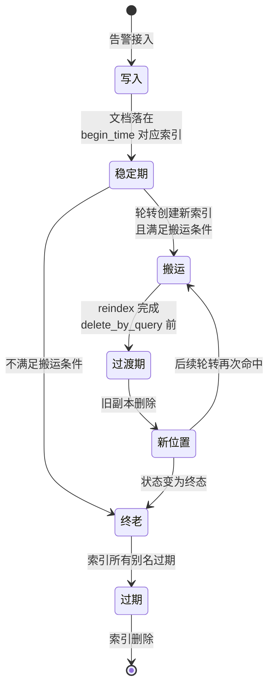
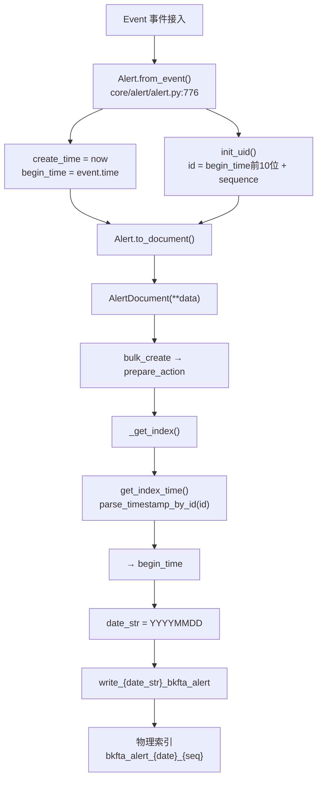
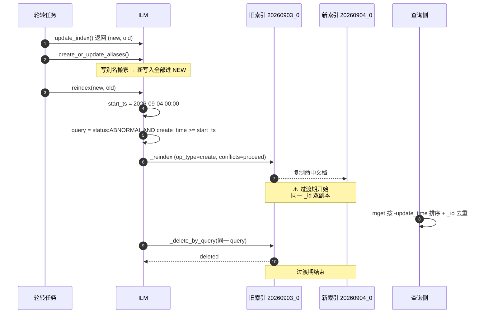
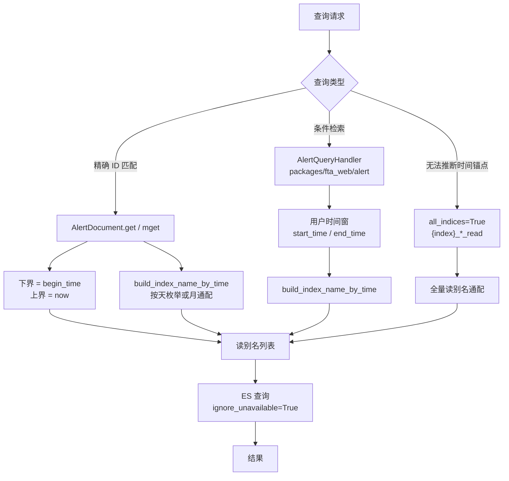
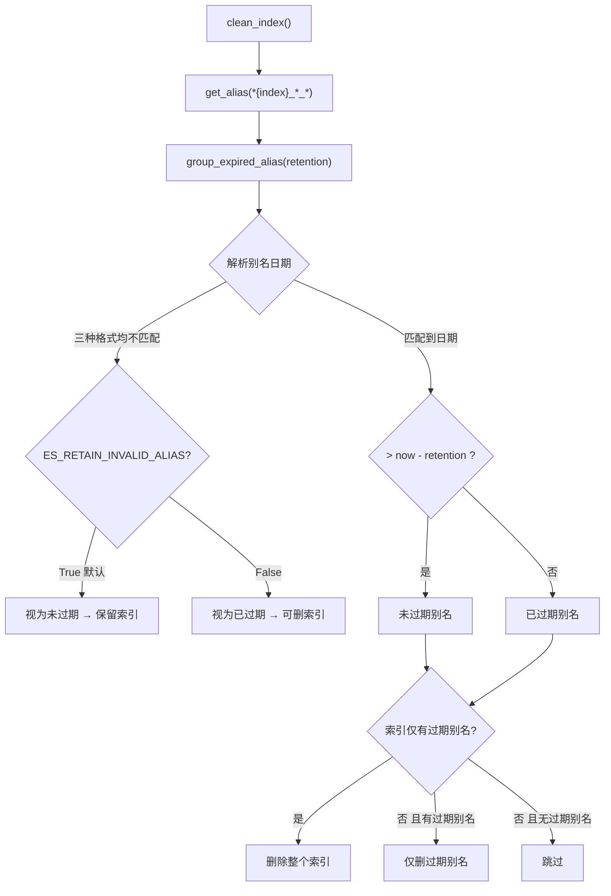

# 05 · 数据流

> 分析数据在"时间切片 + 别名路由 + 条件搬运"体系中的完整生命周期

---

## 一、数据生命周期总览

[专用] 一条告警文档从产生到消失，会经过五个阶段。注意**文档的物理位置可能变更**，这正是本模块区别于普通存储的地方：

**图表来源**
- `bkmonitor/bkmonitor/documents/base.py:67-89`（写入路由）
- `bkmonitor/bkmonitor/utils/elasticsearch/ilm.py:739-801`（搬运）
- `bkmonitor/bkmonitor/utils/elasticsearch/ilm.py:533-581`（过期）

---

## 二、写入流：从告警到物理索引

[专用] 完整链路，每一步都影响文档落点：

**图表来源**
- `bkmonitor/bkmonitor/alarm_backends/core/alert/alert.py:753-766`（`init_uid`）、`:776-802`（`from_event`）
- `bkmonitor/bkmonitor/documents/base.py:67-89`（`_get_index`）、`:163-186`（`prepare_action`）
- `bkmonitor/bkmonitor/documents/alert.py:113-121`（`get_index_time`）

### 2.1 关键：三个时间字段的分工

[专用] 这是理解整条链路的枢纽——**三个时间字段扮演完全不同的角色**：

| 字段 | 来源 | 决定什么 | 会变吗 |
|---|---|---|---|
| `begin_time` | `event.time`（事件时间） | **① `alert_id` 前 10 位 ② 文档写入哪个索引 ③ 查询索引窗口下界** | 否 |
| `create_time` | `int(time.time())`（服务器时间） | **reindex 搬运的范围过滤条件** | 否（仅初始化时赋值两次） |
| `update_time` | 每次变更刷新 | **双副本去重的排序依据** | 是 |

> **记忆口诀**：`begin_time` 管**索引路由**，`create_time` 管**搬运资格**，`update_time` 管**副本新旧**。

### 2.2 写入的 action 类型

[专用] 不同链路用不同的 bulk action，决定了"文档不存在时是否新建"：

| action | 使用链路 | 语义 |
|---|---|---|
| `INDEX` | `save_alerts` 默认（`alert/processor.py:92`） | 有则覆盖、无则新建 |
| `UPSERT` | 聚合引擎、`manager/tasks.py:281`、Issue 关联回填 | 增量更新 + `doc_as_upsert` |
| `UPDATE` | 降噪、处理记录回写 | 仅更新已存在文档 |
| `CREATE` | 故障快照等（`incident/processor.py:316`） | 仅新建 |

> [专用] **注意**：无论哪种 action，`_index` 都由 `prepare_action` 里的 `_get_index()` 决定，即**永远按 `begin_time` 路由**。这意味着：一条 3 天前触发、今天才恢复的告警，状态更新会写回 `write_{3天前}_bkfta_alert` 别名指向的索引——**不是今天的索引**。这是"文档物理位置与业务时间锚定"的设计后果。

---

## 三、搬运流：reindex 的完整时序

[专用] 把 `03-功能推演.md` §2 的推演，用时序图精确表达：

**图表来源**
- `bkmonitor/bkmonitor/utils/elasticsearch/ilm.py:739-801`
- `bkmonitor/bkmonitor/documents/alert.py:167-215`

### 3.1 数据一致性分析

[专用] 三处一致性风险点及其兜底：

| 风险 | 触发条件 | 兜底机制 | 评价 |
|---|---|---|---|
| **双副本短暂共存** | reindex 与 delete_by_query 之间 | `mget` 按 `-update_time` 排序去重 | ✅ `mget` 已防护；`get` 未防护（L3） |
| **旧快照覆盖新写入** | 搬运期间有新写入落到 NEW | `op_type=create` 跳过已存在 `_id` | ✅ 天然乐观锁 |
| **reindex 失败留下双副本** | ES 异常 | 仅记日志，不删旧文档 | ✅ 安全取向；查询侧去重兜底 |
| **delete_by_query 失败** | ES 异常 | 同上，双副本长期存在 | ⚠️ 无自动补偿，需人工介入 |

[通用] **一致性模型**：这是一套**最终一致**的设计。过渡期内读取可能命中旧副本，但最终会收敛到单副本。对于告警这种"展示为主"的场景，秒级到分钟级的最终一致是可接受的。

---

## 四、查询流：时间窗 → 索引列表 → 结果

[专用] 两条并行的查询路径：

**图表来源**
- `bkmonitor/bkmonitor/documents/base.py:107-160`
- `bkmonitor/bkmonitor/documents/alert.py:150-215`

### 4.1 为什么 `ignore_unavailable=True` 是必须的

[专用] `base.py:157`、`:160`、`:162` 三处都设了 `params(ignore_unavailable=True)`。

**原因**：`build_index_name_by_time` 按时间窗枚举出的读别名，**不保证都存在**。比如查询 30 天窗口，中间某天系统停机没有创建索引，那天的读别名就不存在。若不忽略不可用索引，整个查询会报错。

> 这是这套"按时间推导索引"设计的**必要容错**——推导出的索引列表是"期望存在"，不是"保证存在"。

### 4.2 数据流的关键不对称

[专用] 值得单独强调的一处设计张力：

| 方向 | 依据 | 语义 |
|---|---|---|
| **写入路由** | `begin_time`（文档自身时间） | 文档与业务时间锚定 |
| **查询推导** | 用户传入的时间窗 | 用户视角的时间范围 |

这两者**天然错位**——写入按"告警何时发生"，查询按"用户想看哪段"。错位程度取决于告警的存活时长：短告警几乎不错位，长告警（跨天恢复）错位严重。

> **这就是所有踩坑的根源**（见 `04-应用场景.md` §5）。系统给出的三条解法：
> 1. 精确 ID 查询：上界恒 now（`get` / `mget`）
> 2. 无法推断锚点：`all_indices=True`
> 3. 应用层扩展时间窗（`SearchAlertResource.detect_action_id_query`）

---

## 五、清理流（当前未启用）

[专用] 完整记录其设计逻辑，即使当前未调度：

**图表来源**
- `bkmonitor/bkmonitor/utils/elasticsearch/ilm.py:533-581`、`:434-531`、`:413-431`

> [专用] **清理的判定单位不是索引年龄，而是"索引身上是否还有未过期的别名"**。这是一个精妙但反直觉的设计：因为读别名是"那天的数据在这个索引里"的标记，别名还在就说明还有查询会命中它。
>
> ⚠️ **但当前 `clear_expired_indices` 没有注册到任何 crontab**，所以这条流在生产环境中不会自动执行。详见 `04-应用场景.md` L1 与 Q1/Q5。

---

## 六、异步流与调度全景

[专用] 所有涉及本模块的异步任务：

| 任务 | 周期 | 队列 | 状态 |
|---|---|---|---|
| `bkmonitor.documents.tasks.rollover_indices` | `*/24 * * * *` | `celery_cron` / global | ✅ 已注册（`worker.py:239`） |
| `bkmonitor.documents.tasks.clear_expired_indices` | — | — | ❌ **未注册** |
| `rollover_index` 管理命令 | 手工 | — | 可用 |
| `packages/fta_web/handlers.py:275` 调用 | ? | — | ⚠️ 触发场景待确认（Q3） |

[专用] **调度周期与切片粒度的关系**：

切片粒度是**天**（`date_format="%Y%m%d"`），但任务每 **24 分钟**跑一次。也就是说一天约 60 次执行中，**只有跨天那一次会真正创建新索引**，其余 59 次都是"检查 + 刷新别名"。

> **为什么周期要设这么密？** `worker.py:238` 的注释给了答案：
> > 定期进行告警索引轮转 隔天创建，时间稍微拉长一点，避免短时间任务堵塞的时候容易过期，导致创建不成功
>
> 即：高频执行是为了**容错**——万一次执行因任务堵塞失败，后续还有多次机会补上，不会导致新索引缺失进而写入失败。

---

## 七、数据丢失风险清单

[专用] 按"什么情况下会真的丢数据"梳理：

| 风险场景 | 会丢吗 | 说明 |
|---|---|---|
| reindex 搬运中断 | ❌ 不会 | `op_type=create` + 失败时不删旧文档，宁可双副本 |
| delete_by_query 失败 | ❌ 不会 | 留下双副本，数据仍在 |
| 轮转任务连续失败 24 小时 | ⚠️ 可能 | 新一天的写别名不存在 → 写入失败（但已写数据不丢） |
| 写入时间戳超出预留范围（>明天） | ⚠️ 可能 | 写别名不存在 → 写入失败 |
| 索引被清理 | ✅ 会 | 整个索引删除，其中所有文档消失（**清理未启用，暂无此风险**） |
| 物理索引被误删 | ✅ 会 | 该天所有文档消失，需快照恢复 |

> **结论**：本模块在正常路径下**不会丢数据**，所有异常分支都选择了"保留冗余"的取向。真正的数据丢失风险来自**索引级删除**（清理任务、误操作），而非搬运逻辑。

---

## 八、待确认清单（汇总）

> 与 `04-应用场景.md` §6 一致，此处汇总数据流层面新增的项：

| # | 问题 |
|---|---|
| Q1 | `clear_expired_indices` 是否有外部调度？（决定是否真有索引增长风险） |
| Q2 | reindex 的 `create_time` 过滤是否为有意设计？ |
| Q3 | `packages/fta_web/handlers.py:275` 的触发场景？ |
| Q5 | 生产环境如何处理索引清理？ |

`章节来源`
- `bkmonitor/bkmonitor/documents/base.py`
- `bkmonitor/bkmonitor/documents/alert.py`
- `bkmonitor/bkmonitor/utils/elasticsearch/ilm.py`
- `bkmonitor/bkmonitor/config/role/worker.py:238-239`
- `bkmonitor/bkmonitor/alarm_backends/core/alert/alert.py:753-802`
