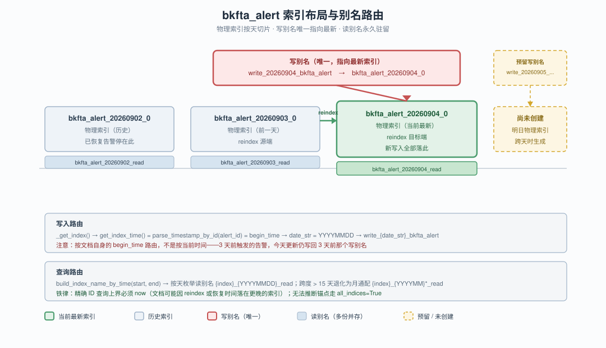
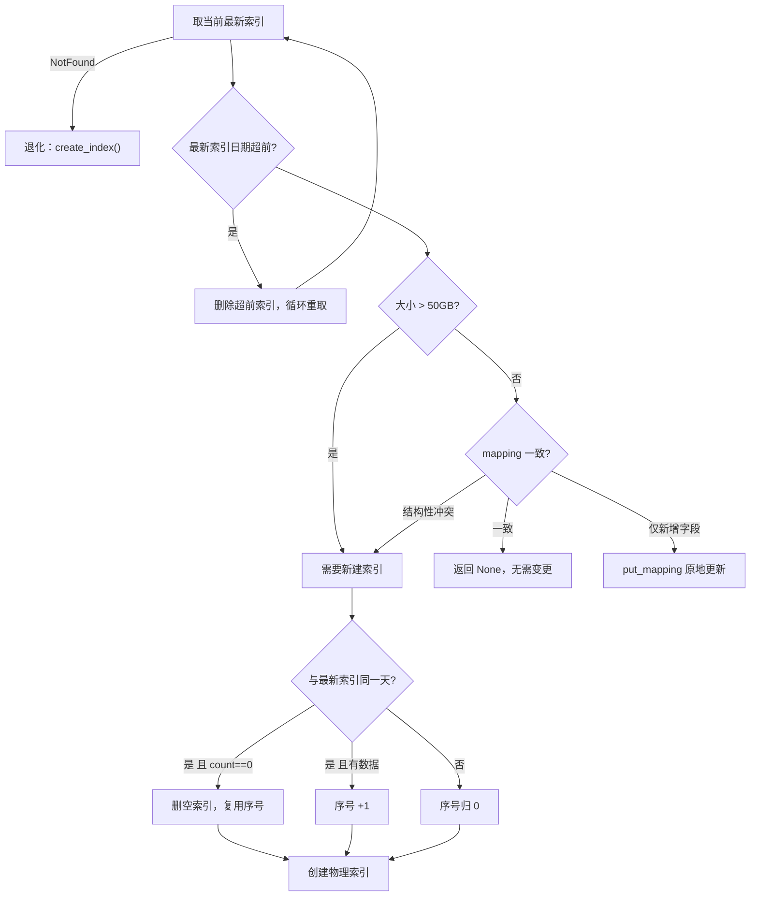
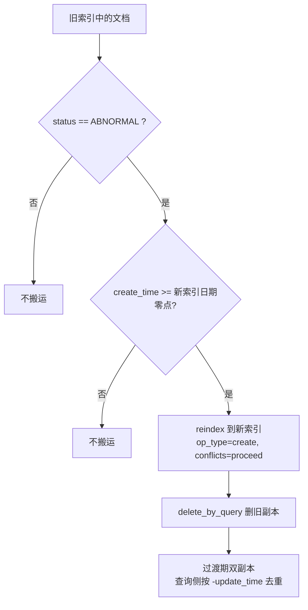
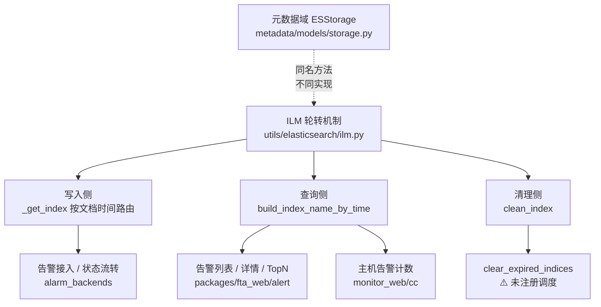

# 06 · 最终文档：ES 告警索引轮转机制

> **讲解对象**：`module` — ES 告警索引轮转（ILM）
> **档案目录**：`.teach/es-alert-index-rollover/`
> **讲解模式**：完整讲解（Phase 0 → 7）
> **知识范围**：`[通用]` ES 索引生命周期常识 + `[专用]` 本项目实现
> **学习目标**：读懂
> **核对状态**：已通过 Phase 3 质量闸门（22 条已确认 / 1 条表述修正 / 1 条存疑）

## 目录

1. [处境：这段代码为什么存在](#一处境这段代码为什么存在)
2. [冲突：为什么朴素做法不行](#二冲突为什么朴素做法不行)
3. [拆解：核心机制逐层展开](#三拆解核心机制逐层展开)
4. [验证：沿真实调用链走一遍](#四验证沿真实调用链走一遍)
5. [定位：它在全局中的位置与边界](#五定位它在全局中的位置与边界)
6. [速查清单与待确认事项](#六速查清单与待确认事项)
7. [下一步](#-下一步)

---

## 一、处境：这段代码为什么存在

[专用] 监控系统的告警数据有三个天然特征：**写多读少、按时间访问、总量无上限增长**。一条告警从触发到恢复可能横跨几分钟，也可能横跨几个月。如果所有告警堆在一个 ES 索引里，会同时撞上三堵墙：

- **容量墙**：单索引无限膨胀，恢复与迁移耗时不可控
- **清理墙**：想删 30 天前的数据，只能 `delete_by_query` 全表扫描，删完还留空洞
- **查询墙**：查"最近 7 天"也要扫全量分片

本项目的答案是**时间切片 + 别名路由**：按天切成物理索引，用「写别名」决定新数据写到哪、用「读别名」决定查询扫哪些索引，到期后整个索引直接删除。这套机制封装在 `ILM` 类（`bkmonitor/utils/elasticsearch/ilm.py`，801 行）里，被 10 个 Document 共用。

**谁在用它**：告警（`bkfta_alert`）、故障（`bkmonitor_aiops_incident_info`）、处理记录、Issue、事件、日志、操作流水等 10 类 ES 文档。

**谁在驱动它**：Celery beat 每 **24 分钟**执行一次 `rollover_indices`（`config/role/worker.py:239`）。

---

## 二、冲突：为什么朴素做法不行

[专用] 如果只有"时间切片"，还不足以解决告警场景。真正的复杂性来自第二个问题：

> **告警是长生命周期的可变实体。**

它不像日志那样写完就不变——一条告警今天还 ABNORMAL，明天可能恢复；恢复时文档要更新、状态要改写。如果文档永远停在"首次触发那天"的索引里，那么"查今天还活着的告警"就必须扫遍全量历史索引。

[专用] 本项目的解法是 **REINDEX 搬运**：轮转创建新索引时，把符合 `REINDEX_QUERY`（告警即 `status=ABNORMAL`）的文档从旧索引搬到新索引。这是**用写入放大换查询收敛**的取舍。

[专用] 而这带来了一个新的、更隐蔽的冲突：

> **写入按"业务时间"路由，查询按"用户时间窗"推导——两者天然错位。**

写入时用 `begin_time` 决定索引（`_get_index()`），查询时用用户传的时间窗推导索引列表（`build_index_name_by_time`）。错位程度取决于告警存活时长：短告警几乎不错位，**长告警（跨天恢复）错位严重**。

这个错位已经在本项目踩过两次坑（详见第五节）。

---

## 三、拆解：核心机制逐层展开

### 3.1 感知层：它对外长什么样

[专用] 四种名字，构成整套机制的词汇表：



**图表来源**
- `bkmonitor/bkmonitor/documents/base.py:60-65`
- `bkmonitor/bkmonitor/utils/elasticsearch/ilm.py:145-147`

| 抽象 | 命名规则 | 谁用 | 关键点 |
|---|---|---|---|
| **物理索引** | `{index}_{YYYYMMDD}_{seq}` | 存储层 | 一天可有多个（`_0`/`_1`），按 50 GB 分裂 |
| **写别名** | `write_{YYYYMMDD}_{index}` | 写入侧 | **唯一**，永远指向最新索引 |
| **读别名** | `{index}_{YYYYMMDD}_read` | 查询侧 | **多份并存**，永久驻留不迁移 |
| **索引模板** | pattern `{index}_*` | 创建时 | `use_template=True`，mapping 由模板提供 |

### 3.2 概念层：三个时间字段的分工

[专用] 这是理解全链路的枢纽，也是最容易混淆的地方：

| 字段 | 来源 | 决定什么 | 会变吗 |
|---|---|---|---|
| `begin_time` | `event.time` | ① `alert_id` 前 10 位 ② **文档写入哪个索引** ③ 查询窗口下界 | 否 |
| `create_time` | `int(time.time())` | **reindex 搬运的范围过滤条件** | 否 |
| `update_time` | 每次变更刷新 | **双副本去重的排序依据** | 是 |

> **口诀**：`begin_time` 管**索引路由**，`create_time` 管**搬运资格**，`update_time` 管**副本新旧**。

### 3.3 机制层一：轮转判定

[专用] `update_index()`（`ilm.py:276-370`）每次执行按序做五件事：



**图表来源**
- `bkmonitor/bkmonitor/utils/elasticsearch/ilm.py:276-370`

[专用] **易错点**：`is_mapping_same()` 返回 `(is_same_mapping, should_create)`，仅新增字段时是 `(False, False)`——**第一个 False 表示"和模型不完全一致"，第二个 False 表示"但不用建索引"**。

### 3.4 机制层二：reindex 搬运

[专用] **只在真的创建了新索引时才触发**（`ilm.py:244-255`）。日常 60 次/天的执行中，约 59 次走"无需变更"分支，零搬运开销。



**图表来源**
- `bkmonitor/bkmonitor/utils/elasticsearch/ilm.py:739-801`

> ⚠️ **本项目内四处材料**（`alert.py:156-160` 注释 / `test_alert_document.py` docstring / ai-docs 设计文档 §2.3 / ki 记忆）表述为"活跃告警每天被搬运到当天索引"。**代码实际是 `status=ABNORMAL AND create_time >= 新索引日期`**，二者不等价：长期存活的旧告警不会被继续搬运。详见 `02-正确性核对.md` E1 项。
>
> **这不影响查询正确性**——`get`/`mget` 的上界恒 `now` 已覆盖所有落点。

### 3.5 机制层三：查询侧索引推导

[专用] `build_index_name_by_time()`（`base.py:107-143`）：

| 时间窗 | 生成的索引列表 |
|---|---|
| 同月、跨度 ≤ 15 天 | 按天枚举 `bkfta_alert_20260901_read` … `20260910_read` |
| 同月、跨度 > 15 天 | 月通配 `bkfta_alert_202609*_read` |
| 跨月 | 起始月按天 + 中间整月通配 + 结束月按天 |

[专用] 三处 `ignore_unavailable=True` 是**必要容错**——枚举出的读别名不保证都存在（如某天系统停机未建索引）。

### 3.6 实操层：怎么用、怎么调

```bash
# 手工触发一次全量轮转
cd bkmonitor && python manage.py rollover_index
```

| 常见调整 | 位置 | 风险 |
|---|---|---|
| 调整单索引大小上限 | `FTA_ES_SLICE_SIZE`（默认 50 GB） | 低 |
| 调整保留天数 | `FTA_ES_RETENTION`（默认 365） | ⚠️ 清理未启用，当前是死配置 |
| 调整索引分片/副本 | 环境变量 `BKMONITOR_DOCUMENT_ES_INDEX_SHARDS` / `_REPLICAS` | 中（仅对新索引生效） |
| 新增需要轮转的 Document | 加到 `ALL_DOCUMENTS` | 低 |
| 改切片粒度为小时 | `INDEX_TIME_FORMAT` + `slice_gap` | **高**：历史索引不兼容 |
| 把 `slice_gap` 调小 | `base.py:205` | ⚠️ 别名数线性膨胀（60 分钟 → 25 个别名） |

---

## 四、验证：沿真实调用链走一遍

[专用] 用两条真实链路验证上面的机制。

### 4.1 验证一：写入链路 —— 文档落在哪

```
Event 接入
  → Alert.from_event()                       create_time=now, begin_time=event.time
  → init_uid()                               id = begin_time 前10位 + sequence
  → AlertDocument(**data)
  → bulk_create → prepare_action → _get_index()
  → get_index_time() = parse_timestamp_by_id(id) = begin_time
  → write_{YYYYMMDD}_bkfta_alert
  → 物理索引 bkfta_alert_{YYYYMMDD}_{seq}
```

**验证结论**：文档落点由 `begin_time` 决定，与"当前时间"无关。一条 3 天前触发、今天恢复的告警，状态更新写回 **3 天前**那个写别名——不是今天的索引。

**代码来源**：`core/alert/alert.py:753-802`、`documents/base.py:67-89`、`documents/alert.py:113-121`

### 4.2 验证二：查询链路 —— 为什么上界必须 now

[专用] 一条告警 `alert_id = 1776330921292201387`（`begin_time` = 2026-04-16），它可能落在哪？

| 情况 | 落点 | 命中条件 |
|---|---|---|
| 当天就恢复 | `bkfta_alert_20260416` | 需覆盖 04-16 |
| 2026-05-01 恢复 | `bkfta_alert_20260501` | 需覆盖 05-01 |
| 被 reindex 搬到今天 | `bkfta_alert_<今天>` | 需覆盖今天 |
| 长期活跃停在 create_time 那天 | `bkfta_alert_<create_time 那天>` | 需覆盖该天 |

**四种落点的共同点**：都 ≥ `begin_time`，且都 ≤ `now`。因此 `[begin_time, now]` 是唯一安全的窗口。

**代码来源**：`documents/alert.py:150-165`（`get`）、`:167-215`（`mget`）

### 4.3 两个真实踩坑（这条铁律的血泪史）

| 坑 | 现象 | 根因 | 正确做法 |
|---|---|---|---|
| **查 7 天查不到、30 天能查到** | 反直觉 | 用户时间窗不含文档实际所在索引（恢复那天） | 精确 ID 查询上界恒 now |
| **未恢复告警计数为 0** | 历史 `end_time` 下计数恒 0 | `end_time` 被透传收窄了索引窗口上界 | `search(days=days)` 上界恒 now，`end_time` 只做文档级过滤 |

> **同构性**：都是"**用户时间窗 ≠ 文档实际索引位置**"。
> **口诀**：索引窗口管"扫哪些索引"，查询条件管"过滤哪些文档"，**两者不可混用**。

---

## 五、定位：它在全局中的位置与边界

### 5.1 与相邻系统的关系



**图表来源**
- `bkmonitor/bkmonitor/documents/base.py:67-160`
- `bkmonitor/bkmonitor/metadata/models/storage.py:3688`（另有一套同名实现）

> [专用] **与元数据域的分界**：`metadata/models/storage.py` 有同名的 `update_index_and_aliases` / `clean_index_v2` / `reallocate_index`，但服务于监控时序数据（table_id 维度），**同名不同实现**。告警域 `ILM` 只管 10 个 Document 索引。

### 5.2 适用与不适用

[专用] **适用**：有天然时间维度、总量无上限、查询以时间窗为主、存在少量长期存活且状态会变的实体。

[专用] **不适用**：

| 场景 | 为什么 | 替代 |
|---|---|---|
| 需跨全量历史精确聚合 | 时间切片让"全量"变几百个索引 | 预聚合 / 离线数仓 |
| 数据无时间维度 | 切片无意义 | 单索引 + 别名 |
| 要求强一致删除语义 | 清理是索引粒度 | `delete_by_query` |

> [专用] **一个具体的反例**：`IssueDocument` **关闭**了 reindex（`issue.py:47`）。原因（`base.py:258-262`）：Issue 要按后加的 `impact_scope` 字段过滤，关闭搬运意味着"历史数据留在旧索引、不参与新字段过滤"——**有意接受的语义**。若开了 reindex，反而会把不含新字段的旧文档搬过来，污染过滤结果。

### 5.3 已知局限（按严重度）

| # | 问题 | 证据 |
|---|---|---|
| **L1** | 过期清理未启用（`clear_expired_indices` 无 crontab） | 全仓 grep 仅命中定义处 `tasks.py:38` |
| **L2** | reindex 搬运范围与四处文档表述不一致 | `ilm.py:759-762` vs 注释/测试/ai-docs/ki |
| **L3** | `get()` 无双副本防护（`mget()` 有） | `alert.py:161-164` vs `:205-215` |
| **L4** | 轮转失败只有日志，无指标无重试 | `tasks.py:33-37` |
| **L5** | `current_index_info` 每次全量扫描所有索引 | `ilm.py:105-127` |
| **L6** | 冷热分层告警域未启用 | `base.py:198-211` 未传 `warm_phase_days` |

### 5.4 性能特征

[专用] `N`=文档数，`M`=索引数，`A`=别名数，`D`=时间窗天数：

| 操作 | 复杂度 | 备注 |
|---|---|---|
| `current_index_info()` | O(M) | 每天约 600 次（10 Document × 60 次），**M 随保留时长增长** |
| `create_or_update_aliases()` | O(A × M) | 每轮 2 次 `update_aliases` |
| `build_index_name_by_time()` | O(D) | ≤15 天按天枚举 |
| `reindex()` | O(K) | K = 命中文档数，`op_type=create` 让 ES 跳过已存在 `_id` |
| `clean_index()` | O(M × A) | 当前未执行 |

**资源特征**：reindex 在 ES 侧执行（不占应用内存），但 delete_by_query 与 stats 走网络；全程同步，Celery worker 在 reindex 期间被占用（300s 超时）。

### 5.5 数据丢失风险

[专用] 正常路径**不会丢数据**——所有异常分支都选"保留冗余"：`op_type=create` 防覆盖、reindex 失败不删旧文档、`conflicts=proceed` 不让个别冲突中断整批。

真正的丢失风险来自**索引级删除**（清理任务、误操作），而非搬运逻辑。

---

## 六、速查清单与待确认事项

### 6.1 写代码 / 排查前必读

- [ ] `alert_id[:10]` 是 `begin_time`，**不是** doc 索引日期
- [ ] 精确 ID 查询的索引窗口**上界必须 now**，不可用用户查询截止时间
- [ ] 无法推断时间锚点的查询走 `all_indices=True`
- [ ] 索引窗口管"扫哪些索引"，查询条件管"过滤哪些文档"，**不可混用**
- [ ] `is_mapping_same` 返回 `(is_same, should_create)`，`(False, False)` = 仅新增字段 → 原地改 mapping
- [ ] reindex 只在"真的建了新索引"时触发
- [ ] 告警域**没有**冷热分层；**没有**启用过期清理

### 6.2 待确认（需向负责人确认，本技能不下结论）

| # | 问题 |
|---|---|
| Q1 | `clear_expired_indices` 是否有外部调度？（决定索引增长风险是否真实存在） |
| Q2 | reindex 的 `create_time` 过滤是否为有意设计，还是本意应为"搬运全部 ABNORMAL"？ |
| Q3 | `packages/fta_web/handlers.py:275` 触发 `rollover_indices()` 的业务场景？ |
| Q4 | 告警域是否规划过冷热分层？ |
| Q5 | 生产环境实际如何处理索引清理？ |

---

## 七、各阶段产物索引

| 文件 | 内容 |
|---|---|
| [00-能力大纲.md](./00-能力大纲.md) | 对外职责、公开能力、关键抽象、核心问题清单 |
| [00-评审清单.md](./00-评审清单.md) | 评审节点占位与记录 |
| [01-代码wiki.md](./01-代码wiki.md) | 结构、命名规则、四个核心流程、查询推导、不变量 |
| [02-正确性核对.md](./02-正确性核对.md) | 22 条已确认 / 1 条修正 / 1 条存疑 + 级联检查 |
| [03-功能推演.md](./03-功能推演.md) | 执行路径推演、reindex 行为、边界异常、性能分析 |
| [04-应用场景.md](./04-应用场景.md) | 适用/不适用场景、局限分级、踩坑案例 |
| [05-数据流.md](./05-数据流.md) | 写入/搬运/查询/清理四流、一致性、调度全景 |
| [assets/index-layout-and-aliases.svg](./assets/index-layout-and-aliases.svg) | 索引布局与别名路由示意图 |

---

## 🚀 下一步

> 复制下面这段文字发给 AI，即可继续（无需重新描述上下文）：

```
我刚看完 es-alert-index-rollover 的讲解材料，档案在 .teach/es-alert-index-rollover/。
请就 {具体方向：reindex 搬运范围的验证方案 / 索引清理未启用的影响评估 / AlertDocument.get 的双副本防护} 再深入讲一层。
```
