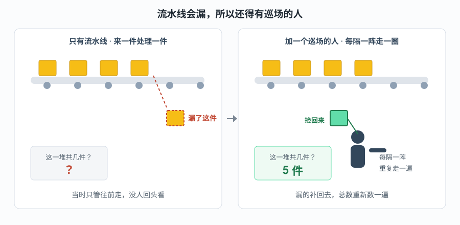

# issue 后台周期任务 · 能力大纲

**本文引用的文件**
- [周期任务主文件 issue_tasks](file://bkmonitor/alarm_backends/service/fta_action/tasks/issue_tasks.py)
- [任务导出清单 tasks/__init__](file://bkmonitor/alarm_backends/service/fta_action/tasks/__init__.py)
- [cron 与模式注册 worker.py](file://bkmonitor/config/role/worker.py)
- [调度分发语义 cron.py](file://bkmonitor/alarm_backends/service/scheduler/tasks/cron.py)

> 讲解对象：`module`（`bkmonitor/alarm_backends/service/fta_action/tasks/issue_tasks.py` + 调度配置）
> 范围：`通用 + 专用`（默认）
> 学习目标：`读懂`（默认）
> 讲解模式：完整讲解（Phase 0 → 7）

## 目录
1. [一句话本质](#一句话本质)
2. [这两个任务为什么存在](#这两个任务为什么存在)
3. [这套写法的特性](#这套写法的特性)
4. [先纠正一个直觉](#先纠正一个直觉)
5. [公开能力清单](#公开能力清单)
6. [关键抽象](#关键抽象)
7. [调度层关键事实](#调度层关键事实)
8. [子模块划分](#子模块划分本文件内部)
9. [讲解路线](#讲解路线)
10. [外部文档索引](#外部文档索引)

## 一句话本质

> 主流程是"来一条处理一条"，忙起来难免漏；这两个任务**每隔一阵回头走一圈，把漏掉的补回去、把总数重新数一遍**。
>
> 换句话说：**它是主流程的补丁队——主流程顾不上算的账，交给它定时重算。**

## 这两个任务为什么存在

**处境对照**：告警聚合成 Issue 发生在每条告警的处理主链路上（`IssueAggregationProcessor.process()`）。这条主链路是"来一条处理一条"的流水线，有两个结构性弱点——下面这张图左边画的就是它。

**图表来源**（本图为纯直觉类比，不对应具体代码；其表达的机制对应下列实现）
- [issue_tasks.py](file://bkmonitor/alarm_backends/service/fta_action/tasks/issue_tasks.py#L47-L112)（主循环与职责清单——"巡场一圈"都干哪些事）
- [worker.py](file://bkmonitor/config/role/worker.py#L236-L244)（cron 与模式注册——"每隔一阵"是多久）
- [cron.py](file://bkmonitor/alarm_backends/service/scheduler/tasks/cron.py#L88-L110)（调度分发语义——谁来走这一圈）

**看图**：左边只有流水线，包裹一件件往前走，掉了一件没人知道，问"这堆共几件"只能答不知道；右边多了一个每隔一阵走一圈的人——掉在地上的捡回去，"这堆共几件"重新数清楚。本模块做的，就是右边那个巡场的人。

具体到代码，主链路的两个弱点是：

| | 不这么做（只靠主链路） | 这么做（加周期任务） |
|---|---|---|
| 抢锁失败 / ES 抖一下没写进去的告警 | 永远不在任何 Issue 里，主链路只记日志不重试 | 每 5 分钟扫一次，把漏关联的补回去 |
| Issue 上"共几条告警""最后一条什么时候"这类派生字段 | 主链路只管累加，从不回头重算，会越走越偏 | 按当前全量告警重新算一遍，收敛到正确值 |
| 一个找不到任何告警的孤儿 Issue | 没人发现，会一直挂着 | 存活超过 5 分钟的会被翻出来记 error 日志 |
| 排查时的代价 | 问题只在出问题那一刻存在，事后无从追溯 | 每 5 分钟一轮，最坏延迟 5 分钟，且状态最终收敛 |

## 这套写法的特性

| # | 特性 | 换来什么 | 代价是什么 |
|---|---|---|---|
| 1 | [专用] 所有写入都设计成可重复执行 | 多集群各跑一遍也不会把数据写坏 | 重复执行纯粹浪费算力——每多一个集群，负载翻一倍 |
| 2 | [专用] 一个任务体内塞 5 项职责 | 一轮扫描里共享同一次全量遍历，省 4 次扫描 | 任务体长、职责耦合，改一项要通读上下文；任一项抛错影响同轮后续项 |
| 3 | [通用] 深分页用游标而非页码 | 扫全量活跃 Issue 不会因翻页变慢 | 游标不能跳页，只能从头顺序走；中途失败只能整轮重来 |
| 4 | [专用] 指纹复算复用主链路同一函数 | 补偿进来的告警与正常进来的一定是同一口径 | 主链路改了指纹算法，周期任务自动跟着变——没有"两边不一致"的缓冲 |
| 5 | [专用] 单周期内按策略去重 | 把 N 个 Issue × M 个策略的查询量降到 N+M | 去重集合只在本轮有效，跨轮不复用 |

章节来源：[issue_tasks.py](file://bkmonitor/alarm_backends/service/fta_action/tasks/issue_tasks.py#L47-L112)、[issue_tasks.py](file://bkmonitor/alarm_backends/service/fta_action/tasks/issue_tasks.py#L234-L886)、[worker.py](file://bkmonitor/config/role/worker.py#L236-L244)

## 先纠正一个直觉

用户说"issue 后台有很多周期任务"——**实际只有 2 个 beat 周期任务**：

| 任务 | cron | 模式 | 队列 |
|---|---|---|---|
| `sync_issue_alert_stats` | `*/5 * * * *` | cluster | `celery_action_cron` |
| `refresh_issue_llm_title_examples` | `0 * * * *` | cluster | `celery_action_cron` |

第三个 `generate_issue_llm_title` **不是周期任务**，是新建 Issue 时 `apply_async` 派发的异步一次性任务（队列 `celery_llm_task`）。

"感觉很多"的来源：`sync_issue_alert_stats` 这一个任务体内塞了 **5 项职责**（统计同步 / 漏关联补偿 / 影响范围重算 / orphan 检测 / 哨兵续命），是"一个任务干五件事"，不是"五个任务"。

所以周期任务的定位是：**主链路的补偿器 + 派生字段的重算器**，不是业务逻辑主体。

## 公开能力清单

### 周期任务 1：`sync_issue_alert_stats`

扫描**全量活跃 Issue**，逐条执行五项职责。规模 = 活跃 Issue 总数，每 5 分钟一轮。

| 职责 | 一句话 | 为什么必须周期做 |
|---|---|---|
| 告警统计同步 | 重算 `alert_count` / `last_alert_time` | 派生字段，主链路只写增量不重算 |
| 漏关联补偿 | 回填 `AlertDocument.issue_id` 缺失的告警 | 主链路 best-effort 失败（抢锁/ES 异常）的兜底 |
| 影响范围重算 | 重算 `impact_scope` 快照 | 随告警集合变化，需按当前全量告警重算 |
| orphan 检测 | 无关联告警且存活 > 5min 的 Issue 打 error 日志 | 异常态只能靠事后扫描发现 |
| Legacy 哨兵续命 | 哨兵不存在 + 确认无 legacy 时重新 set | 30 天 TTL，防止 processor 退化到全索引 fallback |

### 周期任务 2：`refresh_issue_llm_title_examples`

预计算 LLM 标题的 few-shot 示例缓存（采样用户改名），按 strategy / biz 两级写 Redis，TTL 24h。

### 异步任务：`generate_issue_llm_title`

新建 Issue 后异步调 LLM 生成可读标题，CAS 写入 `name`。失败静默保留默认名。

## 关键抽象

| 抽象 | 角色 |
|---|---|
| `IssueDocument` | ES 文档模型（`bkfta_issue`），活跃状态由 `IssueStatus.ACTIVE_STATUSES` 判定 |
| `AlertDocument` | ES 告警文档，通过 `issue_id` 字段与 Issue 关联 |
| `gen_issue_fingerprint` | 指纹算法（`count_md5`），周期任务反算复用主链路同一函数，保证口径一致 |
| `aggregate_config` 快照 | Issue 创建时的聚合维度快照，决定 `impact_scope` 收窄范围 |
| `search_after` 深分页 | 两个 scan 工具函数统一用它避免深分页性能塌陷 |
| `backfilled_strategies` set | 单周期内按策略去重的优化开关，把 O(N×M) 降到 O(N+M) |

### 术语对标

> 本模块有几个词是项目自造或内部黑话，字面意思容易误导。下表给出业界叫法与出处。

| 项目叫法（人话） | 业界标准叫法 | 代码位置 | 代价 / 注意事项 |
|---|---|---|---|
| 漏关联补偿 / backfill | 回补（Backfill）——数据管道里给历史记录补齐缺失字段的常见做法 | [issue_tasks.py](file://bkmonitor/alarm_backends/service/fta_action/tasks/issue_tasks.py#L234-L886) | 只补**空值**、不覆盖已有值，所以可重复执行；代价是已写错的 `issue_id` 永远补不回来 |
| 哨兵 / 哨兵续命 | 哨兵值（Sentinel value）——用一条特殊记录表示"某状态已成立" | [issue_tasks.py](file://bkmonitor/alarm_backends/service/fta_action/tasks/issue_tasks.py#L48-L386) | 带 30 天 TTL，过期后查询会退化到全索引扫描——**性能会暗中变差**，不是功能报错 |
| 指纹 / `gen_issue_fingerprint` | 聚合键（Grouping key）；业界也称 dedup key / fingerprint | [issue_tasks.py](file://bkmonitor/alarm_backends/service/fta_action/tasks/issue_tasks.py#L234-L886) | 周期任务与主链路复用**同一函数**，保证口径一致；代价是主链路一改算法，两边同时变，没有缓冲 |
| `cluster` 运行模式 | 本项目特有（与同文件里的 `global` 相对）——`global` 才是"只跑一份"的常规语义 | [cron.py](file://bkmonitor/alarm_backends/service/scheduler/tasks/cron.py#L88-L110) | **字面最易误解的一个**：`cluster` 不是"集群级只跑一次"，而是**每个集群都跑一次** |
| orphan 检测 | 孤儿记录检测（Orphan detection） | [issue_tasks.py](file://bkmonitor/alarm_backends/service/fta_action/tasks/issue_tasks.py#L234-L886) | 只写 error 日志、不做任何自动处理——发现了还得人来查 |
| `search_after` 深分页 | ES 官方的 PIT + search_after 深分页方案（游标式） | [issue_tasks.py](file://bkmonitor/alarm_backends/service/fta_action/tasks/issue_tasks.py#L234-L886) | 避免深分页性能塌陷；代价是不能跳页，中断只能整轮重来 |
| `impact_scope` | 影响范围（Blast radius / Impact scope）；本项目实现为创建时的维度快照 | [issue_tasks.py](file://bkmonitor/alarm_backends/service/fta_action/tasks/issue_tasks.py#L234-L886) | 它是**快照**、会随告警集合重算，与"创建时确定的范围"不是一回事 |

## 调度层关键事实

[专用] `cluster` 运行模式的含义，来自 `alarm_backends/service/scheduler/tasks/cron.py#L96`：只有 `run_type == "global"` 的任务会被非默认集群跳过，`cluster` 任务**每个集群都会注册并执行**。两个 issue 周期任务都是 `cluster` 模式。

这带来一个必须讲清的推论：多集群部署下 `sync_issue_alert_stats` 会**每个集群各跑一遍**，对同一批活跃 Issue 做重复的重算与 backfill。这不是 bug——各项写入都是**幂等的**（统计是覆盖写、backfill 只补空 `issue_id`），重复执行只是浪费算力，不产生数据错误。真正的风险在"算力放大"而非"数据错乱"。

> ⚠️ `cluster` 任务在多集群下的重复执行，需结合 `alarm_backends/core/cluster.py` 的实际部署形态确认——本材料未实证集群数量，按"可能重复"陈述。

## 子模块划分（本文件内部）

`issue_tasks.py` 1531 行，内部按职责天然分三段：

| 段落 | 行区间 | 职责 |
|---|---|---|
| 统计同步段 | L48-L386 | `sync_issue_alert_stats` + 哨兵续命 + 单 Issue 处理 |
| 补偿与范围段 | L234-L886 | backfill + impact_scope 构造 + 两个 scan 工具 |
| LLM 段 | L899-L1531 | 示例刷新 + `_apply_llm_title` + 自动生成 + 补偿重跑 |

## 本阶段待确认

- 无阻塞项。Phase 2 将逐段展开。

## 讲解路线

| 顺序 | 讲什么 | 对应产物 |
|---|---|---|
| 1 | 先建立直觉：它是主流程的补丁队，为什么必须有它 | [00-能力大纲.md](./00-能力大纲.md) |
| 2 | 再认全零件：两个任务、一个异步任务、关键抽象 | [01-代码wiki.md](./01-代码wiki.md) |
| 3 | 校验：逐条回读代码确认结论 | [02-正确性核对.md](./02-正确性核对.md) |
| 4 | 走一遍真实执行：一轮扫描里五件事怎么做的，异常怎么办 | [03-功能推演.md](./03-功能推演.md) |
| 5 | 定位：什么情况该看这里、它的局限在哪 | [04-应用场景.md](./04-应用场景.md) |
| 6 | 数据怎么流：扫什么、写回哪、与谁交互 | [05-数据流.md](./05-数据流.md) |
| 7 | 汇总成一篇可独立阅读的材料 | [06-最终文档.md](./06-最终文档.md) |

> 若按代码段落深入，顺序建议 **统计同步段 → 补偿与范围段 → LLM 段**：先弄清主循环怎么扫、怎么算，再看漏关联怎么补，最后看与标题生成相关的一条独立支线。

## 外部文档索引

> 本模块 `[通用]` 部分涉及 Celery beat 定时调度、`search_after` 深分页等通行做法，但**本轮讲解全部结论均来自源码实证，未引用外部文档链接**，且相关概念在文内已给出人话解释，读者无需跳转即可读懂。
> 按规范本节省略建库，结论记为：**无**（未收集，非纯专用豁免）。

| 站点 | slug | 范围（scope） | 生成日期 | 索引文件 |
|------|------|---------------|----------|----------|
| 无 | — | — | — | 本轮未建索引；后续若需引用 Celery beat / ES 深分页官方说明，可在此补一行 |

## 章节来源

- [issue_tasks.py](file://bkmonitor/alarm_backends/service/fta_action/tasks/issue_tasks.py#L47-L112)（sync_issue_alert_stats 主循环与职责 docstring）
- [issue_tasks.py](file://bkmonitor/alarm_backends/service/fta_action/tasks/issue_tasks.py#L1438-L1451)（refresh_issue_llm_title_examples）
- [issue_tasks.py](file://bkmonitor/alarm_backends/service/fta_action/tasks/issue_tasks.py#L1084-L1113)（generate_issue_llm_title）
- [worker.py](file://bkmonitor/config/role/worker.py#L236-L244)（两个周期任务的 cron 与模式注册）
- [cron.py](file://bkmonitor/alarm_backends/service/scheduler/tasks/cron.py#L88-L110)（cluster / global 调度分发语义）
- [tasks/__init__.py](file://bkmonitor/alarm_backends/service/fta_action/tasks/__init__.py#L18-L22)（任务导出清单）
