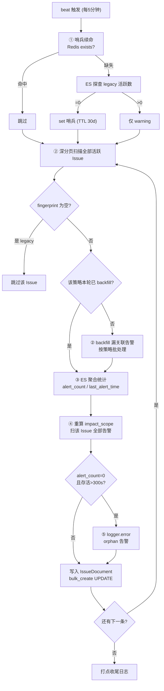

# 功能推演

> 基于已校验事实，推演真实运行时行为：正常路径、边界异常、性能与复杂度。

## 一、一轮 `sync_issue_alert_stats` 的完整执行路径



**图表来源**：`file:///root/bk-monitor/bkmonitor/alarm_backends/service/fta_action/tasks/issue_tasks.py#L47-L229`

## 二、正常路径：一条告警被漏关联后如何被补回

场景：某策略下已有活跃 Issue（fingerprint=F），一条新告警因 worker 抢锁失败没写 `issue_id`。

1. 下个周期（≤5 分钟）任务扫到该策略下的某个活跃 Issue。
2. 该策略本轮未 backfill → 进入 `_backfill_unlinked_alerts_for_strategy`。
3. Step 1 扫该策略全部活跃 Issue，建 `{F: (issue_id, create_time)}` 映射。
4. Step 2 扫该策略 `issue_id` 不存在的告警，下界为最早 Issue 创建时间（不早于 7 天前）。
5. Step 3 对该告警调 `gen_issue_fingerprint`，用 live 维度组算出 F，命中映射。
6. 校验 `alert.begin_time >= issue.create_time` → 通过。
7. `AlertDocument.bulk_create(UPSERT)` 写入 `issue_id`。
8. 后续 issue 列表、详情、统计均能查到这条告警。

**端到端延迟**：最坏约 5 分钟（等下一周期）+ 任务执行耗时。这是"最终一致"而非实时。

## 三、边界与异常路径

### 3.1 高基数策略下的算力放大

[专用] 若某策略聚合维度选了高基数字段（如 `pod_name`），活跃 Issue 数 N 可能达数百。

- **backfill 已优化**：按策略批处理，alert scan 只做 1 次，复杂度 O(N + M×G)，G 通常为 1。
- **未优化的部分**：`_build_impact_scope` 是**逐 Issue** 执行的，每个 Issue 都要独立扫一遍自己的关联告警。N 个 Issue = N 次告警扫描。若每个 Issue 只有少量告警，总开销仍随 N 线性增长。
- **实际瓶颈**：`sync_issue_alert_stats` 单轮耗时 ≈ 活跃 Issue 总数 ×（1 次 ES 聚合 + 1 次告警扫描）。活跃 Issue 上万时，单轮可能超过 5 分钟周期 → 任务重叠。

> ⚠️ **任务重叠风险**：beat 的 `expires` 计算在 `scheduler/tasks/cron.py#L105-L108`，取 `min(3600, max(interval, 300))`。对 `*/5` 任务 interval=300，故 expires=300s——超过 5 分钟未消费的任务会被丢弃。这意味着**执行超时不会无限堆积，但会静默丢轮次**。这是有意的设计（周期任务宁可跳过一轮也不堆积）。

### 3.2 backfill 的 7 天窗口边界

```python
scan_lower_bound = max(earliest_create_time, int(time.time()) - _BACKFILL_ALERT_SCAN_MAX_LOOKBACK_SEC)
```

推论：**6 个月前漏写的告警不会被周期任务回填**。代码注释明说"由 process 主路径兜底"——但主路径是处理新告警的，对历史告警其实没有兜底路径。这是一处**已知的能力边界**，不是 bug：回填设计目标是补偿近期瞬时失败，不是全量历史修复。

历史数据修复另有专门管理命令 `backfill_issue_fingerprint`（`bkmonitor/management/commands/backfill_issue_fingerprint.py`）。

### 3.3 catch-all 与具体 Issue 并存时的归属

[专用] 若策略先把聚合维度配成 `["bk_target_ip"]`（产生多个具体 Issue），后改成 `[]`（产生 catch-all Issue），窗口期内两类 Issue 并存。

匹配排序保证 live 组（当前配置对应的维度组）优先。这里有个微妙点：

- 当前 live = `[]`（catch-all）→ catch-all 组排第一 → **新告警全归 catch-all**，具体 Issue 不再吸收新告警。
- 当前 live = `["bk_target_ip"]` → 具体组排第一 → 命中具体 Issue，未命中才回退 catch-all。

这是**符合直觉**的：新告警应按当前配置归属。但如果 live 配置查询失败（Redis 异常），`live_agg_dims_tuple = None`，退化为纯维度数降序 → 具体组（维度多）仍优先于 catch-all。降级路径也是安全的。

### 3.4 orphan Issue 只报不修

orphan 检测打 `logger.error` 就结束了。没有自动清理、没有自动关联。

合理推断（**标注为推断**）：orphan Issue 的成因多样（告警被清理、策略被删、指纹维度变更导致历史告警无法匹配），自动修复的误伤风险高于收益，故只做可观测信号，交由运维判断。

### 3.5 多集群重复执行

[专用] 两个任务都是 `cluster` 模式，每个集群各跑一遍。由于所有写入都是**幂等**的（统计覆盖写、backfill 只补空字段、impact_scope 全量重算），重复执行不产生数据错误，只浪费算力。

真正的放大点：`_build_impact_scope` 里的 CMDB `SetManager.mget` 与 `BusinessManager.get` 调用。虽然已按业务批量合并，但多集群同时执行会把 CMDB 缓存的回源压力翻倍。

## 四、性能与复杂度

> 触发条件检查：代码中存在显式循环与大数据集处理（scan 深分页）、有 `cache` / `batch` 等性能关注信号。满足分析条件。

| 环节 | 复杂度 | 说明 |
|---|---|---|
| Issue 扫描 | O(N / 500) 页 | `search_after` 深分页，每页 500 |
| backfill（按策略） | O(N + M×G) | N=该策略活跃 Issue 数，M=unlinked 告警数，G=维度组数（通常 1） |
| 统计聚合 | O(1) 次 ES 请求 / Issue | 单次聚合拿 count + max，但**每个 Issue 一次请求** → 总 O(N) 次请求 |
| impact_scope | O(K) / Issue | K=该 Issue 关联告警数，深分页扫描 → 总 O(N×K̄) |
| 写入 | O(N / batch) | 逐条 `bulk_create([update_doc])`，**注意是单条批量**，非攒批 |

**热点路径**：

1. **逐 Issue 的 ES 请求**——活跃 Issue 数 N 直接决定请求次数。这是本任务最主要的规模化瓶颈，且**没有做攒批优化**（对比 backfill 做了批处理）。
2. **逐条 `bulk_create`**——`issue_tasks.py#L217` 每次只传一个文档，没有攒到 N 条再写。N 个 Issue = N 次 bulk 请求。

**可优化方向（供参考，非本次改动建议）**：统计聚合可考虑用 ES `terms` 聚合按 `issue_id` 一次性算全部 Issue 的 count/max；写入可攒批。但这两项都会增加代码复杂度，且当前规模下未必是瓶颈——**优化前应先实测单轮耗时与活跃 Issue 规模**。

**资源消耗**：

- ES：读多写少（每轮 N 次聚合 + N×K̄ 条告警扫描 + N 次更新写入）。
- Redis：哨兵续命 1 次 exists（正常路径）；LLM 示例刷新每级每组 1 次 set。
- CMDB 缓存：impact_scope 中按业务批量 `mget`，非 N+1。

## 五、设计意图推断

[推断] 从"统计是覆盖写、backfill 只补空、impact_scope 全量重算"这三点一致的设计取向，可以推断核心设计意图是：**让周期任务幂等且无状态**。周期任务不记录"上次处理到哪"，每轮都是全量重算，这样任务失败、被跳过、被重复执行都不会积累错误状态。这是周期任务的经典设计选择——用算力换正确性。

推断依据：三项职责的写入语义全部是幂等的，且代码注释反复强调"fail-safe 不阻塞主流程"、"下个周期再试"。

## 章节来源

- `file:///root/bk-monitor/bkmonitor/alarm_backends/service/fta_action/tasks/issue_tasks.py#L47-L229`（主流程）
- `file:///root/bk-monitor/bkmonitor/alarm_backends/service/fta_action/tasks/issue_tasks.py#L231-L384`（backfill 与 7 天窗口）
- `file:///root/bk-monitor/bkmonitor/alarm_backends/service/fta_action/tasks/issue_tasks.py#L456-L767`（impact_scope）
- `file:///root/bk-monitor/bkmonitor/alarm_backends/service/scheduler/tasks/cron.py#L88-L110`（expires 计算与 cluster 分发）
- `file:///root/bk-monitor/bkmonitor/bkmonitor/management/commands/backfill_issue_fingerprint.py#L28-L35`（历史修复命令）
