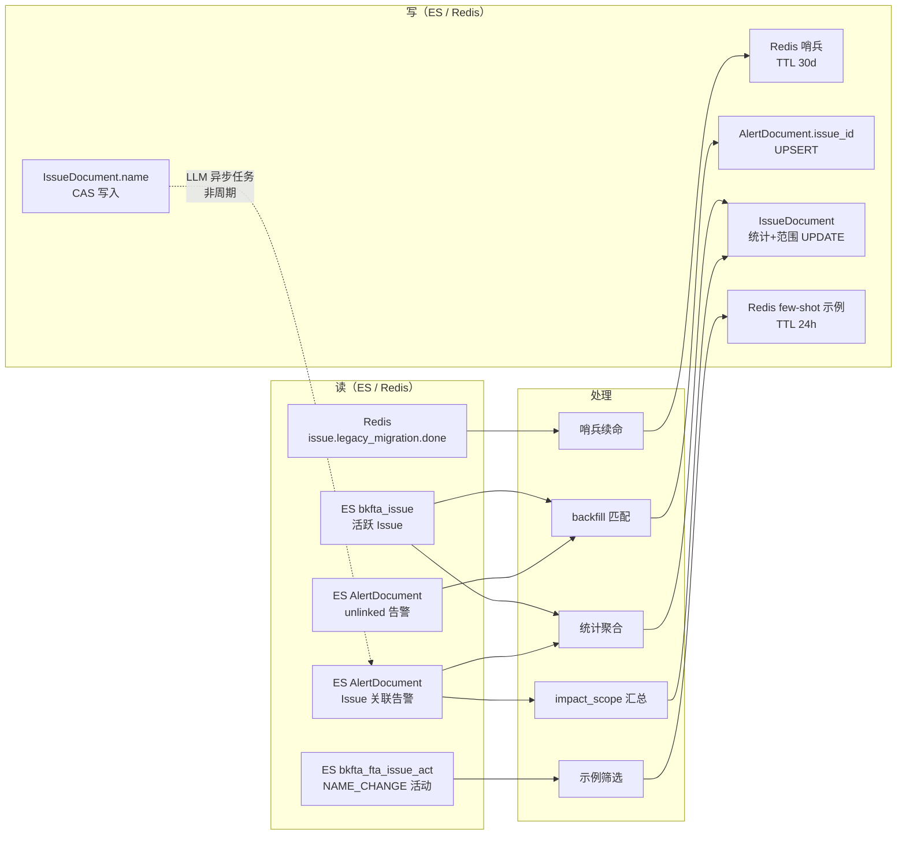
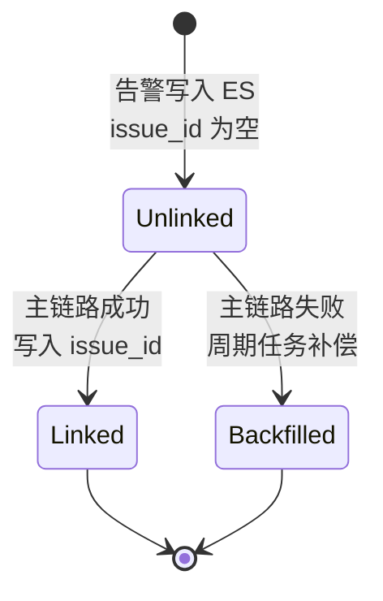

# 数据流分析

## 一、数据在模块内的生命周期

[专用] 本模块没有独立的数据存储，它的数据全部来自 ES 与 Redis，处理后写回 ES/Redis。核心是**两读两写**：

**图表来源**：`file:///root/bk-monitor/bkmonitor/alarm_backends/service/fta_action/tasks/issue_tasks.py#L47-L1531`

## 二、状态流转

[专用] 周期任务本身**不改变 Issue 的状态机**（`pending_review` / `unresolved` / `resolved` / `archived` 由状态机方法控制），只更新派生字段。但告警侧有一个隐含的状态变化：

**图表来源**：`file:///root/bk-monitor/bkmonitor/alarm_backends/service/fta_action/tasks/issue_tasks.py#L320-L384`

`Unlinked → Linked` 与 `Unlinked → Backfilled` 的**终态完全一致**（都是写入 `issue_id`），差别只在写入者是谁。这正是周期任务幂等性的来源——两条路径产出相同终态，重复执行无副作用。

## 三、派生字段的更新时序

| 字段 | 更新时机 | 数据源 | 一致性级别 |
|---|---|---|---|
| `alert_count` | 每 5 分钟 | ES `value_count` 聚合 | 最终一致，滞后 ≤5min |
| `last_alert_time` | 每 5 分钟 | ES `max(begin_time)` 聚合（毫秒转秒） | 最终一致 |
| `impact_scope` | 每 5 分钟 | 扫该 Issue 全部关联告警重算 | 最终一致 |
| `update_time` | 每 5 分钟 | `now` | — |
| `AlertDocument.issue_id` | 主链路实时 / 周期补偿 | — | 最终一致（补偿 ≤5min） |
| Redis few-shot 示例 | 每小时 | NAME_CHANGE 活动采样 | 缓存，TTL 24h |
| `IssueDocument.name` | 新建时异步 | LLM 生成 + CAS | 一次性，失败静默 |

## 四、异步流与队列

[专用] 三个任务分属两个队列，队列隔离是有意的：

| 任务 | 队列 | 触发方式 | 超时策略 |
|---|---|---|---|
| `sync_issue_alert_stats` | `celery_action_cron` | beat `*/5` | `expires=300s`（超时丢弃） |
| `refresh_issue_llm_title_examples` | `celery_action_cron` | beat `0 *` | `expires=3600s` |
| `generate_issue_llm_title` | `celery_llm_task` | 新建 Issue 时 `apply_async` | soft 60s / hard 90s |

**为什么 LLM 任务要独立队列**：它依赖外部 LLM 网关，延迟不可控且可能慢。若混进 `celery_action_cron`，慢任务会占满周期任务的消费者，导致 5 分钟一轮的统计任务排队积压。独立队列 + 硬超时是隔离手段。

**`expires` 的作用**：beat 派发的任务若超过 `expires` 未被消费就自动丢弃。对周期任务这是正确的取舍——**宁可跳过一轮，也不要堆积补跑**（补跑会让负载雪崩）。

## 五、数据一致性与丢失风险

| 风险点 | 是否会导致数据丢失 | 说明 |
|---|---|---|
| 周期任务单轮超时被丢弃 | 否 | 下轮全量重算，幂等 |
| 单条 Issue 处理抛异常 | 否 | try/except 隔离，仅该条本轮不更新 |
| backfill 超 7 天窗口 | **是（静默）** | 历史漏关联不补，需管理命令 |
| Redis 哨兵续命失败 | 否 | 仅性能退化（processor 走 fallback 查询） |
| few-shot 缓存写入失败 | 否 | 读路径退静态示例，仅影响标题质量 |
| LLM 标题生成失败 | 否 | 保留默认名，可显式补偿重跑 |
| 多集群重复执行 | 否 | 全部幂等，仅浪费算力 |

**唯一会真正"丢数据"的是 7 天窗口**——且是设计上的能力边界，不是缺陷。

## 六、一处值得注意的时序耦合

[专用] `_apply_llm_title` 的 CAS 检查（`issue.name != expected_name` → 返回 `name_changed`）依赖 ES 的近实时刷新。

代码注释（L1062-L1064）明确承认：这是 `search-read + write`，ES refresh 约 1s，存在极窄的误判窗口。语义定为 **best-effort**——误覆盖可由用户再次改名修正，且活动日志留痕可审计。

这是"体验增强型功能"的典型取舍：**用可接受的小概率误判，换取不需要分布式事务的实现复杂度**。

## 章节来源

- `file:///root/bk-monitor/bkmonitor/alarm_backends/service/fta_action/tasks/issue_tasks.py#L47-L111`（主循环）
- `file:///root/bk-monitor/bkmonitor/alarm_backends/service/fta_action/tasks/issue_tasks.py#L157-L229`（派生字段写入）
- `file:///root/bk-monitor/bkmonitor/alarm_backends/service/fta_action/tasks/issue_tasks.py#L320-L384`（backfill 状态变化）
- `file:///root/bk-monitor/bkmonitor/alarm_backends/service/fta_action/tasks/issue_tasks.py#L1055-L1082`（CAS 写入与时序说明）
- `file:///root/bk-monitor/bkmonitor/alarm_backends/service/scheduler/tasks/cron.py#L88-L110`（队列与 expires）
- `file:///root/bk-monitor/bkmonitor/alarm_backends/core/cache/key.py#L1248-L1260`（哨兵 TTL）
