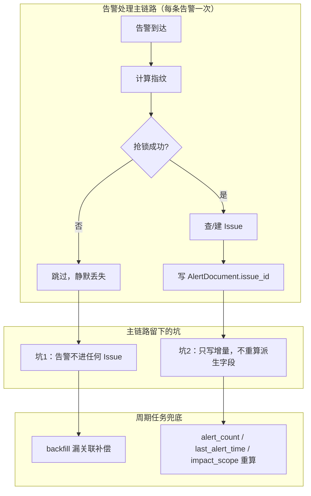
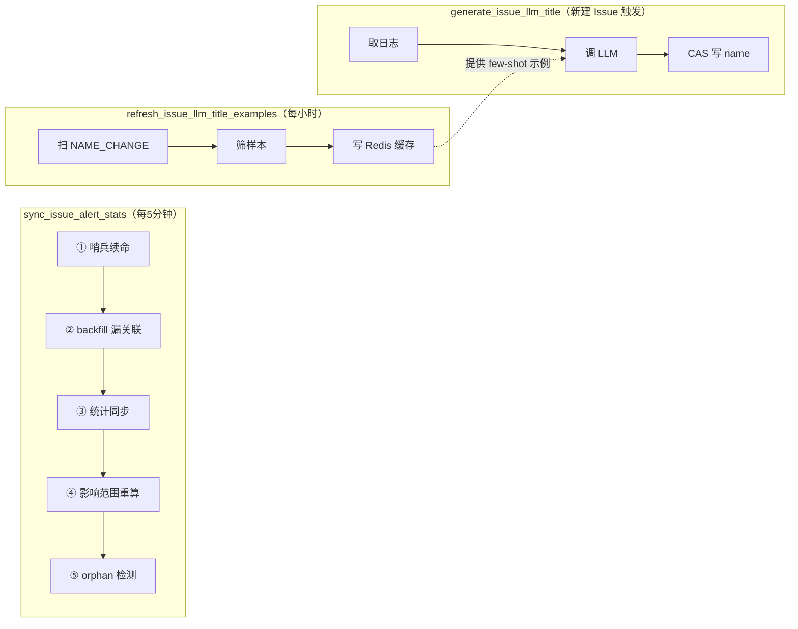
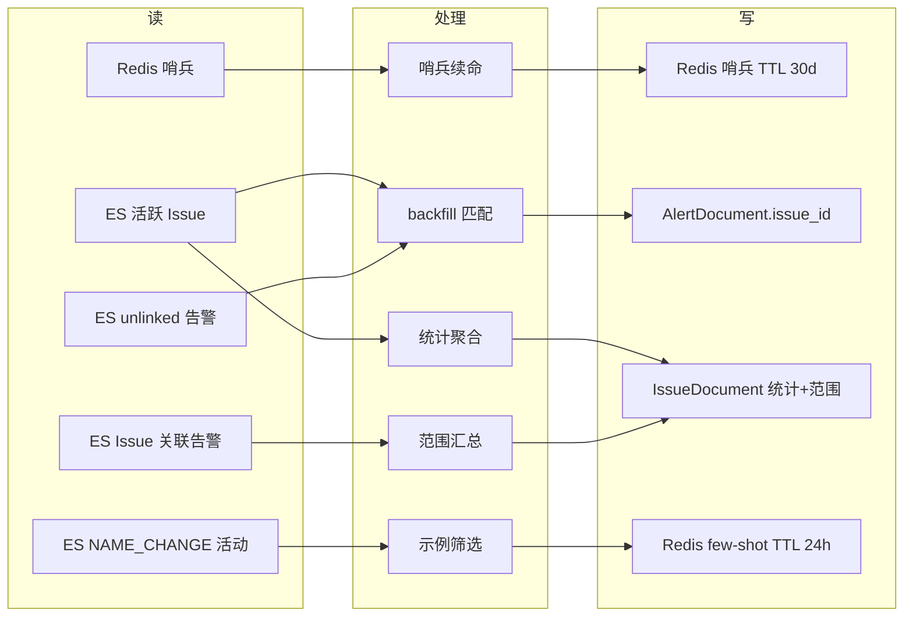

# issue 后台周期任务 · 完整讲解

> 讲解对象：`module` — `bkmonitor/alarm_backends/service/fta_action/tasks/issue_tasks.py` + 调度配置
> 范围：通用 + 专用 ｜ 学习目标：读懂 ｜ 模式：完整讲解（Phase 0→7）
> 档案目录：`.teach/issue-periodic-tasks/`

## 目录

- [一、处境：先纠正一个直觉](#一处境先纠正一个直觉)
- [二、为什么需要它们：主链路的两个结构性弱点](#二为什么需要它们主链路的两个结构性弱点)
- [三、任务全景](#三任务全景)
- [四、sync_issue_alert_stats 五项职责逐层拆解](#四sync_issue_alert_stats-五项职责逐层拆解)
- [五、另两个任务](#五另两个任务)
- [六、运行时行为推演](#六运行时行为推演)
- [七、数据流与一致性](#七数据流与一致性)
- [八、适用边界与已知局限](#八适用边界与已知局限)
- [九、可复用的工程手法](#九可复用的工程手法)

---

## 一、处境：先纠正一个直觉

后台"看起来很多"周期任务，实际 issue 域只有 **2 个 beat 周期任务 + 1 个异步任务**：

| 任务 | cron | 模式 | 队列 | 性质 |
|---|---|---|---|---|
| `sync_issue_alert_stats` | `*/5 * * * *` | cluster | `celery_action_cron` | 周期 |
| `refresh_issue_llm_title_examples` | `0 * * * *` | cluster | `celery_action_cron` | 周期 |
| `generate_issue_llm_title` | — | — | `celery_llm_task` | 异步一次性 |

"很多"的错觉来自 `sync_issue_alert_stats` 一个任务体内塞了 **5 项职责**——是"一个任务干五件事"，不是"五个任务"。

**章节来源**：`file:///root/bk-monitor/bkmonitor/config/role/worker.py#L236-L244`、`file:///root/bk-monitor/bkmonitor/alarm_backends/service/fta_action/tasks/__init__.py#L18-L22`

---

## 二、为什么需要它们：主链路的两个结构性弱点

[专用] Issue 聚合发生在告警处理主链路（`IssueAggregationProcessor.process()`），每条告警触发一次。这条链路有两条硬约束：**必须快**、**必须不阻塞**。由此产生两个弱点：



**图表来源**：`file:///root/bk-monitor/bkmonitor/alarm_backends/service/fta_action/issue_processor.py#L120-L162`、`file:///root/bk-monitor/bkmonitor/alarm_backends/service/fta_action/tasks/issue_tasks.py#L157-L229`

一句话定位：**周期任务是主链路"性能与不阻塞"取舍的代价支付者**。

---

## 三、任务全景



**图表来源**：`file:///root/bk-monitor/bkmonitor/alarm_backends/service/fta_action/tasks/issue_tasks.py#L48-L56`、`L1439-L1451`、`L1085-L1096`

---

## 四、`sync_issue_alert_stats` 五项职责逐层拆解

### ① Legacy 哨兵续命（`#L114-L155`）

**背景**：指纹改造把 Issue 模型从"一策略一活跃 Issue"升级为"按维度组合切分"。旧 Issue 没有指纹，由部署时的 `post_migrate` 触发 `migrate_legacy_active_issues()` 直接 RESOLVE 掉。哨兵是全局 Redis key `issue.legacy_migration.done`，TTL 30 天；processor 看到哨兵就跳过 legacy 全索引 fallback 查询。

**反直觉点：迁移函数不写哨兵。** 设置动作只有 `_mark_legacy_migration_done()`（`documents/issue.py#L1116-L1135`），唯一调用点就是本周期任务（`issue_tasks.py#L146`）——初始 set 和后续续命是同一段代码。原因是 role 隔离：`post_migrate` 跑在 web/saas role，其 settings 不含 `REDIS_*_CONF`，而 `core.cache.key` 模块加载时会解析 `REDIS_CELERY_CONF` 并抛 `AttributeError`，会让 migrate 命令非 0 退出。因此初始 set 由 worker 周期任务异步接管，代价是哨兵未 set 期间 processor 多走 fallback（最大窗口 = 1 个周期，仅性能无损正确性）。

**为什么要续命**：30 天内若没有新部署触发迁移，哨兵过期 → processor 退化到 fallback 查询 → 性能退化。

**三态逻辑**（保守设计，双重确认）：

| 状态 | 动作 |
|---|---|
| Redis `exists` 命中 | 直接 return（正常路径，几乎零开销） |
| 缺失 + ES 探查 legacy=0 | 重新 set 哨兵 |
| 缺失 + ES 探查 legacy>0 | 仅 warning，交下次部署的 migrate |

[通用] 体现的模式是 **fail-safe + 事后确认**：Redis 故障或 ES 探查失败都只是 return，下轮再试，绝不阻塞主流程。

### ② 漏关联补偿：O(N×M) → O(N+M)（`#L234-L384`）

[通用] 全文件最值得学的一段优化。

**旧实现的问题**：对每个活跃 Issue 单独扫一遍同策略 unlinked 告警。高基数策略下 N 个 Issue 就要扫 N 遍，同一条告警被反算指纹 N 次。

**新实现**按策略批处理：

```
Step 0: 取 live issue_config → 得到 live 维度组（优先匹配）
Step 1: 一次 scan 该策略全部活跃 Issue
        → 按 (维度元组 → {fingerprint: (issue_id, create_time)}) 分组
        → 记录 earliest_create_time
Step 2: 一次 scan 该策略 unlinked 告警
        下界 = max(earliest_create_time, now - 7天)
Step 3: 内存反算指纹并分发命中
```

**三个关键设计点**：

1. **为什么分组**：配置变更窗口期内，同策略不同 Issue 可能带着不同的维度快照。分组才能让告警跟"用同样维度算出的指纹"比对。
2. **匹配排序为什么是 live 优先 + 维度数降序**：

   ```python
   return (is_live, -len(agg_tuple))
   ```

   catch-all 组（空维度）**任何告警都能命中**。若让它排第一，本该归具体 Issue 的告警会被错绑。降序保证"具体的先匹配，兜底的后匹配"。

   [专用] 隐藏陷阱：`live_agg_dims_tuple` 在配置缺失时必须保持 `None` 而非 `()`——否则空元组被当成"live=catch-all"，让 catch-all 永远优先。
3. **时间边界**：命中后校验 `alert.begin_time >= issue.create_time`，不满足则 `matched=True` + `break`（视为已命中，不回退到更通用组，防错绑）。语义是"告警必须晚于 Issue 出生"。

### ③④ 统计同步与影响范围重算

[专用] 统计走 ES 单次聚合拿两个值（L180-L191）。注意**毫秒转秒**：`int(raw_max / 1000)`——ES 日期聚合返回毫秒，IssueDocument 用秒。

[专用] `_build_impact_scope`（L456-L767，约 310 行）按 target_type 分流汇总受影响资源：

| 场景 | 输出维度 |
|---|---|
| HOST / SERVICE | `set` / `host` / `service_instances` |
| `K8S-*` | `cluster` / `node` / `service` / `pod` |
| `APM-SERVICE` | `apm_app` / `apm_service` |

三个工程细节：Set 展示名**攒批后按业务 mget**（避免 N+1）、每个维度实例列表截 `[:50]` 但 `count` 是真实总数、**按聚合维度收窄**。

[专用] 收窄函数的返回值有**三态语义**，这是最容易看错的地方：

| 返回值 | 含义 |
|---|---|
| `None` | 维度为空 → **不收窄**，全量输出 |
| `set()` | 维度非空但无资源映射 → **收窄为空**（输出 `{}`） |
| `{...}` | 只允许这些 key |

`None` 与 `set()` 语义相反，代码注释专门强调。

### ⑤ orphan 检测

[专用] `alert_count == 0` 且存活 > 300s → 打 `logger.error`。**只报不修**。

5 分钟阈值的原因：Issue 创建与告警写 `issue_id` 有时间差，刚创建的 Issue 短暂无告警正常，300s 是"足够长到不正常"的经验值。

### 两个 scan 工具

[通用] `_iter_issue_hits_with_total`（L818-L844）与 `_iter_alert_hit_batches`（L847-L864）都用 **`search_after` 深分页**——规避 `from/size` 深分页的性能塌陷（协调节点需堆上累积排序 `from+size` 条，超过 `max_result_window` 直接报错）。

差异仅一处：前者从首批响应的 `hits.total.value` 取总数，省一次 count 请求。

---

## 五、另两个任务

### `refresh_issue_llm_title_examples`（每小时）

[专用] 首行就是**零副作用闸门**：白名单为空直接 return——功能没开时对 ES/Redis 完全无影响。

四步：扫近 30 天 `NAME_CHANGE` 活动（排除 `operator=system`，只要人类改名，单轮上限 2000 条）→ 反查 Issue 确认改名未被改回 → `_collect_example_groups` 筛选并按 strategy/biz 去重聚合 → 写 Redis（TTL 24h）。

失败模式设计得很干净：**任务挂掉 → 缓存 24h 自然过期 → 读路径退静态示例**。缓存是纯加速不是数据源，故失败无害。

### `generate_issue_llm_title`（异步一次性）

[专用] 由 `IssueAggregationProcessor._maybe_dispatch_llm_title` 在新建 Issue 后 `apply_async` 派发，**不是周期任务**。派发有两级闸门：部署级 env `ENABLE_ISSUE_LLM_TITLE` + 业务白名单。

[通用] 任务声明带软硬双超时（L1084）：

```python
@app.task(ignore_result=True, queue="celery_llm_task", soft_time_limit=60, time_limit=90)
```

必须硬超时的原因（docstring 明写）：取关联日志的下游实现有 `except BaseException` 重试，可能吞掉 soft_time_limit 信号。

核心逻辑抽在 `_apply_llm_title`（L899-L1082），与运维补偿路径 `regenerate_issue_llm_title` **共用同一函数**，保证口径一致。

三处细节体现"标题是体验增强非关键数据"的定位：

1. **`enforce_unique=False`** — 同类错误天然生成相同标题，允许重名，不被用户改名的唯一性约束卡回默认名。
2. **rename operator 恒为 `system`** — 真实运维账号只写进 `content` 供审计。因为"标题来源判别"依赖"最近 NAME_CHANGE.operator == system → 是 LLM 改的、可覆盖"，写真实账号会导致二次补偿误判成用户手工改名而跳过。
3. **只对 `alert_not_found` 定向重试**（1s、3s）——新建 Issue 时告警刚写入 ES，可能因近实时刷新延迟查不到，是可恢复竞态。其他失败一律静默保留默认名。

---

## 六、运行时行为推演

### 一条告警被漏关联后的补回路径

1. 下个周期（≤5 分钟）扫到该策略某活跃 Issue → 该策略本轮未 backfill → 进入补偿流程。
2. 扫该策略全部活跃 Issue 建指纹映射 → 扫 unlinked 告警 → 反算指纹命中 → 校验时间边界 → UPSERT 写 `issue_id`。

**端到端延迟最坏约 5 分钟**，是最终一致而非实时。

### 边界与风险

| 场景 | 行为 |
|---|---|
| **高基数策略** | backfill 已优化为 O(N+M×G)；但 `_build_impact_scope` 仍逐 Issue 执行，随 N 线性增长 |
| **单轮超时** | `expires=300s`，超时任务被**静默丢弃**——宁可跳过一轮也不堆积补跑 |
| **超 7 天的漏关联** | 周期任务不补（设计边界）；历史修复用管理命令 `backfill_issue_fingerprint` |
| **catch-all 与具体 Issue 并存** | live 组优先；live 查询失败退化为维度数降序，具体组仍优先，降级安全 |
| **多集群重复执行** | 全部幂等，不出错，但算力与 CMDB 回源压力按集群数放大 |

### 性能与复杂度

| 环节 | 复杂度 | 备注 |
|---|---|---|
| Issue 扫描 | O(N/500) 页 | `search_after` |
| backfill | O(N + M×G) | G 通常为 1 |
| 统计聚合 | **O(N) 次 ES 请求** | 逐 Issue 各一次，未攒批 |
| impact_scope | O(N×K̄) | 逐 Issue 扫其关联告警 |
| 写入 | **O(N) 次 bulk** | 逐条 `bulk_create`，未攒批 |

**主要瓶颈**：逐 Issue 的 ES 请求与逐条写入。可优化方向（供参考，非改动建议）：统计用 `terms` 聚合一次性算全部 Issue；写入攒批。但两者都增加复杂度，**优化前应先实测单轮耗时与活跃 Issue 规模**。

### 设计意图推断

[推断] 从"统计覆盖写、backfill 只补空、impact_scope 全量重算"三点一致的取向，推断核心意图是**让周期任务幂等且无状态**——不记录"上次处理到哪"，每轮全量重算，失败/跳过/重复都不积累错误状态。依据：三项写入语义全部幂等，注释反复强调"fail-safe 不阻塞主流程"、"下个周期再试"。

---

## 七、数据流与一致性



**图表来源**：`file:///root/bk-monitor/bkmonitor/alarm_backends/service/fta_action/tasks/issue_tasks.py#L47-L1531`

告警侧有唯一的状态变化——`Unlinked → Linked`（主链路）与 `Unlinked → Backfilled`（周期补偿）**终态完全一致**，这正是幂等性的来源。

### 一致性风险汇总

| 风险点 | 是否丢数据 |
|---|---|
| 单轮超时被丢弃 | 否（下轮重算） |
| 单条 Issue 抛异常 | 否（try/except 隔离） |
| **backfill 超 7 天窗口** | **是（静默）** |
| 哨兵续命失败 | 否（仅性能退化） |
| few-shot 写入失败 | 否（退静态示例） |
| LLM 生成失败 | 否（保留默认名，可补偿） |
| 多集群重复执行 | 否（幂等） |

**唯一真正"丢数据"的是 7 天窗口**，且是设计上的能力边界而非缺陷。

---

## 八、适用边界与已知局限

**适用**：主链路瞬时失败后的自愈、派生字段最终一致、配置变更后范围重算、LLM 示例预热。

**不适用**：秒级实时性要求、6 个月前历史漏关联、orphan 自动清理、精确一次性副作用、LLM 标题强制重生成。

| # | 技术债 | 位置 |
|---|---|---|
| 1 | 逐 Issue 发 ES 聚合 + 逐条 bulk_create，规模上万时可能丢轮次 | `issue_tasks.py#L180-L191`、`L217` |
| 2 | backfill 7 天窗口的历史盲区，注释称的"主路径兜底"实际不存在 | `issue_tasks.py#L231`、`L320` |
| 3 | orphan 只报不修 | `issue_tasks.py#L198-L211` |
| 4 | 多集群重复执行的算力放大 | `worker.py#L241`、`L243` |
| 5 | `_build_impact_scope` 单函数约 310 行，混合四种职责 | `issue_tasks.py#L456-L767` |

> 以上为描述性记录，非质量裁决。判断"该不该修"请用 `code-review` 或 `artifact-optimizer`。

---

## 九、可复用的工程手法

| 手法 | 位置 | 要点 |
|---|---|---|
| 单条失败隔离 | L96-L103 | 周期任务逐条 try/except，不因一条脏数据中断整轮 |
| 按维度去重的批处理优化 | L73 + L168-L174 | 把 O(N×M) 降为 O(N+M)，`finally` 保证失败也不重试 |
| 算法同源 | L330 | 补偿路径复用主链路 `gen_issue_fingerprint`，保证口径一致 |
| 具体优先于兜底 | L309-L313 | 匹配排序 live 优先 + 维度数降序，防 catch-all 错绑 |
| `search_after` 深分页 | L818-L864 | 规避 `from/size` 性能塌陷 |
| 攒批查外部系统 | L620-L641 | `pending_set_names` 攒批后 mget，避免 N+1 |
| CAS 写入 | L1062-L1065 | 防覆盖并发修改 |
| 零副作用闸门 | L1447-L1451 | 功能未开则直接 return |
| 失败无害缓存 | L1500-L1531 | TTL 24h，过期自动退静态 |
| 软硬双超时 | L1084 | 下游可能吞掉软限信号，必须硬兜底 |
| 幂等无状态周期任务 | 全局 | 不记录进度，每轮全量重算，用算力换正确性 |

---

## 汇总完整性检查

- [x] Phase 1 大纲（2 个周期任务 + 1 异步任务的纠正、处境、能力清单、抽象、调度）已纳入
- [x] Phase 2 代码 wiki（术语表、五项职责逐层、另两任务、模式汇总、依赖）已提炼
- [x] Phase 3 正确性核对（27 已确认 / 3 细化 / 0 存疑）结论已体现，修正已级联
- [x] Phase 4 功能推演（执行路径、边界异常、性能复杂度、意图推断）已纳入
- [x] Phase 5 应用场景（适用/不适用、技术债、扩展点）已纳入
- [x] Phase 6 数据流（两读两写、状态流转、一致性风险、时序耦合）已纳入
- [x] 各阶段 `[通用]` / `[专用]` 标注在汇总后保留
- [x] Mermaid 图均配 `图表来源`
- [x] 分批讲解：不适用（单文件模块，未拆分）

## 收尾评审记录

### 第 1 轮 · 教学法视角

| 维度 | 意见 |
|---|---|
| 结构递进 | 通过。处境 → 为什么 → 全景 → 逐层拆解 → 推演 → 一致性 → 边界 → 手法，符合五幕叙事 |
| 结论可溯源 | 通过。每节带 `章节来源`，Mermaid 图均配 `图表来源` |
| 有无编造 | 通过。性能瓶颈、7 天盲区、只报不修均有代码证据；设计意图明确标 `[推断]` 并给依据 |
| 通用/专用标注 | 通过。共 20+ 处标注，通用知识（search_after / CAS / 深分页）与专用（指纹 / catch-all / legacy）分明 |
| 认知阶梯 | 通过。先讲"为什么存在"再讲"怎么工作"，未倒序 |
| 图表选型 | 通过。4 张 Mermaid 均为流程/状态图，复杂度不高，无需 SVG |

**P0 = 0。**

### 第 2 轮 · 新人视角

| 维度 | 意见 |
|---|---|
| 术语铺垫 | 通过。第四节 ② 开头有术语回指，catch-all / unlinked / fingerprint 均有解释 |
| 能否读懂 | 通过。五幕结构让"这堆任务在干嘛"的答案在第一节就给出 |
| 卡住位置 | 无。第三、四节的层级展开有明确先后顺序 |
| 能否说清系统位置 | 通过。第二节"代价支付者"定位 + 第八节适用边界共同回答 |
| 是否只讲好不讲坏 | 通过。第八节列 5 项技术债并声明"描述性记录非质量裁决" |

**P0 = 0。**

---

## 🚀 下一步

> 复制下面这段文字发给 AI，即可继续（无需重新描述上下文）：

```
我刚看完 issue-periodic-tasks 的讲解材料，档案在 .teach/issue-periodic-tasks/。
请就 {具体方向：backfill 的匹配算法 / impact_scope 构造 / LLM 标题链路 / 性能瓶颈优化} 再深入讲一层。
```
