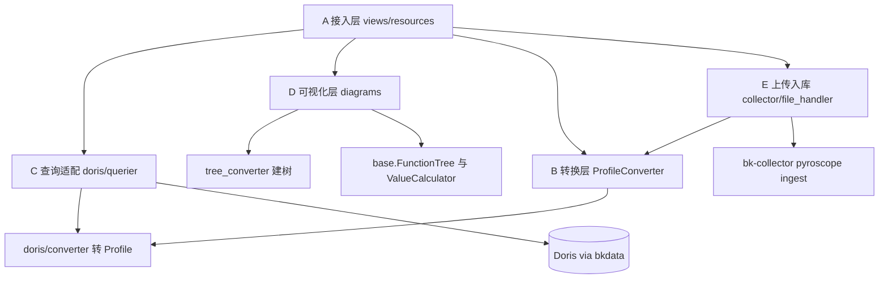

# 能力大纲：APM Profiling 实现

**本文引用的文件**
- [模块入口 urls](file://bkmonitor/packages/apm_web/profile/urls.py)
- [URL 挂载 apm_web/urls](file://bkmonitor/packages/apm_web/urls.py)
- [视图层 views](file://bkmonitor/packages/apm_web/profile/views.py)
- [资源层 resources](file://bkmonitor/packages/apm_web/profile/resources.py)
- [序列化 serializers](file://bkmonitor/packages/apm_web/profile/serializers.py)
- [常量 constants](file://bkmonitor/packages/apm_web/profile/constants.py)
- [pprof 数据模型 models](file://bkmonitor/packages/apm_web/profile/models.py)
- [转换器基类 profileconverter](file://bkmonitor/packages/apm_web/profile/profileconverter.py)
- [pprof 解析器](file://bkmonitor/packages/apm_web/profile/pprof/converter.py)
- [perf_script 解析器](file://bkmonitor/packages/apm_web/profile/perf/converter.py)
- [Doris 转换器 doris/converter](file://bkmonitor/packages/apm_web/profile/doris/converter.py)
- [Doris 查询器 querier](file://bkmonitor/packages/apm_web/profile/doris/querier.py)
- [图表注册表 diagrams/__init__](file://bkmonitor/packages/apm_web/profile/diagrams/__init__.py)
- [树节点与聚合 base](file://bkmonitor/packages/apm_web/profile/diagrams/base.py)
- [建树器 tree_converter](file://bkmonitor/packages/apm_web/profile/diagrams/tree_converter.py)
- [eBPF 转换器](file://bkmonitor/packages/apm_web/profile/diagrams/ebpf_converter.py)
- [回灌采集器 collector](file://bkmonitor/packages/apm_web/profile/collector.py)
- [文件处理 file_handler](file://bkmonitor/packages/apm_web/profile/file_handler.py)
- [上传记录模型 models/profile](file://bkmonitor/packages/apm_web/models/profile.py)
- [解析器注册 apps](file://bkmonitor/packages/apm_web/apps.py)
- [异步任务 tasks](file://bkmonitor/packages/apm_web/tasks.py)

## 范围确认
- 目标模块：`bkmonitor/packages/apm_web/profile/`（含 `apm_web/models/profile.py`、`apm_web/apps.py`、`apm_web/tasks.py#profile_file_upload_and_parse` 等外围协作点）
- 知识范围：两者都含（默认）—`[通用]` 为 pprof/剖析通用知识，`[专用]` 为本平台特有设计与约定
- 学习目标：读懂（默认）
- 讲解对象类型：`module`

## 目录
1. [职责边界](#职责边界)
2. [公开能力清单](#公开能力清单)
3. [关键抽象](#关键抽象)
4. [子模块划分](#子模块划分)

## 职责边界

**做什么** `[专用]`：本模块是蓝鲸 APM「性能分析（Profiling）」功能的 Web 侧实现，负责**把"已经采集上来的剖析数据"变成"页面上能看的火焰图 / 调用图 / 表格 / 趋势图"**，并提供文件上传与导出能力。它挂在 `apm_web/urls.py` 的 `profile_api/` 前缀下。

具体四件事：
1. **查**：从 Doris（经 bkdata 统一查询接口）拉回 sample 原始数据，转成前端要的图形结构；
2. **画**：把调用栈树渲染成火焰图、调用图（DOT）、表格、趋势图，并支持两份 profile 对比（diff）；
3. **传**：接收用户手工上传的 pprof / perf_script 文件，解析后回灌到内置数据源（走 bk-collector 的 pyroscope ingest 端点）；
4. **导**：把查询结果按 pprof 二进制格式导出，供本地 `go tool pprof` 等工具二次分析。

> ⚠️ **接手第一件事：本模块有两条并行数据管线**（[专用]，易混淆，见下文关键抽象）：
> - **Tree 管线（页面主链路）**：`query/samples` 固定用 `ConverterType.Tree`（`views.py#L430`、`views.py#L548`），由 `TreeConverter` 把 Doris 原始行**直接**建成 `FunctionTree` 再出图，**不经过 pprof**；
> - **Profile 管线（上传 / 导出）**：文件上传解析（`file_handler.py#L64`）与导出（`views.py#L818`）才把数据转成 pprof 的 `Profile` 对象。
>
> 因此 `Profile` 只是 Profile 管线与导出功能的中间格式，**不是页面主链路的中间格式**——按"全模块统一中间格式"去找页面调用链会扑空。

**不做什么** `[专用]`：
- 不负责**采集**（应用侧探针由 Pyroscope SDK / OpenTelemetry 承担——外部系统，非本模块代码；eBPF 场景由 DeepFlow 提供数据，见 `resources.py#L221-L224`）；
- 不负责**数据清洗入库**（由 bk-collector + BkData 清洗链路完成，本模块只调 `api.bkdata.query_profile_data` 查询）；
- 不做采样控制、不生成告警（无告警逻辑与定时任务写入，唯一的异步任务是上传文件解析）。
- ⚠️ **文档组织方式说明**：本模块共 **29 个 `.py` 文件**，目录层级 ≥ 3 且子目录间互相引用（`diagrams/` 内部依赖 `base.py`+`diff.py`；`views` 依赖 `doris/`+`diagrams/`；`pprof/`、`perf/` 经注册表由 `file_handler` 间接使用）。为避免产出 5×N 份碎片档案，本轮**按子模块组织章节、统一产出在 `.teach/profile/`**，不生成独立 `sub-modules/` 目录；如需对某个子模块单独深入，见末尾接力提示词。

章节来源：[apm_web/urls.py](file://bkmonitor/packages/apm_web/urls.py#L21-L21)、[urls.py](file://bkmonitor/packages/apm_web/profile/urls.py#L17-L27)、[views.py](file://bkmonitor/packages/apm_web/profile/views.py#L112-L880)、[file_handler.py](file://bkmonitor/packages/apm_web/profile/file_handler.py#L37-L103)、[collector.py](file://bkmonitor/packages/apm_web/profile/collector.py#L57-L133)

## 公开能力清单

> 本节出现的术语（建树、`diagram_types`、`Profile` 对象、Doris）统一在下一节 [关键抽象](#关键抽象) 定义。

所有能力挂在前缀 `/profile_api/` 下（`apm_web/urls.py#L21`），分两类路由：`SimpleRouter` 注册 ViewSet、`ResourceRouter` 注册 Resource（`profile/urls.py#L17-L27`）。

| 能力 | 入口 | 方法 | 一句话职责 | 范围 |
|---|---|---|---|---|
| 上传 profiling 文件 | `upload/upload` | POST | 文件落 bkrepo、建上传记录、触发异步解析入库 | [专用] |
| 查询上传记录 | `upload/records` | GET | 按业务/应用/服务名列出上传记录（过滤过期） | [专用] |
| 查询 samples | `query/samples` | POST/GET | **核心接口**：拉 Doris 数据 → 建树 → 按 `diagram_types` 出图，支持对比模式 | [专用] |
| 查询 label keys | `query/labels` | GET | 取时间窗内出现的标签键集合 | [专用] |
| 查询 label values | `query/label_values` | GET | 取指定标签键的取值（分页） | [专用] |
| 导出 pprof | `query/export` | GET | 查询结果 → `Profile` 对象 → gzip 二进制下载 | [专用] |
| 应用服务列表 | `query/services` | GET | 列出本业务下有 profile 服务的应用（可选附带 eBPF 来源） | [专用] |
| 服务柱状图 | `query/services_trace_bar` | POST | 按分钟粒度统计数据量，并取每个时间点前 10 条 span_id | [专用] |
| 服务详情 | `query/services_detail` | GET | 服务创建/最近上报时间、可用 `data_types` 与默认聚合方法 | [专用] |

章节来源：[urls.py](file://bkmonitor/packages/apm_web/profile/urls.py#L17-L27)、[views.py](file://bkmonitor/packages/apm_web/profile/views.py#L112-L880)

另有 Grafana 侧资源类（`GrafanaQueryProfileResource` 等，`resources.py#L332-L433`）不注册在 HTTP 路由上，供 Grafana 数据源插件调用 `[专用]`。

## 关键抽象

| 抽象 | 角色 | 位置 | 范围 |
|---|---|---|---|
| `Profile` / `Sample` / `Location` / `Function` | pprof 协议的数据模型（protobuf 生成）：Profile 管线与导出功能的中间格式 | [models.py](file://bkmonitor/packages/apm_web/profile/models.py#L21-L196) | [通用] |
| `ProfileConverter` | 解析器基类：任意输入 → `Profile`；提供 string table、三类去重映射（location/mapping/function） | [profileconverter.py](file://bkmonitor/packages/apm_web/profile/profileconverter.py#L23-L94) | [专用] |
| `PprofProfileConverter` | pprof 二进制（自动尝试 gzip 解压）→ `Profile`，并注入 `profile_id` / `service_name` 标签 | [pprof/converter.py](file://bkmonitor/packages/apm_web/profile/pprof/converter.py#L19-L52) | [专用] |
| `PerfScriptProfileConverter` | perf_script 文本 → `Profile`；按空行切分 sample，逐行解析地址/函数名/文件 | [perf/converter.py](file://bkmonitor/packages/apm_web/profile/perf/converter.py#L27-L158) | [专用] |
| `DorisProfileConverter` | Doris 查询结果 → `Profile`；支持 SUM/AVG/LAST 三种聚合（导出链路使用） | [doris/converter.py](file://bkmonitor/packages/apm_web/profile/doris/converter.py#L29-L235) | [专用] |
| `FunctionTree` / `FunctionNode` | 火焰图/调用图共用的**调用栈树**结构，节点带 `value`（总耗时）与 `self_value`（自身耗时） | [diagrams/base.py](file://bkmonitor/packages/apm_web/profile/diagrams/base.py#L29-L133) | [专用] |
| `ValueCalculator` | 节点值计算策略（AVG/SUM/LAST），决定"多个采样点怎么合成一个节点值" | [diagrams/base.py](file://bkmonitor/packages/apm_web/profile/diagrams/base.py#L135-L199) | [专用] |
| `TreeConverter` | **绕开 pprof** 把 Doris 原始行直接建成 `FunctionTree`（同时建树 + 建图两种结构）——页面主链路 | [tree_converter.py](file://bkmonitor/packages/apm_web/profile/diagrams/tree_converter.py#L23-L161) | [专用] |
| `EbpfConverter` | `TreeConverter` 子类：DeepFlow 返回的**平铺节点列表**（带 parent_node_id）→ `FunctionTree`，值由服务端预先算好 | [ebpf_converter.py](file://bkmonitor/packages/apm_web/profile/diagrams/ebpf_converter.py#L20-L113) | [专用] |
| `Diagrammer` 协议 + 注册表 | 「一种图 = 一个 Diagrammer」，`draw()` 出图、`diff()` 对比；6 种实现按名注册 | [diagrams/__init__.py](file://bkmonitor/packages/apm_web/profile/diagrams/__init__.py#L24-L62) | [专用] |
| `Query` / `APIParams` / `APIType` | 把查询意图拼成 JSON SQL 载体，走 `api.bkdata.query_profile_data` 查 Doris；空结果可重试一次 | [doris/querier.py](file://bkmonitor/packages/apm_web/profile/doris/querier.py#L27-L140) | [专用] |
| `QueryTemplate` | 面向"服务维度"的取数封装：最近上报时间、数据量统计、label 拉取（供 `resources.py` 三个 Resource 使用） | [doris/querier.py](file://bkmonitor/packages/apm_web/profile/doris/querier.py#L143-L347) | [专用] |
| `ProfileUploadRecord` / `UploadedFileStatus` | 上传文件的状态机载体（已上传→已解析→已存储 / 各失败态） | [models/profile.py](file://bkmonitor/packages/apm_web/models/profile.py#L13-L57) | [专用] |
| `CollectorHandler` | 把解析出的 `Profile` 以 pyroscope agent 姿态回灌进 bk-collector | [collector.py](file://bkmonitor/packages/apm_web/profile/collector.py#L53-L133) | [专用] |

**全局注册表机制** `[通用]`：本模块用「模块导入即注册」的注册表模式（类似 Django signal / 插件注册表），在 `apps.py` 的 `ready()` 里把三个解析器注册进 `_profile_converters`，图表同理在 `diagrams/__init__.py` 里 `register_diagrammer_cls`。新增一种格式/图表只需新增文件 + 一行注册，无需改动调用方。
章节来源：[apps.py](file://bkmonitor/packages/apm_web/apps.py#L19-L29)、[diagrams/__init__.py](file://bkmonitor/packages/apm_web/profile/diagrams/__init__.py#L45-L62)

## 子模块划分

| 子模块 | 主要文件 | 一句话职责 | 范围 |
|---|---|---|---|
| **A 接入层** | `urls.py` `views.py` `resources.py` `serializers.py` `constants.py` | 暴露 HTTP/Resource 接口、参数校验与鉴权、编排查询与出图流程 | [专用] |
| **B 转换层** | `profileconverter.py` `models.py` `patch.py` `pprof/` `perf/` `doris/converter.py` | 各类输入（文件 / Doris 行）↔ pprof `Profile` 中间格式互转 | [专用] |
| **C 查询与存储适配** | `doris/querier.py` | `Query` 建模 + 拼 JSON SQL + 空结果重试；`QueryTemplate` 面向服务维度取数（最近上报时间 / 数据量 / label） | [专用] |
| **D 可视化层** | `diagrams/`（base / tree_converter / flamegraph / callgraph / table / tendency / diff / dotgraph / grafana_flame / ebpf_converter） | 调用栈树构建、节点值聚合计算、六种图形渲染与两份 profile 对比 | [专用] |
| **E 上传入库链路** | `collector.py` `file_handler.py` + `apm_web/tasks.py` | 文件落对象存储、异步解析、回灌内置数据源、状态回写 | [专用] |

章节来源：[profile/](file://bkmonitor/packages/apm_web/profile/models.py#L1-L196)、[diagrams/](file://bkmonitor/packages/apm_web/profile/diagrams/__init__.py#L15-L21)、[tasks.py](file://bkmonitor/packages/apm_web/tasks.py#L199-L215)

**子模块间依赖关系**：



> 说明：`A` 不直连 Doris，取数一律经 `C`（`api.bkdata.query_profile_data` 仅出现在 `doris/querier.py#L135`）；`pprof/`、`perf/` 由 `E` 经注册表间接使用。

图表来源：[views.py](file://bkmonitor/packages/apm_web/profile/views.py#L42-L63)、[file_handler.py](file://bkmonitor/packages/apm_web/profile/file_handler.py#L19-L21)、[doris/querier.py](file://bkmonitor/packages/apm_web/profile/doris/querier.py#L122-L140)

## 🚀 下一步

> 复制下面这段文字发给 AI，即可继续（无需重新描述上下文）：

```
我刚看完 profile 模块的讲解材料，档案在 .teach/profile/。
请就 {具体方向：A 接入层鉴权与参数校验 / B 转换层与注册表 / C 查询拼装与重试 / D 可视化层建树与聚合 / E 上传入库链路} 再深入讲一层。
```
