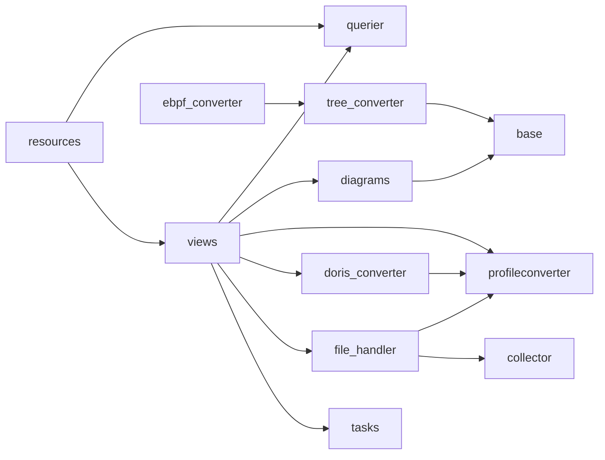

# 代码 Wiki：APM Profiling 实现

**本文引用的文件**
- [views](file://bkmonitor/packages/apm_web/profile/views.py)
- [resources](file://bkmonitor/packages/apm_web/profile/resources.py)
- [serializers](file://bkmonitor/packages/apm_web/profile/serializers.py)
- [constants](file://bkmonitor/packages/apm_web/profile/constants.py)
- [profileconverter](file://bkmonitor/packages/apm_web/profile/profileconverter.py)
- [models](file://bkmonitor/packages/apm_web/profile/models.py)
- [patch](file://bkmonitor/packages/apm_web/profile/patch.py)
- [pprof/converter](file://bkmonitor/packages/apm_web/profile/pprof/converter.py)
- [perf/converter](file://bkmonitor/packages/apm_web/profile/perf/converter.py)
- [doris/querier](file://bkmonitor/packages/apm_web/profile/doris/querier.py)
- [doris/converter](file://bkmonitor/packages/apm_web/profile/doris/converter.py)
- [diagrams/base](file://bkmonitor/packages/apm_web/profile/diagrams/base.py)
- [diagrams/tree_converter](file://bkmonitor/packages/apm_web/profile/diagrams/tree_converter.py)
- [diagrams/flamegraph](file://bkmonitor/packages/apm_web/profile/diagrams/flamegraph.py)
- [diagrams/callgraph](file://bkmonitor/packages/apm_web/profile/diagrams/callgraph.py)
- [diagrams/table](file://bkmonitor/packages/apm_web/profile/diagrams/table.py)
- [diagrams/tendency](file://bkmonitor/packages/apm_web/profile/diagrams/tendency.py)
- [diagrams/diff](file://bkmonitor/packages/apm_web/profile/diagrams/diff.py)
- [diagrams/__init__](file://bkmonitor/packages/apm_web/profile/diagrams/__init__.py)
- [diagrams/ebpf_converter](file://bkmonitor/packages/apm_web/profile/diagrams/ebpf_converter.py)
- [collector](file://bkmonitor/packages/apm_web/profile/collector.py)
- [file_handler](file://bkmonitor/packages/apm_web/profile/file_handler.py)
- [models/profile](file://bkmonitor/packages/apm_web/models/profile.py)
- [tasks](file://bkmonitor/packages/apm_web/tasks.py)
- [config/default](file://bkmonitor/config/default.py)
- [apm_web/urls](file://bkmonitor/packages/apm_web/urls.py)
- [profile/urls](file://bkmonitor/packages/apm_web/profile/urls.py)
- [apps](file://bkmonitor/packages/apm_web/apps.py)

## 目录
1. [先读这段：5 分钟入门](#先读这段5-分钟入门)
2. [模块在系统中的位置](#模块在系统中的位置)
3. [项目结构](#项目结构)
4. [关键类与函数](#关键类与函数)
5. [依赖关系](#依赖关系)
6. [设计模式与不变量](#设计模式与不变量)

## 先读这段：5 分钟入门

> 本节为 `[通用]` 知识，用来填平"没接触过 Profiling"的门槛。熟悉 pprof 的读者可跳过。

**什么是 Profiling**：程序运行时，探针每隔一小段时间（如 10ms）"抓"一次当前正在执行的函数调用栈，记为一个 **sample**（采样点）：一条调用栈 + 一个数值（这次采样消耗的 CPU 纳秒数 / 分配的字节数 / 计数）。累积成千上万个 sample 后，把相同调用路径的 sample 值累加，就得到"哪个函数最耗资源"——这就是剖析（Profiling）。

**什么是 pprof**：Go 生态的剖析数据格式（同时 `go tool pprof` 也是分析工具名）。它是一套 protobuf 定义，为了压缩体积用了 **string table**：所有字符串只存一份，其它字段存它在表中的**下标**（整数）。参考 [google/pprof · profile.proto](https://github.com/google/pprof/blob/main/proto/profile.proto)（核查于 2026-09）。

一个 `Profile` 的核心字段（对应本项目 [models.py#L21-L65](file://bkmonitor/packages/apm_web/profile/models.py#L21-L65)）：

| 字段 | 人话 |
|---|---|
| `sample_type` | 这批数值"是什么量 + 什么单位"，如 `cpu/nanoseconds`、`inuse_space/bytes` |
| `sample` | 采样点列表；每个含 `location_id` 链（调用栈）与 `value`（数值） |
| `location` / `function` | 调用栈上的每一帧：地址、所属函数、函数名、文件名、行号 |
| `mapping` | 这段地址来自哪个二进制/动态库 |
| `string_table` | 字符串池，其它字段存索引；**约定 `string_table[0]` 必须是空串** |

> ⚠️ 顺序坑：pprof 里 **`location_id[0]` 是叶子**（当前正在执行的函数），最后一个才是根（见 [models.py#L85-L87](file://bkmonitor/packages/apm_web/profile/models.py#L85-L87) 注释 "The leaf is at location_id[0]"）。本模块建树时要 `reversed()` 遍历（[tree_converter.py#L98](file://bkmonitor/packages/apm_web/profile/diagrams/tree_converter.py#L98-L98)）。

**火焰图怎么读**：横轴宽度 = 该函数消耗占比（越宽越耗时），纵轴 = 调用深度（上层的父节点在下层之上）。看火焰图就是找"最宽的平顶"。

**本项目涉及的外部系统一句话速查** `[专用]`：

| 名词 | 一句话 |
|---|---|
| Doris | 存 profile 数据的 OLAP 数据库（本模块不直连，走 bkdata 接口） |
| bkdata | 蓝鲸计算平台，本模块用它统一查询接口 `query_profile_data(prefer_storage="doris")` |
| bkrepo | 蓝鲸制品库（对象存储），存用户上传的原始 profile 文件 |
| bk-collector | 蓝鲸采集侧网关，已集成 pyroscope ingest 端点 `/pyroscope/ingest` |
| pyroscope | Grafana 旗下开源持续剖析项目，本模块**兼容其上报协议** |
| DeepFlow | 第三方 eBPF 可观测系统，提供 `ebpf-` 前缀应用的 profile 数据 |
| eBPF | 免插桩的内核级采集技术 |
| `result_table_id` | 平台侧结果表标识，查询 Doris 时必传 |

## 模块在系统中的位置


图表来源：[views.py](file://bkmonitor/packages/apm_web/profile/views.py#L112-L880)、[file_handler.py](file://bkmonitor/packages/apm_web/profile/file_handler.py#L37-L103)、[collector.py](file://bkmonitor/packages/apm_web/profile/collector.py#L57-L133)、[doris/querier.py](file://bkmonitor/packages/apm_web/profile/doris/querier.py#L122-L140)

三条链路（**看懂这张图就看懂了半个模块**）`[专用]`：

| 链路 | 路径 | 是否过 pprof |
|---|---|---|
| ① 页面查询（主链路） | 前端 → `views.samples` → `Query` 查 Doris → `TreeConverter` 建树 → `Diagrammer` 出图 | **否**，绕开 pprof |
| ② 上传入库 | 上传文件 → bkrepo → 异步任务 → 解析器 → `Profile` → bk-collector → Doris | 是（Profile 是中间格式） |
| ③ 导出 | `views.export` → `Query` 查 Doris → `DorisProfileConverter` → `Profile` → gzip 下载 | 是 |

**探针上报的数据不经过本模块**：应用探针 → bk-collector → BkData 清洗 → Doris。本模块只做"查出来 + 画出来 + 传文件 + 导文件"。

## 项目结构

```
bkmonitor/packages/apm_web/profile/
├── urls.py              路由：SimpleRouter(upload/query) + ResourceRouter(query)
├── views.py             接入层核心：鉴权判定、查询编排、出图、导出、labels
├── resources.py         Resource 类：服务列表 / 服务详情 / 柱状图 / Grafana 三件套
├── serializers.py       参数校验（时间兼容秒/微秒、diagram_types、对比参数）
├── constants.py         常量：默认 data_type、查询上限、ebpf 前缀、导出格式
├── models.py            pprof 协议数据模型（protobuf 生成，betterproto）
├── patch.py             对 betterproto 自动生成的 Message 类打补丁（序列化兼容）
├── profileconverter.py  转换器基类 + 全局注册表
├── pprof/converter.py   pprof 二进制 → Profile
├── perf/converter.py    perf_script 文本 → Profile
├── doris/
│   ├── querier.py       Query/APIParams 建模 + QueryTemplate 服务维度取数
│   └── converter.py     Doris 行 → Profile（导出链路，支持 SUM/AVG/LAST）
├── collector.py         把 Profile 回灌 bk-collector（模拟 pyroscope agent）
├── file_handler.py      文件下载 + 依次尝试解析器 + 状态回写
└── diagrams/            可视化层
    ├── __init__.py      Diagrammer 协议 + 6 种图注册表 + get_diagrammer()
    ├── base.py          FunctionNode/FunctionTree/ValueCalculator
    ├── tree_converter.py Doris 原始行 → FunctionTree（页面主链路）
    ├── ebpf_converter.py DeepFlow 平铺列表 → FunctionTree
    ├── flamegraph.py    火焰图（树形嵌套结构）
    ├── table.py         表格（扁平节点 + 排序）
    ├── tendency.py      趋势图（时序柱状，不建树）
    ├── callgraph.py     调用图（graphviz DOT，带裁剪上限）
    ├── dotgraph.py      DOT 原始数据模式
    ├── grafana_flame.py Grafana 火焰图适配格式
    └── diff.py          两份 profile 对比（ADDED/REMOVED/CHANGED/UNCHANGED）
```

章节来源：[profile/urls.py](file://bkmonitor/packages/apm_web/profile/urls.py#L10-L27)

## 关键类与函数

> 阅读顺序建议 `[专用]`：先读 A 表带 🌟 的三行（一次页面查询的完整入口链），再看 D 表的 `TreeConverter`（主链路怎么建树），最后按需要查 B / C / E 表。
>
> ⚠️ **再次强调双管线**：`ConverterType`（[doris/querier.py#L38-L44](file://bkmonitor/packages/apm_web/profile/doris/querier.py#L38-L44)）有两个值——`Tree`（页面查询，绕开 pprof）与 `Profile`（上传解析/导出）。**页面主链路固定用 `Tree`**（[views.py#L430](file://bkmonitor/packages/apm_web/profile/views.py#L430-L430)、[views.py#L548](file://bkmonitor/packages/apm_web/profile/views.py#L548-L548)），只有导出才用 `Profile`（[views.py#L818](file://bkmonitor/packages/apm_web/profile/views.py#L818-L818)）。

### A 接入层

| 名称 | 位置 | 职责 | 范围 |
|---|---|---|---|
| `ProfileBaseViewSet._can_authorize_by_application` | [views.py#L84-L97](file://bkmonitor/packages/apm_web/profile/views.py#L84-L97) | 判定本次请求能否落到某个 APM 应用上鉴权（无 app_name / global_query / `ebpf-` 前缀 → 退回业务级鉴权） | [专用] |
| `ProfileUploadViewSet.upload` | [views.py#L113-L164](file://bkmonitor/packages/apm_web/profile/views.py#L113-L164) | 文件落 bkrepo（key=`{bk_biz_id}_{文件名}`）→ 建记录 → 派发异步任务 | [专用] |
| 🌟 `ProfileQueryViewSet.samples` | [views.py#L485-L564](file://bkmonitor/packages/apm_web/profile/views.py#L485-L564) | 核心接口（= `POST query/samples`）：趋势图**单独走 `_get_tendency_data` 不建树**；支持对比模式（查两次再 diff） | [专用] |
| 🌟 `ProfileQueryViewSet.converter_query` | [views.py#L394-L432](file://bkmonitor/packages/apm_web/profile/views.py#L394-L432) | **主链路编排**：`is_ebpf` 分叉 → eBPF 走 `ebpf_query`，否则走 `query(converter=ConverterType.Tree)` | [专用] |
| 🌟 `ProfileQueryViewSet.converter_to_data` | [views.py#L460-L474](file://bkmonitor/packages/apm_web/profile/views.py#L460-L474) | 调 `get_diagrammer(d_type).draw()` 逐个出图，合并结果并追加 sample_type | [专用] |
| `ProfileQueryViewSet.query` | [views.py#L218-L327](file://bkmonitor/packages/apm_web/profile/views.py#L218-L327) | 查询中枢：拼 `APIParams`、注入排序/过滤/上限、执行 `Query`、按 `ConverterType` 转换 | [专用] |
| `ProfileQueryViewSet.get_essentials` | [views.py#L329-L362](file://bkmonitor/packages/apm_web/profile/views.py#L329-L362) | 解析出 `bk_biz_id / app_name / service_name / result_table_id / is_ebpf` | [专用] |
| `ProfileQueryViewSet.ebpf_query` | [views.py#L193-L216](file://bkmonitor/packages/apm_web/profile/views.py#L193-L216) | 走 `api.apm_api.query_ebpf_profile` 拿 DeepFlow 数据，**完全不查 Doris** | [专用] |
| `ProfileQueryViewSet.enlarge_duration` | [views.py#L652-L672](file://bkmonitor/packages/apm_web/profile/views.py#L652-L672) | 时间单位转换：微秒 → 毫秒，按 offset 平移；窗口过窄时向两端各扩展一半 | [专用] |
| `ProfileQueryViewSet.get_agg_interval` | [views.py#L476-L483](file://bkmonitor/packages/apm_web/profile/views.py#L476-L483) | 聚合周期规则：**窗口 ≤ 5 分钟取 1 秒，否则取 60 秒** | [专用] |
| `ProfileQueryViewSet._examine_global_query_scope` | [views.py#L674-L696](file://bkmonitor/packages/apm_web/profile/views.py#L674-L696) | 全局查询安全校验：必须给 `profile_id` 且该记录归属当前业务 | [专用] |
| `ProfileQueryViewSet.export` | [views.py#L791-L843](file://bkmonitor/packages/apm_web/profile/views.py#L791-L843) | 用 `ConverterType.Profile` 转 Profile → `SerializeToString()` → gzip 响应 | [专用] |
| `QueryServicesDetailResource` | [resources.py#L32-L164](file://bkmonitor/packages/apm_web/profile/resources.py#L32-L164) | 服务详情 + 可用 `data_types`（count 类只放行白名单 6 种）+ 默认聚合方法 | [专用] |

### B 转换层（pprof 中间格式）

> 适用范围提醒：`Profile` 只服务**上传解析**与**导出**两条链路，**不服务页面查询**（页面走 TreeConverter 直接建树）。

| 名称 | 位置 | 职责 | 范围 |
|---|---|---|---|
| `Profile`（protobuf 模型） | [models.py#L21-L65](file://bkmonitor/packages/apm_web/profile/models.py#L21-L65) | pprof 协议主模型：`sample_type / sample / mapping / location / function / string_table / time_nanos` | [通用] |
| `ProfileConverter.add_string / get_string` | [profileconverter.py#L60-L70](file://bkmonitor/packages/apm_web/profile/profileconverter.py#L60-L70) | string table 写入与读取（pprof 用索引代替字符串以压缩体积） | [通用] |
| `ProfileConverter.get_sample_type` | [profileconverter.py#L84-L93](file://bkmonitor/packages/apm_web/profile/profileconverter.py#L84-L93) | 取"真正有意义的"采样类型：pprof 约定第 0 个是 samples/count 描述值，多值时取第 1 个 | [通用] |
| `PprofProfileConverter.convert` | [pprof/converter.py#L23-L52](file://bkmonitor/packages/apm_web/profile/pprof/converter.py#L23-L52) | 先 `gzip.decompress` 再回退原始解析；给每个 sample 打 `profile_id` 与注入标签 | [专用] |
| `PerfScriptProfileConverter.convert` | [perf/converter.py#L31-L70](file://bkmonitor/packages/apm_web/profile/perf/converter.py#L31-L70) | 按空行切 sample、算 duration；真正的逐行解析见 `_parse_lines` | [专用] |
| `PerfScriptProfileConverter._parse_lines` | [perf/converter.py#L80-L158](file://bkmonitor/packages/apm_web/profile/perf/converter.py#L80-L158) | 解出 地址/函数名/文件名；补 `process_name`/`pid`/`cpu_time`/`event_name` 标签 | [专用] |
| `DorisProfileConverter.convert` | [doris/converter.py#L107-L153](file://bkmonitor/packages/apm_web/profile/doris/converter.py#L107-L153) | Doris 行 → Profile：先按聚合方法裁剪样本（LAST 取最后快照、AVG 按堆栈合并求均值），再建 location/function | [专用] |
| `list_profile_parse_converter` | [profileconverter.py#L107-L116](file://bkmonitor/packages/apm_web/profile/profileconverter.py#L107-L116) | **只返回能解析文件的**两个解析器（perf + pprof），Doris 转换器不参与文件解析 | [专用] |

### C 查询与存储适配

| 名称 | 位置 | 职责 | 范围 |
|---|---|---|---|
| `APIType` | [doris/querier.py#L27-L35](file://bkmonitor/packages/apm_web/profile/doris/querier.py#L27-L35) | 7 种查询类型：labels / label_values / query_sample / query_sample_by_json / col_type / service_name / select_aggregate | [专用] |
| `ConverterType` | [doris/querier.py#L38-L44](file://bkmonitor/packages/apm_web/profile/doris/querier.py#L38-L44) | `Profile` → 用 `DorisProfileConverter`；`Tree` → 用 `TreeConverter` | [专用] |
| `Query.execute` | [doris/querier.py#L113-L120](file://bkmonitor/packages/apm_web/profile/doris/querier.py#L113-L120) | 执行查询，**结果为空时用 `retry_if_empty_handler` 改写参数重试一次** | [专用] |
| `Query._execute` | [doris/querier.py#L122-L140](file://bkmonitor/packages/apm_web/profile/doris/querier.py#L122-L140) | 把整个查询对象 `json.dumps` 成 SQL 字符串，调 `api.bkdata.query_profile_data(prefer_storage="doris")`；**仅捕获 `BKAPIError`** 并返回 `None`，其它异常照常抛出 | [专用] |
| `QueryTemplate` | [doris/querier.py#L143-L347](file://bkmonitor/packages/apm_web/profile/doris/querier.py#L143-L347) | 面向服务维度：`get_sample_info`（最近上报时间）、`get_count`、`list_labels`、`exist_data` | [专用] |

### D 可视化层

> 核心约定：**一种图 = 一个 `Diagrammer`**，实现 `draw()`（出图）与 `diff()`（对比），由 `get_diagrammer(名称)` 从注册表取（[diagrams/__init__.py#L24-L62](file://bkmonitor/packages/apm_web/profile/diagrams/__init__.py#L24-L62)）。

| 名称 | 位置 | 职责 | 范围 |
|---|---|---|---|
| `FunctionNode` | [base.py#L29-L124](file://bkmonitor/packages/apm_web/profile/diagrams/base.py#L29-L124) | 节点：`value`（含子树总量）/ `self_value`（自身）；`self_time` 兜底 `value - Σchildren`，负值归零 | [专用] |
| `FunctionNode.replace_invalid_char` | [base.py#L94-L124](file://bkmonitor/packages/apm_web/profile/diagrams/base.py#L94-L124) | 清洗函数名：Go 泛型 `[go.shape.*]` → `(...)`，剔除 DOT 非法字符 `[ ] : ; { } " < >` | [专用] |
| `ValueCalculator.calculate_nodes` | [base.py#L146-L180](file://bkmonitor/packages/apm_web/profile/diagrams/base.py#L146-L180) | 递归计算节点值；策略由 `agg_method` 或 `APM_PROFILING_AGG_METHOD_MAPPING` 决定 | [专用] |
| 🌟 `TreeConverter.convert` | [tree_converter.py#L42-L77](file://bkmonitor/packages/apm_web/profile/diagrams/tree_converter.py#L42-L77) | 建树 + 算快照数（按聚合周期 `FLOOR(ts/interval)*interval` 去重时间点）+ 触发值计算 | [专用] |
| `TreeConverter.build_tree` | [tree_converter.py#L79-L161](file://bkmonitor/packages/apm_web/profile/diagrams/tree_converter.py#L79-L161) | 逆序遍历堆栈建**树**与**图**两套结构；空 lines 时把 parent 重置为根节点防错边 | [专用] |
| `FlamegraphDiagrammer.draw` | [flamegraph.py#L32-L50](file://bkmonitor/packages/apm_web/profile/diagrams/flamegraph.py#L32-L50) | 递归输出 `{id, name, value, self, children}` 嵌套结构（前端直接渲染） | [专用] |
| `TableDiagrammer.draw` | [table.py#L19-L44](file://bkmonitor/packages/apm_web/profile/diagrams/table.py#L19-L44) | 用 `function_node_map`（图视角，同函数聚合）输出扁平列表 + 排序 | [专用] |
| `TendencyDiagrammer.draw` | [tendency.py#L18-L55](file://bkmonitor/packages/apm_web/profile/diagrams/tendency.py#L18-L55) | 时序柱状；单位按 sample_type 后缀映射（nanoseconds→ns / seconds→s / bytes→bytes） | [专用] |
| 调用图三档裁剪阈值 | [callgraph.py#L32-L34](file://bkmonitor/packages/apm_web/profile/diagrams/callgraph.py#L32-L34) | 节点上限 1500 / 边上限 2400 / DOT 字节上限 768KB | [专用] |
| `CallGraphDiagrammer` | [callgraph.py#L349-L372](file://bkmonitor/packages/apm_web/profile/diagrams/callgraph.py#L349-L372) | graphviz 出图；超限降级/裁剪，依赖系统 `dot` 可执行文件 | [专用] |
| `ProfileDiffer._diff_func_node` | [diff.py#L46-L64](file://bkmonitor/packages/apm_web/profile/diagrams/diff.py#L46-L64) | 递归对比：值不同记 CHANGED，仅基线有记 ADDED，仅对比有记 REMOVED | [专用] |
| `EbpfConverter.convert` | [ebpf_converter.py#L35-L113](file://bkmonitor/packages/apm_web/profile/diagrams/ebpf_converter.py#L35-L113) | 首个元素必须 `parent_node_id == "-1"`（根），按 parent 建树，值由 DeepFlow 侧预先算好 | [专用] |

### E 上传入库链路

| 名称 | 位置 | 职责 | 范围 |
|---|---|---|---|
| `profile_file_upload_and_parse`（celery task） | [tasks.py#L199-L215](file://bkmonitor/packages/apm_web/tasks.py#L199-L215) | 异步入口，转调 `ProfilingFileHandler.parse_file` | [专用] |
| `ProfilingFileHandler.parse_file` | [file_handler.py#L37-L103](file://bkmonitor/packages/apm_web/profile/file_handler.py#L37-L103) | 依次尝试解析器 → 成功写 `PARSING_SUCCEED` + meta_info → 回灌 → 成功写 `STORE_SUCCEED` 与查询时间窗（数据时间 ±30 分钟） | [专用] |
| `CollectorHandler.send_to_builtin_datasource` | [collector.py#L57-L133](file://bkmonitor/packages/apm_web/profile/collector.py#L57-L133) | pprof gzip 压缩 → multipart 上报 `{host}/pyroscope/ingest`，参数模拟 pyroscope agent，最多重试 3 次 | [专用] |

## 依赖关系

**内部依赖**（子模块间）：



> `resources --> views` 是**函数内延迟导入**（[resources.py#L342](file://bkmonitor/packages/apm_web/profile/resources.py#L342-L342) 等），用于避开循环依赖。

图表来源：[views.py](file://bkmonitor/packages/apm_web/profile/views.py#L14-L69)、[resources.py](file://bkmonitor/packages/apm_web/profile/resources.py#L23-L27)、[resources.py](file://bkmonitor/packages/apm_web/profile/resources.py#L341-L348)、[file_handler.py](file://bkmonitor/packages/apm_web/profile/file_handler.py#L16-L21)

**外部依赖**：

| 依赖 | 一句话是什么 | 用途 | 范围 |
|---|---|---|---|
| `graphviz`（Digraph） | Python 图形库 | 调用图渲染成 DOT/图片；依赖系统 `dot` 可执行文件 | [通用] |
| `betterproto` | Python protobuf 库 | pprof 模型与序列化（`SerializeToString`） | [通用] |
| `BKRepoStorage` | 蓝鲸制品库对象存储客户端 | 上传文件的读写 | [专用] |
| `opentelemetry.trace` | 分布式追踪 SDK | Doris 查询打 span（span 名 `doris_query`） | [通用] |
| `api.bkdata.query_profile_data` | 平台统一查询接口 | **唯一的下游数据查询出口**（`prefer_storage="doris"`） | [专用] |
| `api.apm_api.*` | APM 平台内部 API 集合 | 应用信息、profile 服务详情、内置数据源、eBPF profile 查询 | [专用] |
| `bkmonitor.iam` 权限类 | 蓝鲸权限中心接入 | `InstanceActionForDataPermission`（应用实例级）/ `ViewBusinessPermission`（业务级） | [专用] |

**被依赖方** `[专用]`：
- [apm_web/urls.py#L17-L21](file://bkmonitor/packages/apm_web/urls.py#L17-L21) 以 `^profile_api/` 前缀挂载整个模块；
- [apps.py#L19-L29](file://bkmonitor/packages/apm_web/apps.py#L19-L29) 在 `ready()` 触发解析器注册；
- Grafana 数据源插件通过 `GrafanaQueryProfileResource` 系列调用（[resources.py#L332-L433](file://bkmonitor/packages/apm_web/profile/resources.py#L332-L433)）。

## 设计模式与不变量

| 模式 | 落点 | 说明 | 范围 |
|---|---|---|---|
| 策略模式 | [base.py#L135-L199](file://bkmonitor/packages/apm_web/profile/diagrams/base.py#L135-L199) | `ValueCalculator` 内嵌 `AvgCount`/`SumCount` 策略，按聚合方法选择 | [通用] |
| 注册表 / 插件模式 | [profileconverter.py#L96-L116](file://bkmonitor/packages/apm_web/profile/profileconverter.py#L96-L116)、[diagrams/__init__.py#L45-L62](file://bkmonitor/packages/apm_web/profile/diagrams/__init__.py#L45-L62) | 解析器与图表均按名注册，新增不改调用方 | [通用] |
| 模板方法 | [profileconverter.py#L23-L94](file://bkmonitor/packages/apm_web/profile/profileconverter.py#L23-L94) | 基类提供 string table 与去重映射，子类只实现 `convert()` | [通用] |
| 数据类 + Protocol | [diagrams/__init__.py#L24-L42](file://bkmonitor/packages/apm_web/profile/diagrams/__init__.py#L24-L42) | `Diagrammer` 是 `Protocol`（结构化子类型），实现无需继承 | [通用] |
| 重试 + 参数改写 | [views.py#L279-L292](file://bkmonitor/packages/apm_web/profile/views.py#L279-L292)、[querier.py#L113-L120](file://bkmonitor/packages/apm_web/profile/doris/querier.py#L113-L120) | 空结果时把过滤键 `profile_id` ↔ `span_id` 互换再查一次（兼容历史数据） | [专用] |
| 缓存 | [views.py#L566-L587](file://bkmonitor/packages/apm_web/profile/views.py#L566-L587) | `is_large_service` 走 `CacheType.APM(3600)`，1 小时缓存 | [专用] |

### 不变量与关键约束

1. **时间单位有四套，各自由不同层决定** `[专用]`：
   | 位置 | 单位 | 谁定的 |
   |---|---|---|
   | 前端入参 `start/end` | **微秒**（`start_time` 为秒，会被 ×1000×1000 转换，[serializers.py#L30-L33](file://bkmonitor/packages/apm_web/profile/serializers.py#L30-L33) 声明 + [serializers.py#L49-L58](file://bkmonitor/packages/apm_web/profile/serializers.py#L49-L58) 转换） | 前端时间组件约定 |
   | `enlarge_duration` 输出、查 Doris | **毫秒** | 平台查询接口约定 |
   | `dtEventTimeStamp`（Doris 结果表时间戳列，驼峰命名，清洗侧写入） | **毫秒** | 入库清洗列语义定死 |
   | `agg_interval` | **秒**（用时 ×1000 转毫秒，[views.py#L603](file://bkmonitor/packages/apm_web/profile/views.py#L603-L603)、[tree_converter.py#L71](file://bkmonitor/packages/apm_web/profile/diagrams/tree_converter.py#L71-L71)） | 本模块入参约定 |
   | pprof `time_nanos` | **纳秒**（毫秒 ×10⁶，[doris/converter.py#L140-L142](file://bkmonitor/packages/apm_web/profile/doris/converter.py#L140-L142)） | pprof 协议强制 |
   
   **改动检查清单**：任何涉及时间的计算，先确认自己在哪一层、单位是什么，再动代码。
2. **聚合方法默认值按采样类型决定** `[专用]`：`sample_type`（采样类型，形如 `cpu/nanoseconds`，前半是"测什么量"后半是单位）决定默认聚合——**累计量用 SUM，瞬时快照量用 AVG**。映射表见 [config/default.py#L639-L652](file://bkmonitor/config/default.py#L639-L652)：CPU / WALL-TIME / EXCEPTION-SAMPLES（含 `DELAY` 例外为 AVG）= SUM；HEAP-SPACE / ALLOC-* / INUSE_* / GOROUTINE / DELAY = AVG。这是本模块最容易踩错的业务规则：拿快照量（如堆内存）做 SUM 会把同一份内存重复累加。
3. **节点 ID 构成**：`systemName + fileName + name` 三段拼接（[base.py#L83-L92](file://bkmonitor/packages/apm_web/profile/diagrams/base.py#L83-L92)），因此"同名函数不同文件"是两个节点，不同调用路径的同函数会合并。
4. **self 值只记在叶子**：一次 sample 的 `self_value` 加在**最后一个有效节点**上（[tree_converter.py#L155-L160](file://bkmonitor/packages/apm_web/profile/diagrams/tree_converter.py#L155-L160)）；`FunctionNode.self_time` 在未显式赋值时退化为 `value - Σchildren`，且负值归零（[base.py#L53-L61](file://bkmonitor/packages/apm_web/profile/diagrams/base.py#L53-L61)）。
5. **树与图双结构并存**：`build_tree` 同时维护 `tree.root`（调用路径树，火焰图用）与 `function_node_map` + `map_root`（函数聚合图，表格用）；图节点在同一条 sample 内用 `visited_node` 去重计数（[tree_converter.py#L145-L153](file://bkmonitor/packages/apm_web/profile/diagrams/tree_converter.py#L145-L153)）。**这也是"火焰图和表格数字对不上"的根因**——两者视角不同。
6. **查询上限分档**：大应用 5000、普通 10000 条 sample（[constants.py#L25-L28](file://bkmonitor/packages/apm_web/profile/constants.py#L25-L28)），由 `is_large_service` 判定且结果缓存 1 小时。
7. **全局查询必须带归属本业务的 `profile_id`**：内置数据源全平台共用，不带 `profile_id` 会读到其他业务数据（[views.py#L674-L696](file://bkmonitor/packages/apm_web/profile/views.py#L674-L696)）。
8. **eBPF 应用不是 APM 应用**：`ebpf-` 前缀应用走 `api.apm_api.query_ebpf_profile`（[views.py#L193-L216](file://bkmonitor/packages/apm_web/profile/views.py#L193-L216)），**取数出口不查 Doris**，也不查 `Application` 表（仅非 eBPF 才调 `_examine_application`，[views.py#L352-L354](file://bkmonitor/packages/apm_web/profile/views.py#L352-L354)）、不做应用实例级鉴权（[views.py#L84-L97](file://bkmonitor/packages/apm_web/profile/views.py#L84-L97)）。
9. **上传文件状态机**：`UPLOADED → PARSING_SUCCEED → STORE_SUCCEED`，任一环失败落 `PARSING_FAILED` / `STORE_FAILED` 且 `content` 记异常（[models/profile.py#L13-L23](file://bkmonitor/packages/apm_web/models/profile.py#L13-L23)）；记录列表按数据源 `retention` 过滤过期项（[views.py#L181-L186](file://bkmonitor/packages/apm_web/profile/views.py#L181-L186)）。
10. **导出只支持 pprof**：`EXPORT_FORMAT_MAP = {"pprof": "pprof"}`（[constants.py#L14-L16](file://bkmonitor/packages/apm_web/profile/constants.py#L14-L16)），其他格式在 [views.py#L826-L827](file://bkmonitor/packages/apm_web/profile/views.py#L826-L827) 直接抛错。

## 🚀 下一步

> 复制下面这段文字发给 AI，即可继续（无需重新描述上下文）：

```
我刚看完 profile 模块的讲解材料，档案在 .teach/profile/。
请就 {具体方向：A 接入层鉴权与参数校验 / B 转换层与注册表 / C 查询拼装与重试 / D 可视化层建树与聚合 / E 上传入库链路} 再深入讲一层。
```
