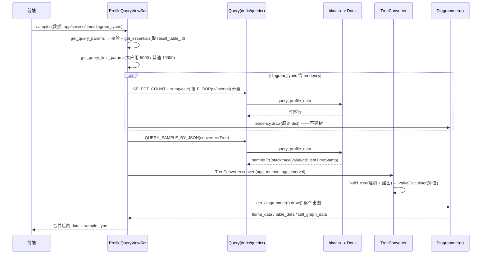
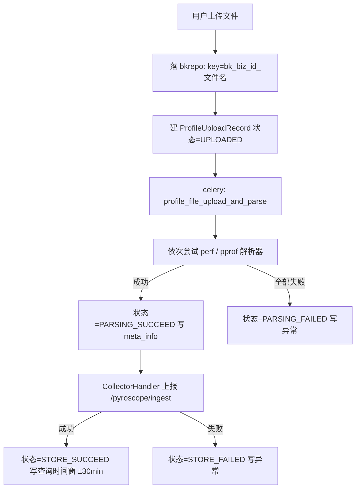

# 功能推演：APM Profiling 实现

**本文引用的文件**
- [views](file://bkmonitor/packages/apm_web/profile/views.py)
- [serializers](file://bkmonitor/packages/apm_web/profile/serializers.py)
- [doris/querier](file://bkmonitor/packages/apm_web/profile/doris/querier.py)
- [diagrams/tree_converter](file://bkmonitor/packages/apm_web/profile/diagrams/tree_converter.py)
- [diagrams/base](file://bkmonitor/packages/apm_web/profile/diagrams/base.py)
- [diagrams/callgraph](file://bkmonitor/packages/apm_web/profile/diagrams/callgraph.py)
- [resources](file://bkmonitor/packages/apm_web/profile/resources.py)
- [file_handler](file://bkmonitor/packages/apm_web/profile/file_handler.py)
- [perf/converter](file://bkmonitor/packages/apm_web/profile/perf/converter.py)

## 目录
1. [正常路径](#正常路径)
2. [边界与异常](#边界与异常)
3. [性能与复杂度](#性能与复杂度)
4. [设计意图](#设计意图)

## 正常路径

### 页面查询主链路（`POST /profile_api/query/samples`）



图表来源：[views.py](file://bkmonitor/packages/apm_web/profile/views.py#L485-L564)、[views.py](file://bkmonitor/packages/apm_web/profile/views.py#L394-L432)、[tree_converter.py](file://bkmonitor/packages/apm_web/profile/diagrams/tree_converter.py#L42-L77)

**关键分支**：
- `is_compared=true`：主链路走完后**再查一次**对比项，然后用 `Diagrammer.diff()` 出差分结果（[views.py#L530-L562](file://bkmonitor/packages/apm_web/profile/views.py#L530-L562)）；
- `is_ebpf`：直接走 `ebpf_query` → `EbpfConverter`，**跳过 `Query` 与 Doris**（[views.py#L406-L416](file://bkmonitor/packages/apm_web/profile/views.py#L406-L416)）；
- `global_query=true`：走内置数据源（`builtin_profile_app`），且必须带 `profile_id`。

### 上传入库链路



图表来源：[views.py](file://bkmonitor/packages/apm_web/profile/views.py#L113-L164)、[file_handler.py](file://bkmonitor/packages/apm_web/profile/file_handler.py#L37-L103)、[tasks.py](file://bkmonitor/packages/apm_web/tasks.py#L199-L215)

## 边界与异常

| 场景 | 行为 | 位置 | 范围 |
|---|---|---|---|
| 查询结果为空且带 `profile_id`/`span_id` 过滤 | 把过滤键 **互换后重试一次**（兼容历史数据两种命名） | [views.py#L279-L292](file://bkmonitor/packages/apm_web/profile/views.py#L279-L292)、[querier.py#L113-L120](file://bkmonitor/packages/apm_web/profile/doris/querier.py#L113-L120) | [专用] |
| 全局查询没带 `profile_id` | 直接抛错（防止跨业务读到别人数据） | [views.py#L686-L696](file://bkmonitor/packages/apm_web/profile/views.py#L686-L696) | [专用] |
| 全局查询无返回 | 反查上传记录，若状态非 `STORE_SUCCEED` 就把解析/存储异常抛给前端 | [views.py#L515-L525](file://bkmonitor/packages/apm_web/profile/views.py#L515-L525) | [专用] |
| 对比项无数据 | 返回"对比项未查询到有效数据"（**不是报错**） | [views.py#L551-L552](file://bkmonitor/packages/apm_web/profile/views.py#L551-L552) | [专用] |
| 主查询无数据 | 返回"未查询到有效数据"，HTTP 200 | [views.py#L527-L528](file://bkmonitor/packages/apm_web/profile/views.py#L527-L528) | [专用] |
| 时间窗口过窄 | `enlarge_duration(min_range=3600)` 向两端各扩展一半（labels 接口固定用 1 小时最小窗口） | [views.py#L665-L671](file://bkmonitor/packages/apm_web/profile/views.py#L665-L671)、[views.py#L736](file://bkmonitor/packages/apm_web/profile/views.py#L736-L736) | [专用] |
| 调用图节点/边超限 | 三档阈值裁剪（1500 节点 / 2400 边 / 768KB DOT） | [callgraph.py#L32-L34](file://bkmonitor/packages/apm_web/profile/diagrams/callgraph.py#L32-L34) | [专用] |
| **调用图对比模式** | `diff()` 直接 `raise ValueError("CallGraph not support diff mode")` | [callgraph.py#L370-L371](file://bkmonitor/packages/apm_web/profile/diagrams/callgraph.py#L370-L371) | [专用] |
| eBPF 数据首元素非根节点 | 抛 `ValueError`（要求 `parent_node_id == "-1"`） | [ebpf_converter.py#L48-L51](file://bkmonitor/packages/apm_web/profile/diagrams/ebpf_converter.py#L48-L51) | [专用] |
| 上传文件所有解析器都失败 | 状态落 `PARSING_FAILED`，`content` 记录每个解析器的异常栈 | [file_handler.py#L68-L76](file://bkmonitor/packages/apm_web/profile/file_handler.py#L68-L76) | [专用] |
| 上传记录列表含过期文件 | 按数据源 `retention` 过滤（过期文件在 bkbase 已查不到） | [views.py#L181-L186](file://bkmonitor/packages/apm_web/profile/views.py#L181-L186) | [专用] |
| 应用未开启 Profiling | 抛"应用未开启性能分析" | [views.py#L716-L717](file://bkmonitor/packages/apm_web/profile/views.py#L716-L717)、[querier.py#L150-L151](file://bkmonitor/packages/apm_web/profile/doris/querier.py#L150-L151) | [专用] |
| 导出格式非 pprof | 抛错 | [views.py#L826-L827](file://bkmonitor/packages/apm_web/profile/views.py#L826-L827) | [专用] |

**隐式行为 / 副作用** `[专用]`：
1. `samples` 接口会把 `diagram_types` 里的 `tendency` **移除**后再走主链路（[views.py#L494](file://bkmonitor/packages/apm_web/profile/views.py#L494-L494)），即趋势图不会参与 `draw()` 循环——它的数据在前面的分支里已经单独取过。
2. 查询默认排序固定为 `dtEventTimeStamp,t1.stacktrace_id desc`（[views.py#L274-L277](file://bkmonitor/packages/apm_web/profile/views.py#L274-L277)），注释说明是为了"保持接口返回数据一致"。
3. `is_large_service` 判定结果缓存 1 小时，期间服务规模变化不会立刻反映到查询上限。
4. perf_script 解析成功后会向标准输出 `print` 统计信息（[perf/converter.py#L66-L69](file://bkmonitor/packages/apm_web/profile/perf/converter.py#L66-L69)）——遗留的调试输出。

## 性能与复杂度

> 本模块涉及大数据集处理（单次最多 5000–10000 条 sample、调用图上限 1500 节点），故做性能分析。

| 环节 | 复杂度 | 说明 | 范围 |
|---|---|---|---|
| `build_tree` | O(N × L) | N = sample 条数（≤10000），L = 单条堆栈深度；每个 sample 逆序遍历全部帧，节点用 dict 查找（O(1)） | [专用] |
| `ValueCalculator.calculate_nodes` | O(M) | M = 树节点总数；递归遍历，每节点调用 `format_percent` | [专用] |
| 火焰图 `draw` | O(M) | 递归复制整棵树为 JSON，输出体量 ≈ 节点数 × 每节点 5 字段 | [专用] |
| 表格 `draw` | O(M log M) | 排序主导，`function_node_map` 大小即节点数 | [通用] |
| 趋势图 | O(P)（Doris 侧聚合） | P = 时间点数；聚合下推到 Doris（`sum(value)` + `FLOOR` 分组），模块侧只做格式转换 | [专用] |
| **服务柱状图** | **O(P) 次网络请求** | `QueryProfileBarGraphResource` 对**每个时间点**发起一次 label 查询（`ThreadPool.map_ignore_exception` 并发）；时间跨度 24h / 1min 粒度 ≈ 1440 次查询 —— **本模块最大的放大风险点** | [专用] |
| 上传解析 | O(F) + 内存 O(F) | `upload` 里 `uploaded.read()` 一次性读入内存；`parse_file` 用 `tempfile` 落盘，大文件有内存压力 | [专用] |

**热点与保护手段** `[专用]`：
- 查询条数上限（5000 / 10000）是主保护阀；
- `is_large_service` 走 1 小时缓存，避免每次查询都调 API 判定；
- 调用图三档阈值防止 graphviz 渲染爆炸；
- 柱状图用线程池并发，但**没有并发度上限或点数量上限**，长周期查询可能打满下游。

## 设计意图

| 设计 | 推断意图 | 依据 | 范围 |
|---|---|---|---|
| 页面查询**绕开 pprof**（`TreeConverter`） | 页面只需要"树"，从 Doris 行直接建树可省掉一次完整的 Profile 构造 + 符号表去重开销 | [tree_converter.py#L24-L27](file://bkmonitor/packages/apm_web/profile/diagrams/tree_converter.py#L24-L27) 类 docstring 明写"而不经过 ProfileConverter" | [专用] |
| 同时维护**树**与**图**两套结构 | 火焰图要"调用路径视角"（同名函数在不同路径分开算），表格要"函数聚合视角"（同名函数合并）——一张树满足不了两种语义 | [tree_converter.py#L114-L153](file://bkmonitor/packages/apm_web/profile/diagrams/tree_converter.py#L114-L153) 同步维护 `root` 与 `function_node_map` | [专用] |
| self 值只记在叶子 | 符合 pprof 语义：一个 sample 的"自身消耗"归给当前正在执行的函数 | [tree_converter.py#L155-L160](file://bkmonitor/packages/apm_web/profile/diagrams/tree_converter.py#L155-L160) 注释 | [通用] |
| AVG 需要"快照数" | 瞬时量（堆内存、goroutine 数）跨多个采样点求平均才有意义，必须知道一共几个采样点 | [tree_converter.py#L69-L74](file://bkmonitor/packages/apm_web/profile/diagrams/tree_converter.py#L69-L74) 按聚合周期去重时间点后传入 | [通用] |
| 空结果时 `profile_id` ↔ `span_id` 互换重试 | 兼容历史数据里两种标签命名并存 | [views.py#L279-L292](file://bkmonitor/packages/apm_web/profile/views.py#L279-L292) | [专用] |
| 上报时"模拟 pyroscope agent" | 复用 bk-collector 已集成的 pyroscope ingest 端点，不新造协议 | [collector.py#L77](file://bkmonitor/packages/apm_web/profile/collector.py#L77-L77) 注释 + [collector.py#L91-L100](file://bkmonitor/packages/apm_web/profile/collector.py#L91-L100) 参数构造 | [专用] |
| 解析时注入 `service_name` 标签 | 上报 token 只带 `bk_biz_id` + `app_name`，service_name 需在清洗期可用 | [file_handler.py#L57-L61](file://bkmonitor/packages/apm_web/profile/file_handler.py#L57-L61) 注释原文说明 | [专用] |

## 🚀 下一步

> 复制下面这段文字发给 AI，即可继续（无需重新描述上下文）：

```
我刚看完 profile 模块的讲解材料，档案在 .teach/profile/。
请就 {具体方向：D 可视化层建树与聚合 / E 上传入库链路 / C 查询拼装与重试} 再深入讲一层。
```
