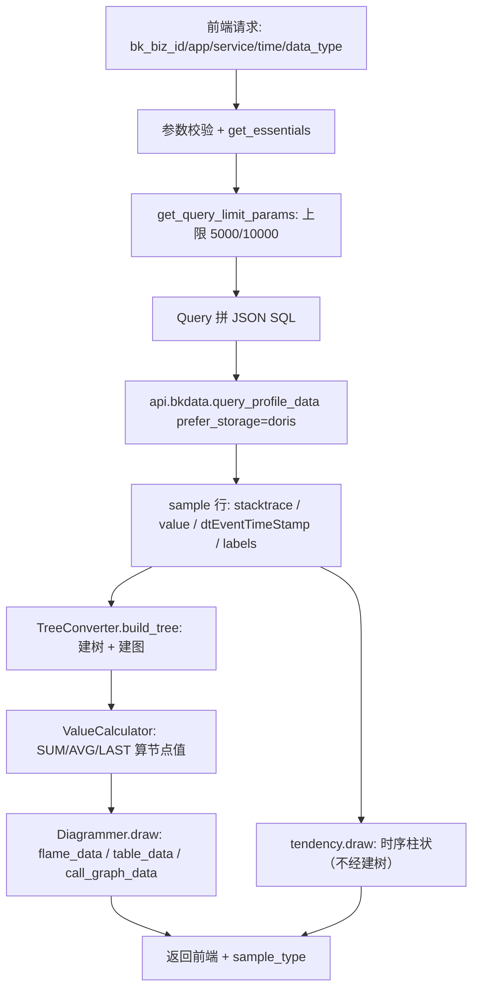
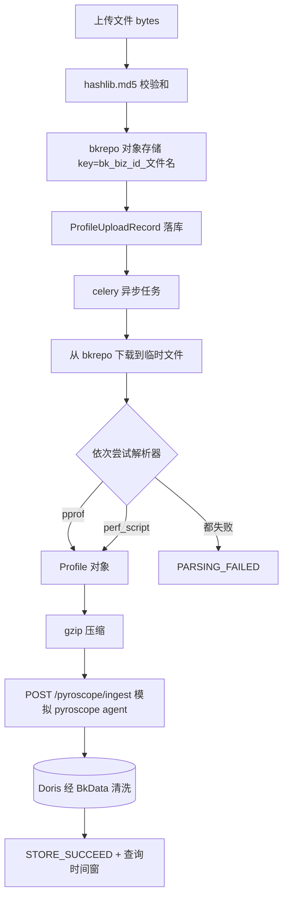
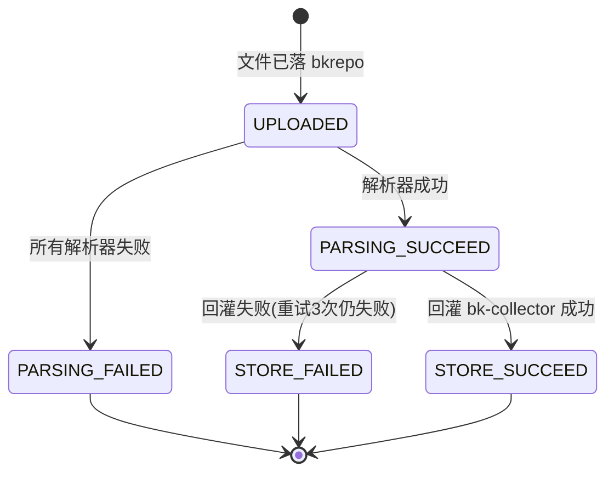

# 数据流分析：APM Profiling 实现

**本文引用的文件**
- [views](file://bkmonitor/packages/apm_web/profile/views.py)
- [doris/querier](file://bkmonitor/packages/apm_web/profile/doris/querier.py)
- [doris/converter](file://bkmonitor/packages/apm_web/profile/doris/converter.py)
- [diagrams/tree_converter](file://bkmonitor/packages/apm_web/profile/diagrams/tree_converter.py)
- [diagrams/base](file://bkmonitor/packages/apm_web/profile/diagrams/base.py)
- [file_handler](file://bkmonitor/packages/apm_web/profile/file_handler.py)
- [collector](file://bkmonitor/packages/apm_web/profile/collector.py)
- [models/profile](file://bkmonitor/packages/apm_web/models/profile.py)
- [tasks](file://bkmonitor/packages/apm_web/tasks.py)

## 目录
1. [数据生命周期](#数据生命周期)
2. [状态流转](#状态流转)
3. [异步流](#异步流)
4. [数据一致性与丢失风险](#数据一致性与丢失风险)

## 数据生命周期

### 链路一：页面查询（读）



图表来源：[views.py](file://bkmonitor/packages/apm_web/profile/views.py#L485-L564)、[doris/querier.py](file://bkmonitor/packages/apm_web/profile/doris/querier.py#L113-L140)、[tree_converter.py](file://bkmonitor/packages/apm_web/profile/diagrams/tree_converter.py#L42-L77)

**数据形态变化**：`查询参数 dict` → `JSON 字符串（SQL 载体）` → `Doris 行（stacktrace 是 JSON 字符串）` → `FunctionTree（内存树/图）` → `前端图形结构`。

### 链路二：上传入库（写）



图表来源：[views.py](file://bkmonitor/packages/apm_web/profile/views.py#L125-L162)、[file_handler.py](file://bkmonitor/packages/apm_web/profile/file_handler.py#L37-L103)、[collector.py](file://bkmonitor/packages/apm_web/profile/collector.py#L57-L133)

### 链路三：导出（读 → 转换 → 下载）

`Query` 查 Doris → `DorisProfileConverter`（按 SUM/AVG/LAST 裁剪样本）→ `Profile` 对象 → `SerializeToString()` → `gzip.compress` → `HttpResponse`（`Content-Encoding: gzip`）。

关键：导出用的是 **Profile 管线**（[views.py#L808-L822](file://bkmonitor/packages/apm_web/profile/views.py#L808-L822)），与页面查询的 Tree 管线不同，因为导出必须产出标准 pprof。

## 状态流转

上传记录状态机（`UploadedFileStatus`）：



图表来源：[models/profile.py](file://bkmonitor/packages/apm_web/models/profile.py#L13-L23)、[file_handler.py](file://bkmonitor/packages/apm_web/profile/file_handler.py#L86-L103)

状态对应的副作用 `[专用]`：
- `PARSING_SUCCEED`：写 `meta_info`（`data_types` 列表 + `sample_type`），前端据此展示可选数据类型；
- `STORE_SUCCEED`：写 `data_time`（文件数据时间）与 `query_start_time` / `query_end_time`（数据时间 **±30 分钟**，[file_handler.py#L96-L103](file://bkmonitor/packages/apm_web/profile/file_handler.py#L96-L103)），前端查询该文件时直接用这个窗口；
- 失败态：写 `content` 字段保存异常栈，供 `records` 接口与全局查询无数据时的错误提示使用。

## 异步流

| 异步点 | 机制 | 位置 | 范围 |
|---|---|---|---|
| 上传文件解析 + 入库 | Celery task `profile_file_upload_and_parse`（`ignore_result`） | [tasks.py#L198-L215](file://bkmonitor/packages/apm_web/tasks.py#L198-L215) | [专用] |
| 服务柱状图并发取数 | `ThreadPool.map_ignore_exception`（每个时间点一次查询，异常被忽略） | [resources.py#L283-L299](file://bkmonitor/packages/apm_web/profile/resources.py#L283-L299) | [专用] |
| 应用数据源异步创建 | 本模块不负责，属 `apm_web` 应用创建流程 | — | [专用] |

**同步阻塞点** `[专用]`：Doris 查询（`api.bkdata.query_profile_data`）是同步 HTTP 调用——这意味着单次 `samples` 请求会同步等待 Doris 返回；对比模式下是**两次**串行等待（[views.py#L536-L550](file://bkmonitor/packages/apm_web/profile/views.py#L536-L550)）。

## 数据一致性与丢失风险

| 风险点 | 说明 | 位置 | 范围 |
|---|---|---|---|
| **bkrepo 与 DB 记录不一致** | 文件已上传成功但 `ProfileUploadRecord.objects.create` 失败 → 对象存储里留下孤儿文件；反之代码里已按"上传失败不记录、不派任务"处理（[views.py#L128-L135](file://bkmonitor/packages/apm_web/profile/views.py#L128-L135)） | [views.py#L128-L154](file://bkmonitor/packages/apm_web/profile/views.py#L128-L154) | [专用] |
| **回灌失败即数据丢失** | 解析成功但上报 bk-collector 三次重试均失败 → 状态 `STORE_FAILED`，**文件仍在 bkrepo 但无自动重试入口**，需用户重新上传 | [file_handler.py#L88-L94](file://bkmonitor/packages/apm_web/profile/file_handler.py#L88-L94) | [专用] |
| **聚合方法与数据语义不匹配** | 若对瞬时快照量（堆内存）错误地使用 SUM，会把同一份内存跨采样点重复累加，数值虚高；映射表是唯一防线 | [config/default.py#L639-L652](file://bkmonitor/config/default.py#L639-L652)、[diagrams/base.py#L146-L157](file://bkmonitor/packages/apm_web/profile/diagrams/base.py#L146-L157) | [专用] |
| **采样点去重影响 AVG 分母** | `snapshot_len` 按聚合周期 `FLOOR(ts/interval)*interval` 去重，周期选错（1s vs 60s）会直接改变平均值 | [tree_converter.py#L69-L74](file://bkmonitor/packages/apm_web/profile/diagrams/tree_converter.py#L69-L74)、[views.py#L476-L483](file://bkmonitor/packages/apm_web/profile/views.py#L476-L483) | [专用] |
| **空结果重试改写参数** | 重试会把 `profile_id` 换成 `span_id`（或反之）重查，若两者语义本就不同，可能返回与预期不同的数据集 | [views.py#L279-L292](file://bkmonitor/packages/apm_web/profile/views.py#L279-L292) | [专用] |
| **过期数据不可查** | 超过数据源 `retention` 的数据在 bkbase 已查不到，`records` 接口同步做了过滤，但用户仍可能看到"记录存在却查不到数据" | [views.py#L181-L186](file://bkmonitor/packages/apm_web/profile/views.py#L181-L186) | [专用] |

## 🚀 下一步

> 复制下面这段文字发给 AI，即可继续（无需重新描述上下文）：

```
我刚看完 profile 模块的讲解材料，档案在 .teach/profile/。
请就 {具体方向：A 接入层鉴权与参数校验 / B 转换层与注册表 / C 查询拼装与重试 / D 可视化层建树与聚合 / E 上传入库链路} 再深入讲一层。
```
