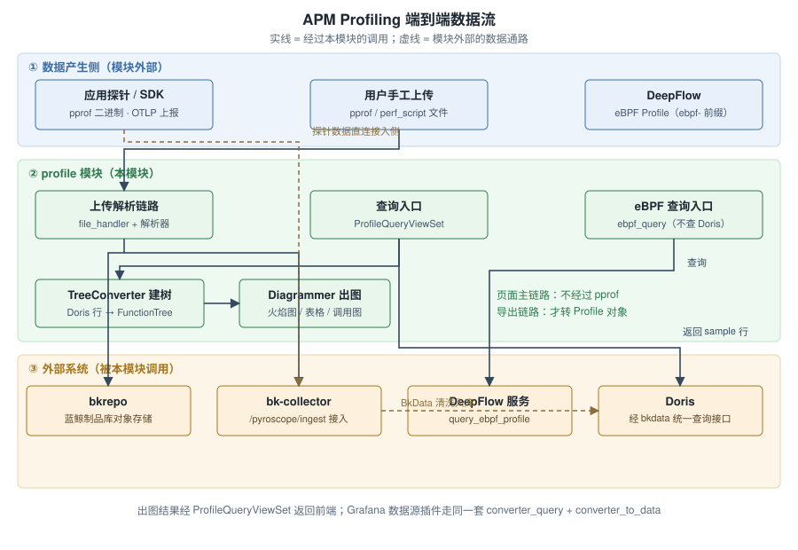
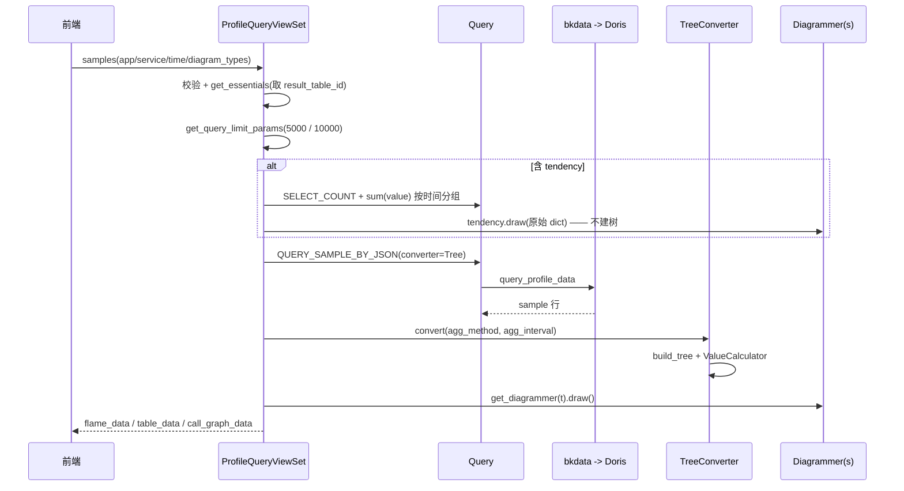
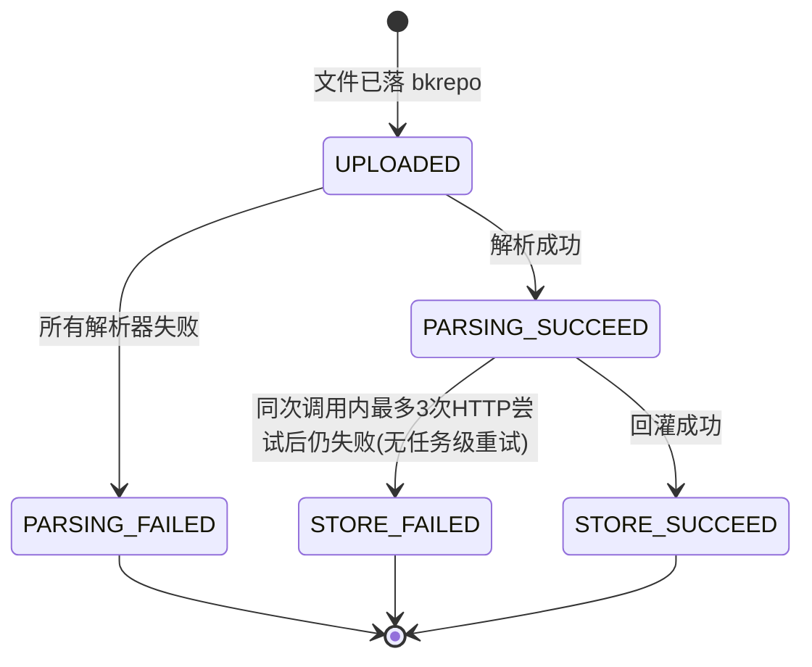

# APM Profiling 实现 · 模块讲解

> 讲解对象：`bkmonitor/packages/apm_web/profile/`（29 个 `.py` 文件）
> 知识范围：通用 + 专用（默认）｜ 学习目标：读懂（默认）
> 产物目录：`.teach/profile/`（`00` 大纲 / `01` wiki / `02` 正确性核对 / `03` 功能推演 / `04` 应用场景 / `05` 数据流 / 本文件）

**阅读路径**（新人建议按此顺序）：§1 处境 → §2 五分钟入门 → §4.1 模块位置 → §4.2 两条管线 → §6.1 主链路时序图；排查问题时再回查 §4.4 不变量 1–10 与 §8。

## 目录
1. [处境：这段代码为什么存在](#1-处境这段代码为什么存在)
2. [先读这段：5 分钟入门](#2-先读这段5-分钟入门)
3. [能力大纲](#3-能力大纲)
4. [代码 Wiki](#4-代码-wiki)
5. [正确性核对](#5-正确性核对)
6. [功能推演](#6-功能推演)
7. [应用场景](#7-应用场景)
8. [数据流](#8-数据流)

---

## 1. 处境：这段代码为什么存在

`[专用]` APM 里已经有了 Trace（这一跳慢不慢）和 Metric（CPU 高不高），但当值班工程师问"**是哪个函数吃掉了这些 CPU**"时，两者都答不上来——Trace 到接口粒度就停了，Metric 只有总量没有归因。

`apm_web/profile/` 就是补这最后一公里的：把**已经采集上来的剖析数据**变成页面上能看的火焰图、调用图、表格和趋势图，并支持上传离线文件与导出 pprof。

**数据在哪** `[专用]`：结构化 sample 数据存在 **Doris**（经 `result_table_id` 定位，这是平台侧结果表标识）；用户上传的**原始文件**存在 **bkrepo**（蓝鲸制品库对象存储）。

**边界** `[专用]`：模块挂在 `^profile_api/` 前缀下（[apm_web/urls.py#L17-L21](file://bkmonitor/packages/apm_web/urls.py#L17-L21)），**不负责采集、不负责清洗入库**——采集由应用侧探针（Pyroscope SDK / OpenTelemetry，外部系统）完成，eBPF 场景由 DeepFlow 提供；清洗入库由 bk-collector + BkData 完成。外部名词速查见 §2。

---

## 2. 先读这段：5 分钟入门

`[通用]` 用于填平"没接触过 Profiling"的门槛，熟悉 pprof 可跳过。

- **Profiling**：探针周期性抓取调用栈，一次抓取 = 一个 **sample**（一条调用栈 + 一个数值，如消耗的 CPU 纳秒）。累积后把相同调用路径的值累加，就得到"哪个函数最耗资源"。
- **pprof**：Go 生态的剖析数据格式（protobuf），用 **string table** 存字符串、其它字段存下标。参考 [google/pprof · profile.proto](https://github.com/google/pprof/blob/main/proto/profile.proto)（核查于 2026-09）。
- **核心字段**：`sample_type`（测什么量+单位，如 `cpu/nanoseconds`）｜`sample`（采样点：调用栈 + 值）｜`location`/`function`（栈帧与函数符号）｜`mapping`（来自哪个二进制）｜`string_table`（字符串池）。
- ⚠️ **顺序坑**：pprof 里 `location_id[0]` 是**叶子**（当前执行处），本模块建树时 `reversed()` 遍历（[models.py#L85-L87](file://bkmonitor/packages/apm_web/profile/models.py#L85-L87)、[tree_converter.py#L98-L105](file://bkmonitor/packages/apm_web/profile/diagrams/tree_converter.py#L98-L105)）。
- **火焰图怎么读** `[通用]`：横轴宽度 = 消耗占比，纵轴 = 调用深度；找最宽的平顶。

**外部系统速查** `[专用]`：Doris（存 profile 的 OLAP 库）｜ bkdata（平台统一查询接口）｜ bkrepo（对象存储）｜ bk-collector（采集网关，含 `/pyroscope/ingest`）｜ pyroscope（开源剖析协议，本模块兼容）｜ DeepFlow（第三方 eBPF 数据源）｜ `result_table_id`（平台结果表标识，查 Doris 必传）。

---

## 3. 能力大纲

### 对外职责 `[专用]`

四件事：**查**（Doris → 图形）、**画**（火焰图/调用图/表格/趋势 + 对比）、**传**（上传文件解析入库）、**导**（导出 pprof）。
不做：采集、清洗入库、采样控制、告警。

### 公开能力 `[专用]`

| 能力 | 入口 | 方法 |
|---|---|---|
| 上传 profiling 文件 | `upload/upload` | POST |
| 查询上传记录 | `upload/records` | GET |
| **查询 samples（核心）** | `query/samples` | POST/GET |
| 查询 label keys / values | `query/labels`、`query/label_values` | GET |
| 导出 pprof | `query/export` | GET |
| 服务列表 / 柱状图 / 详情 | `query/services`、`services_trace_bar`、`services_detail` | GET/POST |

章节来源：[profile/urls.py](file://bkmonitor/packages/apm_web/profile/urls.py#L17-L27)、[views.py](file://bkmonitor/packages/apm_web/profile/views.py#L112-L880)

### 关键抽象

| 抽象 | 角色 | 位置 | 范围 |
|---|---|---|---|
| `Profile`（pprof 模型） | 上传解析与导出的中间格式 | [models.py#L21-L65](file://bkmonitor/packages/apm_web/profile/models.py#L21-L65) | [通用] |
| `ProfileConverter` + 三实现 | 各类输入 → `Profile` | [profileconverter.py#L23-L94](file://bkmonitor/packages/apm_web/profile/profileconverter.py#L23-L94) | [专用] |
| `FunctionTree` / `FunctionNode` | 调用栈树，节点含 `value` 与 `self_value` | [diagrams/base.py#L29-L133](file://bkmonitor/packages/apm_web/profile/diagrams/base.py#L29-L133) | [专用] |
| `TreeConverter` | Doris 行 → 树（**页面主链路，绕开 pprof**） | [tree_converter.py#L23-L161](file://bkmonitor/packages/apm_web/profile/diagrams/tree_converter.py#L23-L161) | [专用] |
| `EbpfConverter` | DeepFlow 平铺列表 → 树 | [ebpf_converter.py#L20-L113](file://bkmonitor/packages/apm_web/profile/diagrams/ebpf_converter.py#L20-L113) | [专用] |
| `Diagrammer` + 注册表 | 一种图 = 一个 Diagrammer，6 种实现 | [diagrams/__init__.py#L24-L62](file://bkmonitor/packages/apm_web/profile/diagrams/__init__.py#L24-L62) | [专用] |
| `Query` / `APIParams` / `QueryTemplate` | 查询建模与执行 | [doris/querier.py#L27-L347](file://bkmonitor/packages/apm_web/profile/doris/querier.py#L27-L347) | [专用] |
| `ProfileUploadRecord` / `UploadedFileStatus` | 上传状态机 | [models/profile.py#L13-L57](file://bkmonitor/packages/apm_web/models/profile.py#L13-L57) | [专用] |
| `CollectorHandler` | 回灌 bk-collector | [collector.py#L53-L133](file://bkmonitor/packages/apm_web/profile/collector.py#L53-L133) | [专用] |

### 子模块划分 `[专用]`

| 子模块 | 文件 | 一句话职责 |
|---|---|---|
| A 接入层 | `urls/views/resources/serializers/constants` | 接口、鉴权、参数校验、编排 |
| B 转换层 | `profileconverter/models/patch/pprof/perf/doris.converter` | 输入 ↔ pprof `Profile` |
| C 查询适配 | `doris/querier` | 拼 JSON SQL、执行、空结果重试、服务维度取数 |
| D 可视化层 | `diagrams/*` | 建树、聚合、六种图、对比 |
| E 上传入库 | `collector/file_handler` + `tasks` | 落存储、解析、回灌、状态回写 |

章节来源：[profile/](file://bkmonitor/packages/apm_web/profile/urls.py#L10-L27)、[apps.py](file://bkmonitor/packages/apm_web/apps.py#L19-L29)

---

## 4. 代码 Wiki

### 4.1 模块在系统中的位置 `[专用]`



图表来源：[views.py](file://bkmonitor/packages/apm_web/profile/views.py#L112-L880)、[file_handler.py](file://bkmonitor/packages/apm_web/profile/file_handler.py#L37-L103)、[collector.py](file://bkmonitor/packages/apm_web/profile/collector.py#L57-L133)、[doris/querier.py](file://bkmonitor/packages/apm_web/profile/doris/querier.py#L122-L140)

| 链路 | 路径 | 过不过 pprof |
|---|---|---|
| ① 页面查询（主链路） | 前端 → `samples` → `Query` 查 Doris → `TreeConverter` 建树 → `Diagrammer` 出图 | **不过** |
| ② 上传入库 | 上传 → bkrepo → 异步解析 → `Profile` → gzip → `/pyroscope/ingest` → Doris | 过 |
| ③ 导出 | `export` → `Query` → `DorisProfileConverter` → `Profile` → gzip 下载 | 过 |
| （探针上报，不经本模块） | 探针 → bk-collector → BkData 清洗 → Doris | — |

### 4.2 ⚠️ 头号易混淆点：两条并行管线 `[专用]`

`ConverterType`（[doris/querier.py#L38-L44](file://bkmonitor/packages/apm_web/profile/doris/querier.py#L38-L44)）有两个值：`Tree`（页面查询）与 `Profile`（上传解析/导出）。

- 页面主链路**固定 `Tree`**（[views.py#L428-L432](file://bkmonitor/packages/apm_web/profile/views.py#L428-L432)、[views.py#L546-L550](file://bkmonitor/packages/apm_web/profile/views.py#L546-L550)）；
- 只有导出才用 `Profile`（[views.py#L816-L820](file://bkmonitor/packages/apm_web/profile/views.py#L816-L820)）。

**结论：`Profile` 不是页面主链路的中间格式。**

### 4.3 设计模式

| 模式 | 落点 | 范围 |
|---|---|---|
| 策略模式（`ValueCalculator`） | [diagrams/base.py#L135-L199](file://bkmonitor/packages/apm_web/profile/diagrams/base.py#L135-L199) | [通用] |
| 注册表 / 插件模式（解析器 + 图表） | [profileconverter.py#L96-L116](file://bkmonitor/packages/apm_web/profile/profileconverter.py#L96-L116)、[diagrams/__init__.py#L45-L62](file://bkmonitor/packages/apm_web/profile/diagrams/__init__.py#L45-L62) | [通用] |
| 模板方法（`ProfileConverter`） | [profileconverter.py#L23-L94](file://bkmonitor/packages/apm_web/profile/profileconverter.py#L23-L94) | [通用] |
| Protocol（`Diagrammer`） | [diagrams/__init__.py#L24-L42](file://bkmonitor/packages/apm_web/profile/diagrams/__init__.py#L24-L42) | [通用] |
| 重试 + 参数改写（`profile_id` ↔ `span_id`） | [views.py#L279-L292](file://bkmonitor/packages/apm_web/profile/views.py#L279-L292) | [专用] |
| 缓存（`is_large_service` 1 小时） | [views.py#L566-L587](file://bkmonitor/packages/apm_web/profile/views.py#L566-L587) | [专用] |

### 4.4 不变量与关键约束 `[专用]`

1. **时间单位有四套**（改动前务必确认自己在哪一层）：
   | 位置 | 单位 | 说明 |
   |---|---|---|
   | `start` / `end`（直传） | 微秒 | [serializers.py#L30-L33](file://bkmonitor/packages/apm_web/profile/serializers.py#L30-L33) |
   | `start_time` / `end_time` | help_text 标注为秒，代码 `×1000×1000` 放大 | [serializers.py#L49-L58](file://bkmonitor/packages/apm_web/profile/serializers.py#L49-L58)；⚠️ 该文件 L52 注释写"前端传递毫秒、需转换成秒级"，与实现和 help_text 口径不一致，**改动前以实测为准** |
   | 查 Doris、`dtEventTimeStamp`、`get_agg_interval` 入参 | 毫秒 | [views.py#L476-L483](file://bkmonitor/packages/apm_web/profile/views.py#L476-L483) |
   | `agg_interval` | 秒（用时 ×1000） | [views.py#L603](file://bkmonitor/packages/apm_web/profile/views.py#L603-L603)、[tree_converter.py#L71](file://bkmonitor/packages/apm_web/profile/diagrams/tree_converter.py#L71-L71) |
   | pprof `time_nanos` | 纳秒（毫秒 ×10⁶） | [doris/converter.py#L140-L142](file://bkmonitor/packages/apm_web/profile/doris/converter.py#L140-L142) |
2. **聚合方法怎么定（照抄规则会踩坑）**：实现是「查表 + 静默回退」，不是语义二分。
   - 支持三种值：**SUM / AVG / LAST**（[doris/converter.py#L37-L43](file://bkmonitor/packages/apm_web/profile/doris/converter.py#L37-L43)；LAST = 只保留最后一个时间点的快照，[tree_converter.py#L79-L87](file://bkmonitor/packages/apm_web/profile/diagrams/tree_converter.py#L79-L87)）；
   - 查表键是 `APM_PROFILING_AGG_METHOD_MAPPING`（[config/default.py#L639-L652](file://bkmonitor/config/default.py#L639-L652)），**键为复合串**如 `HEAP-SPACE`、`WALL-TIME`、`CPU-TIME`、`EXCEPTION-SAMPLES`；
   - **未命中静默回退 SUM，不报错**（[doris/converter.py#L40](file://bkmonitor/packages/apm_web/profile/doris/converter.py#L40-L40)、[diagrams/base.py#L146-L157](file://bkmonitor/packages/apm_web/profile/diagrams/base.py#L146-L157)）→ 新增采样类型若忘记加映射，会按 SUM 计算，瞬时量（堆内存等）数值虚高；
   - `agg_method` 入参是自由字符串、无 choices 校验（[serializers.py#L76](file://bkmonitor/packages/apm_web/profile/serializers.py#L76-L76)），传 typo 也走兜底。
   - 语义上：累计量（CPU / WALL / EXCEPTION）用 SUM，瞬时快照量（HEAP / ALLOC / INUSE / GOROUTINE / DELAY）用 AVG。
3. **节点 ID = systemName + fileName + name**（[base.py#L83-L92](file://bkmonitor/packages/apm_web/profile/diagrams/base.py#L83-L92)）→ 同名函数不同文件算两个节点。
4. **self 值只记在叶子** `[通用]`（[tree_converter.py#L155-L160](file://bkmonitor/packages/apm_web/profile/diagrams/tree_converter.py#L155-L160)）：符合 pprof 语义，一次采样的"自身消耗"归给当前执行函数。
5. **树与图双结构并存**（[tree_converter.py#L114-L153](file://bkmonitor/packages/apm_web/profile/diagrams/tree_converter.py#L114-L153)）——这是"火焰图和表格数字对不上"的根因：火焰图用调用路径树，表格用函数聚合图。
6. 查询上限分档：大应用 5000 / 普通 10000 条 sample（[constants.py#L25-L28](file://bkmonitor/packages/apm_web/profile/constants.py#L25-L28)）。
7. 全局查询必须带归属本业务的 `profile_id`，否则抛错防越权（[views.py#L674-L696](file://bkmonitor/packages/apm_web/profile/views.py#L674-L696)）。
8. eBPF 应用不是 APM 应用：**取数不查 Doris**（[views.py#L193-L216](file://bkmonitor/packages/apm_web/profile/views.py#L193-L216)），也不查 `Application` 表（[views.py#L352-L354](file://bkmonitor/packages/apm_web/profile/views.py#L352-L354)）。
9. 上传状态机五态（[models/profile.py#L13-L23](file://bkmonitor/packages/apm_web/models/profile.py#L13-L23)）。
10. 导出仅支持 pprof（[constants.py#L14-L16](file://bkmonitor/packages/apm_web/profile/constants.py#L14-L16)）。

---

## 5. 正确性核对

24 条结论**全部已确认**（0 有误 / 0 存疑），其中 4 条在评审后修正并已级联同步：

| 原结论 | 修正为 |
|---|---|
| `Profile` 是全模块统一中间格式 | 仅服务上传/导出；页面主链路走 Tree 管线 |
| `views` 依赖 `doris/` + `diagrams/` + `pprof/` | `views` 依赖 `doris/` + `diagrams/` + `doris.converter`；`pprof/`、`perf/` 经注册表由 `file_handler` 间接使用 |
| 依赖图 `A --> Doris` 直连 | 删除该边；取数一律经 `doris/querier` |
| `CallGraphDiagrammer` 在 `callgraph.py#L32-L120` | `callgraph.py#L349-L372`（阈值常量另引 L32-L34） |

详见 [02-正确性核对.md](./02-正确性核对.md)。

---

## 6. 功能推演

### 6.1 页面查询主链路 `[专用]`



图表来源：[views.py](file://bkmonitor/packages/apm_web/profile/views.py#L485-L564)、[tree_converter.py](file://bkmonitor/packages/apm_web/profile/diagrams/tree_converter.py#L42-L77)

### 6.2 边界与异常（要点）`[专用]`

- **空结果重试有触发条件**：仅当 `label_filter` 里含 `profile_id` 或 `span_id` 时才会注入重试 handler，把键互换后再查一次（[views.py#L279-L292](file://bkmonitor/packages/apm_web/profile/views.py#L279-L292)）——不是所有空结果都重试；
- 全局查询无 `profile_id` → 抛错（防跨业务越权）；
- 对比项无数据 → 返回提示而非报错；调用图对比 → 直接 `ValueError`（不支持，[callgraph.py#L370-L371](file://bkmonitor/packages/apm_web/profile/diagrams/callgraph.py#L370-L371)）；
- 上传文件解析全失败 → `PARSING_FAILED` + 异常栈；
- `samples` 会把 `tendency` 从 `diagram_types` 里**移除**后再走主链路（[views.py#L492-L494](file://bkmonitor/packages/apm_web/profile/views.py#L492-L494)）。

### 6.3 性能与复杂度 `[专用]`

| 环节 | 复杂度 | 备注 |
|---|---|---|
| 建树 | O(N × L)，N ≤ 10000 | N = sample 数，L = 栈深 |
| 算值 | O(M) | M = 节点数 |
| 出图 | O(M)（表格含排序 O(M log M)） | 递归复制整棵树为 JSON |
| 趋势图 | O(P)，聚合下推 Doris | P = 时间点数 |
| **服务柱状图** | **O(P) 次网络请求** | 每时间点一次查询（[resources.py#L283-L299](file://bkmonitor/packages/apm_web/profile/resources.py#L283-L299)），**最大放大风险点** |
| 上传解析 | O(F) 时间 + O(F) 内存 | 大文件内存压力 |

### 6.4 设计意图

| 设计 | 意图 | 范围 |
|---|---|---|
| 页面查询绕开 pprof | 页面只要树，省一次完整构造 + 符号表去重 | [专用] |
| 树 + 图双结构 | 火焰图要路径视角、表格要函数聚合视角 | [专用] |
| self 值只记叶子 | 符合 pprof 语义 | [通用] |
| AVG 需要快照数 | 瞬时量跨采样点求平均才有意义 | [通用] |
| 模拟 pyroscope agent 上报 | 复用 bk-collector 已集成的端点，不新造协议 | [专用] |

---

## 7. 应用场景

**适用** `[专用]`：CPU 飙高定位｜内存泄漏（对比两时段堆快照）｜goroutine 泄漏｜版本/时段对比｜eBPF 无侵入剖析｜离线文件分析｜导出本地二次分析｜Grafana 集成。

**不适用**：定位单次慢请求（应用 Trace，`[通用]`）｜秒级以下瞬时抖动（采样可能漏，`[通用]`）｜需要精确到行号的根因（依赖符号信息，`[专用]`）｜上传 JFR 文件（**无解析器**，[专用]）｜调用图做对比（抛异常，[专用]）。

**解决的核心问题** `[专用]`：把"知道哪个服务慢"推进到"知道哪个函数慢"。

**待解决问题**（只描述，不裁决）：① JFR 声明了但无解析器（[apps.py#L27-L29](file://bkmonitor/packages/apm_web/apps.py#L27-L29) vs [models/profile.py#L31-L36](file://bkmonitor/packages/apm_web/models/profile.py#L31-L36)）；② perf 解析器残留 `print`（[perf/converter.py#L66-L69](file://bkmonitor/packages/apm_web/profile/perf/converter.py#L66-L69)）；③ 柱状图按时间点放大查询无上限；④ 上传文件全量读入内存；⑤ 调用图不支持对比且失败方式为抛异常；⑥ 导出仅 pprof；⑦ 大应用判定缓存 1 小时；⑧ `QUERY_SAMPLE` 已标注 legacy。

---

## 8. 数据流

### 8.1 生命周期 `[专用]`

- **查询**：参数 dict → JSON SQL → Doris 行（stacktrace 为 JSON 串）→ `FunctionTree` → 前端图形结构；
- **上传**：文件 bytes → md5（记录校验和）→ bkrepo → 记录 → 异步解析 → `Profile` → gzip → `/pyroscope/ingest` → Doris；
- **导出**：Doris 行 → `DorisProfileConverter` → `Profile` → 序列化 → gzip 下载。

### 8.2 状态流转 `[专用]`



> `STORE_SUCCEED` 会写 `data_time` 与查询时间窗（数据时间 **±30 分钟**，[file_handler.py#L96-L103](file://bkmonitor/packages/apm_web/profile/file_handler.py#L96-L103)）；失败态把异常栈写进 `content` 字段，供前端提示。

图表来源：[models/profile.py](file://bkmonitor/packages/apm_web/models/profile.py#L13-L23)、[file_handler.py](file://bkmonitor/packages/apm_web/profile/file_handler.py#L86-L103)

### 8.3 异步流 `[专用]`

Celery `profile_file_upload_and_parse`（上传解析入库，[tasks.py#L198-L215](file://bkmonitor/packages/apm_web/tasks.py#L198-L215)，**无任务级重试配置**）；`ThreadPool.map_ignore_exception`（柱状图并发取数，异常被忽略）。Doris 查询是**同步阻塞**，对比模式为两次串行等待。

### 8.4 一致性与丢失风险 `[专用]`

bkrepo 孤儿文件风险｜回灌失败即数据丢失且**无自动重试入口**（需人工重传）｜聚合方法与数据语义不匹配导致数值虚高（病因见 §4.4 第 2 条）｜采样点去重影响 AVG 分母｜空结果重试可能返回不同数据集｜过期数据"记录存在却查不到"。

---

## 🚀 下一步

> 复制下面这段文字发给 AI，即可继续（无需重新描述上下文）：

```
我刚看完 profile 模块的讲解材料，档案在 .teach/profile/。
请就 {具体方向：A 接入层鉴权与参数校验 / B 转换层与注册表 / C 查询拼装与重试 / D 可视化层建树与聚合 / E 上传入库链路} 再深入讲一层。
```

也可以说「考我一下」进入知识点对齐（选择题自测）。
