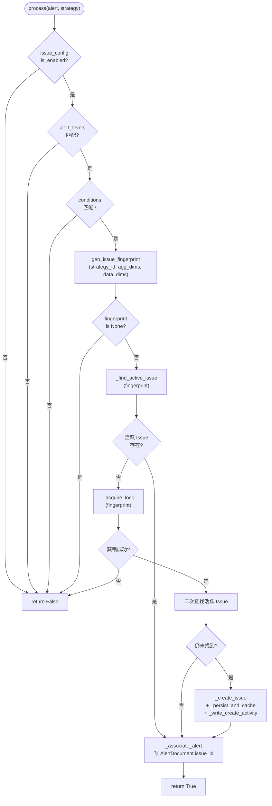
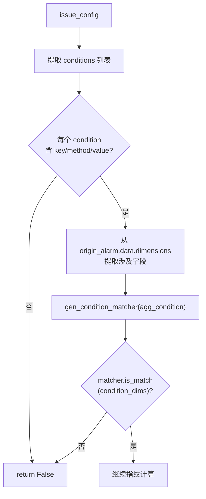
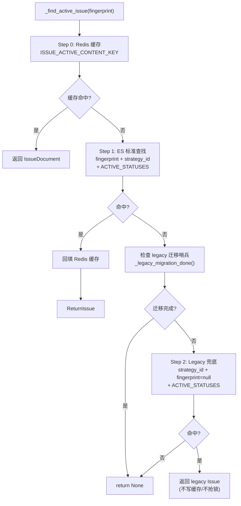

# Issue 聚合引擎

<cite>
**本文引用的文件**
- [issue_processor.py](file://bkmonitor/alarm_backends/service/fta_action/issue_processor.py)
- [constants/issue.py](file://bkmonitor/constants/issue.py)
- [documents/issue.py](file://bkmonitor/bkmonitor/documents/issue.py)
</cite>

## 目录
1. [简介](#简介)
2. [核心流程](#核心流程)
3. [指纹计算](#指纹计算)
4. [配置校验与条件过滤](#配置校验与条件过滤)
5. [活跃 Issue 查找](#活跃-issue-查找)
6. [创建新 Issue](#创建新-issue)
7. [告警关联](#告警关联)
8. [并发控制](#并发控制)
9. [高基数防护](#高基数防护)
10. [部署窗口期兼容](#部署窗口期兼容)
11. [结论](#结论)

## 简介

Issue 聚合引擎（`IssueAggregationProcessor`）是 fta_action 阶段的核心组件，负责将每条告警事件聚合到对应的 Issue。其核心逻辑是：

1. 从策略配置中提取 `issue_config`（是否启用、聚合维度、告警级别、过滤条件）
2. 计算告警的 fingerprint（指纹）
3. 按 fingerprint 查找已有活跃 Issue，存在则关联，不存在则创建新 Issue
4. 将 `AlertDocument.issue_id` 写回告警文档，完成双向绑定

## 核心流程



图表来源
- [issue_processor.py:117-185](file://bkmonitor/alarm_backends/service/fta_action/issue_processor.py#L117-L185)

章节来源
- [issue_processor.py:109-631](file://bkmonitor/alarm_backends/service/fta_action/issue_processor.py#L109-L631)

## 指纹计算

### `gen_issue_fingerprint(strategy_id, aggregate_dimensions, data_dimensions)`

指纹是 Issue 聚合的核心标识，由 `count_md5` 算法生成。其设计确保：

- **同一策略 + 同一维度组合** → 同一 fingerprint → 同一活跃 Issue
- **不同策略** → 不同 fingerprint（即使维度值相同）
- **维度顺序无关**：按 key 排序后参与计算，配置顺序不影响结果

**计算规则**：

```
payload = ["strategy:{strategy_id}"]
for key in sorted(aggregate_dimensions):
    value = data_dimensions.get(key)
    if value is None or str(value).strip() == "":
        return None  # 维度缺失，跳过该告警
    payload.append(f"{key}={str(value).strip()}")
return count_md5(payload)
```

**关键设计决策**：

| 决策 | 说明 |
|------|------|
| 每个元素带 prefix（`strategy:` / `key=value`） | 防止 `count_md5` 内部 `list_sort=True` 导致维度错位（如 `{a:X,b:Y}` 与 `{a:Y,b:X}` 排序后相同） |
| 取值源为 `origin_alarm.data.dimensions` | adapter 收编前的原始维度，命名层级与 `issue_config.aggregate_dimensions` 严格一致 |
| 维度缺失时返回 `None` | 调用方据此跳过该告警，避免"维度凑不齐"的告警进入任何 Issue 池 |
| 空 `aggregate_dimensions` 退化为 `count_md5([f"strategy:{id}"])` | 一个策略一个 Issue（catch-all 退化路径） |

**取值源选型说明**：

- **不能用 `alert.dimensions`**：trigger 阶段会将主机维度收编为 `target_type`/`target`，命名层级错位
- **不能用 event 顶层**：adapter 已 pop 走 `bk_host_id` / `bk_target_ip` 等关键字段
- **使用 `origin_alarm.data.dimensions`**：来自 adapter 收编前的原始 record，保留完整原始命名

章节来源
- [issue_processor.py:38-77](file://bkmonitor/alarm_backends/service/fta_action/issue_processor.py#L38-L77)

### 维度值快照（dimension_values）

与 fingerprint 同口径：相同的 `sorted(aggregate_dimensions)` 排序、相同的 `str(...).strip()` 归一化。创建 Issue 时作为 `dimension_values` 字段持久化，前端可按 `dimension_values.bk_host_id="X"` 直接过滤。

## 配置校验与条件过滤

### 1. 配置校验

`issue_config` 从策略缓存 JSON 直接读取，无需额外 Redis 查询。

必须满足：
- `issue_config` 存在且 `is_enabled = True`
- `alert_levels` 非空且当前告警 severity 在列表中

### 2. 条件过滤（conditions）

复用 `access` 模块的 `gen_condition_matcher` 进行维度匹配。

**关键约束**：`conditions.key` 来自 `issue_config`（与 `aggregate_dimensions` 同层级，含 `bk_target_*` 命名），必须从 `origin_alarm.data.dimensions` 取值匹配。



图表来源
- [issue_processor.py:198-265](file://bkmonitor/alarm_backends/service/fta_action/issue_processor.py#L198-L265)

## 活跃 Issue 查找

### `_find_active_issue(fingerprint)` — 三级查找策略



**三级策略说明**：

| 层级 | 场景 | 说明 |
|------|------|------|
| Step 0 | 正常运行 | Redis 缓存命中，最快路径 |
| Step 1 | 缓存未命中 | 按 fingerprint + strategy_id 查 ES 活跃 Issue，命中后回填缓存 |
| Step 2 | 部署窗口期 | 仅在 legacy 迁移未完成时触发，read-only 兜底到 fingerprint=null 的旧 Issue |

章节来源
- [issue_processor.py:295-367](file://bkmonitor/alarm_backends/service/fta_action/issue_processor.py#L295-L367)

## 创建新 Issue

### `_create_issue(config, fingerprint, dimension_values)`

创建新 Issue 时的关键决策：

| 属性 | 取值逻辑 |
|------|----------|
| `status` | 固定为 `PENDING_REVIEW` |
| `priority` | 固定为 `P2`（默认值） |
| `is_regression` | 同 fingerprint 有 RESOLVED 历史则为 True |
| `name` | `{strategy_name} - {v1} \| {v2}`，回归时前缀 `[回归]`，单值过长截断 |
| `labels` | 来自策略的 `labels` 列表 |
| `aggregate_config` | 快照当前 issue_config（aggregate_dimensions / conditions / alert_levels） |
| `id` | `{create_time_timestamp}{uuid8}` |

**默认名称生成**（`build_issue_default_name`）：
- 格式：`[回归] {strategy_name} - {v1} | {v2}`
- 维度值按 key 排序拼接，与 fingerprint 排序口径一致
- 单值超过 40 字符时截断为 `{prefix}...`
- 空 dimension_values 时不追加后缀

章节来源
- [issue_processor.py:84-106](file://bkmonitor/alarm_backends/service/fta_action/issue_processor.py#L84-L106)
- [issue_processor.py:384-425](file://bkmonitor/alarm_backends/service/fta_action/issue_processor.py#L384-L425)

## 告警关联

### `_associate_alert(issue)`

将 `AlertDocument.issue_id` 写回告警文档，完成双向绑定：

```
self.alert.issue_id = issue.id
AlertDocument.bulk_create(
    [AlertDocument(id=self.alert.id, issue_id=issue.id)],
    action=BulkActionType.UPSERT,
)
```

- 使用 `UPSERT` 操作（非 INSERT），幂等写入
- 失败重试 1 次；仍失败则 error log 记录，不阻塞主流程

章节来源
- [issue_processor.py:568-595](file://bkmonitor/alarm_backends/service/fta_action/issue_processor.py#L568-L595)

## 并发控制

### `_acquire_lock(fingerprint)` — 基于 Redis 的分布式锁

| 特性 | 说明 |
|------|------|
| 锁粒度 | 按 fingerprint，不同 fingerprint 互不阻塞 |
| 获取方式 | 一次性尝试（`SET NX EX`），失败返回 `None` |
| 释放安全 | 使用 `_TokenLock`（Lua 脚本），只释放自己持有的锁 |
| TTL | 由 `ISSUE_FINGERPRINT_LOCK.ttl` 配置 |

**Token 锁机制**：
```lua
if redis.call("get", KEYS[1]) == ARGV[1] then
    return redis.call("del", KEYS[1])
else
    return 0
end
```
避免 TTL 过期后误删其他 worker 持有的锁。

章节来源
- [issue_processor.py:597-631](file://bkmonitor/alarm_backends/service/fta_action/issue_processor.py#L597-L631)

## 高基数防护

### `_check_active_issue_count()` — warn-only 策略

当单策略活跃 Issue 数超过 `ISSUE_MAX_ACTIVE_PER_STRATEGY` 阈值时：
- **仅 metric + warning**，不阻塞新建
- 运维通过 `bkmonitor_issue_fingerprint_blocked{reason=high_cardinality}` 速率告警发现

**性能优化**：
- ES count 结果缓存到 Redis，5 分钟 TTL（±20% jitter 打散 thundering herd）
- 缓存 miss 时用 `SET NX EX 10s` 短锁让一个 worker 探 ES，其他 worker 跳过

**设计决策**：历史实现曾触达阈值时 return False 阻塞新建，但这会导致超阈值后该策略所有告警永久失联。改为 warn-only 后，告警仍正常创建 Issue，仅上报指标。

章节来源
- [issue_processor.py:437-512](file://bkmonitor/alarm_backends/service/fta_action/issue_processor.py#L437-L512)

## 部署窗口期兼容

### Legacy 迁移机制

Issue 从旧 1:1 模型（一策略一 Issue）迁移到 fingerprint 模型后：

1. **部署时**：`post_migrate` hook 调用 `migrate_legacy_active_issues`，将 fingerprint=null 的活跃 Issue RESOLVE
2. **运行期**：`_find_active_issue` 的 Step 2 兜底仅在迁移未完成时短期触达
3. **全局哨兵**：`ISSUE_LEGACY_MIGRATION_DONE_KEY` 标记迁移完成，避免每个新建路径都打 fingerprint=null 全索引查询
4. **周期任务续命**：`_renew_legacy_migration_done_sentinel_if_needed` 防止 30 天 TTL 失效后 processor 退化到 fallback ES 查询

章节来源
- [issue_processor.py:333-367](file://bkmonitor/alarm_backends/service/fta_action/issue_processor.py#L333-L367)

## 结论

Issue 聚合引擎通过 fingerprint 指纹机制实现了"同一具体问题 → 同一 Issue"的聚合语义。其设计在正确性（并发锁 + 三级查找）、性能（缓存 + 批处理）、可观测性（metric + warn-only）三个维度取得了平衡。部署窗口期的 legacy 兜底机制确保了从旧模型到新模型的平滑过渡。
