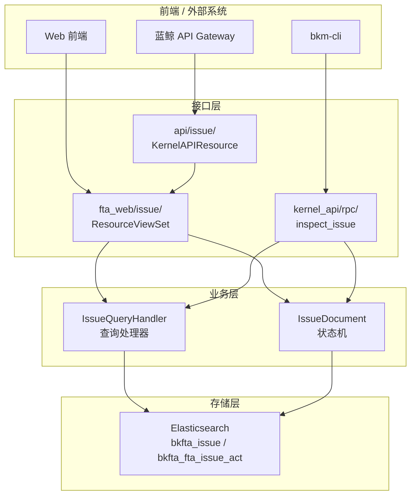
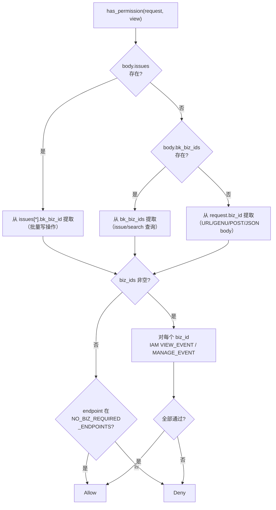

# Issue API 接口

<cite>
**本文引用的文件**
- [fta_web/issue/views.py](file://bkmonitor/packages/fta_web/issue/views.py)
- [fta_web/issue/resources.py](file://bkmonitor/packages/fta_web/issue/resources.py)
- [fta_web/issue/handlers/issue.py](file://bkmonitor/packages/fta_web/issue/handlers/issue.py)
- [fta_web/issue/serializers.py](file://bkmonitor/packages/fta_web/issue/serializers.py)
- [fta_web/issue/urls.py](file://bkmonitor/packages/fta_web/issue/urls.py)
- [kernel_api/rpc/functions/bkm_cli/issue.py](file://bkmonitor/kernel_api/rpc/functions/bkm_cli/issue.py)
- [api/issue/default.py](file://bkmonitor/api/issue/default.py)
</cite>

## 目录
1. [简介](#简介)
2. [接口分层](#接口分层)
3. [Web RESTful API](#web-restful-api)
4. [API Gateway 接口](#api-gateway-接口)
5. [bkm-cli RPC 接口](#bkm-cli-rpc-接口)
6. [权限体系](#权限体系)
7. [查询处理器](#查询处理器)
8. [结论](#结论)

## 简介

Issue 功能对外提供三层接口访问：
1. **Web RESTful API**（`fta_web/issue/`）— 前端直接调用的完整 CRUD 接口
2. **API Gateway**（`api/issue/`）— 通过蓝鲸 API 网关暴露的 Kernel API 接口
3. **bkm-cli RPC**（`kernel_api/rpc/functions/bkm_cli/`）— 供 bkm-cli 命令行工具调用的只读诊断接口

## 接口分层



## Web RESTful API

### 端点总览

| 方法 | 路径 | 权限 | 说明 |
|------|------|------|------|
| POST | `/issue/search` | VIEW_EVENT | Issue 列表查询（支持分页、过滤、排序、时间分片） |
| POST | `/issue/top_n` | VIEW_EVENT | TopN 统计聚合（按维度字段做基数聚合） |
| GET | `/issue/detail` | VIEW_EVENT | Issue 详情（元数据 + 富化维度展示名） |
| GET | `/issue/activities` | VIEW_EVENT | 活动日志查询 |
| GET | `/issue/history` | VIEW_EVENT | 同策略历史 Issue（已解决） |
| POST | `/issue/export` | VIEW_EVENT | 导出 Issue 列表 |
| POST | `/issue/recent_assignees` | VIEW_EVENT | 最近使用负责人（ES 聚合） |
| POST | `/issue/assign` | MANAGE_EVENT | 指派/改派负责人（支持批量） |
| POST | `/issue/resolve` | MANAGE_EVENT | 标记已解决（支持批量） |
| POST | `/issue/reopen` | MANAGE_EVENT | 重新打开（RESOLVED → UNRESOLVED） |
| POST | `/issue/archive` | MANAGE_EVENT | 归档 Issue（实例级批量） |
| POST | `/issue/restore` | MANAGE_EVENT | 恢复归档 Issue |
| POST | `/issue/update_priority` | MANAGE_EVENT | 修改优先级（支持批量） |
| POST | `/issue/rename` | MANAGE_EVENT | 重命名 Issue |
| POST | `/issue/add_follow_up` | MANAGE_EVENT | 添加跟进评论（支持批量） |
| POST | `/issue/edit_follow_up` | MANAGE_EVENT | 编辑跟进评论 |
| POST | `/issue/trend` | VIEW_EVENT | Issue 趋势统计（按时间分片聚合活跃/已解决数量） |
| POST | `/issue/get_tapd_fields` | VIEW_EVENT | 获取 TAPD 单类型的可选字段定义 |
| POST | `/issue/search_tapd_items` | VIEW_EVENT | 搜索 TAPD 项（需求/缺陷/任务） |
| POST | `/issue/create_tapd` | MANAGE_EVENT | 创建 TAPD 单并关联到当前 Issue |
| POST | `/issue/link_tapd` | MANAGE_EVENT | 将 Issue 关联到已有 TAPD 单 |
| POST | `/issue/tapd_relations` | VIEW_EVENT | 查询 Issue 的 TAPD 关联列表 |
| POST | `/tapd/workspace` | VIEW_EVENT | 获取已授权的 TAPD 项目列表（应用态） |
| POST | `/tapd/user_workspace` | VIEW_EVENT | 当前用户可见的 TAPD 项目列表（含 install_url，需用户态授权） |
| POST | `/tapd/unbind_workspace` | MANAGE_EVENT | 手动解绑 TAPD 工作区（持久化 tombstone，阻断自动回绑） |
| POST | `/tapd/rebind_workspace` | MANAGE_EVENT | 重新关联已解绑的 TAPD 工作区 |
| POST | `/tapd/revoke_auth` | MANAGE_EVENT | 撤销用户 TAPD 授权（清除 Redis `tapd_uat:{tenant}:{user}` token） |

章节来源
- [fta_web/issue/views.py:185-243](file://bkmonitor/packages/fta_web/issue/views.py#L185-L243)

### 只读 vs 写操作

- **只读接口**（VIEW_EVENT）：`search`, `detail`, `activities`, `history`, `top_n`, `export`, `recent_assignees`, `trend`, `get_tapd_fields`, `search_tapd_items`, `tapd_relations`, `tapd/workspace`, `tapd/user_workspace`
- **写操作**（MANAGE_EVENT）：`assign`, `resolve`, `reopen`, `archive`, `restore`, `update_priority`, `rename`, `add_follow_up`, `edit_follow_up`, `create_tapd`, `link_tapd`, `unbind_workspace`, `rebind_workspace`, `revoke_auth`

### 无需业务 ID 的接口

`search`, `top_n`, `recent_assignees`, `tapd/workspace`, `tapd/user_workspace` 五个接口允许不传 `bk_biz_id`，由业务层自行限制数据范围。这支持跨业务空间的 Issue 查询与 TAPD 用户态授权场景。

章节来源
- [fta_web/issue/views.py:23-63](file://bkmonitor/packages/fta_web/issue/views.py#L23-L63)

### 批量操作框架

`_run_batch(issues, action_fn, max_workers=10)` 是批量操作的公共执行框架：

```python
def _run_batch(issues: list[dict], action_fn: Callable[[int, str], dict], max_workers=10) -> dict:
```

| 特性 | 说明 |
|------|------|
| 并发模型 | ThreadPoolExecutor，每条 Issue 一个任务 |
| 错误隔离 | 单条失败不影响其他条目 |
| 返回格式 | `{"succeeded": [...], "failed": [{"bk_biz_id", "issue_id", "message"}]}` |
| 异常类型 | `IssueNotFoundError` / `IssueDocumentWriteError` / 通用 Exception |

章节来源
- [fta_web/issue/resources.py:85-150](file://bkmonitor/packages/fta_web/issue/resources.py#L85-L150)

### Issue TopN 查询

`IssueTopNResource` 支持按时间分片并行查询，提升大时间跨度下的 ES 聚合性能：

| 特性 | 说明 |
|------|------|
| 分片触发条件 | `need_time_partition=True` 且时间跨度 > 7 天 |
| 小时间范围 | 直接单次 ES 聚合 |
| fields 去重 | 入口统一去重，防止分片合并时重复累加导致 count 虚高 |
| 业务权限 | 自动拆分 authorized / unauthorized bizs，无权限业务补 0 计数 |

章节来源
- [fta_web/issue/resources.py:216-455](file://bkmonitor/packages/fta_web/issue/resources.py#L216-L455)

### TAPD 工作空间查询

`ListTapdWorkspaceResource` 支持查询已授权的 TAPD 项目列表，并并发获取详细信息：

| 特性 | 说明 |
|------|------|
| 分页 | 支持 `page` + `limit`（默认 30，最大 200） |
| 排序 | 支持 `order` 参数（默认 `created desc`） |
| 字段过滤 | `fields` 参数支持逗号分隔指定字段 |
| 并发模型 | `ThreadPoolExecutor`，max_workers=10，并发获取每个 workspace 的详细信息 |
| 容错 | 单个 workspace 获取失败不阻塞其他，降级返回基本信息 |

章节来源
- [fta_web/issue/resources.py:1461-1553](file://bkmonitor/packages/fta_web/issue/resources.py#L1461-L1553)

### Issue 趋势查询

`IssueTrendResource`（`POST /issue/trend`）按时间分片聚合 Issue 活跃/已解决趋势，便于前端绘制趋势曲线：

| 特性 | 说明 |
|------|------|
| 时间分片 | 复用 `slice_time_interval` 按天/小时切片，大跨度下并行查询降低 ES 压力 |
| 聚合维度 | 按 `status`（`active`/`resolved`）与 `priority` 做基数/计数聚合 |
| 业务权限 | 自动拆分 authorized / unauthorized bizs，无权限业务补 0 计数 |
| 修复逻辑 | 内置 `_repair_missing_resolved_activity`，补全缺失的 `resolved` 活动记录以保证趋势准确 |

章节来源
- [fta_web/issue/resources.py:458-660](file://bkmonitor/packages/fta_web/issue/resources.py#L458-L660)

### TAPD 关联管理（创建 / 关联 / 解绑 / 授权）

Issue 通过 TAPD 关联能力将告警问题单与 TAPD 工作项打通。相关端点由 `TAPD_ENDPOINTS` 统一圈定，全部前置校验 `TAPDAuthPermission`（用户态 TAPD token）：

| 端点 | Resource 类 | 说明 |
|------|-------------|------|
| `issue/get_tapd_fields` | `GetTapdFieldsResource` | 拉取 TAPD 单类型（需求/缺陷/任务）的字段定义与可选项 |
| `issue/search_tapd_items` | `SearchTAPDItemsResource` | 按关键字/类型搜索 TAPD 项 |
| `issue/create_tapd` | `CreateTapdResource` | 创建 TAPD 单，写 `IssueTapdRelation` 并记 `create_tapd` 活动 |
| `issue/link_tapd` | `LinkIssueToTapdResource` | 关联 Issue 到已有 TAPD 单（批量查重 + 记 `tapd_link` 活动） |
| `issue/tapd_relations` | `ListIssueTapdRelationsResource` | 列出 Issue 的全部 TAPD 关联 |
| `tapd/user_workspace` | `ListUserTapdWorkspaceResource` | 当前用户可见 TAPD 项目（含 `install_url`），携带 `success_url` 可触发授权跳转 |
| `tapd/unbind_workspace` | `UnbindTapdWorkspaceResource` | 手动解绑工作区，持久化 tombstone（`TapdWorkspaceManualUnbind`），阻断周期任务自动回绑 |
| `tapd/rebind_workspace` | `RebindTapdWorkspaceResource` | 重新关联已解绑工作区（清除 tombstone） |
| `tapd/revoke_auth` | `RevokeTapdUserAuthResource` | 撤销用户授权，清除 Redis `tapd_uat:{tenant}:{user}` |

**OAuth 回调**：`tapd/oauth_callback/`、`tapd/app_install_callback/` 两个 `csrf_exempt` 路由完成用户态授权码兑换并写回 `tapd_uat` token。

**用户态授权校验**：`TAPDAuthPermission` 对所有 `TAPD_ENDPOINTS` 中的接口前置检查 Redis `tapd_uat:{tenant}:{user}`；未授权时若携带 `success_url`（当前仅 `tapd/user_workspace`）返回 403 + `auth_url` 引导前端跳转授权页，其余接口返回 403 提示先授权。

章节来源
- [fta_web/issue/views.py:50-178](file://bkmonitor/packages/fta_web/issue/views.py#L50-L178)
- [fta_web/issue/resources.py:1554-3100](file://bkmonitor/packages/fta_web/issue/resources.py#L1554-L3100)
- [packages/fta_web/issue/urls.py:1-20](file://bkmonitor/packages/fta_web/issue/urls.py#L1-L20)

## API Gateway 接口

`api/issue/default.py` 定义了通过蓝鲸 API Gateway 访问的 Issue 操作接口：

| 类 | action | 方法 | 说明 |
|----|--------|------|------|
| `AssignResource` | `/app/issue/assign/` | POST | 指派/改派负责人 |
| `ResolveResource` | `/app/issue/resolve/` | POST | 标记已解决 |
| `ReopenResource` | `/app/issue/reopen/` | POST | 重新打开 |
| `ArchiveResource` | `/app/issue/archive/` | POST | 归档 |
| `RestoreResource` | `/app/issue/restore/` | POST | 恢复归档 |
| `UpdatePriorityResource` | `/app/issue/update_priority/` | POST | 修改优先级 |
| `RenameResource` | `/app/issue/rename/` | POST | 重命名 |
| `AddFollowUpResource` | `/app/issue/add_follow_up/` | POST | 添加跟进评论 |
| `EditFollowUpResource` | `/app/issue/edit_follow_up/` | POST | 编辑评论 |

**超时配置**：`TIMEOUT = 300` 秒

**Base URL**：

```
{NEW_MONITOR_API_BASE_URL} 或 {BK_COMPONENT_API_URL}/api/bk-monitor/{APIGW_STAGE}/
```

章节来源
- [api/issue/default.py:1-93](file://bkmonitor/api/issue/default.py#L1-L93)

## bkm-cli RPC 接口

### `inspect_issue(params)` — CLI 诊断入口

通过 bkm-cli 命令行工具调用，提供 4 种只读 operation：

| operation | 参数 | 说明 |
|-----------|------|------|
| `detail` | `issue_id`, `bk_biz_id`(可选) | 查询单个 Issue 详情 |
| `list_by_strategy` | `strategy_id`, `bk_biz_id`, `status`(可选), `start_time/end_time`(可选) | 按策略 ID 列出 Issue |
| `list_by_fingerprint` | `fingerprint`, `bk_biz_id`, `status`(可选), `start_time/end_time`(可选) | 按 fingerprint 列出 Issue |
| `list_activities` | `issue_id`, `bk_biz_id`(可选) | 查询 Issue 活动日志 |

**分页规范**：

| 属性 | 值 |
|------|-----|
| 默认 limit | `DEFAULT_LIMIT = 50` |
| 最大 limit | `MAX_LIMIT = 500` |
| 排序 | `create_time` 降序 |

**关键设计**：

1. **复用 fta_web handler**：`_inspect_issue_detail` 内部调用 `IssueQueryHandler.clean_document` 确保字段清洗、indices 选择、anomaly_message 填充与 web 入口一致
2. **JSON-safe 输出**：`_to_json_safe()` 使用 `DjangoJSONEncoder` 处理 `gettext_lazy`、datetime、Decimal 等非 JSON 类型
3. **业务权限校验**：`bk_biz_id` 为可选参数，传入时校验 Issue 归属

**返回格式（detail）**：

```json
{
    "operation": "detail",
    "bk_biz_id": 2,
    "issue_id": "1718000000abc12345",
    "issue": {
        "id": "1718000000abc12345",
        "strategy_id": "123",
        "name": "CPU使用率过高 - 10.0.0.1",
        "status": "unresolved",
        "priority": "P2",
        "assignee": ["admin"],
        "alert_count": 5,
        "impact_scope": { ... },
        "dimension_values": { "bk_host_id": "9185731" },
        ...
    }
}
```

章节来源
- [kernel_api/rpc/functions/bkm_cli/issue.py:44-200](file://bkmonitor/kernel_api/rpc/functions/bkm_cli/issue.py#L44-L200)

## 权限体系

### IssueBusinessActionPermission

自定义权限校验器，处理 Issue 接口中 `bk_biz_id` 的三种来源：



**权限粒度**：

| 接口类型 | IAM Action |
|----------|------------|
| 只读接口 | `VIEW_EVENT` |
| 写操作 | `MANAGE_EVENT` |

**用户态授权（TAPD 接口）**：所有 `TAPD_ENDPOINTS` 中的接口在 IAM 校验之外，额外由 `TAPDAuthPermission` 前置校验 Redis `tapd_uat:{tenant}:{user}` 用户态 token。未授权时携带 `success_url` 的接口（当前仅 `tapd/user_workspace`）返回 403 + `auth_url` 引导前端跳转授权页，其余接口返回 403 提示先完成授权。`tapd/revoke_auth` 用于主动清除该 token。

章节来源
- [fta_web/issue/views.py:65-178](file://bkmonitor/packages/fta_web/issue/views.py#L65-L178)

## 查询处理器

### IssueQueryHandler

继承 `BaseBizQueryHandler`，提供 Issue 列表的高级查询能力。

**支持过滤条件**：

| 查询字段 | 类型 | 说明 |
|----------|------|------|
| `status` | keyword | 支持虚拟状态（MY_ASSIGNEE / NO_ASSIGNEE） |
| `priority` | keyword | P0/P1/P2 |
| `assignee` | keyword | 负责人 |
| `strategy_id` | keyword | 策略 ID |
| `strategy_name` | text (raw) | 策略名称 |
| `bk_biz_id` | keyword | 业务 ID |
| `labels` | keyword | 标签 |
| `fingerprint` | keyword | Issue 指纹 |
| `dimension_values.{key}` | keyword | 维度值精确过滤 |
| `impact_scope.{dimension}` | keyword | 影响范围维度过滤 |

**时间范围语义**：

- `end_time` 约束 `create_time`（该时间前已创建）
- `start_time` 约束 `resolved_time`（在该时间之后才解决）
- 时间分片模式下，按 `resolved_time` 唯一归属分片，避免重复计数

**排序**：默认 `-first_alert_time, priority, status`

章节来源
- [fta_web/issue/handlers/issue.py:86-200](file://bkmonitor/packages/fta_web/issue/handlers/issue.py#L86-L200)

### IssueQueryTransformer

将前端查询参数转换为 ES DSL，负责字段映射：

| 前端字段 | ES 存储格式 |
|----------|-------------|
| `name` | `name.raw`（精确查询） |
| `strategy_name` | `strategy_name.raw`（精确查询） |
| `fingerprint` | `fingerprint`（本身是 keyword） |
| `impact_scope.{dim}` | `impact_scope.{dim}.instance_list.{id_field}`（exists 查询） |

章节来源
- [fta_web/issue/handlers/issue.py:36-83](file://bkmonitor/packages/fta_web/issue/handlers/issue.py#L36-L83)

## 结论

Issue 的接口层设计体现了良好的分层架构：Web RESTful API 提供完整的 CRUD 能力，API Gateway 提供标准化的外部对接入口，bkm-cli RPC 提供运维诊断工具。三层接口共享业务层（`IssueQueryHandler`、`IssueDocument` 状态机），确保数据查询和操作的语义一致性。权限体系通过 `IssueBusinessActionPermission` 处理多种 `bk_biz_id` 来源场景，在不侵入框架的前提下实现了细粒度的 IAM 控制。
