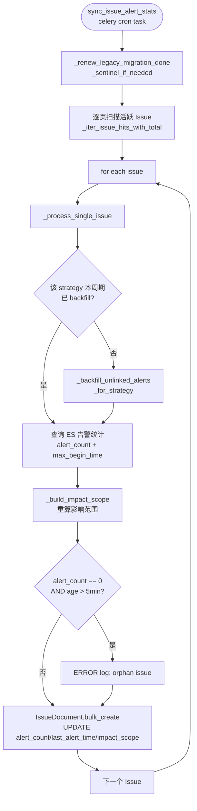
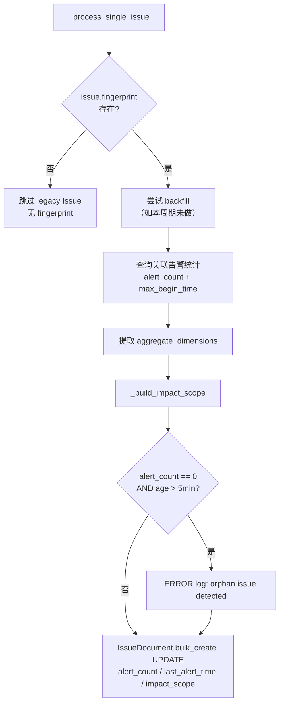
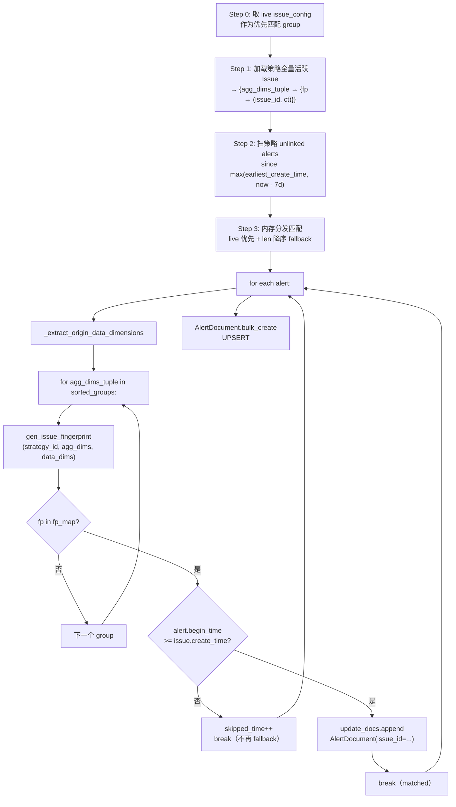
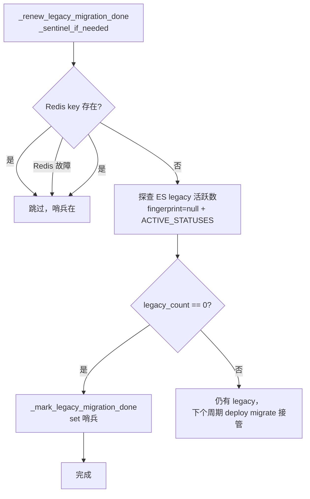
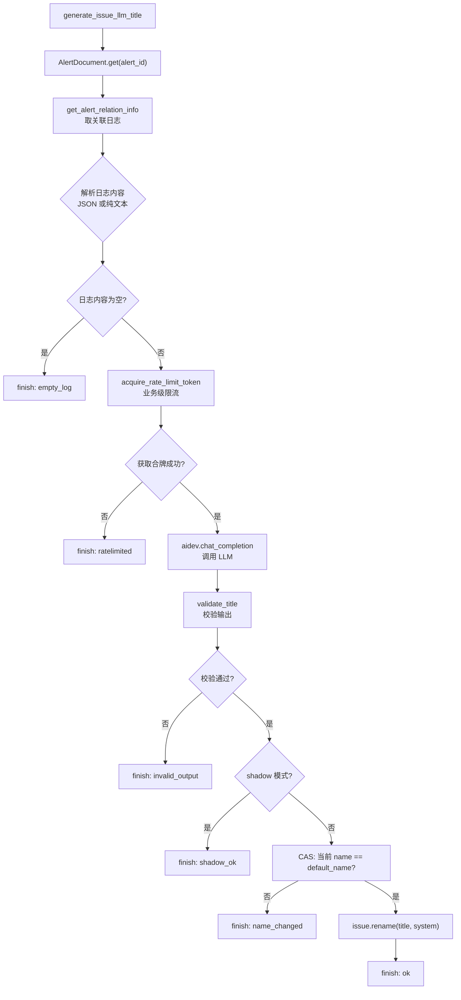

# Issue 周期任务

<cite>
**本文引用的文件**
- [issue_tasks.py](file://bkmonitor/alarm_backends/service/fta_action/tasks/issue_tasks.py)
- [issue_processor.py](file://bkmonitor/alarm_backends/service/fta_action/issue_processor.py)
- [documents/issue.py](file://bkmonitor/bkmonitor/documents/issue.py)
- [documents/alert.py](file://bkmonitor/bkmonitor/documents/alert.py)
</cite>

## 目录
1. [简介](#简介)
2. [任务架构](#任务架构)
3. [sync_issue_alert_stats 主任务](#sync_issue_alert_stats-主任务)
4. [单条 Issue 处理流程](#单条-issue-处理流程)
5. [漏关联补偿（backfill）](#漏关联补偿backfill)
6. [影响范围重算（impact_scope）](#影响范围重算impact_scope)
7. [orphan Issue 检测](#orphan-issue-检测)
8. [Legacy 迁移哨兵续命](#legacy-迁移哨兵续命)
9. [遍历与分页工具](#遍历与分页工具)
10. [LLM 标题生成任务](#llm-标题生成任务)
11. [LLM 标题示例缓存刷新](#llm-标题示例缓存刷新)
12. [结论](#结论)

## 简介

Issue 周期任务（celery periodic tasks）负责定期维护 Issue 的统计信息与数据一致性。核心任务 `sync_issue_alert_stats` 通过 celery beat 调度，对全量活跃 Issue 执行以下 5 项操作：

1. **告警统计同步**：更新 `alert_count` 和 `last_alert_time`
2. **漏关联补偿**：回填 `AlertDocument.issue_id` 未写入的告警
3. **影响范围重算**：基于关联告警重新汇总 `impact_scope`
4. **orphan Issue 检测**：发现无关联告警的孤立 Issue 并告警
5. **Legacy 哨兵续命**：防止 30 天 TTL 失效后 processor 退化到 fallback ES 查询
6. **LLM 标题示例缓存刷新**：周期预计算用户改名的 few-shot 示例缓存

## 任务架构



图表来源
- [issue_tasks.py:40-105](file://bkmonitor/alarm_backends/service/fta_action/tasks/issue_tasks.py#L36-L100)

## sync_issue_alert_stats 主任务

```python
@app.task(ignore_result=True, queue="celery_action_cron")
def sync_issue_alert_stats():
```

| 属性 | 值 |
|------|-----|
| Queue | `celery_action_cron` |
| 扫描页大小 | `ISSUE_SCAN_PAGE_SIZE = 500` |
| 告警扫描页大小 | `ALERT_SCAN_PAGE_SIZE = 500` |
| 进度日志间隔 | 每 100 条 |
| 异常处理 | 单条失败不影响其他条目，异常统一计入 failed 计数 |

**执行流程**：

```
1. 续命 legacy 迁移哨兵（如需要）
2. 逐页扫描全量活跃 Issue
3. 对每条 Issue 调用 _process_single_issue
4. 汇总统计：processed / total / failed / strategies_backfilled / elapsed
```

**性能优化**：

| 优化点 | 说明 |
|--------|------|
| 策略级 backfill 去重 | 同周期内同 strategy 只做一次 backfill，避免 O(N×M) 放大 |
| search_after 分页 | 使用 ES search_after 而非 from/size，避免深度分页性能退化 |
| 批量写入 | 告警 backfill 结果批量 UPSERT，而非逐条更新 |

章节来源
- [issue_tasks.py:40-105](file://bkmonitor/alarm_backends/service/fta_action/tasks/issue_tasks.py#L36-L100)

## 单条 Issue 处理流程

### `_process_single_issue(issue, backfilled_strategies)`



**关键处理**：

| 操作 | 说明 |
|------|------|
| 跳过 legacy Issue | `fingerprint` 为空的 Issue 直接跳过（部署窗口期短期存在） |
| ES 统计查询 | `value_count` 聚合取 alert_count，`max` 聚合取 last_alert_time |
| 时间戳转换 | ES date 聚合返回毫秒，除以 1000 转为 epoch_second |
| aggregate_dims 容错 | `None` 与 `[]` 等价处理 |

章节来源
- [issue_tasks.py:149-225](file://bkmonitor/alarm_backends/service/fta_action/tasks/issue_tasks.py#L149-L225)

## 漏关联补偿（backfill）

### `_backfill_unlinked_alerts_for_strategy(strategy_id)` — 策略级批量回填

这是 Issue 周期任务中最复杂的逻辑，解决告警写入时 `AlertDocument.issue_id` 可能遗漏的问题。

#### 为什么需要 backfill？

Issue 创建和告警关联发生在 fta_action 阶段（通过 `_associate_alert`），但以下场景可能导致 `issue_id` 未写入：
- ES 写入瞬时失败（UPSERT 重试仍失败）
- Issue 创建时告警的 `begin_time` 早于 Issue（不满足时间边界）
- 同一告警在 Issue 创建前已存在（周期任务回溯）

#### 旧实现 vs 新实现

| 对比维度 | 旧实现（per-issue） | 新实现（per-strategy） |
|----------|---------------------|------------------------|
| 复杂度 | O(N×M)：每条 Issue 扫一遍同策略 unlinked alerts | O(N+M)：一次 scan 策略 Issue + 一次 scan unlinked alerts |
| 去重 | 同一条 unlinked alert 被扫 N 次 | 同一条 alert 只匹配一次 |
| 时间复杂度 | N 个 Issue × M 条 alert | N + M items + G groups 匹配 |

#### 执行流程



**关键设计决策**：

| 决策 | 说明 |
|------|------|
| 匹配优先级 | live config 对应 group 排第一，其余按 len 降序（具体优先 catch-all） |
| 时间边界 | `alert.begin_time >= issue.create_time`，避免 first_alert_time 与告警时间线断裂 |
| 7 天扫描上限 | 避免长生命周期策略下 scan 范围爆炸；6 个月前漏写由 process 主路径兜底 |
| fail-open | 策略缓存 miss 时退化到不优先 live 路径，按 len 降序匹配 |
| 不预跳过空 data_dimensions | catch-all group 不读 data_dimensions 仍能命中；第三方告警也可被 catch-all Issue backfill |

章节来源
- [issue_tasks.py:226-447](file://bkmonitor/alarm_backends/service/fta_action/tasks/issue_tasks.py#L226-L447)

## 影响范围重算（impact_scope）

### `_build_impact_scope(issue_id, aggregate_dimensions)` — 按关联告警汇总

遍历 Issue 关联的所有告警，按资源维度汇总受影响范围。

#### 支持的资源维度

| 维度 | 数据来源 | 输出格式 |
|------|----------|----------|
| `set` (CMDB 集群) | `bk_topo_node`（set\|开头） | `{count, instance_list[{set_id, display_name}], link_tpl}` |
| `host` (主机) | `bk_host_id` / `ip` | `{count, instance_list[{bk_host_id, bk_biz_id, display_name}], link_tpl}` |
| `service_instances` | `bk_service_instance_id` | `{count, instance_list[{bk_service_instance_id, bk_biz_id, display_name}], link_tpl}` |
| `cluster` / `node` / `service` / `pod` (K8S) | `bcs_cluster_id` + target_type | `{count, instance_list[...], link_tpl}` |
| `apm_app` / `apm_service` (APM) | `app_name` + `service_name` | `{count, instance_list[...], link_tpl}` |

#### 聚合维度收窄

`_allowed_scope_keys(aggregate_dimensions)` 根据 Issue 的聚合维度决定 impact_scope 允许输出哪些 key：

```
- aggregate_dimensions 为空 → 全量输出
- 含 bk_target_ip / bk_host_id → 允许 host, set
- 含 bk_service_instance_id → 允许 service_instances, set
- 含 bcs_cluster_id / pod / node → 允许 cluster, node, pod (+ service 如显式在 dims)
- 含 app_name → 允许 apm_app (+ apm_service 如 service_name 也在 dims)
```

#### CMDB Set 展示名填充

Set 的展示名通过批量查询 CMDB 获得：
1. 解析 `bk_topo_node` 中的 `set|{set_id}`
2. 若 `origin_alarm.dimension_translation` 中包含展示名，直接使用
3. 否则按 `bk_biz_id` 分组，批量调用 `SetManager.mget` 获得 `{biz_name}/{set_name}`

章节来源
- [issue_tasks.py:448-809](file://bkmonitor/alarm_backends/service/fta_action/tasks/issue_tasks.py#L448-L809)

## orphan Issue 检测

**定义**：Issue 创建后 `ORPHAN_ISSUE_THRESHOLD_SECONDS`（300 秒 = 5 分钟）内仍未关联任何告警。

**处理方式**：仅 ERROR log 记录（`[issue] orphan issue detected`），不自动删除或修改 Issue。

**检测位置**：`_process_single_issue` 中，当 `alert_count == 0` 且 `now - issue.create_time > 5min` 时触发。

章节来源
- [issue_tasks.py:31-31](file://bkmonitor/alarm_backends/service/fta_action/tasks/issue_tasks.py#L31-L31)
- [issue_tasks.py:196-199](file://bkmonitor/alarm_backends/service/fta_action/tasks/issue_tasks.py#L196-L199)

## Legacy 迁移哨兵续命

### `_renew_legacy_migration_done_sentinel_if_needed()`

**问题背景**：`ISSUE_LEGACY_MIGRATION_DONE_KEY` 的 TTL 为 30 天。若 30 天内无 deploy 触发 migrate 续命，哨兵过期后 processor 的 `_find_active_issue` Step 2 会永久走 fallback ES 查询（每个新 fingerprint 多打 1-2 次 fingerprint=null 索引查询），造成性能退化。

**续命逻辑**：



**设计要点**：
- Redis 故障 fail-open，不阻塞周期任务主流程
- 仅当确认 legacy=0 时才 set 哨兵，否则交给下次 deploy 的 migrate 处理

章节来源
- [issue_tasks.py:106-148](file://bkmonitor/alarm_backends/service/fta_action/tasks/issue_tasks.py#L106-L148)

## 遍历与分页工具

### `_iter_issue_hits_with_total()` — 逐页迭代活跃 Issue

使用 ES `search_after` 分页，避免 `from/size` 深度分页性能问题。首批响应中提取 `total`（无额外 ES count 请求）。

### `_iter_alert_hit_batches(base_search)` — 逐批迭代告警

同样使用 `search_after` 分页，默认按 `begin_time, id` 排序。

章节来源
- [issue_tasks.py:810-838](file://bkmonitor/alarm_backends/service/fta_action/tasks/issue_tasks.py#L810-L838)

## LLM 标题生成任务

### `generate_issue_llm_title(issue_id, bk_biz_id, default_name, alert_id)`

对新建 Issue 异步调用 LLM 总结关联日志生成可读标题。任何失败静默保留默认名，不重试不入队。

| 属性 | 值 |
|------|-----|
| Queue | `celery_llm_task`（与通知/周期任务隔离） |
| soft_time_limit | 60s |
| time_limit | 90s（硬兆底：下游取关联日志有 `except BaseException` 重试，可能吞掉软限信号） |
| 失败语义 | 任何失败/超时/校验不过 = 静默保留默认名 |

**执行流程**：



图表来源
- [issue_tasks.py:1061-1234](file://bkmonitor/alarm_backends/service/fta_action/tasks/issue_tasks.py#L1061-L1234)

**关键设计决策**：

| 决策 | 说明 |
|------|------|
| 两级闸门 | 部署级 env `ENABLE_ISSUE_LLM_TITLE`（由 helm chart 注入） + 运行时业务白名单 |
| 独立队列 | `celery_llm_task`，与通知/周期任务隔离，队列带 TTL 自蒸发兆底 |
| shadow 模式 | `ISSUE_LLM_TITLE_SHADOW=True` 时只生成+打点，不写入，默认关闭 |
| CAS 保护 | 写入前检查当前 name 是否仍为默认名，避免覆盖用户已修改的标题 |
| 回归前缀 | `[回归]` 前缀由代码层拼接，不交给 LLM 处理 |
| 撞名处理 | LLM 标题业务内撞名时保留默认名，保证可区分 |
| 分步打点 | fetch_log 和 llm_call 分别 observe 耗时，长尾在日志平台查询侧 |
| few-shot 示例 | `resolve_examples` 按 strategy / biz 两级聚合，支持动态 + 静态示例 |

章节来源
- [issue_tasks.py:1061-1234](file://bkmonitor/alarm_backends/service/fta_action/tasks/issue_tasks.py#L1061-L1234)

## LLM 标题示例缓存刷新

### `refresh_issue_llm_title_examples()` — 周期预计算 few-shot 示例

扫描近 30 天用户改名活动（`NAME_CHANGE`，operator 非 system），筛选后按 strategy / biz 两级聚合写 Redis。

| 属性 | 值 |
|------|-----|
| Queue | `celery_action_cron` |
| 扫描范围 | 近 30 天 `NAME_CHANGE` 活动 |
| 单轮扫描上限 | 2000 条 |
| 缓存 TTL | 24h（任务挂掉缓存自然过期，读路径自动退静态示例） |

**筛选规则**（`_collect_example_groups` 纯函数）：
- 改名未被改回（issue 当前 name == 最新改名值）
- 通过输出校验同款禁项清洗
- 同 strategy / biz 内按标题去重

**设计要点**：
- 功能未对任何业务开启时直接跳过，零 ES/Redis 副作用
- 同一 issue 多次改名只取最新一次（按 create_time 降序扫，首见即最新）
- 周期任务任一环节失败均静默，不阻塞调度

章节来源
- [issue_tasks.py:1235-1260](file://bkmonitor/alarm_backends/service/fta_action/tasks/issue_tasks.py#L1235-L1260)

## 结论

Issue 周期任务是 Issue 系统数据一致性的最后防线。通过定期扫描 + 统计更新 + 漏关联补偿 + 影响范围重算的组合，确保即使在 ES 写入瞬时失败、部署窗口期异常等边界条件下，Issue 的统计数据与实际告警状态保持一致。新增的 LLM 标题生成任务通过独立队列 + 异步失败静默的方式增强 Issue 可读性，backfill 的 O(N×M) → O(N+M) 优化展现了在大规模告警场景下的良好性能意识。
