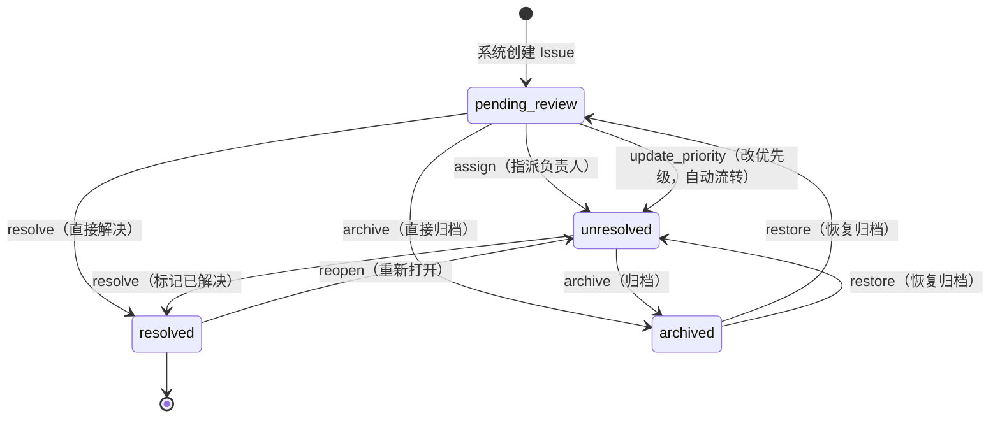
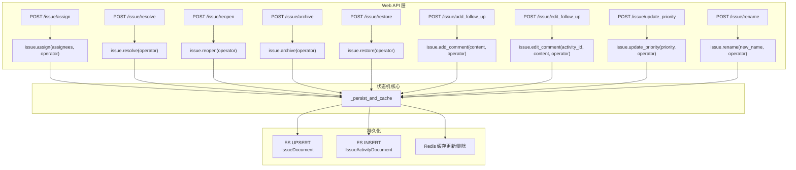
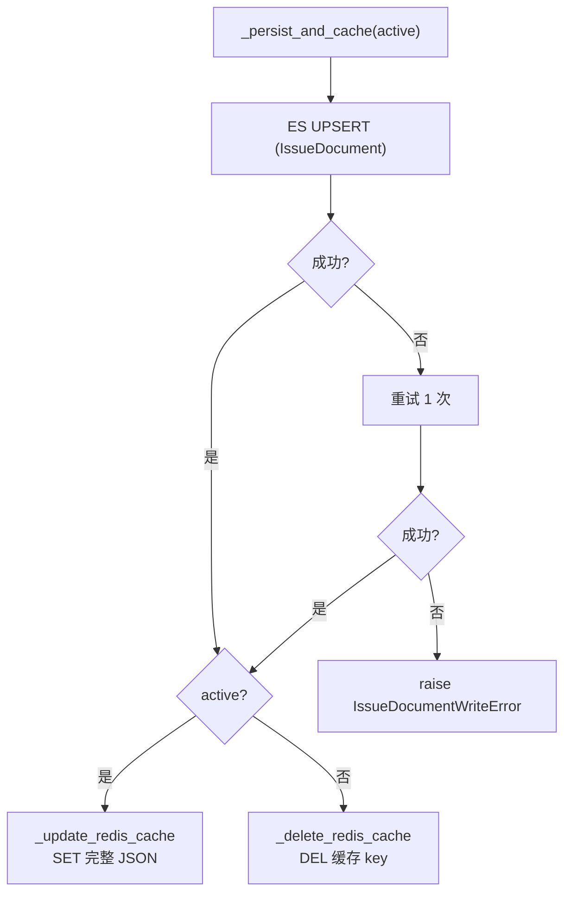

# Issue 状态管理

<cite>
**本文引用的文件**
- [documents/issue.py](file://bkmonitor/bkmonitor/documents/issue.py)
- [constants/issue.py](file://bkmonitor/constants/issue.py)
</cite>

## 目录
1. [简介](#简介)
2. [状态机总览](#状态机总览)
3. [状态转换详解](#状态转换详解)
4. [方法调用路径](#方法调用路径)
5. [活动日志机制](#活动日志机制)
6. [Redis 缓存同步](#redis-缓存同步)
7. [持久化策略](#持久化策略)
8. [特殊场景](#特殊场景)
9. [结论](#结论)

## 简介

Issue 状态管理由 `IssueDocument` 类中的状态机方法实现，覆盖 Issue 从创建到归档的完整生命周期。所有状态变更操作均通过 `IssueActivityDocument` 记录活动日志，形成完整审计链。

核心设计原则：
- **状态机保证**：每个状态转换有明确的合法前置条件，不满足时抛出 `ValueError`
- **活动日志**：每次操作记录 from_value → to_value 变更，永不删除（append-only）
- **双写策略**：ES 持久化 + Redis 缓存同步更新（活跃 Issue 写入缓存，非活跃 Issue 删除缓存）
- **幂等重试**：ES 写入失败自动重试 1 次，仍失败则抛出异常或 error log

## 状态机总览



图表来源
- [documents/issue.py:147-235](file://bkmonitor/bkmonitor/documents/issue.py#L147-L235)

### 状态定义

| 状态 | 值 | 说明 | 是否活跃 |
|------|-----|------|----------|
| 待审核 | `pending_review` | Issue 创建后的初始状态，等待指派 | 是 |
| 未解决 | `unresolved` | 已有负责人，等待处理 | 是 |
| 已解决 | `resolved` | 已标记为解决 | 否 |
| 归档 | `archived` | 已归档，不再活跃 | 否 |

章节来源
- [constants/issue.py:14-27](file://bkmonitor/constants/issue.py#L14-L27)

## 状态转换详解

### 1. `assign()` — 首次指派负责人

| 属性 | 说明 |
|------|------|
| 前置状态 | `pending_review` |
| 后置状态 | `unresolved` |
| 活动日志 | `ASSIGNEE_CHANGE`（None → assignees）+ `STATUS_CHANGE`（pending_review → unresolved） |

```python
def assign(self, assignees: list[str], operator: str) -> list:
    # 前置条件：当前状态必须为 PENDING_REVIEW
    if self.status != IssueStatus.PENDING_REVIEW:
        raise ValueError(...)
    self.assignee = assignees
    self.status = IssueStatus.UNRESOLVED
    self._persist_and_cache(active=True)
    return self._write_activities([...])
```

章节来源
- [documents/issue.py:147-161](file://bkmonitor/bkmonitor/documents/issue.py#L147-L161)

### 2. `reassign()` — 改派负责人

| 属性 | 说明 |
|------|------|
| 前置状态 | 任意状态均可 |
| 后置状态 | 不变 |
| 活动日志 | `ASSIGNEE_CHANGE`（old_assignees → new_assignees） |

关键差异：`assign` 仅用于首次指派（从 pending_review 到 unresolved），`reassign` 用于任意状态下的改派（不触发状态流转）。

章节来源
- [documents/issue.py:163-173](file://bkmonitor/bkmonitor/documents/issue.py#L163-L173)

### 3. `resolve()` — 标记已解决

| 属性 | 说明 |
|------|------|
| 前置状态 | `pending_review` 或 `unresolved`（`ACTIVE_STATUSES`） |
| 后置状态 | `resolved` |
| 活动日志 | `STATUS_CHANGE`（old_status → resolved） |
| 额外字段 | `resolved_time` 设置为当前时间 |

章节来源
- [documents/issue.py:175-190](file://bkmonitor/bkmonitor/documents/issue.py#L175-L190)

### 4. `archive()` — 归档

| 属性 | 说明 |
|------|------|
| 前置状态 | `pending_review` 或 `unresolved`（`ACTIVE_STATUSES`） |
| 后置状态 | `archived` |
| 活动日志 | `STATUS_CHANGE`（old_status → archived） |

归档操作会删除 Redis 缓存（`active=False`）。

章节来源
- [documents/issue.py:192-205](file://bkmonitor/bkmonitor/documents/issue.py#L192-L205)

### 5. `reopen()` — 重新打开

| 属性 | 说明 |
|------|------|
| 前置状态 | `resolved` |
| 后置状态 | `unresolved` |
| 活动日志 | `STATUS_CHANGE`（resolved → unresolved） |

章节来源
- [documents/issue.py:208-219](file://bkmonitor/bkmonitor/documents/issue.py#L208-L219)

### 6. `restore()` — 恢复归档

| 属性 | 说明 |
|------|------|
| 前置状态 | `archived` |
| 后置状态 | 归档前的状态（从活动日志推断），无记录时回退到 `pending_review` |
| 活动日志 | `STATUS_CHANGE`（archived → target_status） |

**恢复逻辑**：从 `IssueActivityDocument` 中找到最近一次归档操作的 `from_value`，据此确定恢复到哪个状态。

章节来源
- [documents/issue.py:222-235](file://bkmonitor/bkmonitor/documents/issue.py#L222-L235)

### 7. `add_comment()` — 添加跟进评论

| 属性 | 说明 |
|------|------|
| 前置状态 | 任意状态均可 |
| 活动日志 | `COMMENT`（content）+ 若当前状态为 `pending_review` 则自动追加 `STATUS_CHANGE` → `unresolved` |

**关键设计**：添加评论时若 Issue 仍为 `pending_review`，会自动流转到 `unresolved`——这与现实语义一致（有人跟进意味着已开始处理）。

章节来源
- [documents/issue.py:238-258](file://bkmonitor/bkmonitor/documents/issue.py#L238-L258)

### 8. `edit_comment()` — 编辑评论

| 属性 | 说明 |
|------|------|
| 前置条件 | 活动记录存在且类型为 `COMMENT`，操作人等于原作者 |
| 活动日志 | `COMMENT_EDIT`（old_content → new_content） |

**设计要点**：
- 内容未变化直接返回当前活动列表，不写 ES
- 编辑后写两条文档：更新原 COMMENT 内容 + 新增 COMMENT_EDIT 记录
- 返回结果先拼新增编辑记录，再合并覆盖后的历史列表

章节来源
- [documents/issue.py:260-366](file://bkmonitor/bkmonitor/documents/issue.py#L260-L366)

### 9. `update_priority()` — 修改优先级

| 属性 | 说明 |
|------|------|
| 前置状态 | 任意状态均可 |
| 活动日志 | `PRIORITY_CHANGE`（old_priority → priority）+ 若当前为 `pending_review` 则追加 `STATUS_CHANGE` → `unresolved` |

章节来源
- [documents/issue.py:368-387](file://bkmonitor/bkmonitor/documents/issue.py#L368-L387)

### 10. `rename()` — 重命名

| 属性 | 说明 |
|------|------|
| 前置条件 | 同业务下不存在同名 Issue |
| 活动日志 | `NAME_CHANGE`（old_name → new_name） |

章节来源
- [documents/issue.py:389-414](file://bkmonitor/bkmonitor/documents/issue.py#L389-L414)

## 方法调用路径

Issue 状态机方法的调用链路如下：



图表来源
- [fta_web/issue/views.py:85-118](file://bkmonitor/packages/fta_web/issue/views.py#L85-L118)
- [documents/issue.py:437-489](file://bkmonitor/bkmonitor/documents/issue.py#L437-L489)

## 活动日志机制

### IssueActivityDocument

活动日志采用 append-only 模式，每条记录不可变。索引为 `bkfta_fta_issue_act`。

| 活动类型 | from_value | to_value | content | 触发操作 |
|----------|------------|----------|---------|----------|
| `create` | — | fingerprint | dimension_values JSON | Issue 创建 |
| `status_change` | 旧状态 | 新状态 | — | 状态流转 |
| `assignee_change` | 旧负责人 | 新负责人 | — | 指派/改派 |
| `priority_change` | 旧优先级 | 新优先级 | — | 改优先级 |
| `name_change` | 旧名称 | 新名称 | — | 重命名 |
| `comment` | — | — | 评论内容 | 添加跟进 |
| `comment_edit` | 旧内容 | 新内容 | — | 编辑评论 |
| `create_tapd` | — | — | TAPD 单信息 | 创建并关联 TAPD 单 |
| `tapd_link` | — | — | 关联目标 | 关联已有 TAPD 单 |

### 活动日志读取

`_read_activities()` 按 `issue_id` 查询全部活动日志，按 `time` 降序排列，最多 500 条。

**写前读策略**：每次 `_write_activities()` 调用前先读取历史活动日志，再将新增记录拼到头部返回。这避免了 ES 近实时（near-real-time）特性导致的"写完查不到最新记录"的问题。

章节来源
- [documents/issue.py:491-567](file://bkmonitor/bkmonitor/documents/issue.py#L491-L567)

## Redis 缓存同步

### 缓存策略

| Issue 状态变化 | Redis 操作 |
|---------------|------------|
| 创建 Issue（活跃） | `_update_redis_cache` — SET `ISSUE_ACTIVE_CONTENT_KEY`（完整 JSON） |
| resolve / archive（非活跃） | `_delete_redis_cache` — DEL `ISSUE_ACTIVE_CONTENT_KEY` |
| reopen / restore（活跃） | `_update_redis_cache` — SET `ISSUE_ACTIVE_CONTENT_KEY` |
| assign / reassign / update_priority（活跃） | `_update_redis_cache` — 更新缓存内容 |

**防御性 guard**：若 `fingerprint` 为空（legacy Issue），跳过缓存写/删，避免污染 "None" key。

### 缓存 Key 格式

```
ISSUE_ACTIVE_CONTENT_KEY:{fingerprint}
```

由 `ISSUE_ACTIVE_CONTENT_KEY.get_key(fingerprint=...)` 生成，TTL 由 `ISSUE_ACTIVE_CONTENT_KEY.ttl` 配置。

章节来源
- [documents/issue.py:457-489](file://bkmonitor/bkmonitor/documents/issue.py#L457-L489)

## 持久化策略

### `_persist_and_cache(active: bool)`

核心双写方法的执行流程：



章节来源
- [documents/issue.py:437-455](file://bkmonitor/bkmonitor/documents/issue.py#L437-L455)

### 双写一致性

- **写入顺序**：先 ES 后 Redis（ES 为唯一持久化存储，Redis 为性能优化缓存）
- **失败处理**：ES 写入失败重试 1 次，仍失败则抛异常；Redis 操作 fail-silent（只 log，不阻塞）
- **缓存一致性**：`_update_redis_cache` 写入完整 `to_cache_dict()` JSON，覆盖而非增量更新

## 特殊场景

### 1. PENDING_REVIEW 自动流转

以下操作会触发 `PENDING_REVIEW → UNRESOLVED` 的自动状态流转：

| 操作 | 说明 |
|------|------|
| `add_comment` | 有人跟进意味着已开始处理 |
| `update_priority` | 调整优先级意味着已关注 |

此设计使 Issue 在首次人工互动后自动脱离"待审核"状态，无需显式指派。

### 2. 批量操作

Web API 层 `_run_batch()` 支持对多条 Issue 执行批量操作。每条 Issue 作为一个独立任务单元由 `ThreadPoolExecutor` 并发执行。单条失败不影响其他条目，异常统一归入 `failed` 列表。

并行度由 `max_workers`（默认 10）控制。

章节来源
- [fta_web/issue/resources.py:85-150](file://bkmonitor/packages/fta_web/issue/resources.py#L85-L150)

### 3. 幂等性

- **rename**：新名称与当前名称相同时直接返回当前活动列表，不写 ES
- **edit_comment**：新内容与当前内容相同时直接返回，不写 ES
- **reopen**：仅 `resolved` 状态可操作，重复调用抛异常

## 结论

Issue 状态管理通过类型安全的状态机方法确保状态转换的正确性，通过 append-only 活动日志确保完整审计链，通过 ES + Redis 双写策略兼顾持久化可靠性和查询性能。`PENDING_REVIEW` 的自动流转机制减少了用户操作步骤，批量操作框架支持高效的 UI 交互。
