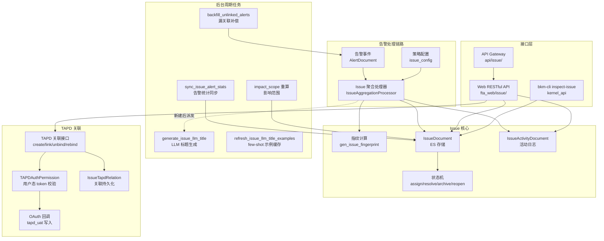
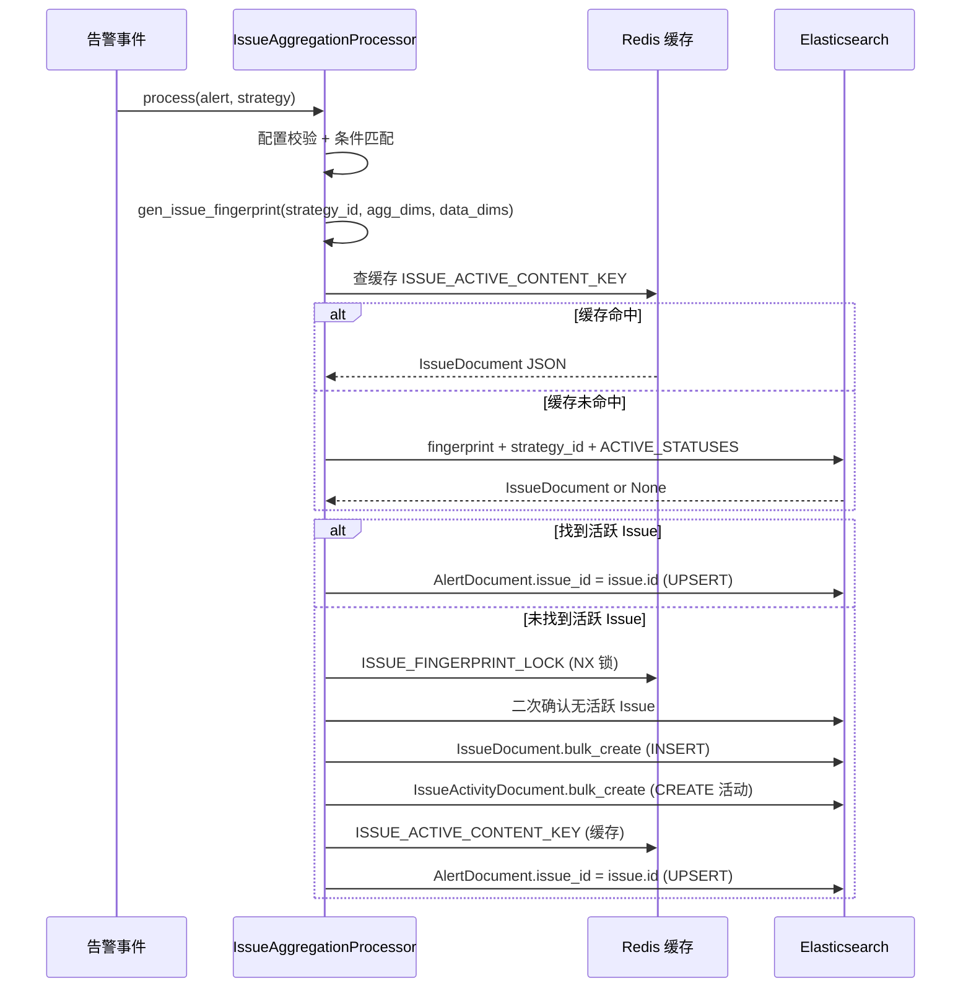

# Issue 系统设计总览

<cite>
**本文引用的文件**
- [issue_processor.py](file://bkmonitor/alarm_backends/service/fta_action/issue_processor.py)
- [issue_tasks.py](file://bkmonitor/alarm_backends/service/fta_action/tasks/issue_tasks.py)
- [documents/issue.py](file://bkmonitor/bkmonitor/documents/issue.py)
- [constants/issue.py](file://bkmonitor/constants/issue.py)
- [fta_web/issue/views.py](file://bkmonitor/packages/fta_web/issue/views.py)
- [fta_web/issue/resources.py](file://bkmonitor/packages/fta_web/issue/resources.py)
- [fta_web/issue/handlers/issue.py](file://bkmonitor/packages/fta_web/issue/handlers/issue.py)
- [kernel_api/rpc/functions/bkm_cli/issue.py](file://bkmonitor/kernel_api/rpc/functions/bkm_cli/issue.py)
- [api/issue/default.py](file://bkmonitor/api/issue/default.py)
- [alarm_backends/service/fta_action/llm_title.py](file://bkmonitor/alarm_backends/service/fta_action/llm_title.py)
</cite>

## 目录
1. [简介](#简介)
2. [架构总览](#架构总览)
3. [模块拓扑](#模块拓扑)
4. [数据模型](#数据模型)
5. [核心子功能索引](#核心子功能索引)
6. [常量与枚举](#常量与枚举)
7. [结论](#结论)

## 简介

Issue 是 BK-Monitor 告警处理链路中的**问题聚合与跟踪域**。其核心目标是：将海量告警按"同一具体问题"聚合为 Issue，帮助运维人员聚焦问题根因而非逐条处理告警事件。

Issue 功能完整覆盖以下能力：
- **告警聚合**：基于策略配置 + 维度指纹（fingerprint），将同策略下维度组合相同的告警聚合到同一 Issue
- **状态管理**：Issue 具备完整的状态机（待审核 → 未解决 → 已解决 → 归档），支持指派、解决、归档、重开、恢复等操作
- **活动日志**：每次状态变更、指派、评论、优先级调整均记录活动日志，形成完整审计链
- **影响范围**：自动按关联告警汇总受影响的主机、集群、Pod、APM 服务实例等
- **周期任务**：后台定期同步告警统计（alert_count / last_alert_time）、漏关联补偿、影响范围重算
- **Web API**：提供列表查询、TopN 统计、导出、批量操作等完整 RESTful 接口
- **TAPD 关联管理**：将 Issue 与 TAPD 工作项打通——获取字段、搜索项、创建/关联 TAPD 单、查询关联列表；支持工作区手动解绑（持久化 tombstone 阻断自动回绑）与重新关联；用户态授权经 OAuth 回调写入 `tapd_uat` token
- **Issue 趋势**：`IssueTrendResource` 按时间分片聚合活跃/已解决趋势，并内置缺失 `resolved` 活动修复逻辑
- **Issue 合并**：`IssueMergeResolver` 将合并后的 Issue 展开为完整 ID 集合并解析展示主 Issue（`display_id`），查询层注入 `merge_status` 摘要
- **LLM 标题生成**：新建 Issue 后异步调用 LLM 总结关联日志生成可读标题，失败静默保留默认名
- **RPC/CLI**：通过 bkm-cli `inspect-issue` 支持 Issue 详情、按策略/指纹查询、活动日志查询

## 架构总览

图表来源
- [issue_processor.py:109-221](file://bkmonitor/alarm_backends/service/fta_action/issue_processor.py#L109-L221)
- [documents/issue.py:42-820](file://bkmonitor/bkmonitor/documents/issue.py#L42-L820)
- [issue_tasks.py:37-1380](file://bkmonitor/alarm_backends/service/fta_action/tasks/issue_tasks.py#L37-L1380)
- [fta_web/issue/views.py:50-178](file://bkmonitor/packages/fta_web/issue/views.py#L50-L178)
- [fta_web/issue/resources.py:1554-3100](file://bkmonitor/packages/fta_web/issue/resources.py#L1554-L3100)

## 模块拓扑

Issue 功能跨越 6 个代码模块，各模块职责如下：

| 模块路径 | 职责 | 关键类/函数 |
|----------|------|-------------|
| `alarm_backends/service/fta_action/issue_processor.py` | 告警聚合处理器：指纹计算、创建/查找 Issue、关联告警、LLM 标题派发 | `IssueAggregationProcessor`, `gen_issue_fingerprint`, `_maybe_dispatch_llm_title` |
| `alarm_backends/service/fta_action/tasks/issue_tasks.py` | 周期任务：告警统计同步、漏关联补偿、影响范围重算、LLM 标题生成 | `sync_issue_alert_stats`, `_backfill_unlinked_alerts_for_strategy`, `_build_impact_scope`, `generate_issue_llm_title`, `refresh_issue_llm_title_examples` |
| `bkmonitor/documents/issue.py` | 数据模型：Issue 主体文档 + 活动日志文档，含状态机方法 | `IssueDocument`, `IssueActivityDocument` |
| `constants/issue.py` | 常量枚举：状态、优先级、活动类型、影响范围维度 | `IssueStatus`, `IssuePriority`, `IssueActivityType`, `ImpactScopeDimension` |
| `packages/fta_web/issue/` | Web 接口层：RESTful API、查询处理器、序列化 | `IssueViewSet`, `IssueQueryHandler`, `IssueQueryTransformer` |
| `kernel_api/rpc/functions/bkm_cli/issue.py` | CLI/RPC 接口：bkm-cli inspect-issue 后端 | `inspect_issue`, `_inspect_issue_detail`, `_list_issues_by_strategy` |
| `packages/fta_web/issue/resources.py` | Web 接口层：TAPD 关联（创建/关联/解绑/授权）、Issue 趋势等 Resource | `IssueTrendResource`, `GetTapdFieldsResource`, `SearchTAPDItemsResource`, `CreateTapdResource`, `LinkIssueToTapdResource`, `ListUserTapdWorkspaceResource`, `UnbindTapdWorkspaceResource`, `RebindTapdWorkspaceResource`, `RevokeTapdUserAuthResource` |
| `bkmonitor/issue_merge.py` | Issue 合并/展开：合并 ID 扩展、展示主 Issue 解析、合并上下文加载 | `IssueMergeResolver`, `MergeResolverContext` |

## 数据模型

### IssueDocument（ES 索引：`bkfta_issue`）

Issue 主体的唯一持久化存储，按天分索引，使用 `all_indices=True` 跨索引查询。

| 字段 | 类型 | 说明 |
|------|------|------|
| `id` | Keyword | Issue ID，格式为 `{timestamp}{uuid8}`，前 10 位为创建时间戳 |
| `strategy_id` | Keyword | 关联策略 ID |
| `bk_biz_id` | Keyword | 业务 ID |
| `name` | Text (raw: Keyword) | Issue 名称，支持 `.raw` 精确查询 |
| `status` | Keyword | 状态：`pending_review` / `unresolved` / `resolved` / `archived` |
| `is_regression` | Boolean | 是否回归（同 fingerprint 历史有 RESOLVED 记录） |
| `assignee` | Keyword(multi) | 负责人列表 |
| `priority` | Keyword | 优先级：P0（高）/ P1（中）/ P2（低，默认） |
| `alert_count` | Long | 关联告警数量（由周期任务更新） |
| `first_alert_time` | Date | 首次告警时间 |
| `last_alert_time` | Date | 最近告警时间 |
| `impact_scope` | Flattened | 影响范围快照（host / set / cluster / pod / apm_app 等） |
| `strategy_name` | Text (raw: Keyword) | 策略名称 |
| `labels` | Keyword(multi) | 标签列表（来自策略） |
| `aggregate_config` | Object(enabled=false) | 聚合配置快照（aggregate_dimensions / conditions / alert_levels） |
| `fingerprint` | Keyword | 聚合指纹（count_md5），唯一标识"同一具体问题" |
| `dimension_values` | Flattened | 维度取值快照（如 `{"bk_host_id": "9185731"}`） |
| `create_time` | Date | 创建时间 |
| `update_time` | Date | 更新时间 |
| `resolved_time` | Date | 解决时间 |

章节来源
- [documents/issue.py:42-90](file://bkmonitor/bkmonitor/documents/issue.py#L42-L90)

### IssueActivityDocument（活动日志）

记录 Issue 生命周期的每一次变更操作。

| 字段 | 说明 |
|------|------|
| `issue_id` | 所属 Issue ID |
| `bk_biz_id` | 业务 ID |
| `activity_type` | 活动类型：`create` / `comment` / `comment_edit` / `status_change` / `assignee_change` / `priority_change` / `name_change` |
| `operator` | 操作人 |
| `from_value` | 变更前值 |
| `to_value` | 变更后值 |
| `content` | 评论内容 |
| `time` | 操作时间 |
| `create_time` | 创建时间 |

章节来源
- [constants/issue.py:44-61](file://bkmonitor/constants/issue.py#L44-L61)

### 数据流：告警 → Issue → 活动日志

图表来源
- [issue_processor.py:117-185](file://bkmonitor/alarm_backends/service/fta_action/issue_processor.py#L117-L185)

## 核心子功能索引

| 子功能 | 详细文档 | 核心代码 |
|--------|----------|----------|
| Issue 聚合引擎 | [Issue 聚合引擎](Issue%20聚合引擎.md) | `issue_processor.py` |
| Issue 状态管理 | [Issue 状态管理](Issue%20状态管理.md) | `documents/issue.py` |
| Issue 周期任务 | [Issue 周期任务](Issue%20周期任务.md) | `issue_tasks.py` |
| Issue API 接口 | [Issue API 接口](Issue%20API%20接口.md) | `fta_web/issue/`, `kernel_api/` |

## 常量与枚举

### IssueStatus — 状态定义

| 值 | 中文名 | 说明 |
|----|--------|------|
| `pending_review` | 待审核 | Issue 创建后的初始状态 |
| `unresolved` | 未解决 | 已指派负责人 |
| `resolved` | 已解决 | 人工标记解决或部署迁移切割 |
| `archived` | 归档 | 已归档，不再活跃 |

活跃状态（`ACTIVE_STATUSES`）：`[pending_review, unresolved]`

### IssuePriority — 优先级

| 值 | 中文名 | 说明 |
|----|--------|------|
| `P0` | 高 | — |
| `P1` | 中 | — |
| `P2` | 低 | 默认值（`DEFAULT`） |

### IssueActivityType — 活动类型

| 值 | 中文名 |
|----|--------|
| `create` | 创建 |
| `comment` | 评论 |
| `comment_edit` | 评论编辑 |
| `status_change` | 状态变更 |
| `assignee_change` | 负责人变更 |
| `priority_change` | 优先级变更 |
| `name_change` | 名称变更 |
| `create_tapd` | 创建 TAPD |
| `tapd_link` | 关联 TAPD |

### ImpactScopeDimension — 影响范围维度

| 维度 | 中文名 | ID 字段 |
|------|--------|---------|
| `set` | 集群 | `set_id` |
| `host` | 主机 | `bk_host_id` |
| `service_instances` | 服务实例 | `bk_service_instance_id` |
| `cluster` | BCS 集群 | `bcs_cluster_id` |
| `node` | Node | `node` |
| `service` | Service | `service` |
| `pod` | Pod | `pod` |
| `apm_app` | APM 应用 | `app_name` |
| `apm_service` | APM 服务 | `service_name` |

章节来源
- [constants/issue.py:14-240](file://bkmonitor/constants/issue.py#L14-L240)

## 结论

Issue 是 BK-Monitor 告警处理链路的核心域之一，通过 fingerprint 指纹机制将海量告警聚合为可跟踪的问题单元，配合完整的状态机、活动日志、影响范围和周期任务，为运维团队提供了从"告警风暴"到"聚焦问题"的能力跃迁。各子模块职责清晰、代码成熟，详见各子功能文档。
