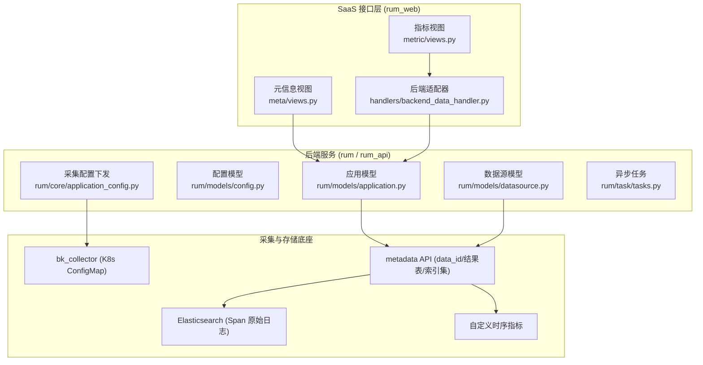
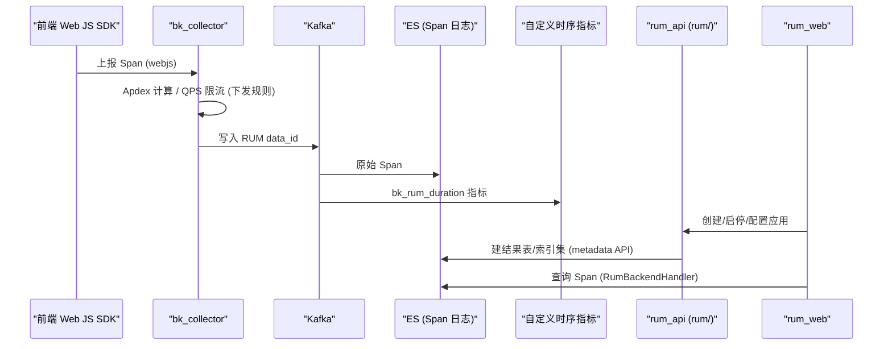

# RUM 全栈监控

<cite>
**本文引用的文件**
- [rum/models/application.py](file://bkmonitor/rum/models/application.py)
- [rum/models/config.py](file://bkmonitor/rum/models/config.py)
- [rum/models/datasource.py](file://bkmonitor/rum/models/datasource.py)
- [rum/core/application_config.py](file://bkmonitor/rum/core/application_config.py)
- [rum/task/tasks.py](file://bkmonitor/rum/task/tasks.py)
- [packages/rum_web/meta/resources.py](file://bkmonitor/packages/rum_web/meta/resources.py)
- [packages/rum_web/meta/views.py](file://bkmonitor/packages/rum_web/meta/views.py)
- [packages/rum_web/metric/resources.py](file://bkmonitor/packages/rum_web/metric/resources.py)
- [packages/rum_web/metric/views.py](file://bkmonitor/packages/rum_web/metric/views.py)
</cite>

## 目录
1. [简介](#简介)
2. [项目结构](#项目结构)
3. [核心组件](#核心组件)
4. [架构总览](#架构总览)
5. [与 APM 的关系](#与-apm-的关系)
6. [依赖分析](#依赖分析)
7. [附录：接口速览](#附录接口速览)
8. [性能考虑](#性能考虑)
9. [故障排查指南](#故障排查指南)

## 简介
RUM（Real User Monitoring，真实用户监控）面向前端 Web 应用的用户体验数据采集与分析，覆盖页面加载性能（LCP/FCP/CLS/INP/TTFB 等 Web Vitals）、静态资源加载、API 请求、JS 错误、长任务、路由切换、用户交互等维度。RUM 与 APM（链路追踪）并列，是蓝鲸监控可观测体系中面向「终端用户体验」的子域，二者共享 bk_collector 采集底座与 UnifyQuery 统一查询能力。

章节来源
- 本节为概念性内容，介绍 RUM 的定位与覆盖维度，不直接分析具体文件。

## 项目结构
RUM 由两个协同模块构成，遵循监控平台「SaaS 接口层 → 后端服务层 → 采集/存储底座」的分层约定：

- **`rum/`（后端服务 rum_api）**：拥有应用与配置的权威数据模型 `RumApplication` / `RumAppConfig` / `RumDataSource` / `MetricDataSource`，负责通过 metadata API 创建 data_id、结果表、索引集，并把采集配置（Apdex/QPS/维度补充）渲染为 bk_collector 的 ConfigMap 并下发到 K8s。
- **`packages/rum_web/`（SaaS 接口层）**：作为前端 REST 入口，持有应用镜像模型 `Application` 与应用级通用配置 `RumAppConfig`，将管理操作委托给 `api.rum_api.*`，并提供指标查询、存储探测、无数据告警等接口。

图表来源
- [rum/models/application.py:24-99](file://bkmonitor/rum/models/application.py#L24-L99)
- [rum/models/datasource.py:35-168](file://bkmonitor/rum/models/datasource.py#L35-L168)
- [rum/core/application_config.py:28-94](file://bkmonitor/rum/core/application_config.py#L28-L94)
- [packages/rum_web/meta/views.py:39-142](file://bkmonitor/packages/rum_web/meta/views.py#L39-L142)
- [packages/rum_web/metric/views.py:16-25](file://bkmonitor/packages/rum_web/metric/views.py#L16-L25)

章节来源
- [rum/models/application.py:24-99](file://bkmonitor/rum/models/application.py#L24-L99)
- [packages/rum_web/meta/views.py:39-142](file://bkmonitor/packages/rum_web/meta/views.py#L39-L142)
- [packages/rum_web/metric/views.py:16-25](file://bkmonitor/packages/rum_web/metric/views.py#L16-L25)

## 核心组件
- **应用管理（两层模型）**：后端 `RumApplication` 为权威模型，SaaS 侧 `Application` 为其镜像，通过 `sync_datasource()` 从 rum_api 回写 `span_result_table_id` / `metric_result_table_id`，并在创建时初始化 Apdex、QPS、存储三类默认配置。
- **双数据源**：每个应用同时持有两个数据源——`RumDataSource`（原始 Span 日志，ES 自由 schema）与 `MetricDataSource`（`bk_rum_duration` 时序指标）。`start_rum()` / `stop_rum()` 同时启停两者，`is_enabled` 标记整体启用状态。
- **配置下发**：`RumApplicationConfig.refresh_k8s()` 按业务分组、按 K8s 集群批量渲染 bk_collector 配置模板，下发 Apdex 计算器（`apdex_calculator/rum_apdex_common`）、QPS 令牌桶限流（`rate_limiter/token_bucket`）与维度补充（`resource_filter/metrics`）规则。
- **查询与可视化**：`RumBackendHandler` 后端适配器封装 Span 数据源（ES）的存储信息、索引、采样、字段与数据视图查询；`RumAlertQueryResource` 查询无数据告警时间带。

章节来源
- [rum/models/application.py:39-133](file://bkmonitor/rum/models/application.py#L39-L133)
- [rum/models/datasource.py:172-268](file://bkmonitor/rum/models/datasource.py#L172-L268)
- [rum/core/application_config.py:96-188](file://bkmonitor/rum/core/application_config.py#L96-L188)
- [packages/rum_web/handlers/backend_data_handler.py:133-300](file://bkmonitor/packages/rum_web/handlers/backend_data_handler.py#L133-L300)

## 架构总览
RUM 数据流为「采集 → 接入 → 存储 → 查询」闭环：前端 Web JS SDK（固定 `resource.telemetry.sdk.language = webjs`，`resource.rum.provider = blueking`）采集 Span 上报至 bk_collector；collector 依据下发的 Apdex/QPS 规则做计算与限流，数据经 Kafka 落到 RUM data_id，写入 ES（原始 Span）与自定义时序（指标）。SaaS 通过 rum_api 管理应用与数据源，查询时由 `RumBackendHandler` 走 UnifyQuery 统一查询。

章节来源
- [span 规范 resource 属性](file://bkmonitor/packages/rum_web/docs/spec/span/span.md#L118-L130)
- [rum/models/datasource.py:63-146](file://bkmonitor/rum/models/datasource.py#L63-L146)
- [packages/rum_web/handlers/backend_data_handler.py:133-300](file://bkmonitor/packages/rum_web/handlers/backend_data_handler.py#L133-L300)

图表来源
- [rum/core/application_config.py:141-188](file://bkmonitor/rum/core/application_config.py#L141-L188)
- [rum/models/datasource.py:268-417](file://bkmonitor/rum/models/datasource.py#L268-L417)
- [packages/rum_web/handlers/backend_data_handler.py:250-299](file://bkmonitor/packages/rum_web/handlers/backend_data_handler.py#L250-L299)

## 与 APM 的关系
- **共享底座**：RUM 与 APM 共用 bk_collector 采集、`metadata` 结果表/索引集体系、UnifyQuery 查询与无数据告警策略机制，代码结构与 `apm_web` 高度对齐（如 `RumBackendHandler` 对齐 `apm_web RumBackendHandler`）。
- **差异点**：RUM 聚焦前端体验，Span 语义以 `span_type`（document/http/resource/vital/error/longtask/action/route/custom）表达；存储使用 ES 自由 schema（非 APM 的固定 Trace 结构）；应用配置走 `RumAppConfig` 的「大类:小类」复合键（`apdex:*` / `qps:*`），并由 K8s ConfigMap 下发到 collector。

章节来源
- [packages/rum_web/handlers/backend_data_handler.py:46-134](file://bkmonitor/packages/rum_web/handlers/backend_data_handler.py#L46-L134)
- [rum/models/config.py:16-151](file://bkmonitor/rum/models/config.py#L16-L151)

## 依赖分析
- **内部依赖**：`rum/` 依赖 `metadata` API（`create_data_id` / `create_result_table` / `create_time_series_group`）、`bk_collector` 配置工具（`BkCollectorConfig`）、`constants.rum` 字段定义；`rum_web/` 依赖 `api.rum_api.*` 委托后端，并复用 APM 的 `AsyncColumnsListResource`、告警策略与权限（IAM）体系。
- **外部依赖**：Elasticsearch（Span 存储）、Kafka（数据接入）、K8s（collector 配置下发）、OpenTelemetry Web JS SDK（采集端）。
- **潜在循环**：SaaS 与后端通过 `api.rum_api` RPC 解耦，避免直接 import 循环；`Application` 仅为镜像，保存操作委托回 rum_api。

章节来源
- [rum/models/datasource.py:122-146](file://bkmonitor/rum/models/datasource.py#L122-L146)
- [packages/rum_web/meta/resources.py:58-143](file://bkmonitor/packages/rum_web/meta/resources.py#L58-L143)

## 附录：接口速览
- 应用管理：创建/删除应用、启停数据源、查询 Token、列表与详情。
- 配置：Apdex / QPS / 存储三类 SetupProcessor，经 rum_api `release_app_config` 下发并刷新 K8s。
- 查询：存储信息、ES 索引、数据采样、字段信息、数据视图、无数据告警策略。
- 指标：告警时间带查询（`alert_query`）、应用列表异步指标（LCP P75 / JS 错误率 / API 失败率）。

章节来源
- [packages/rum_web/meta/views.py:45-142](file://bkmonitor/packages/rum_web/meta/views.py#L45-L142)
- [packages/rum_web/metric/views.py:22-25](file://bkmonitor/packages/rum_web/metric/views.py#L22-L25)

## 性能考虑

- **采集侧卸载**：Apdex 计算与 QPS 限流在 bk_collector 端完成，后端 `rum/` 不接收上报流量，接入压力不会传导到管理服务。
- **Kafka 解耦**：采集数据经 Kafka 落到 RUM data_id，接入与存储写入解耦，削峰填谷。
- **查询预聚合**：`RumBackendHandler` 走 UnifyQuery 预聚合面板（grain 1m/1d），应用列表异步指标经缓存键复用，降低查询压力。

章节来源
- [rum/core/application_config.py:96-188](file://bkmonitor/rum/core/application_config.py#L96-L188)
- [packages/rum_web/handlers/backend_data_handler.py:46-134](file://bkmonitor/packages/rum_web/handlers/backend_data_handler.py#L46-L134)
- [packages/rum_web/handlers/service_handler.py:16-21](file://bkmonitor/packages/rum_web/handlers/service_handler.py#L16-L21)

## 故障排查指南

- **无数据（data_status=no_data）**：`set_data_status()` 依据最近 `no_data_period`（默认 10 分钟）内是否有数据刷新；确认 `start_rum`/`stop_rum` 已启用、双数据源启停正常。
- **查询失败 / 索引为空**：确认 `span_result_table_id` / `metric_result_table_id` 已由 `sync_datasource()` 回写；检查 ES 索引与 UnifyQuery 数据源配置。
- **配置未下发到 collector**：确认 `refresh_k8s` 异步任务成功、目标集群 K8s ConfigMap 已渲染；Apdex/QPS 规则依赖 `RumAppConfig` 配置。

章节来源
- [rum/models/application.py:39-133](file://bkmonitor/rum/models/application.py#L39-L133)
- [packages/rum_web/handlers/backend_data_handler.py:133-300](file://bkmonitor/packages/rum_web/handlers/backend_data_handler.py#L133-L300)
- [rum/core/application_config.py:28-94](file://bkmonitor/rum/core/application_config.py#L28-L94)
