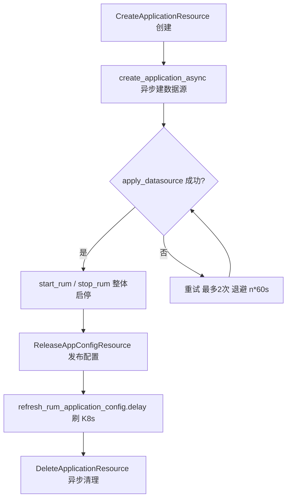

# RUM 应用管理与配置

<cite>
**本文引用的文件**
- [rum/resources.py](file://bkmonitor/rum/resources.py)
- [packages/rum_web/models/application.py](file://bkmonitor/packages/rum_web/models/application.py)
- [packages/rum_web/meta/resources.py](file://bkmonitor/packages/rum_web/meta/resources.py)
- [packages/rum_web/meta/views.py](file://bkmonitor/packages/rum_web/meta/views.py)
- [packages/rum_web/constants.py](file://bkmonitor/packages/rum_web/constants.py)
</cite>

## 目录
1. [简介](#简介)
2. [SaaS 应用镜像模型](#saas-应用镜像模型)
3. [应用生命周期（后端 rum_api）](#应用生命周期后端-rumapi)
4. [配置下发（三类 SetupProcessor）](#配置下发三类-setupprocessor)
5. [无数据告警策略](#无数据告警策略)
6. [权限控制](#权限控制)
7. [应用列表与异步指标列](#应用列表与异步指标列)
8. [应用生命周期流程图](#应用生命周期流程图)
9. [性能考虑](#性能考虑)
10. [故障排查指南](#故障排查指南)

## 简介
RUM 应用管理分两层：后端 `rum/resources.py`（rum_api）持有权威操作，SaaS `rum_web/meta` 作为前端 REST 入口委托调用。`packages/rum_web/models/application.py` 的 `Application` 为镜像模型，创建时通过 `api.rum_api.create_application` 落库后端并初始化三类默认配置。

章节来源
- [rum/resources.py:38-64](file://bkmonitor/rum/resources.py#L38-L64)
- [packages/rum_web/models/application.py:71-105](file://bkmonitor/packages/rum_web/models/application.py#L71-L105)

## SaaS 应用镜像模型
`Application`（rum_web）关键字段：`application_id`（主键，来自后端返回）、`bk_biz_id`、`app_name`、`app_alias`、`client_type`（默认 `web`）、`metric_result_table_id` / `span_result_table_id`（由 `sync_datasource()` 从后端回写）、`data_status`（`normal` / `no_data` / `disabled`）、`apm_application_id`（可关联 APM 应用）。

配置键常量：`APPLICATION_DATASOURCE_CONFIG_KEY`、`APDEX_CONFIG_KEY`、`QPS_CONFIG_KEY`。创建时调用 `set_init_apdex_config()`（默认 `apdex_api_request=500`、`apdex_view_load=500`，单位 ms）、`set_init_qps_config()`（默认 `DEFAULT_RUM_APP_QPS=500`）、`set_init_datasource_config()`（默认 ES 配置）。`set_data_status()` 依据最近 `no_data_period`（默认 10 分钟）内是否有数据刷新 `data_status`。

章节来源
- [packages/rum_web/models/application.py:30-219](file://bkmonitor/packages/rum_web/models/application.py#L30-L219)
- [packages/rum_web/constants.py:28-47](file://bkmonitor/packages/rum_web/constants.py#L28-L47)

## 应用生命周期（后端 rum_api）
`rum/resources.py` 提供权威资源：

| 资源 | 说明 |
|------|------|
| `CreateApplicationResource` | 创建应用，未传 `es_storage_config` 时取 `RumApplicationHelper.get_default_storage_config` 默认值 |
| `DeleteApplicationResource` | 异步 `delete_application_async`（清理 QPS 配置、停数据源、删镜像） |
| `StartApplicationResource` / `StopApplicationResource` | 整体启停 `start_rum()` / `stop_rum()` |
| `ApplyDatasourceResource` | 变更数据源存储配置 `apply_datasource()` |
| `ApplicationInfoResource` / `QueryBkDataTokenInfoResource` | 查询详情与上报 Token |
| `AppConfigResource` / `ReleaseAppConfigResource` / `DeleteAppConfigResource` | 获取/发布/删除应用配置（按大类分组） |

`ApplicationRequestSerializer` 支持三种定位方式：`application_id`、或 `bk_biz_id + app_name`、或 `space_uid + app_name`。

章节来源
- [rum/resources.py:28-319](file://bkmonitor/rum/resources.py#L28-L319)

## 配置下发（三类 SetupProcessor）
`SetupApplicationResource` 通过四个 Processor 原子更新不同维度，全部在 `@atomic` 事务内：

| Processor | 作用 | 下发动作 |
|-----------|------|----------|
| `ApplicationSetupProcessor` | 更新 `app_alias` / `description` | 仅本地 |
| `DatasourceSetupProcessor` | `span_datasource_config` | `api.rum_api.apply_datasource` + 写 `APPLICATION_DATASOURCE_CONFIG_KEY` |
| `ApdexSetupProcessor` | `application_apdex_config` | `api.rum_api.release_app_config`（`apdex:*`）+ 写 `APDEX_CONFIG_KEY` |
| `QPSSetupProcessor` | `application_qps_config` | `api.rum_api.release_app_config`（`qps:default`）+ 写 `QPS_CONFIG_KEY` |

发布配置后会异步 `refresh_rum_application_config.delay` 刷新 K8s collector 配置。

章节来源
- [packages/rum_web/meta/resources.py:272-416](file://bkmonitor/packages/rum_web/meta/resources.py#L272-L416)

## 无数据告警策略
`GetNoDataStrategyInfoResource` 为应用创建「无数据告警」策略（查不到则自动创建，存入 `RumAppConfig` 的 `nodata_error_strategy_id`）：
- 指标：`custom:{metric_result_table_id}:browser_web_vital_duration_bucket`，PromQL 求和。
- 策略：标签 `BKRUM`，场景 `application_check`，默认关闭，关联运维通知组（`get_or_create_ops_notice_group`），阈值 `eq 0`。
- `NoDataStrategyEnableResource` / `NoDataStrategyDisableResource` 通过 `update_partial_strategy_v2` 启停。

章节来源
- [packages/rum_web/meta/resources.py:799-1006](file://bkmonitor/packages/rum_web/meta/resources.py#L799-L1006)

## 权限控制
`ApplicationViewSet` 基于 IAM 实例权限：
- 管理类（`delete_application` / `start` / `stop` / `setup` / `nodata_strategy_*` / `query_rum_token`）：需 `MANAGE_RUM_APPLICATION` + 资源 `RUM_APPLICATION`。
- 查看类（`application_info_by_app_name` / `data_sampling` / `data_view_config` / `storage_field_info`）：需 `VIEW_RUM_APPLICATION`。
- `MetaInfoViewSet` / `MetricViewSet` 仅需 `ViewBusinessPermission`。

章节来源
- [packages/rum_web/meta/views.py:51-142](file://bkmonitor/packages/rum_web/meta/views.py#L51-L142)

## 应用列表与异步指标列
`ListApplicationResource` 返回应用列表（不分页，按「有数据优先 + 名称」排序），列含 `lcp_p75` / `js_error_rate` / `api_fail_rate`（均 `asyncable`）。`ListApplicationAsyncResource` 继承 `AsyncColumnsListResource`，按列名（`ASYNC_COLUMN_CHOICES`）异步查询指标：
- `lcp_p75`：LCP P75（秒，原始 ns / 1000）。
- `js_error_rate` / `api_fail_rate`：百分比（原始比例 × 100）。
- 指标经 `APPLICATION_LIST(...)` 计算，结果缓存于 `ServiceHandler.build_cache_key`（键 `BKMONITOR_{PLATFORM}_{ENVIRONMENT}_RUM_APPLICATION_METRIC_{bk_biz_id}_{application_id}`）。

章节来源
- [packages/rum_web/meta/resources.py:419-639](file://bkmonitor/packages/rum_web/meta/resources.py#L419-L639)
- [packages/rum_web/handlers/service_handler.py:16-21](file://bkmonitor/packages/rum_web/handlers/service_handler.py#L16-L21)
- [packages/rum_web/constants.py:49-55](file://bkmonitor/packages/rum_web/constants.py#L49-L55)

## 应用生命周期流程图

图表来源
- [rum/resources.py:28-319](file://bkmonitor/rum/resources.py#L28-L319)
- [rum/task/tasks.py:21-109](file://bkmonitor/rum/task/tasks.py#L21-L109)
- [packages/rum_web/meta/resources.py:272-416](file://bkmonitor/packages/rum_web/meta/resources.py#L272-L416)

章节来源
- [rum/resources.py:28-319](file://bkmonitor/rum/resources.py#L28-L319)
- [rum/task/tasks.py:21-109](file://bkmonitor/rum/task/tasks.py#L21-L109)
- [packages/rum_web/meta/resources.py:272-416](file://bkmonitor/packages/rum_web/meta/resources.py#L272-L416)

## 性能考虑

- **事务内远程调用**：`SetupApplicationResource` 在 `@atomic` 事务内由四类 Processor 原子更新，其中 `DatasourceSetupProcessor` 会调用 `api.rum_api.apply_datasource`（远程 RPC），需关注事务超时与回滚一致性。
- **配置发布异步化**：发布配置后异步 `refresh_rum_application_config.delay` 刷新 K8s collector，避免阻塞管理请求。
- **列表轻量排序**：`ListApplicationResource` 不分页，按「有数据优先 + 名称」内存排序，适合应用数不大的场景。

章节来源
- [packages/rum_web/meta/resources.py:272-416](file://bkmonitor/packages/rum_web/meta/resources.py#L272-L416)
- [packages/rum_web/meta/resources.py:419-639](file://bkmonitor/packages/rum_web/meta/resources.py#L419-L639)

## 故障排查指南

- **配置不生效**：确认 `ReleaseAppConfigResource` 已发布且 `refresh_k8s` 异步任务成功，检查目标集群 K8s ConfigMap 是否正确渲染。
- **权限 403**：管理类操作需 IAM 实例权限 `MANAGE_RUM_APPLICATION`（资源 `RUM_APPLICATION`），查看类需 `VIEW_RUM_APPLICATION`；`MetaInfoViewSet`/`MetricViewSet` 仅需 `ViewBusinessPermission`。
- **data_status=no_data**：`set_data_status()` 依据最近 `no_data_period`（默认 10 分钟）内是否有数据刷新状态，确认应用确有上报。

章节来源
- [packages/rum_web/meta/views.py:51-142](file://bkmonitor/packages/rum_web/meta/views.py#L51-L142)
- [packages/rum_web/models/application.py:30-219](file://bkmonitor/packages/rum_web/models/application.py#L30-L219)
