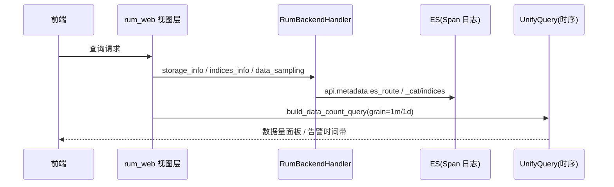

# RUM 指标查询与可视化

<cite>
**本文引用的文件**
- [packages/rum_web/handlers/backend_data_handler.py](file://bkmonitor/packages/rum_web/handlers/backend_data_handler.py)
- [packages/rum_web/handlers/service_handler.py](file://bkmonitor/packages/rum_web/handlers/service_handler.py)
- [packages/rum_web/metric/resources.py](file://bkmonitor/packages/rum_web/metric/resources.py)
- [packages/rum_web/metric/views.py](file://bkmonitor/packages/rum_web/metric/views.py)
- [packages/rum_web/constants.py](file://bkmonitor/packages/rum_web/constants.py)
</cite>

## 目录
1. [简介](#简介)
2. [后端适配器 RumBackendHandler](#后端适配器-rumbackendhandler)
3. [数据视图与统一查询](#数据视图与统一查询)
4. [告警时间带查询](#告警时间带查询)
5. [应用列表异步指标](#应用列表异步指标)
6. [缓存策略](#缓存策略)
7. [查询时序](#查询时序)
8. [性能考虑](#性能考虑)
9. [故障排查指南](#故障排查指南)

## 简介
RUM 的查询能力由 `rum_web` 提供，分为「Span 数据源探测」（走 ES，由 `RumBackendHandler` 适配）与「指标/告警查询」（走 UnifyQuery 与时序）。其设计对齐 `apm_web` 的 `RumBackendHandler` / 指标查询体系。

章节来源
- [packages/rum_web/handlers/backend_data_handler.py:46-134](file://bkmonitor/packages/rum_web/handlers/backend_data_handler.py#L46-L134)

## 后端适配器 RumBackendHandler
`telemetry_handler_registry` 注册表按 `TelemetryDataType.RUM` 分发到 `RumBackendHandler`，操作 Span 数据源（ES，对应 `app.span_result_table_id`）。主要方法：

| 方法 | 说明 |
|------|------|
| `storage_info()` | 查询存储配置（ES 集群/副本/保留期/分片/切分大小），优先读 `APPLICATION_DATASOURCE_CONFIG_KEY`，缺省取 settings 默认 |
| `indices_info()` | 通过 `api.metadata.es_route` 查询 `_cat/indices` 获取索引列表（过滤非标准时间后缀） |
| `data_sampling(size)` | 通过 `api.metadata.kafka_tail` 拉取最近采样数据 |
| `storage_field_info()` | 通过 `api.metadata.get_result_table` 返回字段列表 |
| `get_data_view_config()` | 构建分钟/日两个数据量面板（`browser_web_vital_duration_bucket`） |
| `get_no_data_strategy_config()` | 生成无数据告警 PromQL（`custom:{metric_result_table_id}:browser_web_vital_duration_bucket`） |

章节来源
- [packages/rum_web/handlers/backend_data_handler.py:133-300](file://bkmonitor/packages/rum_web/handlers/backend_data_handler.py#L133-L300)

## 数据视图与统一查询
`TelemetryBackendHandler.build_data_count_query()` 基于 `grafana.graphUnifyQuery` 构建 unify_query target，按 `grain`（`1m` / `1d`）生成「分钟数据量」「日数据量」两个面板。`build_call_back_target()` 组装 `query_configs`，数据源为 `CUSTOM` / `TIME_SERIES`，时间字段 `time`。

章节来源
- [packages/rum_web/handlers/backend_data_handler.py:58-124](file://bkmonitor/packages/rum_web/handlers/backend_data_handler.py#L58-L124)
- [packages/rum_web/handlers/backend_data_handler.py:250-279](file://bkmonitor/packages/rum_web/handlers/backend_data_handler.py#L250-L279)

## 告警时间带查询
`RumAlertQueryResource`（`metric/alert_query`，POST）查询应用无数据告警时间带：
- 按 `ERROR` / `WARN` / `INFO` 三级分别调用 `resource.fta_web.alert.alert_date_histogram`，`query_string` 为 `metric: custom.{metric_result_table_id}.*`。
- `format_alert_data()` 将多级告警折叠为红/黄/蓝/空四态时间带，供前端 `apdex-chart` 渲染。

章节来源
- [packages/rum_web/metric/resources.py:28-142](file://bkmonitor/packages/rum_web/metric/resources.py#L28-L142)
- [packages/rum_web/metric/views.py:22-25](file://bkmonitor/packages/rum_web/metric/views.py#L22-L25)

## 应用列表异步指标
`ListApplicationAsyncResource` 提供首页应用列表的异步指标列（`ASYNC_COLUMN_CHOICES`）：

| 列 | 指标处理 |
|----|----------|
| `lcp_p75` | LCP P75，原始 ns 转秒（/1000） |
| `js_error_rate` | JS 错误率，比例转百分比（×100） |
| `api_fail_rate` | API 失败率，比例转百分比（×100） |

`METRIC_MAP` 映射列到 `LcpP75Instance` / `JsErrorRateInstance` / `ApiFailRateInstance`，经 `APPLICATION_LIST(...)` 计算；命中缓存直接返回，miss 则补全并回写缓存。默认指标 `RUM_APPLICATION_DEFAULT_METRIC` 全为 0。

章节来源
- [packages/rum_web/meta/resources.py:486-639](file://bkmonitor/packages/rum_web/meta/resources.py#L486-L639)
- [packages/rum_web/constants.py:49-55](file://bkmonitor/packages/rum_web/constants.py#L49-L55)
- [packages/rum_web/constants.py:130-137](file://bkmonitor/packages/rum_web/constants.py#L130-L137)

## 缓存策略
`ServiceHandler.build_cache_key(application)` 生成应用指标缓存键：`BKMONITOR_{PLATFORM}_{ENVIRONMENT}_RUM_APPLICATION_METRIC_{bk_biz_id}_{application_id}`，由 `cache.get_many` 批量读取，未命中再走 `APPLICATION_LIST` 计算并回写，降低 UnifyQuery 压力。

章节来源
- [packages/rum_web/handlers/service_handler.py:16-21](file://bkmonitor/packages/rum_web/handlers/service_handler.py#L16-L21)
- [packages/rum_web/meta/resources.py:506-528](file://bkmonitor/packages/rum_web/meta/resources.py#L506-L528)

## 查询时序

图表来源
- [packages/rum_web/handlers/backend_data_handler.py:46-134](file://bkmonitor/packages/rum_web/handlers/backend_data_handler.py#L46-L134)
- [packages/rum_web/handlers/backend_data_handler.py:58-124](file://bkmonitor/packages/rum_web/handlers/backend_data_handler.py#L58-L124)
- [packages/rum_web/metric/resources.py:28-142](file://bkmonitor/packages/rum_web/metric/resources.py#L28-L142)

章节来源
- [packages/rum_web/handlers/backend_data_handler.py:46-134](file://bkmonitor/packages/rum_web/handlers/backend_data_handler.py#L46-L134)
- [packages/rum_web/handlers/backend_data_handler.py:58-124](file://bkmonitor/packages/rum_web/handlers/backend_data_handler.py#L58-L124)
- [packages/rum_web/metric/resources.py:28-142](file://bkmonitor/packages/rum_web/metric/resources.py#L28-L142)

## 性能考虑

- **异步指标缓存**：应用列表指标经 `ServiceHandler.build_cache_key` 缓存（键 `BKMONITOR_{PLATFORM}_{ENVIRONMENT}_RUM_APPLICATION_METRIC_{bk_biz_id}_{application_id}`），命中直接返回，miss 才走 `APPLICATION_LIST` 计算并回写，降低 UnifyQuery 压力。
- **预聚合面板**：数据量面板按 `grain=1m/1d` 由 `build_data_count_query` 预聚合，避免全量扫描原始 Span。
- **存储信息缓存优先**：`storage_info()` 优先读 `APPLICATION_DATASOURCE_CONFIG_KEY`，缺省才回退 settings，减少 metadata 调用。

章节来源
- [packages/rum_web/handlers/service_handler.py:16-21](file://bkmonitor/packages/rum_web/handlers/service_handler.py#L16-L21)
- [packages/rum_web/meta/resources.py:486-639](file://bkmonitor/packages/rum_web/meta/resources.py#L486-L639)
- [packages/rum_web/handlers/backend_data_handler.py:133-300](file://bkmonitor/packages/rum_web/handlers/backend_data_handler.py#L133-L300)

## 故障排查指南

- **存储信息为空 / 字段缺失**：检查 `APPLICATION_DATASOURCE_CONFIG_KEY` 与 settings 默认存储配置；确认 `span_result_table_id` 已由 `sync_datasource()` 从后端回写。
- **指标查不到**：确认 UnifyQuery 数据源 `CUSTOM`/`TIME_SERIES`、时间字段 `time`；指标经 `APPLICATION_LIST` 计算后缓存，确认缓存未过期或强制刷新。
- **无数据告警异常**：`get_no_data_strategy_config` 依赖 `metric_result_table_id`，确认数据源已创建且 `nodata_error_strategy_id` 已写入 `RumAppConfig`。

章节来源
- [packages/rum_web/handlers/backend_data_handler.py:133-300](file://bkmonitor/packages/rum_web/handlers/backend_data_handler.py#L133-L300)
- [packages/rum_web/metric/resources.py:28-142](file://bkmonitor/packages/rum_web/metric/resources.py#L28-L142)
- [packages/rum_web/meta/resources.py:486-639](file://bkmonitor/packages/rum_web/meta/resources.py#L486-L639)
