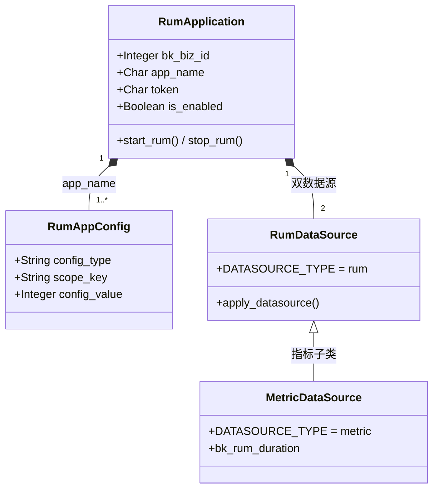

# RUM 数据模型

<cite>
**本文引用的文件**
- [rum/models/application.py](file://bkmonitor/rum/models/application.py)
- [rum/models/config.py](file://bkmonitor/rum/models/config.py)
- [rum/models/datasource.py](file://bkmonitor/rum/models/datasource.py)
- [rum/constants.py](file://bkmonitor/rum/constants.py)
- [constants/rum.py](file://bkmonitor/constants/rum.py)
</cite>

## 目录
1. [简介](#简介)
2. [应用模型 RumApplication](#应用模型-rumapplication)
3. [应用配置模型 RumAppConfig](#应用配置模型-rumappconfig)
4. [双数据源模型](#双数据源模型)
5. [Span 结果表字段（RUM_FIELD_LIST）](#span-结果表字段rum_field_list)
6. [存储与默认值](#存储与默认值)
7. [模型关系图](#模型关系图)
8. [性能考虑](#性能考虑)
9. [故障排查指南](#故障排查指南)

## 简介
RUM 后端（`rum/`，即 rum_api 服务）以四个核心模型描述应用、配置与数据源。所有模型使用独立数据库连接 `DATABASE_CONNECTION_NAME`（默认 `monitor_api`），与告警/元数据等模块物理隔离。

章节来源
- [rum/constants.py:14](file://bkmonitor/rum/constants.py#L14)
- [rum/models/application.py:24-34](file://bkmonitor/rum/models/application.py#L24-L34)

## 应用模型 RumApplication
`RumApplication` 是应用的权威模型，关键字段：

| 字段 | 类型 | 说明 |
|------|------|------|
| `bk_biz_id` | Integer | 业务 ID |
| `app_name` | Char(50) | 应用名称，与 `bk_biz_id` 联合唯一 |
| `app_alias` | Char(128) | 应用别名 |
| `type` | Char(32) | 前端类型，默认 `web` |
| `token` | Char(64) | 前端接入 Token（UUID4，长度 32） |
| `is_enabled` | Boolean | 是否启用（整体启动状态） |
| `bk_tenant_id` | Char(64) | 租户 ID |

应用生命周期方法：
- `start_rum()` / `stop_rum()`：整体启停，同时启停 `RumDataSource` + `MetricDataSource` 并切换 `is_enabled`。
- `start_metric()` / `stop_metric()`：仅操作指标数据源，不影响 `is_enabled`。
- `create_application(...)`：校验重名后创建应用，异步（countdown=3）触发 `create_application_async` 建数据源。
- `apply_datasource(es_storage_config)`：可重复执行，创建/更新 RUM 与 Metric 两个数据源。

章节来源
- [rum/models/application.py:24-133](file://bkmonitor/rum/models/application.py#L24-L133)

## 应用配置模型 RumAppConfig
`RumAppConfig` 用「复合键 + int 值」表达多维配置，结构如下：

- `config_type`：复合键 `大类:小类`，如 `apdex:apdex_view_load` / `apdex:apdex_api_request`（由 `ApdexConfigKey` 拼接）/ `qps:default` / `sampler:percentage`。
- `scope_type` / `scope_key`：作用域，当前仅支持 `APPLICATION_LEVEL`，`scope_key` 为 `app_name`。
- `config_value`：固定 int。

核心方法：
- `refresh_config(...)`：按 `refresh_categories` 限制删除范围，upsert 配置并清理重复记录。
- `configs(bk_biz_id, app_name, scope_type)` / `get_configs_by_category(..., category)`：按大类查询（如 `apdex` 匹配 `apdex:lcp` / `apdex:fcp`）。

章节来源
- [rum/models/config.py:16-151](file://bkmonitor/rum/models/config.py#L16-L151)

## 双数据源模型
每个应用对应两类数据源，基类 `RumDataSourceConfigBase` 定义公共逻辑（`data_name`、`table_id`、结果表启停、data_id 创建），子类差异化：

| 维度 | `RumDataSource`（原始日志） | `MetricDataSource`（指标） |
|------|------------------------------|----------------------------|
| `DATASOURCE_TYPE` | `rum` | `metric` |
| ETL | `bk_flat_batch`（日志） | `bk_standard_v2_time_series`（时序） |
| 存储 | Elasticsearch，`schema_type=free`，动态 mapping | 时序分组，`label=application_check` |
| 指标 | — | `bk_rum_duration`（float，单位 ns） |
| 索引集 | 创建 `log_search` 索引集（`category_id=application_check`） | 无 |

关键行为：
- `apply_datasource(...)`：幂等创建 data_id + 结果表；`option=False` 时停止结果表。
- `start(bk_biz_id, app_name)` / `stop(...)`：切换结果表 `is_enable`；`RumDataSource.stop` 额外删除关联索引集。
- 冷热集群：读取集群 `hot_warm_config`，按比例（`DEFAULT_ES_WARM_RETENTION_RATIO = 0.5`）设置 warm 阶段。

章节来源
- [rum/models/datasource.py:35-168](file://bkmonitor/rum/models/datasource.py#L35-L168)
- [rum/models/datasource.py:172-268](file://bkmonitor/rum/models/datasource.py#L172-L268)
- [rum/models/datasource.py:268-489](file://bkmonitor/rum/models/datasource.py#L268-L489)

## Span 结果表字段（RUM_FIELD_LIST）
`RumDataSource` 结果表字段由 `constants/rum.py` 的 `RUM_FIELD_LIST` 定义，核心字段：

| 字段 | 类型 | 说明 |
|------|------|------|
| `bk_biz_id` / `app_name` | keyword | 维度 |
| `attributes` / `resource` | object（动态） | Span 属性与资源信息 |
| `events` | nested | Span 事件（含 exception.message / stacktrace） |
| `elapsed_time` / `start_time` / `end_time` | long | 耗时与时间戳（微秒） |
| `kind` | integer | Span 类型（0-5） |
| `links` / `parent_span_id` / `span_id` / `trace_id` | keyword / nested | 链路标识 |
| `span_name` | keyword | Span 名称 |
| `status` | object | code（integer）+ message（text） |

`RUM_RESULT_TABLE_OPTION` 指定去重字段与查询时间字段：唯一键 `trace_id, span_id, parent_span_id, start_time, end_time, span_name`，查询时间字段 `end_time`（long，微秒），`need_add_time=True` 按日期路由索引。

章节来源
- [constants/rum.py:18-191](file://bkmonitor/constants/rum.py#L18-L191)

## 存储与默认值
- 集群来源：优先 `RUM_ELASTICSEARCH_CLUSTER_ID`（`settings`），回退到 metadata 集群列表中 `_default` 注册系统的 ES 集群；Kafka 集群来自 `RUM_KAFKA_CLUSTER_ID`。
- 默认 ES 配置：`RUM_APP_DEFAULT_ES_STORAGE_CLUSTER` / `ES_RETENTION` / `ES_REPLICAS` / `ES_SHARDS` / `ES_SLICE_LIMIT`（见 `RumApplicationHelper.get_default_storage_config`）。
- 业务级上限：`BizConfigKey`（`default_es_retention_days_max` 等）通过 `monitor.models.ApplicationConfig` 控制私有/默认集群的保留期与副本上限。

章节来源
- [rum/constants.py:18-20](file://bkmonitor/rum/constants.py#L18-L20)
- [rum/core/handlers/application_helper.py:28-73](file://bkmonitor/rum/core/handlers/application_helper.py#L28-L73)
- [packages/rum_web/constants.py:58-75](file://bkmonitor/packages/rum_web/constants.py#L58-L75)

## 模型关系图

图表来源
- [rum/models/application.py:24-133](file://bkmonitor/rum/models/application.py#L24-L133)
- [rum/models/config.py:16-151](file://bkmonitor/rum/models/config.py#L16-L151)
- [rum/models/datasource.py:35-168](file://bkmonitor/rum/models/datasource.py#L35-L168)

章节来源
- [rum/models/application.py:24-133](file://bkmonitor/rum/models/application.py#L24-L133)
- [rum/models/config.py:16-151](file://bkmonitor/rum/models/config.py#L16-L151)
- [rum/models/datasource.py:35-168](file://bkmonitor/rum/models/datasource.py#L35-L168)

## 性能考虑

- **双库物理隔离**：所有 RUM 模型使用独立连接 `DATABASE_CONNECTION_NAME=monitor_api`，与告警/元数据模块隔离，避免连接争用。
- **ES 动态 mapping 膨胀**：`RumDataSource` 存储 `schema_type=free` 动态 mapping，`attributes`/`resource` 为 object 动态字段，高频写入需关注字段膨胀与索引体积；冷热分离按 `DEFAULT_ES_WARM_RETENTION_RATIO=0.5` 切 warm 阶段。
- **结果表启停幂等**：`apply_datasource(option)` 控制创建/停止，频繁启停不影响已有 `bk_data_id`，避免重复创建。

章节来源
- [rum/constants.py:18-20](file://bkmonitor/rum/constants.py#L18-L20)
- [rum/models/datasource.py:35-168](file://bkmonitor/rum/models/datasource.py#L35-L168)
- [rum/core/handlers/application_helper.py:28-73](file://bkmonitor/rum/core/handlers/application_helper.py#L28-L73)

## 故障排查指南

- **创建应用失败**：检查 `bk_biz_id+app_name` 唯一约束；`create_application` 经 `create_application_async`（countdown=3）异步建数据源，确认异步任务成功。
- **缺索引集 / 数据源未写入**：`RumDataSource.stop` 会删除关联 `log_search` 索引集；确认 `apply_datasource` 幂等重试成功、metadata `create_data_id` 正常返回。
- **字段查询为空**：确认 `RUM_FIELD_LIST` 字段映射与 `RUM_RESULT_TABLE_OPTION` 查询时间字段 `end_time`；ES 动态 mapping 下新字段可能未立即索引。

章节来源
- [rum/models/application.py:24-133](file://bkmonitor/rum/models/application.py#L24-L133)
- [rum/models/datasource.py:35-168](file://bkmonitor/rum/models/datasource.py#L35-L168)
- [rum/resources.py:57-83](file://bkmonitor/rum/resources.py#L57-L83)
