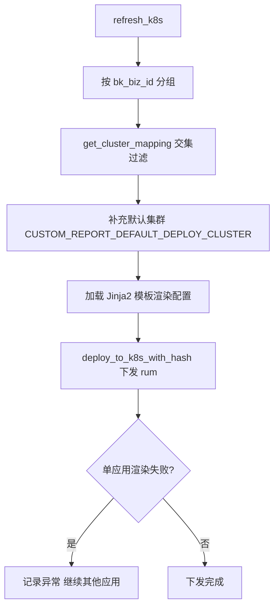

# RUM 数据采集与上报

<cite>
**本文引用的文件**
- [rum/core/application_config.py](file://bkmonitor/rum/core/application_config.py)
- [rum/core/handlers/application_helper.py](file://bkmonitor/rum/core/handlers/application_helper.py)
- [rum/task/tasks.py](file://bkmonitor/rum/task/tasks.py)
- [rum/resources.py](file://bkmonitor/rum/resources.py)
- [constants/rum.py](file://bkmonitor/constants/rum.py)
</cite>

## 目录
1. [简介](#简介)
2. [上报接入 Token](#上报接入-token)
3. [bk_collector 配置下发](#bk_collector-配置下发)
4. [下发规则详情](#下发规则详情)
5. [异步任务](#异步任务)
6. [配置下发流程图](#配置下发流程图)
7. [性能考虑](#性能考虑)
8. [故障排查指南](#故障排查指南)

## 简介
RUM 数据由前端 Web JS SDK 经 bk_collector 接入。后端 `rum/` 不直接接收上报流量，而是负责「应用/数据源的元数据创建」与「collector 采集配置的动态下发」。配置下发通过渲染 K8s ConfigMap 模板并写入对应集群实现。

章节来源
- [rum/core/application_config.py:28-94](file://bkmonitor/rum/core/application_config.py#L28-L94)
- [rum/models/application.py:135-139](file://bkmonitor/rum/models/application.py#L135-L139)

## 上报接入 Token
应用创建时生成 `token`（`uuid4().hex`，长度 32）。`RumApplication.get_bk_data_token()` 优先返回模型内 token，作为前端 SDK 上报鉴权凭证。SaaS 侧 `QueryBkDataTokenInfoResource` 与后端 `QueryBkDataTokenInfoResource` 均可查询。

上报数据通过 `resource_filter_config_metrics` 规则做维度补充：从 `resource.bk.data.token` / `resource.process.pid` / `resource.tps.tenant.id` 中剥离敏感维度，并自 `app_name`（来自 token）补全归属。

章节来源
- [rum/models/application.py:135-139](file://bkmonitor/rum/models/application.py#L135-L139)
- [rum/core/application_config.py:130-139](file://bkmonitor/rum/core/application_config.py#L130-L139)

## bk_collector 配置下发
`RumApplicationConfig.refresh_k8s(applications)` 是配置下发的核心入口：

1. 按 `bk_biz_id` 分组（不同业务可能部署到不同集群）。
2. 解析 `BkCollectorClusterConfig.get_cluster_mapping()`，仅保留「需要部署的业务」与「集群允许的业务」交集。
3. 补充 `settings.CUSTOM_REPORT_DEFAULT_DEPLOY_CLUSTER` 默认集群。
4. 对每个集群，加载 `CONFIG_MAP_APPLICATION_TPL_NAME` Jinja2 模板，按应用渲染配置，批量 `deploy_to_k8s_with_hash(cluster_id, config_map, "rum")` 下发。

单应用渲染失败仅记录异常并继续，不影响其他应用。

章节来源
- [rum/core/application_config.py:28-94](file://bkmonitor/rum/core/application_config.py#L28-L94)

## 下发规则详情
每个应用的 `get_application_config()` 生成以下 collector 规则：

- **Apdex 计算**（`apdex_calculator/rum_apdex_common`，`type=standard`）：
  - `apdex:apdex_view_load`（来自 `ApdexConfigKey.APDEX_VIEW_LOAD`）→ `SPAN_KIND_INTERNAL`，`predicate_key=span_name`，`predicate_value=documentLoad`，产出 `rum_view_load_apdex`。
  - `apdex:apdex_api_request`（来自 `ApdexConfigKey.APDEX_API_REQUEST`）→ `SPAN_KIND_CLIENT`，按 `attributes.http.method`，`duration` 取自 `fetchStart`→`responseEnd`，产出 `rum_api_request_apdex`。
  - Apdex T 值来自 `RumAppConfig`（`apdex:*` 配置）。
- **QPS 限流**（`rate_limiter/token_bucket`，`type=token_bucket`）：`qps` 来自 `qps:default` 配置；无配置则不下发。
- **数据接入**：`get_bk_data_id_config()` 注入 `metric_data_id`（Metric 数据源）与 `trace_data_id`（RUM 数据源）。

章节来源
- [rum/core/application_config.py:96-188](file://bkmonitor/rum/core/application_config.py#L96-L188)

## 异步任务
`rum/task/tasks.py`（Celery，`queue=celery_cron`）编排应用生命周期：

| 任务 | 说明 |
|------|------|
| `create_application_async` | 建应用后异步 `apply_datasource`，失败重试（最多 2 次，退避 `n*60s`），成功后 `refresh_k8s` |
| `delete_application_async` | 清 QPS 配置（`qps:default=-1`）、`refresh_rum_application_config`、停数据源、删镜像 |
| `refresh_rum_application_config` | 单应用刷新 K8s 配置 |
| `refresh_rum_config_to_k8s` | 批量刷新所有启用应用的 K8s 配置 |

章节来源
- [rum/task/tasks.py:21-109](file://bkmonitor/rum/task/tasks.py#L21-L109)
- [rum/resources.py:57-83](file://bkmonitor/rum/resources.py#L57-L83)

## 配置下发流程图

图表来源
- [rum/core/application_config.py:28-94](file://bkmonitor/rum/core/application_config.py#L28-L94)

章节来源
- [rum/core/application_config.py:28-94](file://bkmonitor/rum/core/application_config.py#L28-L94)

## 性能考虑

- **按业务分组批量下发**：`refresh_k8s` 先按 `bk_biz_id` 分组、再取集群映射交集，仅向「需要部署的业务 ∩ 集群允许的业务」下发，缩小渲染范围。
- **失败隔离**：单应用模板渲染失败仅记录异常并继续，不影响其他应用，提升批量下发健壮性。
- **异步编排**：创建/删除/刷新均经 Celery（`queue=celery_cron`）异步任务，避免阻塞管理请求；失败重试最多 2 次、退避 `n*60s`。

章节来源
- [rum/core/application_config.py:28-94](file://bkmonitor/rum/core/application_config.py#L28-L94)
- [rum/task/tasks.py:21-109](file://bkmonitor/rum/task/tasks.py#L21-L109)

## 故障排查指南

- **配置未生效**：确认 `refresh_k8s` 异步任务成功、目标集群 K8s ConfigMap 已正确渲染；检查 `CUSTOM_REPORT_DEFAULT_DEPLOY_CLUSTER` 与 `get_cluster_mapping` 业务交集是否包含该应用。
- **上报鉴权失败（Token 无效）**：`get_bk_data_token()` 返回模型内 `token`（`uuid4().hex` 长度 32）；维度补充规则 `resource_filter_config_metrics` 依赖 token 解析 `app_name`，确认 token 正确。
- **Apdex/QPS 未计算**：确认 `qps:default` 已配置（无配置则不下发限流）；Apdex T 值来自 `RumAppConfig` 的 `apdex:*` 配置。

章节来源
- [rum/core/application_config.py:96-188](file://bkmonitor/rum/core/application_config.py#L96-L188)
- [rum/models/application.py:135-139](file://bkmonitor/rum/models/application.py#L135-L139)
